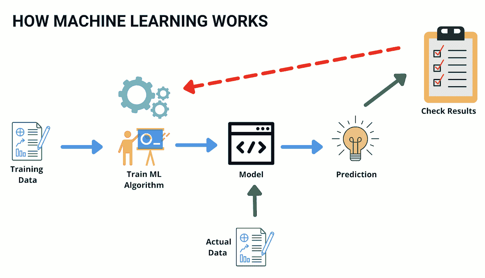
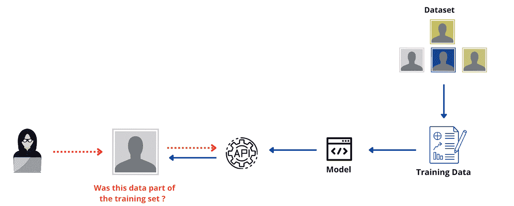

# 推理攻击—未来的 SQL 注入

> 原文：<https://pub.towardsai.net/inference-attacks-the-sql-injection-of-the-future-ba6daa563682?source=collection_archive---------1----------------------->

## 您对这种新的攻击媒介做好准备了吗？

杰佛森·桑多斯在 [Unsplash](https://unsplash.com?utm_source=medium&utm_medium=referral) 上拍摄的照片

**你能猜到这是什么类型的攻击吗？**

*   以应用层为目标
*   绕过传统防御
*   揭示应用程序和数据的内部工作原理
*   发生这种攻击的原因是应用程序在其消息中暴露了太多的信息。

如果你猜到了 **SQL 注入袭击，**那么我很不愿意告诉你，但是你错了。

> 向针对人工智能和机器学习应用的推理攻击问好，这将成为明天的 SQL 注入攻击

就像二十年前 SQL 注入对网络应用的攻击被证明是大多数网络安全团队的盲点一样；推理攻击将对基于人工智能的应用程序做同样的事情

就像 SQL 注入由于代码中的安全弱点而发生，需要在源代码级别进行修复；推理攻击的发生是由于底层的人工智能算法。

你担心了吗？

# 那么什么是推理攻击呢

为了理解推理攻击，让我们看看人工智能和机器学习系统是如何工作的。

机器学习(ML)系统使用训练数据来随着时间积累知识，并做出决策或预测。输入的训练数据越多，这个决策就越准确。

来源:图片由作者提供

一旦进入生产阶段，ML 系统通常会公开公共 API，供用户和其他应用程序查询以访问它们的功能。

这些模型可以部署在医疗保健和银行等行业，从而对持卡人数据或个人身份信息(PII)等敏感数据进行训练，这些数据对攻击者来说是黄金

作为一名攻击者，如果我有兴趣了解以下信息会怎么样:

*   **用什么样的数据来训练系统？**
*   **ML 系统如何做出这些决定？**

这两者都不可用，这就是推理攻击的由来。

> 在推理攻击中，攻击者感兴趣的是获得模型被训练的数据..或者模型本身的工作。鉴于这些模型有时是根据高度敏感的数据训练的，价值数百万的知识产权；这些都可能是公司的灾难！

最常见的推理攻击类型称为**成员推理(MI)，**攻击者试图重建用于训练模型的数据。

ML 模型通常以**置信分数**的形式提供回答，如果提供给它们的数据与它们被训练的数据相匹配，则给出更高的分数。

攻击者需要的只是访问 API，他可以开始通过 ML 模型运行记录，并根据输出得分评估该模型是否在特定数据集上进行了训练。

来源:图片由作者提供

如果攻击者知道他在做什么，他就可以对模型进行逆向工程，并让它披露用来训练它的信息。如果机器学习模型是根据被认为敏感的数据训练的，这可能会产生严重的后果。

**让我们举几个例子来说明这种攻击是如何发生的:**

*   *攻击者可以查询带有名称或标识符的模型，以确定某人是否在医院的患者名单上或敏感医疗名单上。*
*   *攻击者可以发现患者是否正在接受某种药物治疗。*
*   *攻击者可以向面部识别模型提供图像，以查明特定的面部是否用于训练。*

在更高级的攻击中，怀有恶意的人甚至可以窃取信用卡号和其他敏感信息，如社会安全号码！

# ML 即服务的兴起

增加攻击面的一个因素是近年来机器学习即服务(MaaS)的流行。大多数公司不想经历从零开始构建模型的麻烦，可以从第一天开始就使用这些基于云的服务。

云服务完成所有繁重的工作，只需提供训练数据。问题是，如果被发现，攻击者可以利用 ML 模型中的任何弱点来潜在地对多个公司进行成员推断攻击。

**遗憾的是，这并不是理论上的，因为康奈尔大学的研究人员** [**发表了**](https://ieeexplore.ieee.org/document/7958568) **推理攻击的细节，可以利用这些细节来对付此类模型。**

# 新的攻击需要新的控制。

对 AI 和 ML 模型的攻击不同于传统的网络安全攻击，不能以相同的方式修复。没有修复算法的“补丁”,因为问题出在算法被训练的基础数据上。

就像应用安全从安全盲区演变成厂商行业(**现在就买这个 WAF**！)到一个成熟的安全学科，毫无疑问，A.I .和机器学习攻击会遵循同样的路线。

但是，我们可以从过去的错误中吸取教训，并从今天开始实施一些控制措施:

*   **如果遇到训练数据，ML 模型**应该能够进行归纳，即先前看到的和未看到的数据分数应该相似，并且不会相差太大，从而不会将信息泄露给攻击者。
*   **ML**模型的公开 API 应该具有节流特性，以检测攻击者是否出于恶意持续查询这些模型。想想一个 IP 的“失败登录”是如何触发网络安全团队的警报的
*   **AI 和 ML 模型的 Pen-test**需要添加到常规的安全保证活动中，并开发具体的攻击案例。查看我在[和](https://infosecwriteups.com/how-to-start-penetration-testing-of-artificial-intelligence-c11e97b77dfa)的详细帖子。

> 我希望你喜欢阅读这篇文章。如果你觉得这个话题有趣，那就去看看我的打折课程 [***人工智能治理和网络安全***](https://cloudsecguy.gumroad.com/l/aigovernance/1tojq7p?_gl=1*1c51k6t*_ga*MzQ0NDEyMjc4LjE2NDM3MTgwOTU.*_ga_6LJN6D94N6*MTY2MzA5NTE4Ni4yNzEuMS4xNjYzMDk1MTkzLjAuMC4w)

> Taimur Ijlal 是一家获得多项奖项的信息安全领导者，在金融科技行业的网络安全和 IT 风险管理方面拥有 20 多年的国际经验。可以在 LinkedIn 或他的博客上联系泰穆尔。他还有一个 YouTube 频道“[云安全专家](https://www.youtube.com/c/CloudSecurityGuy)”，在上面他定期发布关于云安全、人工智能和一般网络安全职业建议的帖子。
> 
> **如果你喜欢读这篇文章，那么考虑支持我，使用这个** [**链接**](https://taimurcloud123.medium.com/membership) 成为一个中等会员