# 数据科学的推断统计学

> 原文：<https://pub.towardsai.net/inferential-statistics-for-data-science-91cf4e0692b1?source=collection_archive---------1----------------------->

## [数据科学](https://towardsai.net/p/category/data-science)，[统计](https://towardsai.net/p/category/statistics)

## 概率基础，概率分布

照片由[拍摄，来自](https://www.pexels.com/@vlada-karpovich?utm_content=attributionCopyText&utm_medium=referral&utm_source=pexels) [Pexels](https://www.pexels.com/photo/young-lady-typing-on-keyboard-of-laptop-in-living-room-4050315/?utm_content=attributionCopyText&utm_medium=referral&utm_source=pexels)

# 推断统计学

推断统计允许您从数据中做出预测(推断)。

大多数情况下，我们会处理大量数据进行数据分析。因此，我们将抽取一个数据样本，并通过使用推断统计从样本中做出预测/推断。

但是在预测的同时，我们找不到确切的值。所以，我们将从概率的角度来谈。

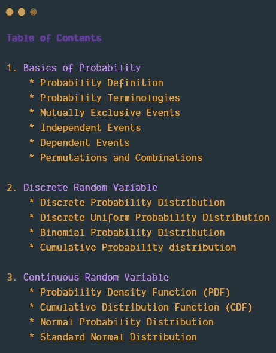

# 可能性

概率是对事件发生的可能性的度量。它的范围在 0 和 1 之间。概率越高，事件发生的可能性就越大。

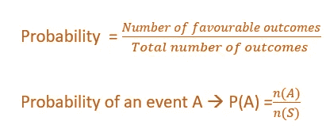

**举例:**
1。掷骰子得到 1 的概率是 1/6
2。掷骰子时得到偶数的概率是 1/2

# 概率术语

*   **实验** 实验是任何定义明确的动作，可以无限重复，并有一组定义明确的结果。
    **举例:**抛硬币，掷骰子。
*   结果被定义为任何可能的实验结果。
    **示例:**掷骰子时，可能的结果是 1、2、3、4、5 或 6。
*   **样本空间** 实验中所有可能结果的集合。
    **举例:**滚个骰子。S={1，2，3，4，5，6}
*   **事件**
    事件是实验的一组有利结果。它是样本空间的子集。
    1。掷骰子时得到 1 的事件。E={1}
    2。掷骰子时得到偶数的事件。E={2，4，6}

# 互斥事件——概率加法法则

## 互斥事件

如果两个事件 A 和 B 不能同时发生，则称这两个事件是互斥的。据说得到一个头或一个尾是互斥的。这两件事不可能同时发生。

## 加法法则 1:

当两个事件 A，B 互斥时，得到 A 或 B 的概率是 A 的概率和 B 的概率之和。

**P(A 或 B) = P(A) + P(B)**

***举例:*** 从一副 52 张牌中，得到国王或王后的概率。

得到国王的概率→ P(A) = 4/52
得到王后的概率→ P(B) = 4/52

得到国王或王后的概率→ P(A 或 B)= 4/52+4/52 = 8/52
P(A 或 B) = 2/13

## 加法法则 2:

当两个事件 A、B 不互斥时，A 或 B 的概率为

**P(A 或 B) =P(A) +P(B) -P(A ∩B)**

***举例:*** 从一副 52 张牌中，得到一张王或一张红牌的概率。

拿到王的概率 P(A)=4/52
拿到红卡的概率 P(B)=26/52
拿到红王的概率 **P(A ∩B)** =2/52

拿到国王或红牌的概率= 4/52+26/52–2/52 = 28/52

**P(A 或 B) =7/13**

# 独立事件——概率乘法法则

## 独立事件

独立事件是指其发生不依赖于任何其他事件的事件。

一起投掷 2 枚硬币时获得 2 个正面的概率。一枚硬币上人头的概率与另一枚硬币上人头的概率无关。

P(A 和 B) =P(A) *P(B)

P((A 和 B) = 1/2 * 1/2 = 1/4

# 相关事件—条件概率

从属事件是那些其发生依赖于任何其他事件的事件。

**P(A 和 B) =P(A) * P(B |A)**

***举例:P*** 从 52 张牌中抽出两张王的概率。

从一副牌中选择一张国王的概率 P(A) = 4/52

从一副牌中选择第二张国王的概率 P(B|A) = 3/51

从这副牌中选择两张国王的概率= 4/52 * 3/51 = 12/2652

从一副牌中选择两张国王的概率= 1/221

# 排列和组合

## 排列

排列顺序很重要。

**两种类型的排列:**

***举例:*** ATM 密码应为四位数字。[允许重复，但顺序也很重要。]

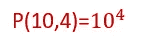

10⁴置换是可能的

**2。不允许重复。**

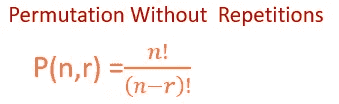

从 10 名获奖者中选出第一名、第二名和第三名。(顺序很重要，不允许重复)

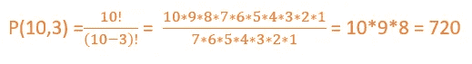

720 种不同的排列。

# 组合

组合-顺序无关紧要。

## 两种类型的组合:

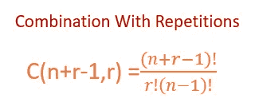

那家商店有三种口味的冰淇淋。(香草、巧克力、草莓)。一个人只能吃两勺冰淇淋。有哪些不同的组合？

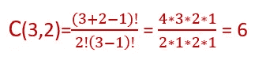

六种不同的重复组合[图片由作者提供]

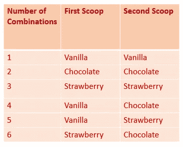

六种不同的组合[图片由作者提供]

有六种不同的组合可供选择。

**2。不允许重复。**

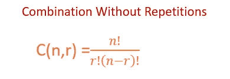

没有重复的组合公式[图片由作者提供]

**示例:**从装有 5 种不同水果的篮子中选择 3 种不同的水果【顺序无关紧要，不允许重复】
从苹果、芒果、橙子、香蕉、草莓中选择 3 种

从 5 中选择 3

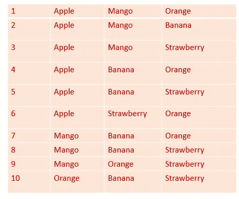

10 种不同的组合[图片由作者提供]

# 概率分布和随机变量

# 随机变量

随机变量是实验结果的数字描述。
1。离散随机变量
2。连续随机变量

# 1.离散随机变量

如果一个随机变量取有限个不同的值或一个无限序列的值，那么它就是一个离散随机变量。

***举例:*** 我们抛 2 个硬币时得到正面的概率？

这里投掷两枚硬币的概率是一个实验。

随机变量用 X 表示

“人头数”是随机变量。

在这种情况下，X 可以是 0 头、1 头或 2 头

S={HH，HT，TH，TT}

P(X = 0)→掷 2 个硬币时得不到人头的概率= 1/4
P(X=1) →掷 2 个硬币时得到 1 个人头的概率=2/4
P(X=2) →掷 2 个硬币时得到 2 个人头的概率= 1/4

# 离散概率分布

随机变量的概率描述了随机变量的值的概率分布。

概率分布可以用方程式或图表来表示。

**方程式**

概率分布由 f(x)表示的概率函数定义。它提供了随机变量的每个值的概率。
离散概率函数需要的条件是

离散概率分布[图片由作者提供]

**图形**

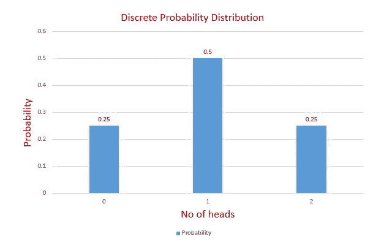

离散概率分布[图片由作者提供]

## 预期值

随机变量的期望值或均值由
E(x)=**σ**xf(x)=**μ**计算

**上例计算期望值。**
我们掷 2 枚硬币时得到正面的概率？

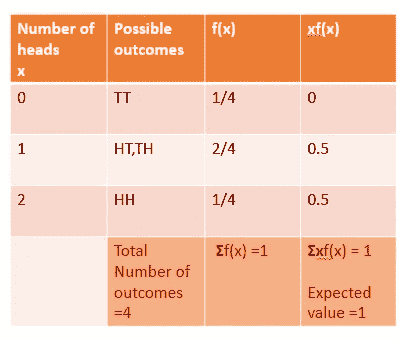

期望值[图片由作者提供]

## 差异

随机变量的方差决定了随机变量的值与期望值(平均值)的差异程度。

随机变量 x 的方差计算如下

**计算上例的方差**

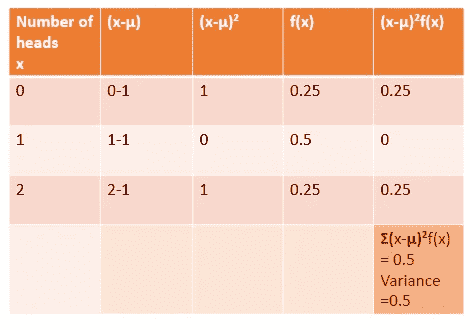

计算方差[图片由作者提供]

## 标准偏差

标准差是方差的平方根

# 离散均匀概率分布

在离散均匀概率分布中，随机变量的值是同样可能的。

离散均匀概率函数为
f(x) = 1/n
n →随机变量个数。

***举例:*** 掷骰子。所有 6 个数字的可能性相等。

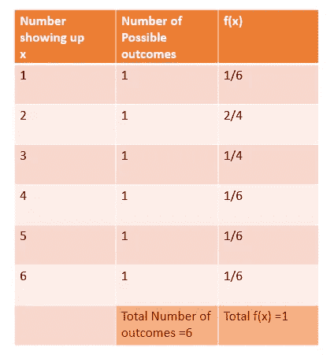

离散均匀概率分布[图片由作者提供]

# 二项式概率分布

## 二项分布的性质

1.  该实验应包含一系列 n 次相同的试验。
2.  每次试验应该只有两种结果。(比如成功或失败)
3.  成功的概率用 p 表示，它在所有试验中保持不变。
4.  每次审判都是独立的。

例子:投掷 10 次硬币，得到 5 个正面的概率。

让我们检查一下我们的例子是否符合二项式分布的性质。

1.  它有 10 个相同的试验
2.  它有两种结果。头/尾
3.  得到正面的概率是 p，所有的试验都是一样的。
4.  每次审判都是独立的。

## 二项式概率函数

让我们看看如何得到这个方程。

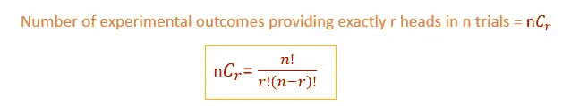

2.然后，我们来计算一下 n 次试验得到 r 个头的概率。

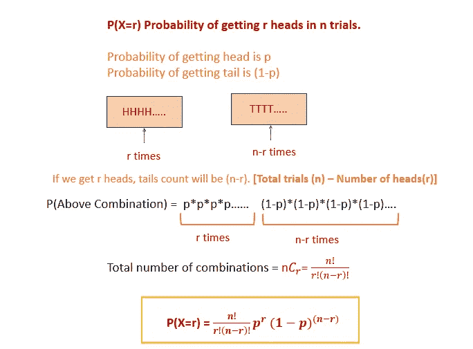

在 n 次试验中获得 r 个头像的概率[图片由作者提供]

因此，我们得到了二项分布方程。

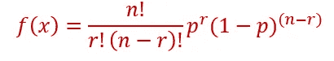

使用这个公式，让我们计算在投掷 10 次硬币时，得到正好 5 个正面的概率。

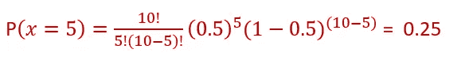

# 累积概率分布

在前面的例子中，我们已经计算了精确值的概率。(正好 5 个头)。

如果我们需要计算小于 4 的值，或者类似的值，那么就使用累积分布函数。

抛 10 次硬币得到少于 4 个人头的概率=P(X <4)

P(X<4)=P(X=0)+P(X=1)+P(X=2)+P(X=3)

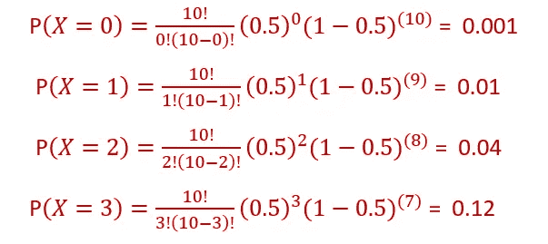

P(X<4)= 0.001+0.01+0.04+0.12 =0.17

Probability of getting less than 4 heads while tossing a coin 10 times =0.17

# 2\. Continuous Random Variable

Continuous Random variable takes all value in a certain interval. Continuous Random Variable is usually measurements

**举例**:一个班里随机一个学生的重量。

我们来看看连续随机变量的概率。

# 连续概率分布

我们不能谈论特定值的连续随机变量的概率。但是我们可以找到一个连续随机变量在一定区间内的概率。

***举例:*** 假设我们来计算一个班级学生权重的概率。

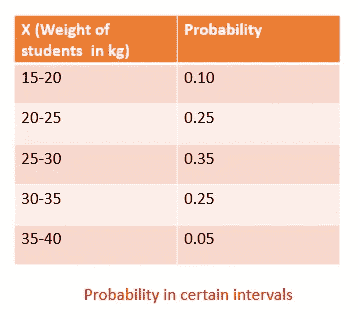

这里，我们有一个连续随机变量在区间内的概率。

如果要求小于 25
**P(X≤25)**的班级学生权重的概率，可以用两种方法求。

1.  概率密度函数
2.  累积分布函数

# 概率密度函数

我们来画出学生体重在一定区间内的概率。

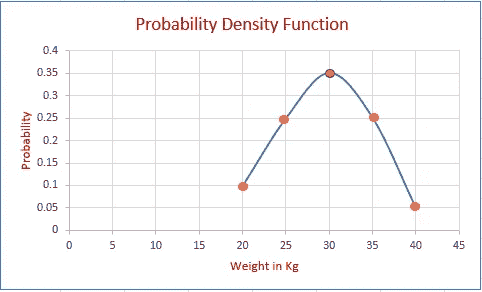

作者图片

现在我们要求学生体重小于 25 P(X≤25)的概率。在概率密度函数中，曲线下的面积给出了概率值。

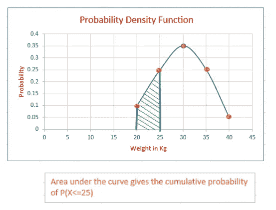

作者图片

# 累积分布函数

我们可以用累积概率函数求出 P(X≤25)。首先，我们来计算累积概率。

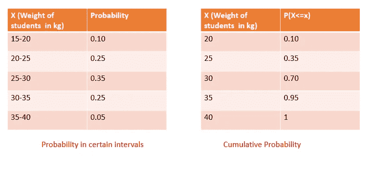

作者图片

让我们画出 X(学生权重)对 X(学生权重)的累积概率

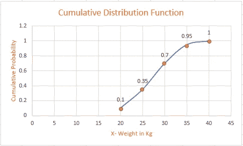

作者图片

因为，它的累积功能，它会不断增加。它达到的最高值应该是 1。

现在，从图中我们可以找到 **P(X≤25)** 。学生体重小于 25 的概率为`0.35`

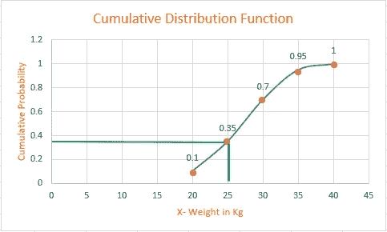

作者图片

我们可以使用 PDF 和 CDF 来寻找连续随机变量的概率分布。与 CDF 相比，PDF 更好。
在 PDF 中，更容易看到图案。但是在 CDF 中，它继续增加。

# 正态概率分布

在所有分布中，正态概率分布是连续随机变量最重要的分布。它主要用于统计推断。

## 正态分布的特征

1.  分布是对称的。
2.  它有两个参数均值和标准差。
3.  正态分布的最高点是平均值，也是中位数和众数。
4.  标准差决定了曲线的展宽。标准差越多，曲线就越宽。
5.  随机变量的概率由曲线下的面积来衡量。
6.  它遵循**经验法则**，也称为**三西格马法则**或
    **68–95–99.7 法则**。

*   **随机变量值的 68%** 落在其平均值的 **1 标准差**内。
*   **随机变量值的 95%** 落在其平均值的 **2 个标准差**内。
*   **随机变量的 99.7%** 的值落在其平均值的 **3 个标准差**内。

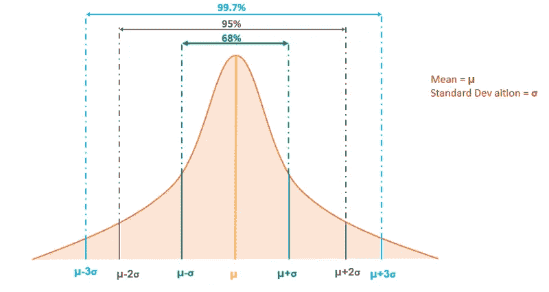

作者图片

# 标准正态分布

在正态分布中，为了找到概率，我们关心的是平均值和 x 的值之间的差异。基本上，这和离平均值有多少标准差是一样的。

我们可以标准化正态分布，通过将每个值的 **X** 转换为 **Z** (这表示离平均值有多少标准偏差)

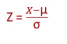

z 是标准正态分布中的重要参数。z 是无单位的。

假设我们有体重公斤数的正态分布，我们会得到一条正态分布曲线。

如果我们把同样的体重换算成 lbs 均值，就会得到另一条正态分布曲线。

所以，我们可以有一条曲线，把 X 转换成 z。

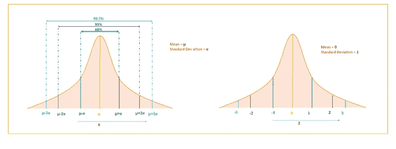

作者图片

要找到给定 Z 的累积概率，我们可以使用 Z 表。

一个具有正态分布的随机变量，其**均值为 0** 且**标准差为 1** 被称为具有**标准正态分布**。

# 距离图

让我们画出学生的体重(公斤)和体重(磅)的曲线图。(数据相同，但单位不同)

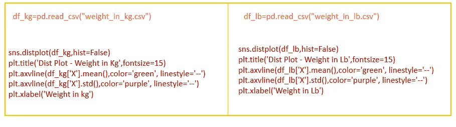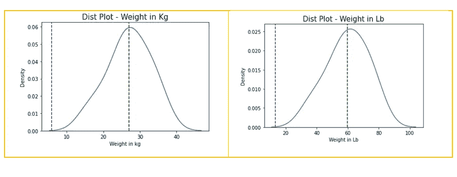

以千克为单位的重量与以磅为单位的重量

对于相同的数据，但是不同的单位，我们得到两条不同的分布曲线。

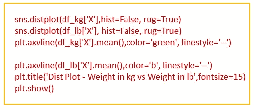

分布图[“千克重量”与“磅重量”] —作者图片

将数据(X)转换为 Z 后，我们将获得“千克重量”和“磅重量”的相同分布曲线

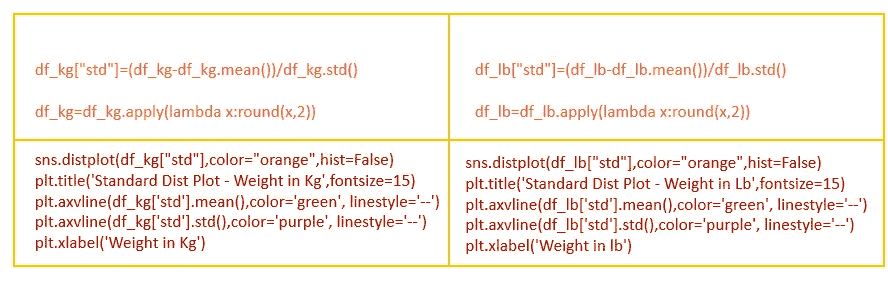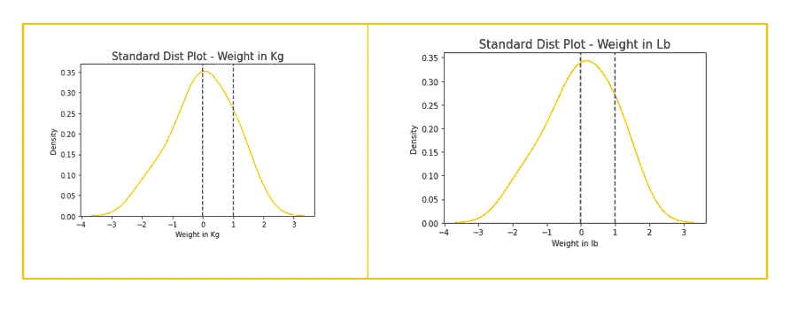

标准分布图[图片由作者提供]

将 X 转换为 Z 后，我们得到均值=0，标准差=1。我们得到了相同的“千克重量”与“磅重量”的分布曲线。

# 结论

在这篇文章中，我已经介绍了概率和不同概率分布的基础知识。

感谢您阅读我的文章，希望对您有所帮助

# 我关于统计的其他博客。

 [## 使用熊猫和海牛探索描述性统计

### 定量方法和直观方法

pub.towardsai.net](/exploring-descriptive-statistics-using-pandas-and-seaborn-1b8501e1f27f)  [## 中心极限定理——解释清楚

### 抽样分布，标准误差

towardsdatascience.com](https://towardsdatascience.com/central-limit-theorem-clearly-explained-4fe60def52d6)  [## 统计学中的重要术语-机器学习

### 统计和概率概念

medium.com](https://medium.com/analytics-vidhya/important-terms-in-statistics-machine-learning-4bfa5962e9be)  [## 假设检验-均值、方差、比例的检验

### p 值法、临界值法、置信区间法

pub.towardsai.net](/hypothesis-testing-test-of-mean-variance-proportion-77ec2bfdd749) 

请关注此空间，了解更多关于 Python 和数据科学的文章。如果你喜欢看我的更多教程，就关注我的 [***中***](https://medium.com/@IndhumathyChelliah)[***LinkedIn***](https://www.linkedin.com/in/indhumathy-chelliah/)*[***Twitter***](https://twitter.com/IndhuChelliah)***。****

**点击这里成为中等会员:*[*https://indhumathychelliah.medium.com/membership*](https://indhumathychelliah.medium.com/membership)*

**原载于 2021 年 2 月 3 日 http://indhumathychelliah.com***。***