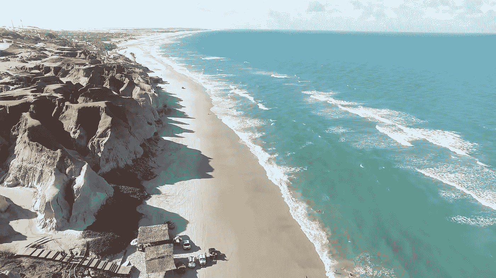
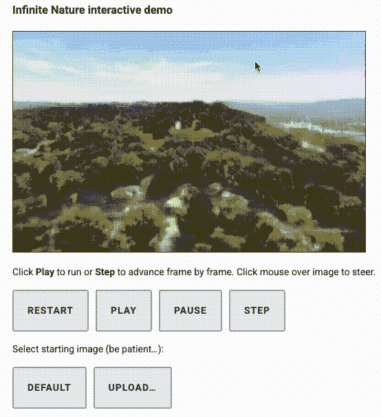
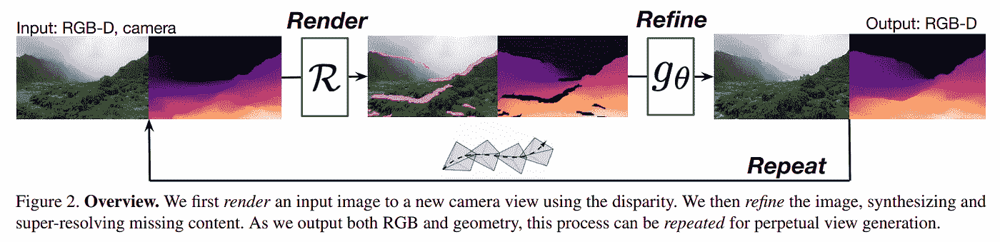
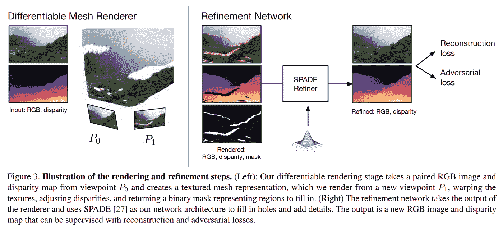

# 无限自然:飞入一个影像，像控制无人机一样探索它！

> 原文：<https://pub.towardsai.net/infinite-nature-fly-into-an-image-and-explore-it-like-controlling-a-drone-541cab44b8f5?source=collection_archive---------3----------------------->

## [人工智能](https://towardsai.net/p/category/artificial-intelligence)

## 视图合成的下一步:永久视图生成，目标是拍摄一幅图像，然后飞进去探索风景！

> 原载于 [louisbouchard.ai](https://www.louisbouchard.ai/infinite-nature/) ，前两天在[我的博客](https://www.louisbouchard.ai/tag/artificial-intelligence/)上看到的！

听听这个故事

本周的[论文](https://arxiv.org/pdf/2012.09855.pdf)是关于一项名为“永久视图生成”的新任务，目标是拍摄一张图像飞入其中并探索风景。这是这个问题的第一个解决方案，但考虑到我们只将一幅图像输入网络，它可以生成像鸟一样飞入网络的图像，这是非常令人印象深刻的。当然，这项任务极其复杂，并将随着时间的推移而改进。正如两分钟论文所说，想象一下，在接下来的几篇论文中，这项技术对于视频游戏或飞行模拟器是多么有用！

莉雅等著[无限自然](https://arxiv.org/pdf/2012.09855.pdf)

我惊讶地看到它已经运行得如此之好，即使这是介绍这项新任务的论文。尤其是考虑到这个任务有多复杂。不仅因为它必须像 GANverse3D 一样生成新的视点，我在以前的[文章](https://www.louisbouchard.me/ganverse3d/)中提到过，而且它还必须在每一帧生成一个新的图像，一旦你通过了几十帧，你就几乎没有原始图像可以使用了。是的，这可以在数百帧上完成，同时仍然比当前的视图合成方法看起来好得多。

让我们看看他们如何从一张图片生成一个完整的鸟瞰视频，以及您如何在无需设置任何东西的情况下立即尝试！

[莉雅等著《无限的自然》](https://arxiv.org/pdf/2012.09855.pdf)

要做到这一点，他们必须使用图像的几何形状，所以他们首先需要产生图像的视差图。这是通过一个叫做 [MiDaS](https://github.com/intel-isl/MiDaS) 的最先进的网络来完成的，我就不赘述了，但这是它给出的输出。这个视差图基本上是一个反向深度图，通知网络场景内部的深度。

[莉雅，A 等人，无限自然](https://arxiv.org/pdf/2012.09855.pdf)

然后，我们进入他们的技术的真正的第一步，这是渲染器。这个渲染器的目标是基于旧视图生成一个新视图。这个新视图将是下一帧，正如你所理解的，旧视图是输入图像。这是使用可区分渲染器完成的。可微分只是因为我们可以使用反向传播来训练它，就像我们传统上使用传统的深度网络一样，你知道。该渲染器利用图像和视差图生成一个三维网格，表示您可以在下面的图 3(左)中看到的场景。然后，我们简单地使用这个 3D 网格从一个新的视点生成一个图像，在这个例子中是 P1。这给了我们这张惊人的新照片，看起来有点放大，但它不是简单的放大。渲染图像上有一些粉红色的标记，视差图上有一些黑色的标记，如上面的图 2 所示。它们对应于用作渲染器输入的先前图像中的遮挡区域和视野之外的区域，因为该渲染器仅生成新的视图，而不能创造看不见的细节。这就给我们带来了一个相当大的问题，如果我们不知道那里发生了什么，我们怎么能有一个完整而真实的图像呢？好吧，我们可以使用另一个网络，它也将这个新的视差图和图像作为输入来“细化”它(图 3，右)。

莉雅著，[A 等人，](https://arxiv.org/pdf/2012.09855.pdf)无限自然

另一个名为 SPADE 的网络(显示在右边)也是一个网络状态，但用于条件图像合成。这里，它是一个条件图像合成网络，因为我们需要告诉我们的网络一些条件，在这种情况下，这些条件是粉红色和黑色缺失的部分。我们基本上是将这个有缺陷的图像发送到第二个网络，以填补漏洞并添加必要的细节。你可以将这种铲形网络视为 GAN 架构，图像首先被编码成潜在代码，这将为我们提供图像的风格。然后，该代码被解码以生成初始图像的新版本，简单地用遵循编码信息中存在的相同风格的新信息来填充丢失的部分。

瞧！你有了新的框架和它的反向深度图。你现在可以简单地一遍又一遍地重复这个过程来得到所有未来的帧，就像这样。使用这个输出作为下一次迭代的输入，您可以产生无限的迭代，总是遵循想要的视点和前面的帧上下文！

如你所知，如此强大的算法经常需要数据和注释来训练，这个也不例外。为了做到这一点，他们需要从无人机上拍摄的自然航拍镜头，这些镜头是他们从 youtube 上拍摄的，经过人工策划和预处理，以创建他们自己的数据集。幸运的是，对于其他想要应对这一挑战的研究人员来说，你不必做同样的事情，因为他们发布了这套自然海岸场景的空中镜头数据集，用于训练他们的算法。它可以在他们的项目页面上下载，该页面链接在下面的参考资料中。

正如我提到的，你甚至可以自己尝试，因为他们公开了代码，但他们也创建了一个[演示](https://colab.research.google.com/github/google-research/google-research/blob/master/infinite_nature/infinite_nature_demo.ipynb#scrollTo=sCuRX1liUEVM)你现在就可以在 google colab 上尝试。链接在下面的参考资料中。您只需像这样运行前几个单元，它们将安装代码和依赖项，加载它们的模型，然后就可以了。你现在可以在他们的图片周围自由飞翔，甚至上传你自己的图片！当然，我刚才提到的所有步骤都已经存在了。

只需运行代码并享受！

## 观看视频中的更多示例:

如果你喜欢我的工作，并想与人工智能保持同步，你绝对应该关注我的其他社交媒体账户( [LinkedIn](https://www.linkedin.com/in/whats-ai/) ， [Twitter](https://twitter.com/Whats_AI) )，并订阅我的每周人工智能 [**简讯**](http://eepurl.com/huGLT5) ！

## 支持我:

*   支持我的最好方式是在 [**媒体**](https://medium.com/@whats-ai) 上关注我，或者如果你喜欢视频格式，在[**YouTube**](https://www.youtube.com/channel/UCUzGQrN-lyyc0BWTYoJM_Sg)**上订阅我的频道。**
*   **支持我在 [**上的工作**](https://www.patreon.com/whatsai)**
*   **加入我们的 [**Discord 社区:** **一起学 AI**](https://discord.gg/learnaitogether)和*分享你的项目、论文、最佳课程、寻找 Kaggle 队友等等！***

## **参考**

**论文:刘，a .，塔克，r .，贾帕尼，v .，马卡迪亚，a .，斯内夫利，n .，金泽，a .，2020。无限自然:从一幅图像中生成自然场景的永久视图，[https://arxiv.org/pdf/2012.09855.pdf](https://arxiv.org/pdf/2012.09855.pdf)**

**项目链接:【https://infinite-nature.github.io/ **

**代码:[https://github . com/Google-research/Google-research/tree/master/infinite _ nature](https://github.com/google-research/google-research/tree/master/infinite_nature)**

**colab demo:[https://colab . research . Google . com/github/Google-research/Google-research/blob/master/infinite _ nature/infinite _ nature _ demo . ipynb # scroll to = scurx 1 Liu EVM](https://colab.research.google.com/github/google-research/google-research/blob/master/infinite_nature/infinite_nature_demo.ipynb#scrollTo=sCuRX1liUEVM)**

**midalsl:Ranftl 等人，2020 年，走向稳健的单目深度估计:零炮跨数据集传输的混合数据集，[https://github.com/intel-isl/MiDaS](https://github.com/intel-isl/MiDaS)**

**SPADE: Park 等人，2019，空间自适应归一化的语义图像合成，[https://github.com/NVlabs/SPADE](https://github.com/NVlabs/SPADE)**