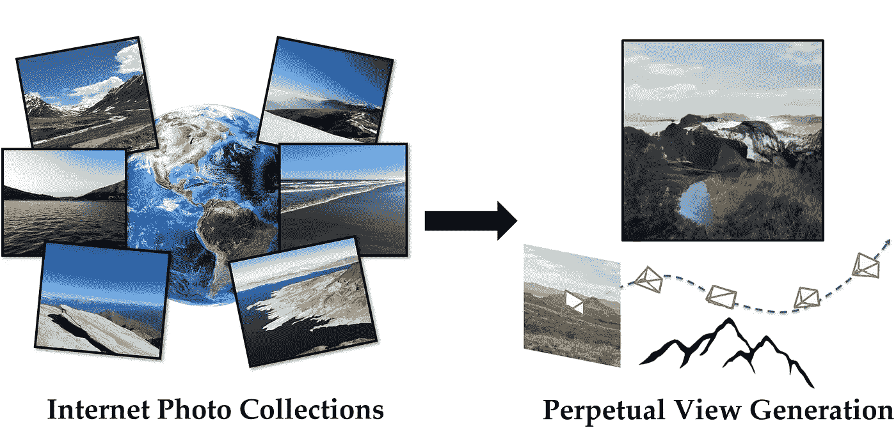
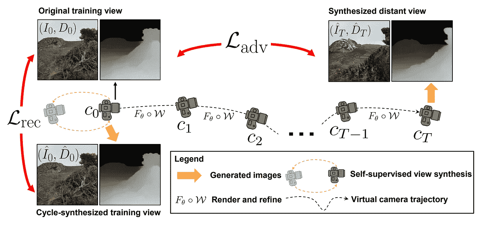
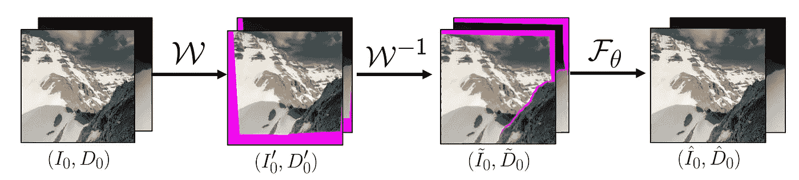
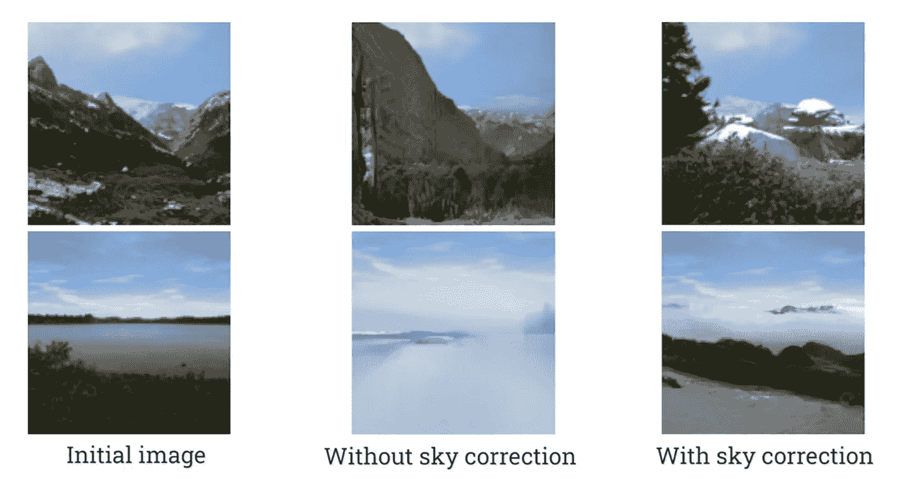

# 无限自然-零:用人工智能飞入你的画面！

> 原文：<https://pub.towardsai.net/infinitenature-zero-fly-into-your-pictures-with-ai-f148c8dbf11?source=collection_archive---------3----------------------->

## 生成无限的新帧，就好像你会飞向你的图像！

> 最初发表于 [louisbouchard.ai](https://www.louisbouchard.ai/infinitenature-zero/) ，前两天在[我的博客上读到的！](https://www.louisbouchard.ai/infinitenature-zero/)

## 看视频！

你有没有想象过能够拍一张照片，然后神奇地潜入其中，仿佛这是通往另一个世界的大门？

好吧，不管你有没有想过这个问题，有些人已经想到了，多亏了他们，现在有了人工智能，这才成为可能！这离心灵运输和能够身临其境只有一步之遥。也许有一天人工智能会帮助解决这个问题，并解决一个实际的问题！我只是开玩笑，这真的很酷，我很高兴有人正在努力。

这是无限大…零！之所以这样称呼它，是因为它是我之前提到的一篇名为 InfiniteNature 的论文的后续。有什么区别？质量！看看那个。只有一篇论文比这好得多。

太不可思议了！你实际上可以感觉到你正在进入画面，并且它只需要一个输入画面。

多酷啊。！唯一更酷的是它是如何工作的…让我们开始吧！**查看以上视频中的更多结果！**

## 无限零度是如何工作的…

从单幅图像学习永久视图生成。报纸上的图片和说明。

这一切都始于你作为输入发送的一张图片。是的，一个单一的图像。它不需要一个视频或多个视图，或其他任何东西。这与他们之前的论文不同，我也覆盖了他们在训练中需要视频来帮助模型理解自然场景的地方，这也是为什么他们将这个模型称为“InfiniteNature-Zero”，因为它需要零视频。在这里，他们的工作分为三种方法在训练中使用，以获得那些结果…

首先，该模型随机采样两个虚拟相机轨迹，这将告诉你你在图像中的位置。

方法概述。图片来自报纸

为什么是两个？因为第一个是生成一个新视图所必需的，告诉你从哪里飞入图像以生成第二个图像，这是你将采取的实际轨迹。

第二个虚拟轨迹在训练期间用于潜入并返回到原始图像，以自我监督的方式教导模型在视图生成期间学习几何感知视图细化，因为我们教导它返回到我们在训练数据集中的图像。他们将这种方法称为循环虚拟相机轨迹，因为开始和结束视图是相同的:我们的输入训练图像。他们这样做是通过去一个虚拟的或假的采样视点，然后返回到原始视图，只是为了将重建部分教给模型。视点使用一种称为自动驾驶算法的算法进行采样，以找到天空，而不是跳伞到岩石或地面上，因为没有人愿意这样做。

从左至右:输入图像；渲染到虚拟“先前”视图的输入；渲染回起始视点的虚拟视图。报纸上的图片和说明。

然后，在训练期间，我们使用类似 GAN 的方法，使用鉴别器来测量生成的新视图看起来有多像真实图像，这里用 L_adv 表示。所以是的，甘斯还没死！这是一个非常酷的应用，当你没有任何地面真相时，例如，当你没有无限的图像时。基本上，他们使用另一个模型，一个鉴别器，在我们的训练数据集上训练，可以说一个图像是否似乎是它的一部分。因此，根据其答案，您可以改进生成，使其看起来像来自数据集的图像，这看起来应该是真实的！

我们还测量我们重新生成的初始图像和原始图像之间的差异，以帮助模型迭代地更好地重建它，这里用 L_rec 表示。

我们只是重复这个过程多次，以产生我们的新框架，并创建这些类型的视频！

在获得这些惊人的结果之前，还有最后一件事需要调整。他们发现，用他们的算法，天空，由于与地面相比具有无限的性质，变化太快了。为了解决这个问题，他们使用另一种分割模型来自动在生成的图像中找到天空，并使用生成的天空和我们初始图像中的天空之间的智能混合来修复它，这样它就不会变化得太快和不真实。另一个线索是，人工智能并不真正聪明，需要大量的手动调整！

经过这两步过程和天空优化的训练后，InfiniteNature-Zero 允许您拥有自然场景的稳定远程轨迹，以及精确生成几何连贯的新视图。

瞧！这就是你如何拍一张照片，然后像一只鸟一样一头扎进去！我邀请你阅读他们的论文，以获得关于他们的方法和实现的更多细节，特别是关于他们如何以如此聪明的方式训练他们的模型，因为为了简单起见，我省略了一些技术细节。

顺便说一下，如果你想试试的话，下面有代码和链接！如果有，请告诉我，并将结果发给我！我很想看看他们。

感谢您的阅读，希望您喜欢这篇文章。下周我会带着另一篇精彩的论文来看你！

## 参考

李，z .，王，q .，斯内夫利，n .和金泽，a .，2022。从单幅图像中学习自然场景的永久视图生成。在欧洲计算机视觉会议上(第 515-534 页)。施普林格、查姆、[https://arxiv.org/abs/2207.11148](https://arxiv.org/abs/2207.11148)
代码和项目网站:[https://infinite-nature-zero.github.io/](https://infinite-nature-zero.github.io/)
我的简讯(一个新的人工智能应用每周向你的电子邮件解释！):[https://www.louisbouchard.ai/newsletter/](https://www.louisbouchard.ai/newsletter/)