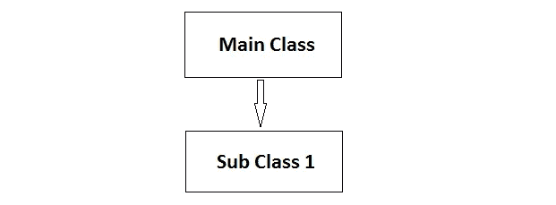
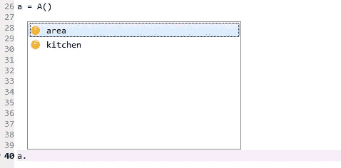
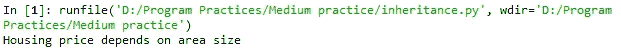
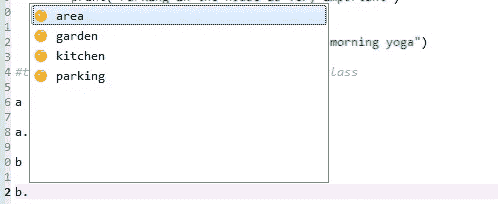
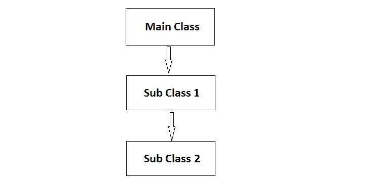
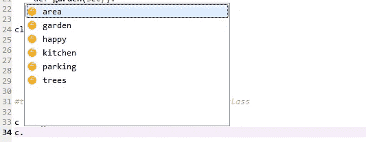
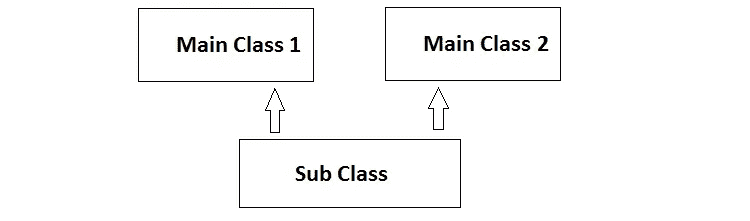

# Python 中的继承及其类型

> 原文：<https://pub.towardsai.net/inheritance-and-its-type-with-python-f35b993d712e?source=collection_archive---------1----------------------->

## [编程](https://towardsai.net/p/category/programming)

## 单一、多级和多重继承方法的概念


由[马库斯·斯皮斯克](https://unsplash.com/@markusspiske?utm_source=medium&utm_medium=referral)在 [Unsplash](https://unsplash.com?utm_source=medium&utm_medium=referral) 上拍摄的照片

继承是面向对象编程中的一种方法，使子类类似于主类，从而子类继承主类的属性。我们使用继承的主要原因是代码的重用性。

[](https://medium.com/towards-artificial-intelligence/nlp-zero-to-hero-with-python-2df6fcebff6e) [## NLP——使用 Python 从零到英雄

### 学习自然语言处理基本概念的手册

medium.com](https://medium.com/towards-artificial-intelligence/nlp-zero-to-hero-with-python-2df6fcebff6e) 

## 继承的类型

1.  单一遗传
2.  多级遗传
3.  多重遗传

> ***单继承***

单一继承意味着子类只从一个主类继承属性。比如我们可以把房子的属性。



单级继承。作者照片

示例:

```
class A:
    def area(self):
        print("Housing price depends on area size")

    def kitchen(self):
        print("The kitechen should be madular type")

#now making a class B, which inherits the properties of class A

class B(A):
    def parking(self):
        print("Need of space for two cars")

    def garden(self):
        print("Garden should be in house")
```

要访问类的方法、功能或特性，我们必须创建该类的对象。

```
#to access their features we make an object of class

a = A()
```

小“A”是 A 类的一个对象，有了这个对象，我们可以访问那个类的方法。在点号后按 tab 键。您可以从该类中看到您可以使用的所有功能。

```
a.area()
```



用对象访问 A 类方法

使用对象的输出。



带有对象的 area()函数的输出。

当我们创建一个 B 类的对象时，我们看到它也继承了 A 类的所有方法。

```
b = B()
b.parking()
```



B 类继承了 A 类的特性

> ***多级继承***

在多级继承中，more 子类是从子类派生出来的。为了理解这一点，下面有一个图表。



多级遗传。作者照片

示例:

```
class A:
    def area(self):
        print("Housing price depends on area size")

    def kitchen(self):
        print("The kitchen should be modular type")

#now making a class B, which inherits the properties of class A

class B(A):
    def parking(self):
        print("Need of space for two cars")

    def garden(self):
        print("Garden should be in house")#deriving class C for multilevel inheritance        
class C(B):
    def trees(self):
        print("Happy Environment Day")

    def happy(self):
        print("We are happy people")

#to access their features we make an object of class

c = C()
c.happy()
```

这就是类“C”如何继承类“B”的特性。



C 类继承了子类 1 和主类的所有特性

[](https://medium.com/towards-artificial-intelligence/python-data-structures-data-types-and-objects-244d0a86c3cf) [## Python 数据结构数据类型和对象

### python 中类对象的便捷概念

medium.com](https://medium.com/towards-artificial-intelligence/python-data-structures-data-types-and-objects-244d0a86c3cf) 

> ***多级继承***

在这种类型的继承中，子类继承了 A 类的特性，而 B 类意味着继承了不止一个主类。需要注意的一点是，b 类不是从 a 类继承的。



多重遗传。作者照片

示例:

```
class A:
    def area(self):
        print("Housing price depends on area size")

    def kitchen(self):
        print("The kitchen should be modular type")

#now making a class B, which inherits the properties of class A

class B:
    def parking(self):
        print("Need of space for two cars"

    def garden(self):
        print("Garden should be in house")#deriving class C for multiple inheritance        
class C(A,B):
    def trees(self):
        print("Happy Environment Day")

    def happy(self):
        print("We are happy people")

#to access their features we make an object of class

c = C()
c.trees()
```

> ***结论:***

为了代码的易用性和重用性，继承是面向对象编程中一个非常重要的概念。

我希望你喜欢这篇文章。通过我的 [LinkedIn](https://www.linkedin.com/in/data-scientist-95040a1ab/) 和 [twitter](https://twitter.com/amitprius) 联系我。

# 推荐文章

1.[Python 最有用的 15 种 NumPy 方法](/15-most-usable-numpy-methods-with-python-4d20eb93e149?sk=911d2bebf042b148be8f366b907af158)
2。 [NumPy:图像上的线性代数](/numpy-linear-algebra-on-images-ed3180978cdb?source=friends_link&sk=d9afa4a1206971f9b1f64862f6291ac0)3。[Python 中的异常处理概念](/exception-handling-concepts-in-python-4d5116decac3?source=friends_link&sk=a0ed49d9fdeaa67925eac34ecb55ea30)
4。[熊猫:处理分类数据](/pandas-dealing-with-categorical-data-7547305582ff?source=friends_link&sk=11c6809f6623dd4f6dd74d43727297cf)
5。[超参数:机器学习中的 RandomSeachCV 和 GridSearchCV](/hyper-parameters-randomseachcv-and-gridsearchcv-in-machine-learning-b7d091cf56f4?source=friends_link&sk=cab337083fb09601114a6e466ec59689)
6。[用 Python](https://medium.com/towards-artificial-intelligence/fully-explained-linear-regression-with-python-fe2b313f32f3?source=friends_link&sk=53c91a2a51347ec2d93f8222c0e06402)
7 全面讲解了线性回归。[用 Python](https://medium.com/towards-artificial-intelligence/fully-explained-logistic-regression-with-python-f4a16413ddcd?source=friends_link&sk=528181f15a44e48ea38fdd9579241a78)
充分解释了 Logistic 回归 8。[数据分发使用 Numpy 与 Python](/data-distribution-using-numpy-with-python-3b64aae6f9d6?source=friends_link&sk=809e75802cbd25ddceb5f0f6496c9803)
9。 [40 种 Python 中最疯狂可用的方法](https://medium.com/pythoneers/40-most-insanely-usable-methods-in-python-a983c78f5bfd?sk=07df9058ea3e8c2fce4318a73cd8fce9)
10。[Python 中最常用的 20 种熊猫快捷方式](https://medium.com/pythoneers/20-most-usable-pandas-shortcut-methods-in-python-c9bc065ce11e?sk=1faf673d0cdfb46234975cbdeed12beb)