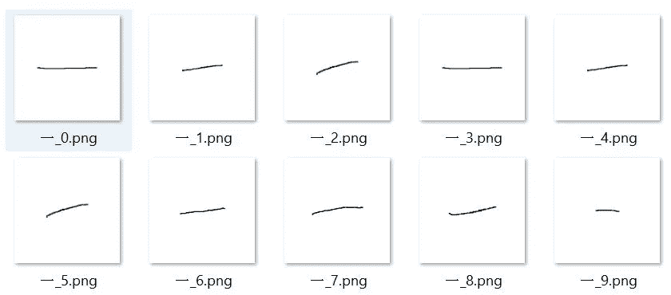

# 批量输入图片文件到 TensorFlow 下的 Kickstart 训练

> 原文：<https://pub.towardsai.net/input-image-files-by-batch-to-kickstart-training-under-tensorflow-e4ccce6ab64b?source=collection_archive---------0----------------------->

## 由于内存错误，无法加载图像作为训练输入？这篇 5 分钟的文章可以为你节省 5 个小时甚至更多。

由 [Unsplash](https://unsplash.com?utm_source=medium&utm_medium=referral) 上 [charlesdeluvio](https://unsplash.com/@charlesdeluvio?utm_source=medium&utm_medium=referral) 拍摄的照片

# **背景**

最近，我一直在尝试建立一个用于图像分类的机器学习模型。由于缺乏足够的真实数据，我首先创建了一个 python 脚本来生成一些人工图像，并用文件名作为标签显式地保存它们。

汉字的人工数据样本(在英语中，它表示数字一)

然而，后来，当我试图加载这些数据作为我的机器学习模型的训练输入时，弹出了内存错误的消息。可以看到图片总数已经超过 40000 张。

一条错误消息显示计算机未能分配足够的 RAM 来保存/处理图像数组。

这个内存错误不容易解决，因为它在某种程度上与我们计算机的硬件设置有关。带着这个问题，我试着在网上搜索解决方案，下面是所有答案的汇总。不幸的是，没有一个能满足我的需求。

(1) **降低类别数和图像大小**，但这可能不符合您的模型目标，并且当图像维度降低时，准确率可能会下降。

(2) **应用**[**Pickle**](https://docs.python.org/3/library/pickle.html)**库**显式存储处理后的数组，然后使用另一台计算机或云服务器加载数据集并训练模型，但这并不总是可行的，尤其是当类的数量或图像的数量非常大时。

(3) **使用**TF . data . dataset . from _ generator，**修改加载函数**，该函数将人工图像直接传递给模型进行训练，无需明确保存。这种方法效果很好，也允许批量加载数据，但可能不是最佳选择。这是因为有时我们只是想通过显式地保存它们来对所有人工图像进行概述。此外，将图像保存在单独的文件夹中使得以后能够容易地调整，例如，将一些真实数据添加到文件夹中并重新训练它。如果你更喜欢用这种方法，这里的文章[提供了一个很好的参考。](https://medium.com/the-owl/creating-a-tf-dataset-using-a-data-generator-5e5564609e64)

尽管如此，第三种方法将我带到了 **Tensorflow** 的**数据集**模块，这也是我想在本文中向大家介绍的内容。

# 加载训练数据的函数

B 在介绍这个模块之前，让我们快速看一下加载训练数据集的原始函数。它首先使用 **OpenCV** 库将图像文件读取为 NumPy 数组，然后将所有图像和相应的标签存储在两个独立的 NumPy 数组 **x_train、**和 **y_train** 中。

然而，如上所述，在存储或处理这样的数组时存在存储器限制。有时错误出现在加载期间，有时出现在处理期间。

# **tensor flow 的数据集模块**

在那一瞬间，我就在想，为什么我们不能只在训练时需要的时候才加载图像的子集，这在**TF . data . dataset . from _ generator 的方法下是允许的。**只是我也想在输入图像进行训练之前将其明确保存。

在阅读了模块的[文档](https://www.tensorflow.org/api_docs/python/tf/data/Dataset)和这里的官方教程[后，我终于想出了一个解决方案，并在不做任何妥协或对上述原始功能进行任何大的修改的情况下成功启动了培训。在下文中，我将解释新代码中的所有关键函数，它们看起来与 numpy 数组的处理非常相似，只是在 **Tensorflow** 格式下。](https://www.tensorflow.org/tutorials/load_data/images)

## **Load_train_data()**

这是加载数据函数的主体。这与旧版本的主要区别在于，我们首先将图像路径加载到一个 list*(****TF . data . dataset . list _ files****)*中，而不是图像本身。这是 **Tf.data.Dataset** 的关键特征，它最大限度地减少了加载过程中的内存需求。这些图像将在稍后的训练中根据它们各自的文件路径进行加载。

保存后，我们还会对列表*(****list _ ds . shuffle****)*进行混排，因为通常我们保存图像数据时，都是按时间顺序排列的。随机播放功能确保图像被随机输入用于训练。

最后，我们通过**映射**将函数 **process_path()** 应用于训练数据集。这非常重要，因为现在，训练数据只是图像路径的列表。我们必须教程序如何加载图像和标签。

## 进程路径()

在 **process_path()** 内部，第一件事就是从文件路径中获取标签，也就是我们的 **y_train，**。接下来，我们通过***TF . io . read _ file***按照路径*、*加载图像文件，后面是后处理*、* **decode_img()** 。

## **Get_label()**

这个函数从文件路径中获取标签。这些代码与通常的字符串处理非常相似，但在 Tensorflow 格式下—***TF . string . split****。*

该函数以**一键编码**结束，这是分类变量作为二进制向量的表示。分类值首先被映射到整数值。然后，每个整数值都表示为一个全为 0 的二进制向量，除了整数的索引标记为 1。

## Decode_img()

这个功能是调整图像，以适应我们的机器学习模型的输入。在我的例子中，我首先将图像转换为 RGB 格式，因为人工图像最初是黑白的，而我的模型的输入格式是彩色的。其次，我将图像调整为 128 x 128 的格式，并通过除以 255 进行标准化。

这种处理功能在每种情况下都会发生变化。都取决于我们模型的输入要求。

## 性能配置()

最后，最后一步是设置函数来配置加载训练数据的性能。这也是一个非常重要的步骤，允许我们批量 ***ds.batch()*** 加载镜像文件，并允许在**自动调优**启用的情况下进行缓存和预取。Tensorflow 将通过自动调整后端参数来帮助平滑训练过程。

所有这些都降低了内存需求，因为只有在训练过程中需要时才加载图像的子集。否则，它们将以图像路径的形式存储。

所以这就是我们所需要的。现在，即使我们面对数百个类和大量的图像，我们仍然能够启动模型训练。

# **结论**

**Tensorflow** 不断修改和引入新的数据结构，以平滑训练过程。**数据集**模块是一个很好的例子，它帮助我们批量加载显式保存的图像作为训练输入。希望上面的代码可以为你节省一些时间，把你的重点和精力转移到如何提高你的模型的准确率上来。

谢谢您们。下次见~

# **参考**

1.  Siladittya 甘露。(2021).[使用数据生成器](https://medium.com/the-owl/creating-a-tf-dataset-using-a-data-generator-5e5564609e64)创建 TF 数据集。

 [## 用我的推荐链接加入媒体-哈德森高

### 如果你对我写的东西感兴趣，不要错过成为 Medium 会员的机会。您将可以完全访问所有…

medium.com](https://medium.com/@hudsonko/membership) 

如果你有兴趣知道如何定制损失函数，使 LSTM 模型更适用于股票价格预测。下面看看我之前的文章。

 [## 定制损失函数，使 LSTM 模型更适用于股票价格预测

### 损失函数不要只考虑价格差异，方向损失也很重要！！！

towardsdatascience.com](https://towardsdatascience.com/customize-loss-function-to-make-lstm-model-more-applicable-in-stock-price-prediction-b1c50e50b16c)