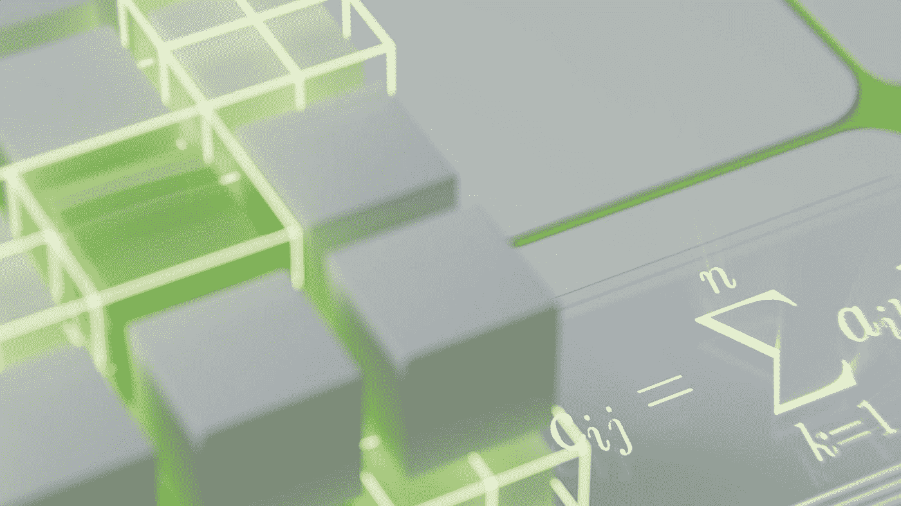
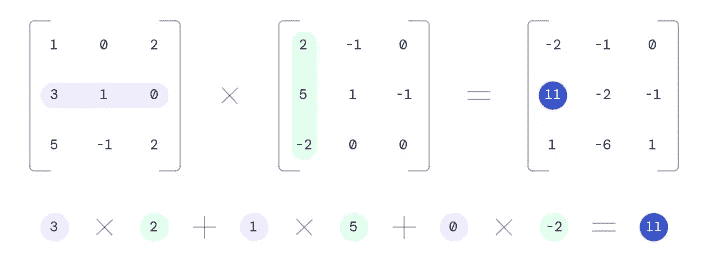
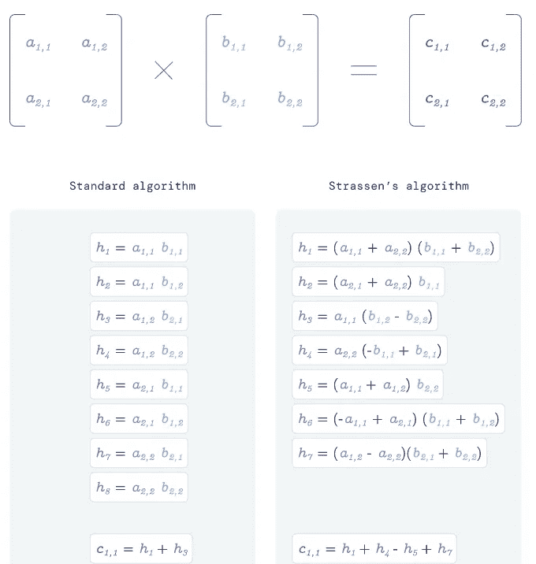
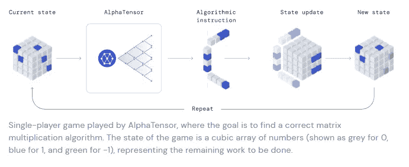
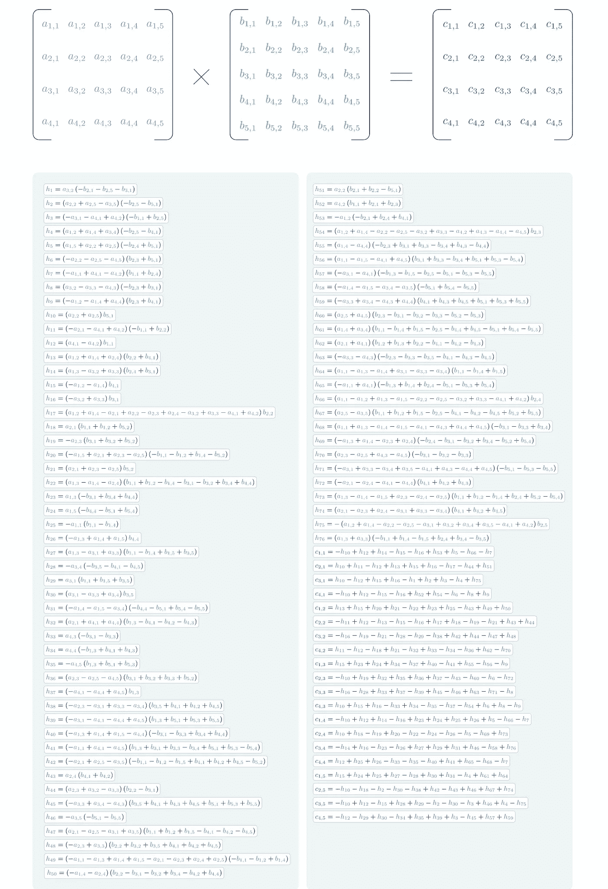

# 在 DeepMind 的 AlphaTensor 中，新的超级模型可以发现新的数学算法

> 原文：<https://pub.towardsai.net/inside-deepminds-alphatensor-the-new-super-model-that-can-discover-new-math-algorithms-a5283513ee27?source=collection_archive---------0----------------------->

## 新的人工智能代理能够在矩阵乘法这个极具挑战性的领域发现新的算法。

图片来源:Reddit

> 我最近创办了一份专注于人工智能的教育时事通讯，已经有超过 125，000 名订户。《序列》是一份无废话(意思是没有炒作，没有新闻等)的 ML 导向时事通讯，需要 5 分钟阅读。目标是让你与机器学习项目、研究论文和概念保持同步。请通过订阅以下内容来尝试一下:

 [## 序列

### 与机器学习、人工智能和数据发展保持同步的最佳资源…

thesequence.substack.com](https://thesequence.substack.com/) 

DeepMind 似乎专注于将人工智能(AI)应用于科学中一些最难的问题。蛋白质构建、天气预测、核聚变和古代碑文修复只是 DeepMind 人工智能研究工作中的一些重大努力。现在，我们应该在列表中添加一个新类别:数学算法发现。上周，DeepMind 在著名的科学杂志《自然》上发表了一篇论文[，揭示了 AlphaTensor](https://www.nature.com/articles/s41586-022-05172-4) ，这是一种能够发现矩阵乘法新算法的神经网络。

自数学诞生以来，算法一直是数学的基础。新算法的发现不仅需要跨越几个数学领域的深刻和广泛的知识，还需要强大的直觉和创造力。从认知的角度来看，这是人类仍然能够胜过人工智能代理的问题类型。AlphaTensor 是最早涉足这一领域的人工智能模型之一。从功能的角度来看，AlphaTensor 能够建立在另一个 DeepMind 超级模型的基础上: [AlphaZero，它在不同的棋盘游戏中实现了超人的性能，如围棋、象棋和 shogi](https://www.deepmind.com/blog/alphazero-shedding-new-light-on-chess-shogi-and-go) 。你可以把 AlphaTensor 看作是为算法发现游戏优化的 AlphaZero。AlphaTensor 解决的第一个算法是机器学习(ML)中许多重要方法的基础。

# 矩阵乘法

矩阵乘法是我们在代数课上学习的第一批算法之一，但它对计算机视觉、语音识别、视频游戏等领域有着深远的影响。传统的矩阵乘法方法将每个像元的值分解成一个线性公式，该公式组合了输入矩阵的行和列。

图片来源:DeepMind

几个世纪以来，这种基本方法被认为是解决矩阵乘法的唯一方法，直到 1969 年，德国数学家 Volker Strassen [发表了一篇论文](https://link.springer.com/article/10.1007/BF02165411)描述了一种更优的技术。Strassen 的方法是基于从非常小的矩阵研究中获得的见解，这产生了乘法算法中的少量运算。

图片来源:DeepMind

Strassen 的文章发表几十年后，数学界还没有发现新的矩阵乘法算法，这在很大程度上被认为是一个已经解决的问题。

# 阿尔法张量

AlphaTensor 将矩阵乘法问题建模为单人游戏。游戏环境是一个三维张量，表示给定算法的正确程度。播放器可以执行操作来修改张量并将其条目清零。结果是一个可能正确的矩阵乘法算法，它的困难在于将张量归零的步骤数。

图片来源:DeepMind

就复杂性而言，该游戏比围棋大 30 个数量级，而围棋直到几年前还被人工智能认为是无法解决的。基于 AlphaZero 的原则，AlphaTensor 使用了一种强化学习算法来玩游戏，而无需事先了解规则。在这个过程中，AlphaTensor 发现了许多算法，包括 Strassen 的算法。AlphaTensor 能够随着时间的推移逐步改进发现过程，超越人类的直觉，发现许多以前未知的算法。

在标准的 4x5 乘 5x5 矩阵乘法方法中清楚地说明了α张量的有效性，其中传统方法需要大约 100 次运算。AlphaTensor 能够输出一种新算法，在 76 次运算中完成乘法运算。AlphaTensor 显示出对 Strassen 算法的显著改进，这是数学界 50 年来从未见过的。

图片来源:DeepMind

AlphaTensor 的改进不仅在小矩阵中可见，更重要的是，在大矩阵乘法场景中非常相关，这在许多 ML 域中是常见的。更令人震惊的是，AlphaTensor 产生的不是一种而是数千种此前未知的矩阵乘法方法。虽然 AlphaTensor 针对单一类型的问题进行了优化，但它的原理可以应用于算法发现中的许多场景。这为加速数学研究的混合智能方法打开了大门。