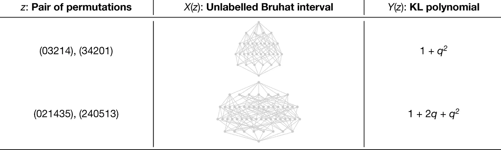
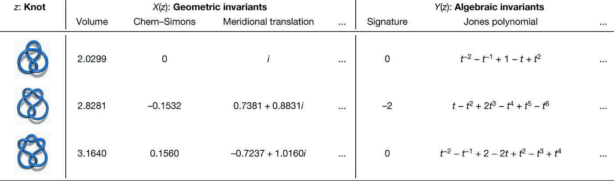

# DeepMind 将深度学习用于高等数学的新尝试

> 原文：<https://pub.towardsai.net/inside-deepminds-new-efforts-to-use-deep-learning-to-advance-mathematics-3aa846982cae?source=collection_archive---------2----------------------->

## [深度学习](https://towardsai.net/p/category/machine-learning/deep-learning)

## 使用深度学习技术可以帮助数学家发展对该领域最棘手问题的直觉。

来源:[https://www . education mesd . com/courses/math-for-machine-learning-linear-algebra/](https://www.educationmesd.com/courses/math-for-mahine-learning-linear-algebra/)

> 我最近创办了一份专注于人工智能的教育时事通讯，已经有超过 10 万名订户。《序列》是一份无废话(意思是没有炒作，没有新闻等)的 ML 导向时事通讯，需要 5 分钟阅读。目标是让你与机器学习项目、研究论文和概念保持同步。请通过订阅以下内容来尝试一下:

 [## 序列|克塞尼亚·塞梅诺娃|子堆栈

### 订阅人工智能世界中最相关的项目和研究论文。受到 110，000+的信任…

thesequence.substack.com](https://thesequence.substack.com/) 

深度学习在生物学或物理学等不同的核心科学学科中正变得越来越重要。但是数学呢？显然，数学是每一种深度学习方法背后的基础，但这些方法可以用来推进数学研究本身吗？这是 DeepMind 最近在著名的自然杂志上发表的一篇论文的主题，他们在论文中展示了一些清晰的例子，说明深度学习如何用于新的数学发现。

高等数学高度依赖数据集的模式识别，这是深度学习擅长的领域。DeepMind 认为深度学习可以在推进数学直觉方面发挥作用。高等数学中的任何最新发现都依赖于强大的形式主义和坚实的直觉的结合。深度学习可以帮助识别数学问题中不同函数之间的模式，这可以通过识别否则会丢失的关系来指导数学家的直觉。一般来说，下图说明了 DeepMind 使用深度学习推进数学直觉的工作流程。

# 两个高级示例

为了测试他们的想法，DeepMind 合作将深度学习方法应用于两个值得注意的数学问题。DeepMind 选择的问题之一被称为[组合不变性猜想](https://dl.acm.org/doi/10.1016/j.jcta.2005.12.003)，40 多年来一直未被证实。这个猜想是基于一个被称为表示论的数学领域，它专注于对线性对称性的理解。组合不变性猜想本身的细节超出了本文的范围，但本质上，概述了 Kazhdan–Lusztig(KL)多项式和称为 Bruhat 区间的图结构之间的关系。解决这一猜想的主要限制之一是，布鲁哈特区间的结构太复杂，无法从中提取模式。

使用深度学习，DeepMind 能够识别布鲁哈特区间图中的特定模式，这些模式表明了与 KL 多项式的潜在关系。利用这种直觉，[悉尼大学的 Geordie Williamson](https://www.maths.usyd.edu.au/u/geordie/) 教授能够开发一种算法，从理论上解决组合不变性猜想。虽然不是完整的证明，但 DeepMind 能够在 300 万个例子中验证该算法。

图片来源:深度思维，自然

DeepMind 工作的另一个例子与拓扑理论中被称为纽结的基本对象之一有关。从几何结构来看，纽结是封闭的曲线，在量子场论、几何、代数等不同领域发挥着重要作用。几个世纪以来困扰数学家的一个问题是，纽结的结构是否有助于描述数学不同领域之间的关系。纽结的几何能告诉我们关于它的代数的任何事情吗？DeepMind 使用了一个深度学习模型，该模型发现了一种被称为结的自然斜率的代数结构，这似乎表明了与其几何形状的关系。利用这种洞察力，牛津大学的马克·拉肯比教授和安德拉·胡斯教授能够量化直接连接不同数学领域的关系。

图片来源:深度思维，自然

DeepMind 的工作可能是一个新时代的开始，数学家们利用深度学习技术来开发关于该领域最困难问题的新直觉。正如之前几次一样，DeepMind 继续推动深度学习的边界，以推进不同的科学领域。