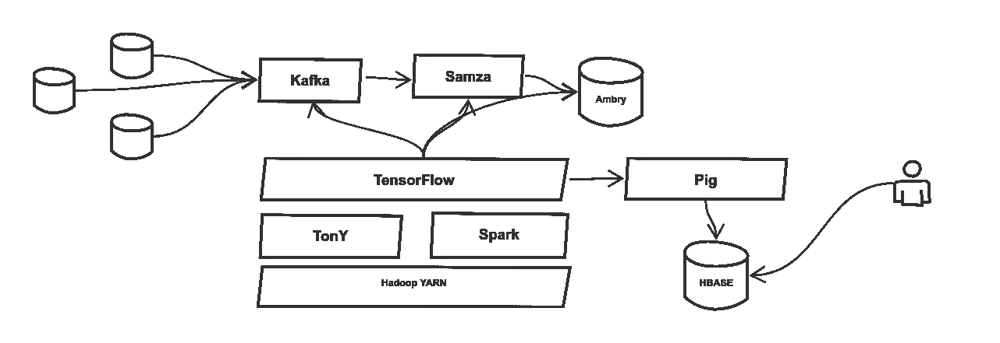
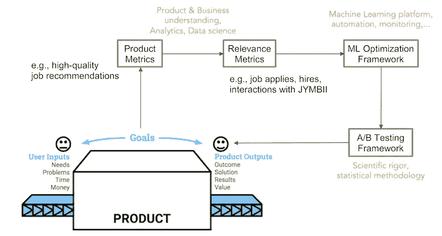

# 领英的机器学习基础设施内部

> 原文：<https://pub.towardsai.net/inside-linkedins-machine-learning-infrastructure-125076417ee0?source=collection_archive---------2----------------------->

## LinkedIn 机器学习的架构和技术概述。

图片来源:[https://solutions review . com/business-intelligence/machine-learning-LinkedIn-groups/](https://solutionsreview.com/business-intelligence/machine-learning-linkedin-groups/)

> 我最近创办了一份专注于人工智能的教育时事通讯，已经有超过 125，000 名订户。《序列》是一份无废话(意思是没有炒作，没有新闻等)的 ML 导向时事通讯，需要 5 分钟阅读。目标是让你与机器学习项目、研究论文和概念保持同步。请通过订阅以下内容来尝试一下:

 [## 序列

### 与机器学习、人工智能和数据发展保持同步的最佳资源…

thesequence.substack.com](https://thesequence.substack.com/) 

大规模构建机器学习是一条充满挑战的道路，没有多少记录良好的案例研究可以作为参考。我在 Invector Labs 的团队最近发布了一张幻灯片，总结了我们在大规模构建机器学习解决方案时学到的一些经验，但我们也一直在努力研究该领域的其他公司是如何解决这些问题的。

LinkedIn 是多年来一直将机器学习应用于大规模场景的公司之一，但人们对这家软件巨头使用的具体方法和技术知之甚少。最近，LinkedIn 工程团队发表了一系列博客文章，提供了一些关于他们机器学习基础设施和实践的非常有趣的见解。虽然许多场景都非常特定于 LinkedIn，但这些技术和最佳实践适用于许多大规模的机器学习解决方案。

# 有人类参与的机器学习

LinkedIn 的机器学习架构最有趣的一个方面是他们如何将人类作为机器学习工作流的一部分。例如，让我们看一个场景，它发现不同头衔之间的关系，例如“高级软件工程师”或“首席开发人员”，以改善搜索体验。LinkedIn 使用人类分类学家来标记标题之间的关系，以便它们可以用于机器学习模型，如长短期记忆网络，这有助于发现标题之间的其他关系。机器学习架构是 [LinkedIn 知识图谱](https://engineering.linkedin.com/blog/2016/10/building-the-linkedin-knowledge-graph)的基础。

# 大规模的机器学习基础设施

LinkedIn 的机器学习基础设施的核心是一个名为 Pro-ML 的专有系统。从概念上讲，Pro-ML 控制着机器学习模型从训练到监控的整个生命周期。为了扩大 Pro-ML 的规模，LinkedIn 建立了一个架构，将 Kafka 或 Samza 等一些开源技术与 Spark 或 Hadoop YARN 等基础设施构建模块相结合。

来源:[https://engineering . LinkedIn . com/blog/2018/09/open-sourcing-Tony-native-support-of-tensor flow-on-Hadoop](https://engineering.linkedin.com/blog/2018/09/open-sourcing-tony--native-support-of-tensorflow-on-hadoop)

虽然 LinkedIn 的机器学习堆栈中使用的大多数技术都是众所周知的，但有几项新的贡献值得进一步探索:

**[**Ambry**](https://github.com/linkedin/ambry)**:**LinkedIn 的 Ambry 是一个分布式不可变 blob 存储系统，它高度可用，非常容易扩展，经过优化，能够以高吞吐量和低延迟为大小从几千字节到几千兆字节的不可变对象提供服务，并支持从客户端到存储层的端到端流，反之亦然。该系统构建为在跨多个数据中心的主动-主动设置下工作，并提供非常便宜的存储。**

****[**TonY**](https://github.com/Intel-bigdata/TensorFlowOnYARN)**:**TensorFlow on YARN(TonY)是一个在 Apache Hadoop 上原生运行 tensor flow 的框架。TonY 支持将单节点或分布式 TensorFlow 培训作为 Hadoop 应用程序运行。****

******[**Photon ML**](https://github.com/linkedin/photon-ml)**:**Photon ML 是一个基于 Apache Spark 的机器学习库。目前，Photon ML 支持训练不同类型的广义线性模型(GLMs)和广义线性混合模型(GLMMs/GLMix 模型):logistic、Linear 和 Poisson。******

# ****Hadoop 上的 TensorFlow****

****上个月，LinkedIn 工程团队[开源了其 TensorFlow on the YARN(TonY)框架](https://github.com/linkedin/TonY)的第一版。此次发布的目标是让 TensorFlow 程序能够在分布式纱线集群上运行。虽然 TensorFlow 工作流在 Apache Spark 等基础设施上得到广泛支持，但 YARN 仍然在很大程度上被机器学习社区所忽视。TonY e 通过处理资源协商和容器环境设置等任务，为在 Hadoop 上运行 TensorFlow 作业提供一流的支持。****

********

****来源:[https://engineering . LinkedIn . com/blog/2018/09/open-sourcing-Tony-native-support-of-tensor flow-on-Hadoop](https://engineering.linkedin.com/blog/2018/09/open-sourcing-tony--native-support-of-tensorflow-on-hadoop)****

****在其核心部分，TonY 采用了一个 TensorFlow 程序，并将其分成多个可以在 YARN 集群上执行的并行任务。它这样做的同时保持对 TensorFlow 的计算图的完全支持，这意味着 TensorBoard 等工具可以在 TonY 上使用，无需任何修改。****

********

****来源:[https://engineering . LinkedIn . com/blog/2018/09/open-sourcing-Tony-native-support-of-tensor flow-on-Hadoop](https://engineering.linkedin.com/blog/2018/09/open-sourcing-tony--native-support-of-tensorflow-on-hadoop)****

****TonY 是对 TensorFlow 生态系统的一个有趣贡献，可以改善 TensorFlow 应用程序大规模运行的体验。此外，TonY 可以受益于 YARN 生态系统中可用的各种工具和库，为训练和运行 TensorFlow 应用程序提供高度可扩展的运行时。****

# ****测试****

****LinkedIn 运行着数以千计的并发机器学习模型，这些模型不断发展和升级。在这些情况下，开发一种健壮的测试方法对于优化机器学习模型在运行时的性能至关重要。在 LinkedIn 的情况下，工程团队已经将 A/B 测试作为其 Pro-ML 架构的一等公民，允许机器学习工程师为特定场景部署竞争算法，并评估产生最佳结果的算法。****

********

****图片来源:LinkedIn****

****来源:[https://engineering . LinkedIn . com/blog/2018/09/open-sourcing-Tony-native-support-of-tensor flow-on-Hadoop](https://engineering.linkedin.com/blog/2018/09/open-sourcing-tony--native-support-of-tensorflow-on-hadoop)****

****像 LinkedIn 这样的互联网巨头处于实施大规模机器学习解决方案的最前沿，他们对这一主题的见解对开始机器学习之旅的公司来说非常有价值。LinkedIn 的工作清楚地表明，大规模开发机器学习是一项永无止境的工作，它将流行的开源库和平台与专有框架和方法相结合。****