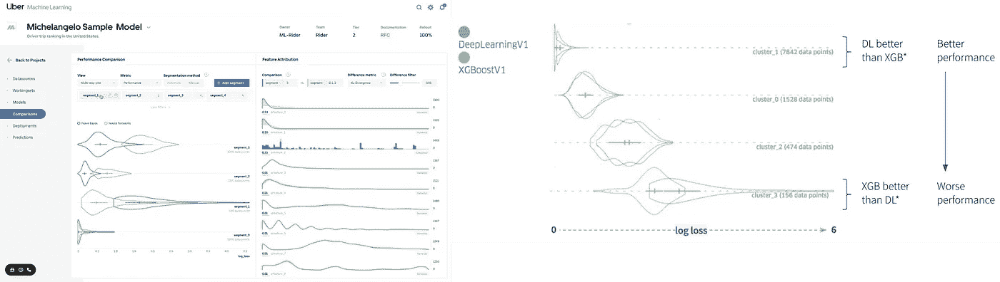
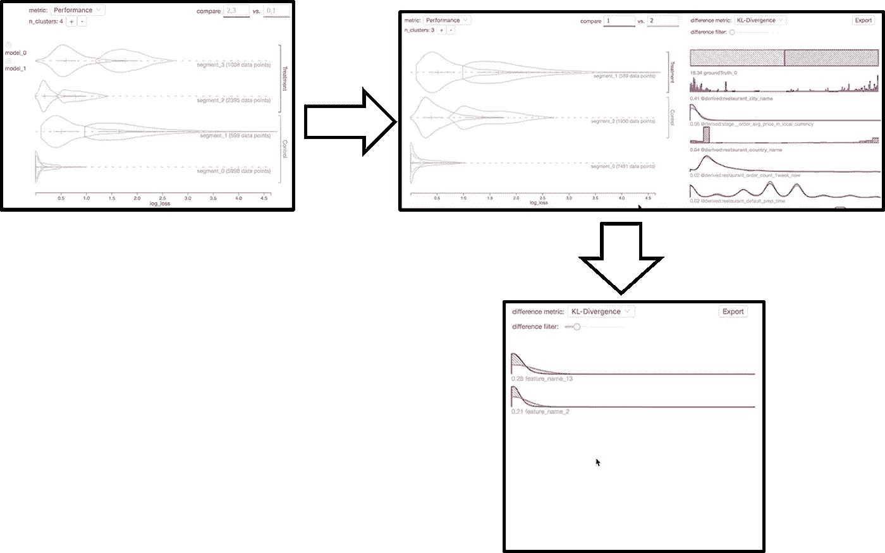
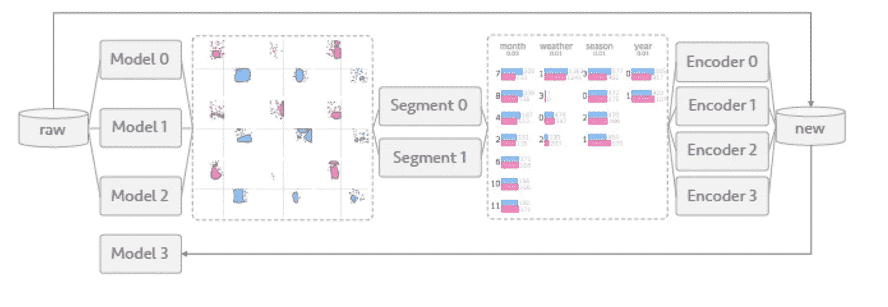
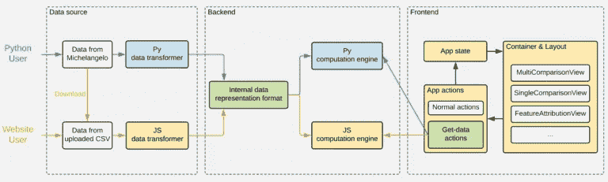

# 内部流形:用于调试机器学习模型的优步堆栈

> 原文：<https://pub.towardsai.net/inside-manifold-ubers-stack-for-debugging-machine-learning-models-e4daf6830665?source=collection_archive---------0----------------------->

## [机器学习](https://towardsai.net/p/category/machine-learning)

## 开源栈结合了聪明的可视化来检测关于 ML 模型的见解。

图片来源:优步

> 我最近创办了一份专注于人工智能的教育时事通讯，已经有超过 10 万名订户。《序列》是一份无废话(意思是没有炒作，没有新闻等)的 ML 导向时事通讯，需要 5 分钟阅读。目标是让你与机器学习项目、研究论文和概念保持同步。请通过订阅以下内容来尝试一下:

 [## 序列

### 订阅人工智能世界中最相关的项目和研究论文。受到 102，000 多人的信任…

thesequence.substack.com](https://thesequence.substack.com/) 

优步继续其对机器学习开源社区的惊人贡献。从像 [Pyro](https://pyro.ai/) 这样的概率编程语言到像 [Ludwig](https://uber.github.io/ludwig/) 这样的低代码机器学习模型工具，这个运输巨头一直在定期发布简化机器学习应用程序生命周期的工具和框架。一年多前，优步宣布它是[开源歧管](https://github.com/uber/manifold)，一个用于机器学习模型的与模型无关的可视化调试工具。Manifold 的目标是帮助数据科学家以直观的方式识别跨数据集和模型的性能问题。

机器学习程序不同于传统的软件应用程序，因为它们的结构随着模型建立更多的知识而不断变化和发展。因此，调试和解释机器学习模型是现实世界人工智能(AI)解决方案中最具挑战性的方面之一。调试、解释和诊断是大规模构建机器学习解决方案的组织关注的活跃领域。调试和解释机器学习模型的挑战并不新鲜，业界已经在这一领域产生了一些工具和框架。然而，大多数现有的堆栈专注于使用性能度量来评估候选模型，例如像[对数损失](http://wiki.fast.ai/index.php/Log_Loss)、[曲线下面积(AUC)](https://stats.stackexchange.com/questions/132777/what-does-auc-stand-for-and-what-is-it) 和[平均绝对误差(MAE)](https://en.wikipedia.org/wiki/Mean_absolute_error) ，这些度量虽然有用，但在模型性能的根本原因方面提供的洞察力很少。另一个常见的挑战是，大多数机器学习调试工具都局限于特定类型的模型(例如:回归或分类)，很难在更广泛的机器学习架构中推广。因此，数据科学家花费大量时间尝试不同的模型配置，直到他们能够实现特定的性能。

# 进入歧管

像优步这样的公司正在几十个团队中运营数百个机器学习模型。因此，这些模型的调试和可解释性成为机器学习管道的一个关键方面。借助 Manifold，优步工程团队希望实现一些切实可行的目标:

调试机器学习模型中的代码错误。

理解一个模型的优势和劣势，无论是孤立的还是与其他模型相比较的。

比较和集成不同的模型。

将通过检查和性能分析收集的见解整合到模型迭代中。

为了实现这些目标，Manifold 将机器学习分析过程分为三个主要阶段:检查、解释和细化。

**检查:**在分析过程的第一部分，用户设计一个模型，并试图调查和比较模型结果与其他现有结果。在此阶段，用户比较典型的性能指标，如准确度、精确度/召回率和接收机工作特性曲线(ROC ),以获得新模型是否优于现有模型的粗粒度信息。

**解释:**分析过程的这一阶段试图解释前一阶段形成的不同假设。这个阶段依靠比较分析来解释特定模型的一些症状。

**细化:**在此阶段，用户试图通过将从解释中提取的知识编码到模型中并测试性能来验证前一阶段生成的解释。

机器学习分析过程的三个步骤在简化机器学习模型调试的简单用户界面上实现。歧管用户界面由两个主要对话框组成:

1) **性能比较视图:**提供使用小多重设计的模型对之间的视觉比较，以及局部特征解释器视图。

2) **特征属性视图:**揭示用户定义的子集之间的特征比较，并提供特征分布的相似性度量。

图片来源:优步

用户可以使用三个主要步骤在 Manifold 中调试机器学习模型:

1) **比较**:首先，给定具有来自一个或多个 ML 模型的输出的数据集，流形比较并突出跨模型或数据子集的性能差异。

2) **切片**:该步骤允许用户根据模型性能选择感兴趣的数据子集，以便进一步检查。

3) **属性** : Manifold 然后突出显示所选数据子集之间的特征分布差异，帮助用户找到性能结果背后的原因。

图片来源:优步

# 流形结构

从架构的角度来看，流形工作流将一组机器学习模型作为输入，并基于特征工程产生不同的数据段。然后，特征段由一组编码器处理，这些编码器产生一组具有原始模型未捕捉到的内在结构的新特征，并帮助用户迭代新模型并获得更好的性能。

图片来源:优步

上面描述的工作流是在一个简单的架构中实现的，该架构基于三个主要组件:数据源、后端和前端。在功能上，管汇架构基于三个主要模块:

*   **数据转换器**，将其他内部服务(如米开朗基罗)的数据格式转换为 Manifold 内部数据表示格式的功能
*   **计算引擎**，负责运行集群和其他数据密集型计算的功能
*   **前端组件，**流形可视化分析系统的 UI(其 Python 包使用内置版本的 JavaScript 前端组件)

图片来源:优步

Manifold 的关键能力之一是与优步的核心机器学习平台:米开朗基罗的集成。为了实现这一目标，优步工程团队依赖于基于 JavaScript 的计算框架，如 [TensorFlow.js](https://js.tensorflow.org/) ，这消除了对昂贵计算硬件的需求。对于更多计算密集型进程，Manifold 提供了一个基于 Python 的接口，该接口基于[熊猫](https://pandas.pydata.org/)和 [Scikit-Learn](https://scikit-learn.org/stable/) 。

# 歧管 v1 中的新特性

自最初发布以来，优步已经为 Manifold 添加了一系列新特性，以便为其开源首次亮相做好准备:

**对通用二进制分类和回归模型调试的模型无关支持。**用户将能够分析和比较各种算法类型的模型，使他们能够辨别不同数据切片的性能差异。

**对表格特征输入的可视化支持，包括数字、分类和地理空间特征类型。**使用每个数据切片的特征值分布信息，用户可以更好地了解某些性能问题的潜在原因，例如，模型的预测损失与其数据点的地理位置和分布之间是否存在任何相关性。

**与 Jupyter 笔记本的集成。**通过这种集成，Manifold 接受作为 Pandas DataFrame 对象的数据输入，并在 Jupyter 中呈现该数据的可视化。由于 Jupyter Notebook 是数据科学家和 ML 工程师最广泛采用的数据科学平台之一，这种集成使用户能够在不中断正常工作流程的情况下分析他们的模型。

**基于每个实例的预测损失和其他特征值的交互式数据切片和性能比较。**用户将能够基于预测损失、地面实况或其他感兴趣的特征来切片和查询数据。该功能将使用户能够通过通用的数据切片逻辑快速验证或拒绝他们的假设。

毫无疑问，流形是优步对机器学习应用开发的最重要贡献之一。像 Manifold 这样的工具可以帮助简化跨不同机器学习框架的机器学习模型的调试和故障排除。我们当然可以期待机器学习社区在不久的将来为多方面的发展做出积极的贡献。