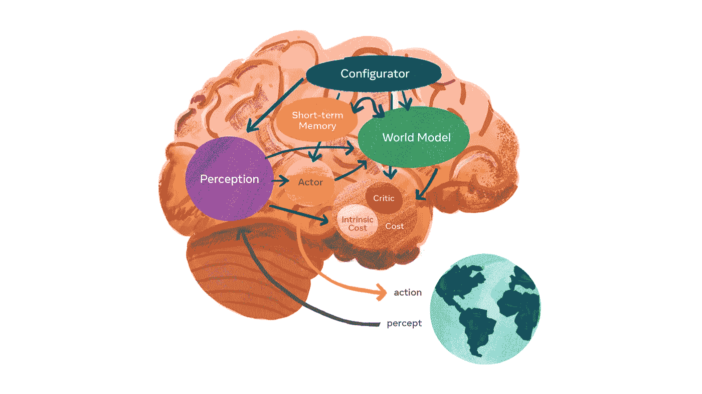
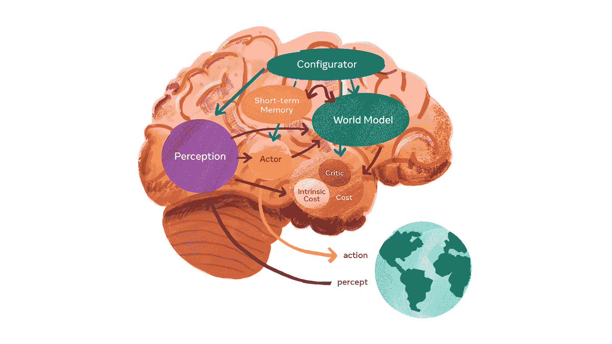

# 在 Meta 的新架构中，构建能够像人类和动物一样推理的人工智能代理

> 原文：<https://pub.towardsai.net/inside-metas-new-architecture-for-build-ai-agents-that-can-reason-like-humans-and-animals-423a925e4349?source=collection_archive---------1----------------------->

## 新的架构为自主 AI 代理提供了基础。

图片来源:Meta AI

> 我最近创办了一份专注于人工智能的教育时事通讯，已经有超过 10 万名订户。《序列》是一份无废话(意思是没有炒作，没有新闻等)的 ML 导向时事通讯，需要 5 分钟阅读。目标是让你与机器学习项目、研究论文和概念保持同步。请通过订阅以下内容来尝试一下:

 [## 序列

### 订阅人工智能世界中最相关的项目和研究论文。受到 120，000+的信任…

thesequence.substack.com](https://thesequence.substack.com/?r=2g8vk) 

人类和动物有一种不可思议的能力，只需要少量的观察和实验就可以学习非常复杂的世界模型。这种认知技能的关键是我们重用大量背景知识的能力。许多认知心理学家将这种技能归类为“常识”,尽管对它了解甚少，但它仍然是我们认知结构的关键。从这个角度来看，常识可以被看作是世界模型的集合，可以指导我们的决策过程。

人类认知的架构与当前一代有监督的人工智能模型形成了高度对比，在当前一代的人工智能模型中，每项任务都需要从头开始重新学习。近年来，我们已经看到了诸如自我监督学习(SSL)之类的技术，它们提供了一种在最少监督的情况下学习给定环境的模型的替代方法。Meta(脸书)人工智能研究(FAIR)一直是 SSL 思想学派背后的主要倡导者。在他们最近的活动“实验室内部”中，Meta AI 的首席人工智能科学家 Yann LeCun 将这些努力向前推进了一步，提出了一种新的架构，以实现能够自主推理的新一代人工智能系统。

LeCun 架构的核心基于六个独立的可微分模块，能够计算不同的目标函数。这六个模块模拟人脑的不同功能，如下图所示。

图片来源:Meta AI

每个模块都提供了自主智能模型的原子构建模块:

1)配置器:该模块负责执行控制。将任务的定义作为输入，配置器设置体系结构中其他模块的参数，以便执行该任务。

**2)感知模块:**该模块接收来自不同传感器的信号，并试图构建给定环境的表示。这种表示优化了手边特定任务所需的特性。

世界模型:这个模块有两个基本的角色。首先，它试图估计感知模块没有提供的关于环境模型的缺失信息。它还试图预测环境的未来状态。从这个角度来看，世界模块可以被视为与给定任务相关的环境状态的模拟器。

**4)成本:**该模块计算评估代理不适的指标。“不舒服”指的是从代理人的损害到偏离偏见和道德准则的任何事情。

**5)Actor:**这个模块为给定的任务和环境状态计算动作序列。

短期记忆:这个模块跟踪当前和预测的世界状态以及相关的成本，因此它可以在不同的行动中被分解。

LeCun 和 FAIR 团队不仅仅是提出了一个通用的架构，而是更深入地研究了目前可以用来实现其中几项功能的不同深度学习技术。我们应该期待 LeCun 的架构在不久的将来成为 Meta 人工智能系统的基础之一。