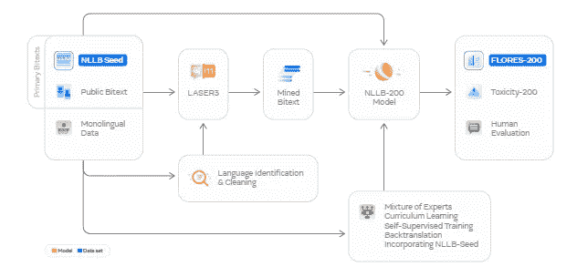
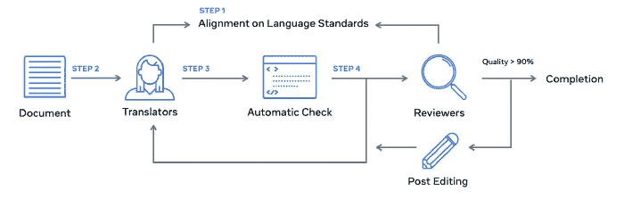
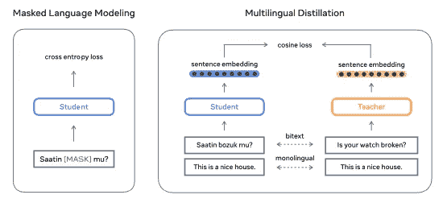
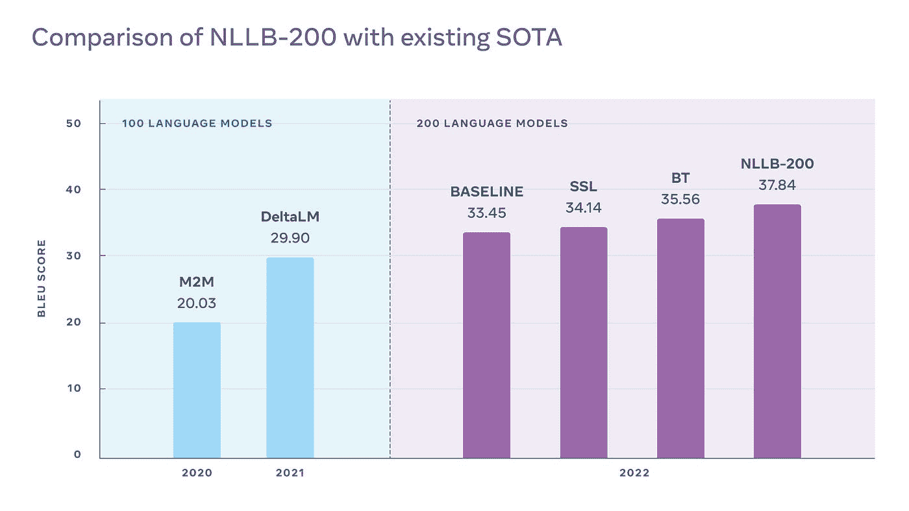

# 在 NLLB-200 中，Meta AI 的新超级模型实现了跨越 200 种语言的机器翻译的新里程碑

> 原文：<https://pub.towardsai.net/inside-nllb-200-meta-ai-new-super-model-sets-milestone-in-machine-translations-across-200-8156c86fd150?source=collection_archive---------2----------------------->

## 将机器翻译引入低资源语言的最重要的成就之一。

来源:https://gigazine.net/gsc_news/en/20220707-meta-nllb-200/

> 我最近创办了一份专注于人工智能的教育时事通讯，已经有超过 125，000 名订户。《序列》是一份无废话(意思是没有炒作，没有新闻等)的 ML 导向时事通讯，需要 5 分钟阅读。目标是让你与机器学习项目、研究论文和概念保持同步。请通过订阅以下内容来尝试一下:

 [## 序列

### 与机器学习、人工智能和数据发展保持同步的最佳资源…

thesequence.substack.com](https://thesequence.substack.com/) 

机器翻译是可以产生直接社会影响的深度学习学科之一。如今，世界上有很大一部分人无法用他们的母语访问在线内容。类似地，自然语言理解(NLU)方面的大多数进步都局限于高资源语言，如英语、西班牙语或法语，这些语言具有大量的可用训练数据。将翻译扩展到数百种低资源语言和方言是未来十年机器翻译最重要的挑战之一。几天前，Meta AI 开源了[no language left behind(NLLB)-200](https://ai.facebook.com/research/no-language-left-behind/)，这是一个可以跨 200 种语言进行最先进的机器翻译的模型。Meta AI 还开源了一些补充数据集和框架，可以帮助加速低资源语言的机器翻译研究。[NLLB 200 的研究论文长达惊人的 190 页。](https://research.facebook.com/publications/no-language-left-behind/?utm_source=twitter&utm_medium=organic_social&utm_campaign=nllb&utm_content=os-artifacts)

# NLLB-200

NLLB-200 不是一个单一的模型，而是模型、数据集和工具的组合，有助于翻译大量不同资源的语言。具体来说，Meta AI 最终开源了以下组件:

**人工翻译的数据集**

Flores-200:204 种语言的评价数据集

NLLB-Seed:39 种语言的 Seed 培训数据

NLLB 医学博士:种子数据在不同领域的 6 种语言，以评估推广

毒性-200:检测 200 种语言毒性的词汇表

**创建大规模双文本数据集的工具**

200 多种语言的语言识别

LASER3:句子编码器，用于识别 148 种语言的对齐双文本

stopes:一个数据挖掘库，可以用来处理和清理单语

数据，然后创建对齐的双文本

训练数据重新创建:重新创建原始模型中使用的训练数据的脚本。

**涵盖 202 种语言的翻译模型**

NLLB-200:54.5 b 稀疏门控专家混合模型

3.3B 和 1.3B 高密度变压器型号

从 NLLB-200 中提炼出的 1.3B 和 600M 高密度变压器模型。

这些组件之间的关系在下面的 NLLB-200 架构图中有清晰的说明。

图片来源:Meta AI

让我们更详细地探讨一些关键组件。

# 弗洛雷斯-200 和 NLLB-种子

NLLB-200 的两个最重要的贡献是用于评估机器翻译任务的 FLORES-200 和 NLLB-Seed 数据集。FLORES-200 是一个多对多的评估数据集，允许研究人员评估 40，000 个不同方向的机器翻译任务的性能。FLORES-200 是使用相当复杂的工作流程创建的，包括翻译人员、自动验证工具以及审核人员。结果是低资源语言行业中最丰富的数据集之一。

图片来源:Meta AI

作为对 FLORES-200 工作的补充，Meta AI 还开源了包含 39 种语言约 6000 个句子的 NLLB-Seed 数据集。这个数据集的想法是跨不同语言播种机器翻译模型。

# 激光 3

NLLB-200 的另一个贡献是 LASER3 模型，用于翻译任务中的零镜头转换。正如你可能想象的那样，LASER3 是最新版本的[激光工具包](https://engineering.fb.com/2019/01/22/ai-research/laser-multilingual-sentence-embeddings/)。LASER3 用一种新的变压器模型取代了 LSTM 层，这种模型以自我监督的方式进行训练。核心思想是使用一个基于高资源语言编码器的教学模型和几个基于低资源语言的学生模型。

图片来源:Meta AI

# 建模

NLLB-200 广泛使用先进技术，如专家混合(MoE)技术。该模型使用了一系列具有共享容量的 MoE 模型，因此它们可以被资源较少的语言模型使用，而不需要那么多数据。NLLB-200 也使用两步课程方法，在引入低资源语言任务之前，高资源语言被训练几个时代。这解决了一些过度拟合的挑战。

# 结果呢

NLLB-200 实现了令人印象深刻的里程碑，在 100 和 200 种语言中超越了最先进的模型。下面的图表说明了一些使用著名的 BLEU 评分的比较。

图片来源:Meta AI

NLLB-200 是让人工智能更加包容和平等的最令人印象深刻的尝试之一。通过开源 NLLB-200 的所有组件，Meta AI 在推进低资源语言的机器翻译研究方面迈出了重要一步。