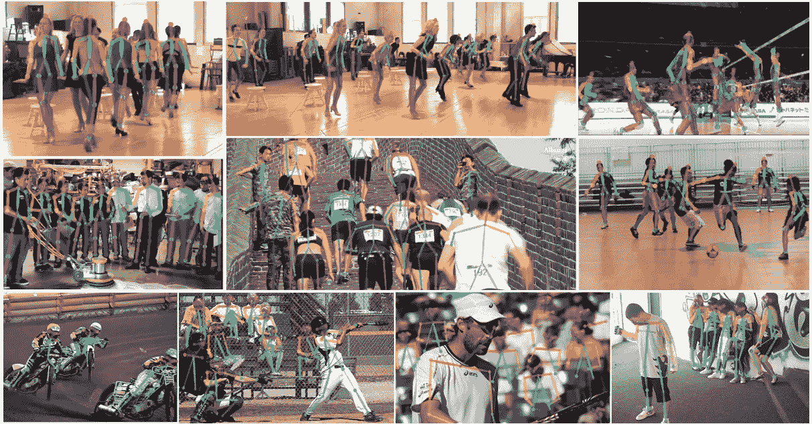
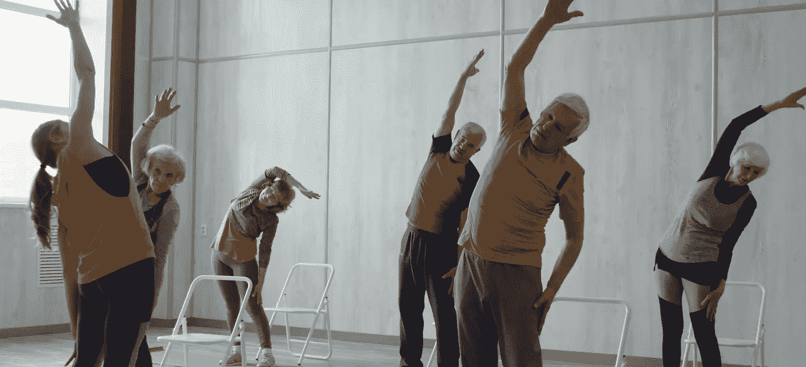
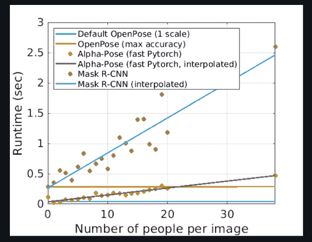
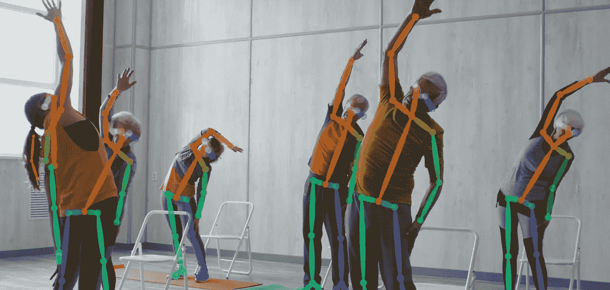
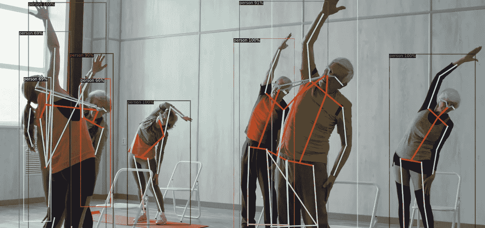
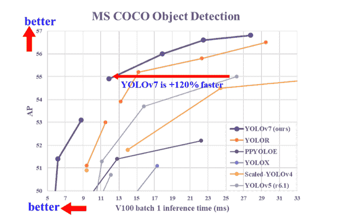
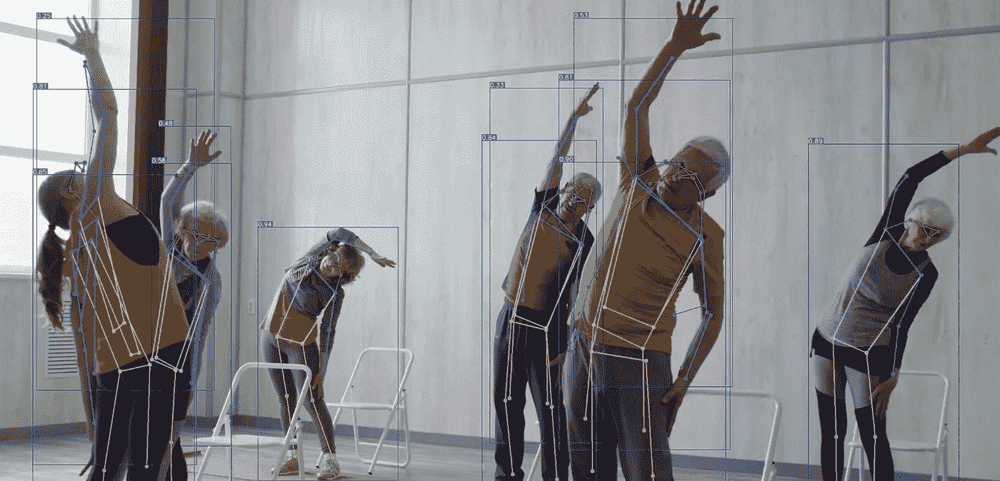

# 关于姿态估计的见解

> 原文：<https://pub.towardsai.net/insights-regarding-pose-estimation-c8b37f5df660?source=collection_archive---------2----------------------->

## 你为什么不深入研究描绘人体的技术艺术呢？

来源:https://arxiv.org/abs/1812.08008

T 他的帖子的目的是分享我在 [Neosperience](https://www.neosperience.com/) 实习期间研究**姿态估计**时学到的知识和实验。这份文件可能对那些计划开发与估计姿态相关的项目的人有用。

你可以查看**技术细节**、**实验方法、**和**代码实现**进行本帖推理。

> ***技术细节***

**姿态估计**是计算机视觉中使用的一项技术，涉及从图像或视频帧中估计**物体**的**位置**、**方位**和**比例**。**姿态估计**在很多领域都有应用，比如**机器人**、**增强现实**、**动作捕捉**、**计算机视觉**。

当前最先进的姿态估计方法是基于**卷积神经网络(CNN)** 。完成这项任务的方法主要有两种:一种是**自上而下的方法**和一种**自下而上的方法**。两种方法都有各自的**优点**和**缺点**与监控区域相关。

*   **自上而下**的方法包括两个步骤。第一步是检测图像中的所有人，然后在这些检测中估计部分并计算姿态。它也被称为两阶段**方法**。

一些**自顶向下**的方法有: [**用于人体姿态估计和跟踪的单基线**](https://github.com/Microsoft/human-pose-estimation.pytorch) **，**[**alpha Pose**](https://github.com/MVIG-SJTU/AlphaPose)**，Mask-RCNN，**[**py torch CPN**](https://github.com/GengDavid/pytorch-cpn)

*   **自下而上**的方法首先预测图像中的**关键点**，然后将这些关键点组合成图像中人的姿势。

一些**自下而上**的方法有**[**MoveNet**](https://www.tensorflow.org/hub/tutorials/movenet)**，**[**PersonLab**](https://arxiv.org/pdf/1803.08225.pdf)**，**[**open pose**](https://github.com/CMU-Perceptual-Computing-Lab/openpose)。**

> ****那么，在什么条件下应该首选哪种方法呢？****

*   ****自顶向下**的方法主要用于**单人**位姿估计。**
*   ****自下而上的**方式更适合**多人**的情况。**
*   ****自上而下**方式比**自下而上**方式精度**高**但速度**低。****
*   ****自底向上的**方法提供了**常量运行时。****

**这种**在**精度**和**速度**之间权衡**的主要原因是**分辨率**。如上所述，**自上而下**的方法首先检测到这个人，并使用图像的这一部分来反馈给他们的网络。它具有高分辨率的姿态估计。另一方面，整个图像用于为**自下而上**方法的网络提供信息。**

**因此，**自底向上的**方法似乎更适合于**实时应用**。然而，**根据客户的情况，可以首选自上而下的**方法。**

**在人数较少的情况下，这种方式极有可能带来更**准确的**结果，并且**推断时间**可能不成问题。**

> *****实验*****

**我已经详细介绍了我在实施过程中所使用的方法。关于这些方法的简短解释和对样本视频的推断结果可以在这一部分进行检查。**

****

**样本视频中的单帧。来源:来自[皮克斯拜](https://pixabay.com//?utm_source=link-attribution&utm_medium=referral&utm_campaign=video&utm_content=32937)的[拉蒙·斯塔基](https://pixabay.com/users/stuck1-15406262/?utm_source=link-attribution&utm_medium=referral&utm_campaign=video&utm_content=32937)的视频**

**[open pose](https://arxiv.org/abs/1812.08008)**

*   ****自下而上**的方法。**
*   ****OpenPose** 是为**实时多人** 2D 姿态估计而设计的。**
*   **它比**自上而下**的方法精度低。然而，它在演示中表现出了良好的性能。**
*   ****推断时间**与其他一些估计量的比较可以在下图中查到。**

****

**来源:[https://arxiv.org/abs/1812.08008](https://arxiv.org/abs/1812.08008)**

*   **与某些**自上而下的**方法不同，如 **Mask-RCNN** 和**Alpha Pose**,**open Pose**在每张图像的**人数**和**运行时间**之间没有线性关系。**
*   **你可以在下面看到演示结果。这个[笔记本](https://github.com/mgultekin/PoseEstimation/blob/main/notebooks/OpenPose.ipynb)可以用来对**打开姿势**进行推断。**

****

**来源:作者图片**

**[**脸书探测仪 2**](https://github.com/facebookresearch/detectron2)**

*   **它是由**脸书**创建的基于 **PyTorch 的**对象检测和分割**库**。**
*   **他们不断用新任务更新他们的 Github。**人体姿态预测**就是其中之一。**
*   **他们的模型基于**面具 R-CNN** 。对于姿态估计，他们提供了一种**自上而下**的方法，首先检测人类，然后估计每个盒子中的关键点，包括人类。**
*   **它包括针对不同视觉识别任务的不同预训练模型。这些模型可以在他们的 [GitHub 模型动物园](https://github.com/facebookresearch/detectron2/blob/main/MODEL_ZOO.md)部分找到。**
*   **你可以通过 Colab 笔记本看到 [**我的实现**](https://github.com/mgultekin/PoseEstimation/blob/main/Detectron2Inference.ipynb) 。**
*   **下面是演示结果的截图。视频演示结果显示**探测器 2** 在**精度**和**速度**两方面都没有给**带来高性能**。**

****

**来源:作者图片**

**[yolov 7](https://arxiv.org/abs/2207.02696)**

*   ****高性能**在**速度**和**精度**方面。**
*   **在相似的推理速度下，它们提供比其他 **YOLOs** 更高的精度。**
*   **导出模型可能很容易。他们支持出口 **Pytorch 到 ONNX** 和**tensort**。所有的实现都可以在他们的 [Github](https://github.com/WongKinYiu/yolov7) 上找到。**

****

**来源:[https://arxiv.org/abs/2207.02696](https://arxiv.org/abs/2207.02696)**

*   **与其他**实时物体探测器**的对比从上面可以看出， **YOLOv7** 达到了**最先进的性能**。**
*   **你可以通过 Colab 笔记本看到 [**我的实现**](https://github.com/mgultekin/PoseEstimation/blob/main/yolov7PoseEstimation.ipynb) 。**
*   **你可以从下面的演示结果中看到截图。就**速度**和**精度**而言，该型号在样本视频上表现最佳。**

****

**来源:作者图片**

> *****结论*****

*   **我已经展示了我在**姿态估计**算法上的工作的概述。根据你的**问题**和不同方法的**能力**，你要找到合适的方法。**
*   **我建议你先确定你的**问题**的**困境**，然后想出解决办法。 ***没有一种方法可以解决所有可能的场景，例如多人、高速推理需求或关于安全性和可伸缩性的硬件兼容性需求*。****

> ****注:**姿态估计模型，它们的基准结果，它们的论文，以及实现细节可以从[的论文中查阅，代码](https://paperswithcode.com/task/multi-person-pose-estimation)。它还包括研究和实施之间的性能比较。你的项目可以有一个起点。**

**各行各业的人都在估算一个物体或人的姿态。他们包括**建筑师**，他们用它来**建造建筑**和**家具**，**公司**，他们用它来**工作场所安全**，甚至**人**，他们只是想从不同的角度知道自己的**身体**有多少是合适的，以便他们能够**针对每种情况适当地**或**跳舞**。此外,**政府**需要维护**人类的安全**,就像人们在公共场所**摔倒**或**受伤**一样。这些例子只是沙漠中的沙粒。**

****幸运的是**，我们能够通过使用**深度学习**和**计算机视觉**技术来实现这一切。这仅仅是开始…我们有足够的资源和能力去做这件事。**

***让我们一起打造让人们生活更轻松的产品……感谢阅读。***

> ***关于我***

*   **我是一个**深度学习**和**计算机视觉**爱好者**。我正在帕维亚大学**攻读**数据科学**的**硕士学位。********
*   **你可以通过 [LinkedIn](https://www.linkedin.com/in/gultekinmustafa/) 、 [Twitter、](https://twitter.com/MRgultekinn)和 [Medium](https://medium.com/@mustafagultekinn01) 联系到我。**