# 在 Linux 上安装 Fastai 课程要求

> 原文：<https://pub.towardsai.net/install-the-fast-ai-requirements-on-linux-116415a9df22?source=collection_archive---------0----------------------->

## 面向编码人员的深度学习:

## 包含术语和命令定义的扩展指南


图片由[安东·马克西莫夫·朱文斯基](https://unsplash.com/@juvnsky)提供

T 他的文章是一个扩展指南，旨在帮助你了解整章发生了什么。它提供了本文中使用的术语、命令和代码的定义。它还包括带下划线的文本，这些文本链接到文章词汇表中的其他定义。

## 开放终端:

*GNOME 终端*是在 [Ubuntu](#1ea3) 桌面环境下使用的默认终端模拟器。它可以运行命令、处理文件、与其他计算机交互，以及执行管理任务和配置。它还具有多个选项卡、用户配置文件和自定义启动命令。

1.  点击左上角的“活动”
2.  在搜索栏中输入“终端”
3.  点击“终端”

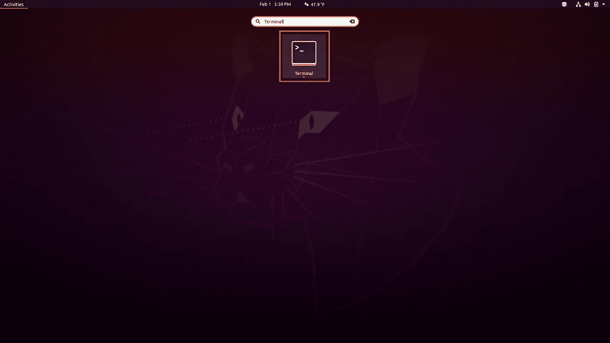

## 打开桌面目录:

*改变目录(cd)* 命令用于将当前工作目录改变到指定目录。它可以导航到分别从根目录和当前工作目录开始的绝对路径和相对路径。它还可以导航到存储在[变量](#1888)和[环境变量](#7696)中的路径。

1.  从下面这些指令中复制命令
2.  将命令粘贴到终端
3.  按“回车”

```
cd $HOME/Desktop/
```


## 设定电脑的默认版本:

在 [Pyenv](#5f79) 中使用*全局*命令来指定整个系统的默认 Python 版本。它在 Pyenv 目录中创建一个存储指定版本的文本文件。Pyenv 使用它来激活默认版本，但它会被本地 Pyenv 文本文件和环境变量覆盖。

1.  从下面这些指令中复制命令
2.  将命令粘贴到终端
3.  按“回车”

```
pyenv global 3.6.8
```

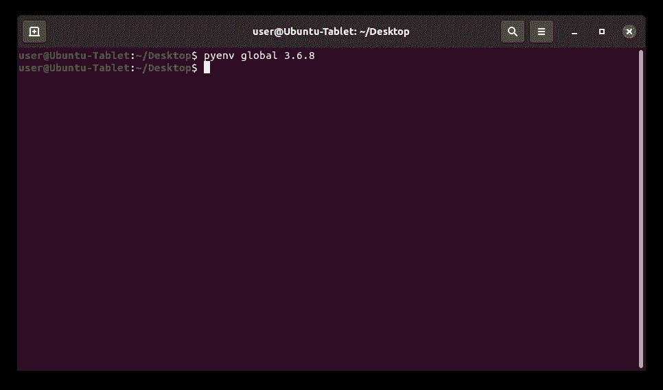

## 克隆 Fastbook 存储库:

*克隆*命令用于 [Git](#) 从 GitHub 下载指定的[库](#1edb)。它复制存储库整个历史中的所有文件、子目录、分支和提交。它还可以与递归标志结合使用，以复制存储库用作依赖项的[子模块](#d3d2)。

1.  从下面这些指令中复制命令
2.  将命令粘贴到终端
3.  按“回车”

```
git clone --recursive [https://github.com/fastai/fastbook.git](https://github.com/fastai/fastbook.git)
```

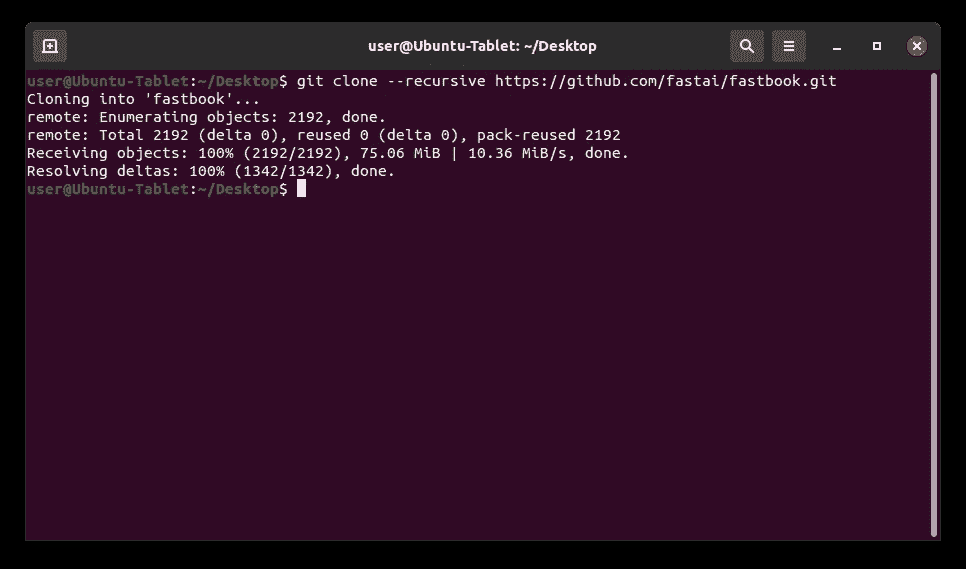

## 打开 FastBook 目录:

*改变目录(cd)* 命令用于将当前工作目录改变到指定目录。它可以导航到分别从根目录和当前工作目录开始的绝对路径和相对路径。它还可以导航到存储在变量和环境变量中的路径。

1.  从下面这些指令中复制命令
2.  将命令粘贴到终端
3.  按“回车”

```
cd fastbook
```

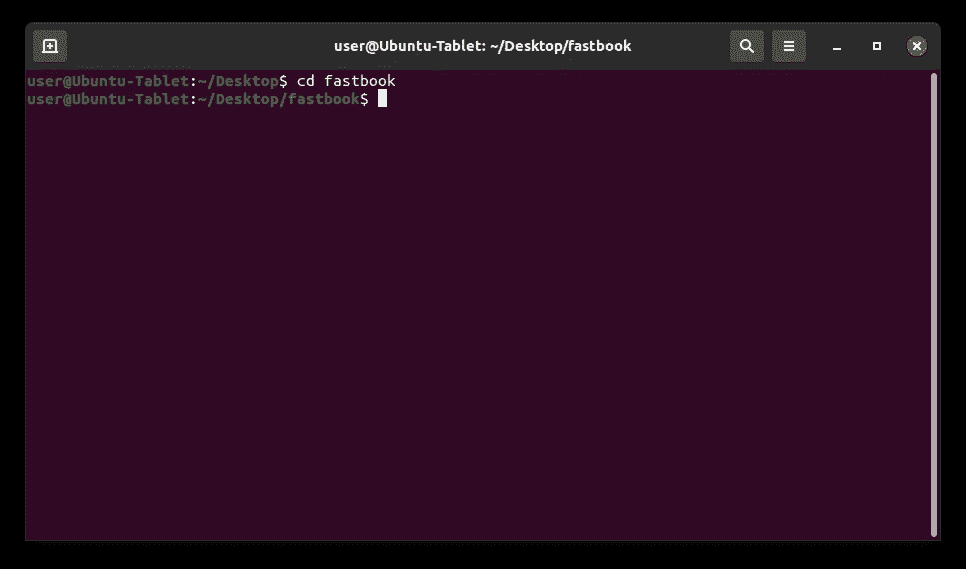

## 升级 Pip:

在 [pip](#b653) 中使用*升级(U)* 选项来更新已经安装在计算机上的指定软件包。它可用于从 Python 包索引下载和安装最新版本的包。它也可以用来下载和安装最新版本的 pip 软件包管理器。

1.  从下面这些指令中复制命令
2.  将命令粘贴到终端
3.  按“回车”

```
python -m pip install --upgrade pip
```

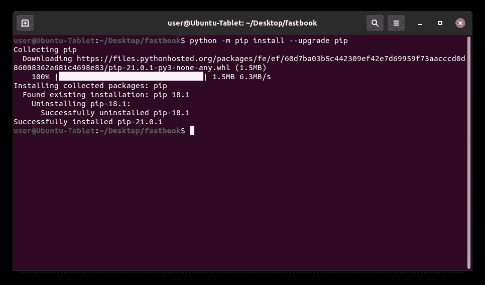

## 安装 Virtualenv:

Virtualenv 是 Python 中用来创建和管理[虚拟环境](#add8)的程序。它可以指定使用哪个 Python 版本和目录来创建虚拟环境。它还将所有必需的文件安装到指定的目录中，而不是系统范围的 Python 安装目录中。

1.  从下面这些指令中复制命令
2.  将命令粘贴到终端
3.  按“回车”

```
python -m pip install virtualenv
```

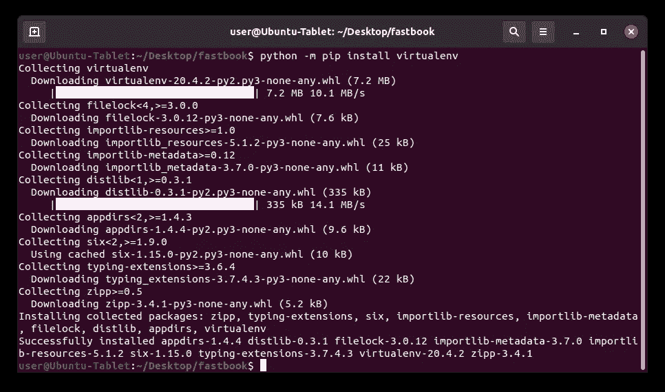

## 创建虚拟环境:

*Virtualenv* 是 Virtualenv 中用于创建独立 Python 环境的命令。它指定了用于安装虚拟环境的目录的名称。它还可以指定用于创建虚拟环境的 Python 版本，但默认情况下它使用默认版本。

1.  从下面这些指令中复制命令
2.  将命令粘贴到终端
3.  按“回车”

```
python -m virtualenv venv36
```

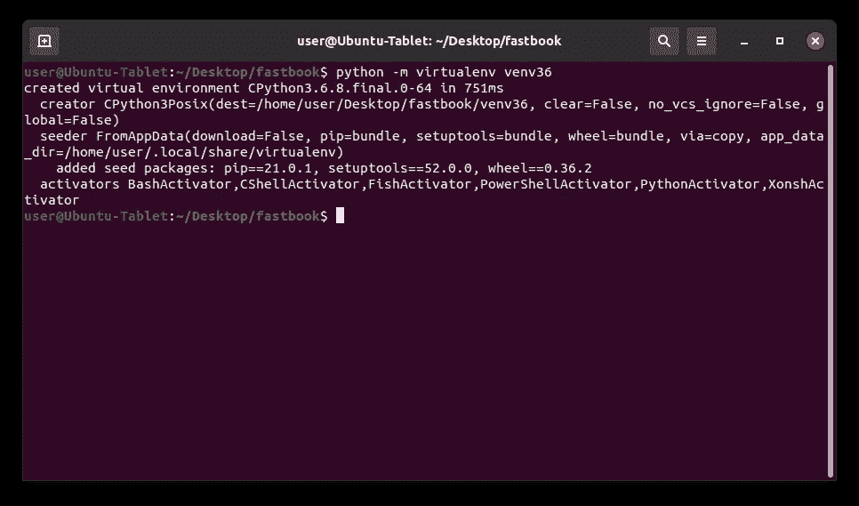

## 激活虚拟环境:

*激活*脚本用于启动虚拟环境。它将虚拟环境路径添加到 [PATH](#4b9b) 环境变量中，该变量将新的 Python 解释器和包管理器设置为默认版本。它还设置要安装在虚拟环境安装目录中的包。

1.  从下面这些指令中复制命令
2.  将命令粘贴到终端
3.  按“回车”

```
source venv36/bin/activate
```


## 升级 Fastbook:

在 pip 中使用*升级(U)* 选项来更新已经安装在计算机上的指定软件包。它可用于从 Python 包索引下载和安装最新版本的包。它也可以用来下载和安装最新版本的 pip 软件包管理器。

1.  从下面这些指令中复制命令
2.  将命令粘贴到终端
3.  按“回车”

```
python -m pip install --upgrade fastbook
```

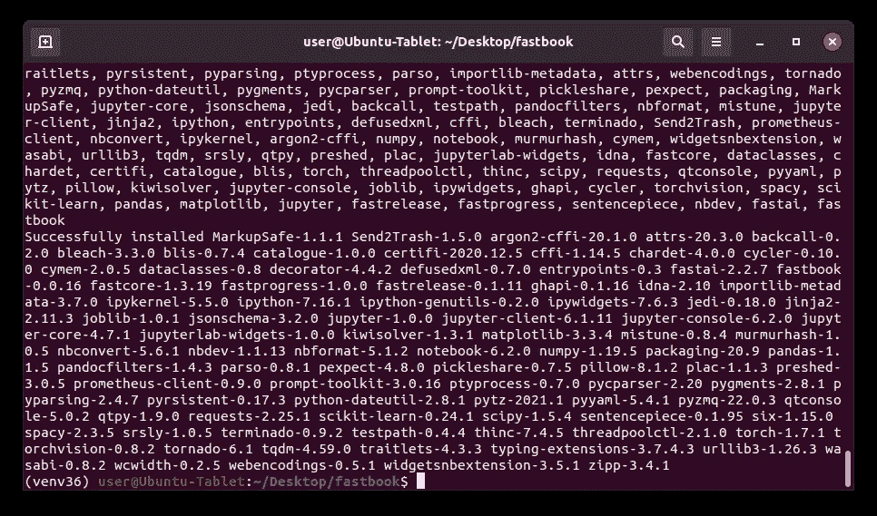

## 安装依赖项:

*依赖关系*是一个额外的二进制包，一个特定的二进制包需要它才能正常工作。它可能需要多个依赖项来构建几乎所有由包管理器发布的程序。它也会被一些包管理器自动下载和安装。

1.  从下面这些指令中复制命令
2.  将命令粘贴到终端
3.  按“回车”

```
python -m pip install graphviz kaggle waterfallcharts treeinterpreter dtreeviz
```

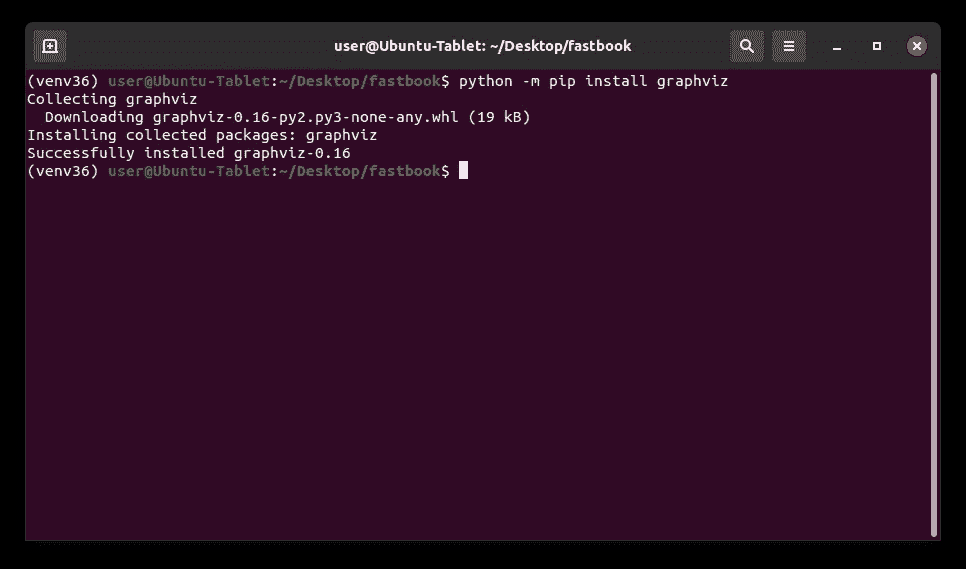

## 安装 Graphviz:

*Graphviz* 是一个用于多种操作系统的图形可视化库。它可以使用简单的文本语言从图形的文本描述中创建图表。它还可以使用各种颜色、字体、表格节点布局、线条样式、超链接和形状来自定义图表。

1.  从下面这些指令中复制命令
2.  将命令粘贴到终端
3.  按“回车”

```
sudo apt-get --yes install graphviz
```

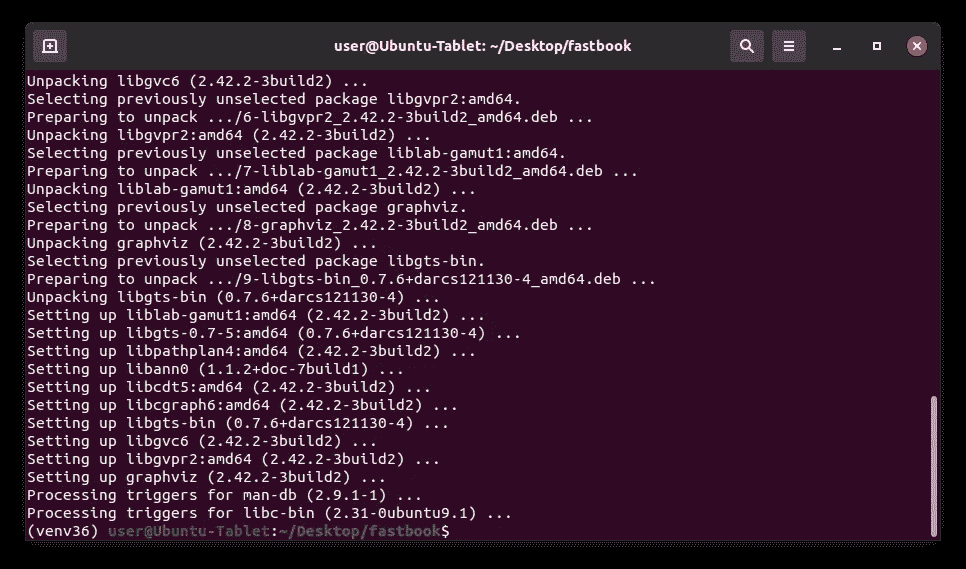

## 安装虚拟环境:

在 [IPython](#50f3) 内核中使用 *Install* 命令，将指定的虚拟环境添加到 [Jupyter Notebook](#f1d2) 中的内核中。它指定了用于引用虚拟环境的目录名。它还指定了用于在文件菜单中引用虚拟环境的显示名称。

1.  从下面这些指令中复制命令
2.  将命令粘贴到终端
3.  按“回车”

```
sudo venv36/bin/python -m ipykernel install --name "fastai-pytorch" --display-name "FastAI (PyTorch)"
```

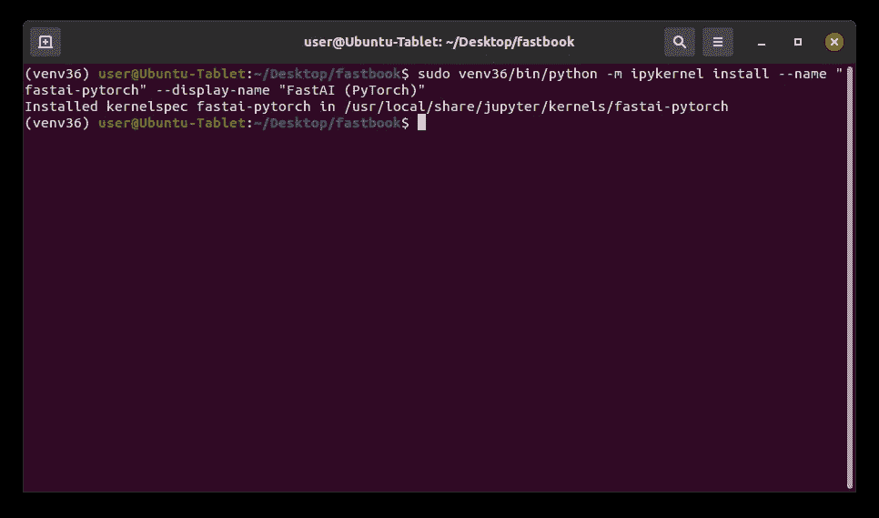

```
**Extra Resources:** Want to learn how to use artificial intelligence, machine learning, and deep learning? This blog is covering the Fastai course and interesting repositories related to the field.
```

```
**Fastai:** 1\. [Chapter 1: Your Deep Learning Journey Q&A](https://medium.com/p/735f932def0a)
2\. [Chapter 2: From Model to Production Q&A](https://medium.com/p/5a0902207f5b)
3\. [Chapter 3: Data Ethics Q&A](https://medium.com/p/501bb37ca30d)
4\. [Chapter 4: Under the Hood: Training a Digit Classifier Q&A](https://medium.com/p/90d2ccb6eaa9)
5\. [Chapter 5: Image Classification Q&A](https://medium.com/p/aa7cacdeab1/)
6\. [Chapter 6: Other Computer Vision Problems Q&A](https://medium.com/p/aa7cacdeab1/)
7\. [Chapter 7: Training a State-of-the-Art Model Q&A](https://medium.com/p/6f6dcc83dd9f/)**Linux:**
01\. [Install and Manage Multiple Python Versions](https://medium.com/p/916990dabe4b)
02\. [Install the NVIDIA CUDA Driver, Toolkit, cuDNN, and TensorRT](https://medium.com/p/cd5b3a4f824)
03\. [Install the Jupyter Notebook Server](https://medium.com/p/b2c14c47b446)
04\. [Install Virtual Environments in Jupyter Notebook](https://medium.com/p/1556c8655506)
05\. [Install the Python Environment for AI and Machine Learning](https://medium.com/p/765678fcb4fb)
06\. [Install the Fastai Course Requirements](https://medium.com/p/116415a9df22/)**WSL2:**
01\. [Install Windows Subsystem for Linux 2](https://medium.com/p/cbdd835612fb)
02\. [Install and Manage Multiple Python Versions](https://medium.com/p/1131c4e50a58)
03\. [Install the NVIDIA CUDA Driver, Toolkit, cuDNN, and TensorRT](https://medium.com/p/9800abd74409) 
04\. [Install the Jupyter Notebook Server](https://medium.com/p/7c96b3705df1)
05\. [Install Virtual Environments in Jupyter Notebook](https://medium.com/p/3e6bf456041b)
06\. [Install the Python Environment for AI and Machine Learning](https://medium.com/p/612240cb8c0c)
07\. [Install Ubuntu Desktop With a Graphical User Interface](https://medium.com/p/95911ee2997f) (Bonus)
08\. [Install the Fastai Course Requirements](https://medium.com/p/15a77fc7e301/)**Windows 10:**
01\. [Install and Manage Multiple Python Versions](https://medium.com/p/c90098d7ba5a)
02\. [Install the NVIDIA CUDA Driver, Toolkit, cuDNN, and TensorRT](https://medium.com/p/55febc19b58)
03\. [Install the Jupyter Notebook Server](https://medium.com/p/e8f3e9436044)
04\. [Install Virtual Environments in Jupyter Notebook](https://medium.com/p/5c189856479)
05\. [Install the Python Environment for AI and Machine Learning](https://medium.com/p/23c34b2baf12)
06\. [Install the Fastai Course Requirements](https://medium.com/p/90236724f881/)**MacOS:** 01\. [Install and Manage Multiple Python Versions](https://medium.com/p/ca01a5e398d4)
02\. [Install the Jupyter Notebook Server](https://medium.com/p/2a276f679e0)
03\. [Install Virtual Environments in Jupyter Notebook](https://medium.com/p/e3de97491b3a)
04\. [Install the Python Environment for AI and Machine Learning](https://medium.com/p/2b2353d7bcc3)
05\. [Install the Fastai Course Requirements](https://medium.com/p/90fdd524bc82)
```

## 词汇表:

Ubuntu Desktop 是一款桌面操作系统，以快速、安全和免费著称。它安装了一个元包，其中包含了构成桌面环境[的所有包，桌面环境](#71cd)默认使用 [GNOME 3](#71cd) 。这为 Ubuntu Linux 发行版提供了一个图形用户界面。
[ [返回](#8378)

*桌面环境*是在操作系统之上的程序集合，构成了图形用户界面。它包括窗口管理器、面板、菜单、系统托盘、图标和小部件等组件。它还决定了系统的外观以及如何与之交互。
[ [返回](#1ea3)

GNOME 3 是一个非常流行的桌面环境，拥有简单、易用、可靠的用户体验。它提供了一个独特的用户界面，旨在专注于任务，消除干扰。它还具有一个干净的无图标桌面，强大的搜索，任务概述和桌面扩展。
[ [回车](#1ea3)

Ubuntu 是一个基于 Debian 之上的开源操作系统，包括数千个支持程序。它已经成为最受欢迎的 Linux 发行版之一，以易用、可靠和免费而闻名。它还可以用在台式机、服务器和物联网设备上。
[返回](#1ea3)

*变量*是用来存储不同类型值的容器。它可以通过在指定的变量名和值之间放置一个等号来赋值或更新一个值。它还可以通过在现有变量名前放置一个美元符号来引用存储的值。
[回车](#39fe)

*环境变量*是由计算机自动创建和维护的变量。它帮助系统知道在哪里安装文件、查找程序以及检查用户和系统设置。它也可以被计算机上任何地方的图形和命令行程序使用。
[ [返回](#39fe)

Pyenv 是一个用于 macOS 和 Linux 上 Python 版本管理的程序。它可以安装多个 Python 版本，指定系统范围内使用的版本，以及指定特定目录中使用的版本。它还可以使用特定版本创建和管理虚拟环境。
[ [返回](#68fb) ]

Git 是一个用来跟踪源代码随时间变化的程序。它可以处理各种规模的项目，并允许多个团队和人员对同一个存储库进行更改。它还可以从存储库的整个历史中将源代码恢复到以前的版本。
[ [返回](#5a75)

*库*是位于远程服务器上的[二进制包](#f069)的存储位置。它需要出现在源列表中，以便计算机安装或更新其包含的软件包。这有助于提供高级别的安全性，同时使在 Linux 发行版中安装程序变得容易。
[回车](#5a75)

*二进制包*是一个存档文件，包含使其包含的程序正常工作所需的文件和目录。它存储在包含特定 Linux 发行版的所有程序的存储库中。它还需要 Linux 包管理器来访问、提取和安装它。
[回车](#1edb)

*子模块*是一个存储库，它嵌套在另一个存储库的子目录中。它包含特定版本的存储库在特定时间点的所有文件的副本。它还包含存储库中被视为其依赖项的所有子模块的副本。
[返回](#5a75)

*Pip 安装包(pip)* 是 Python 中使用的默认包管理器。它允许用户轻松安装标准 Python 库中没有的第三方包。它可以安装不同的包类型，但它主要使用源代码发行版和构建发行版。
[回车](#0b08)

虚拟环境*是一个独立的 Python 安装目录，它有自己的解释器、站点包和脚本。它主要用于防止不同项目之间的版本冲突。它还被用来满足来自 GitHub 的不同程序的依赖需求。
[ [返回](#f389)*

*路径*是一个环境变量，包含计算机用来查找可执行文件的目录列表。它从上到下在列表的每个目录中查找请求的可执行文件。一旦找到匹配的可执行文件并运行程序或命令，它也会停止搜索。
[ [返回](#af54) ]

*自然语言处理(NLP)* 是人工智能的一个分支，致力于赋予计算机理解文本和口语的能力。它将计算语言学与统计、机器学习和深度学习模型相结合。它还使计算机能够以文本或语音数据的形式处理人类语言，并理解其全部含义，包括说话者或作者的意图和情感。
[ [返回](#1b67)

*交互式 Python (IPython)* 是 Jupyter Notebook 中使用的交互式 shell 和默认内核。它运行包含在 Jupyter 笔记本文件中的 Python 代码。它还增加了新的功能，如自省、并行计算、富媒体、shell 语法、制表符结束和历史。
[返回](#67e7)

Jupyter Notebook 是一个用于创建、修改和分发包含代码、等式、可视化和叙述性文本的笔记本的程序。它提供了一个在 web 浏览器中运行的交互式编码环境。它也已经成为机器学习和数据科学的首选工具。
[回车](#67e7)