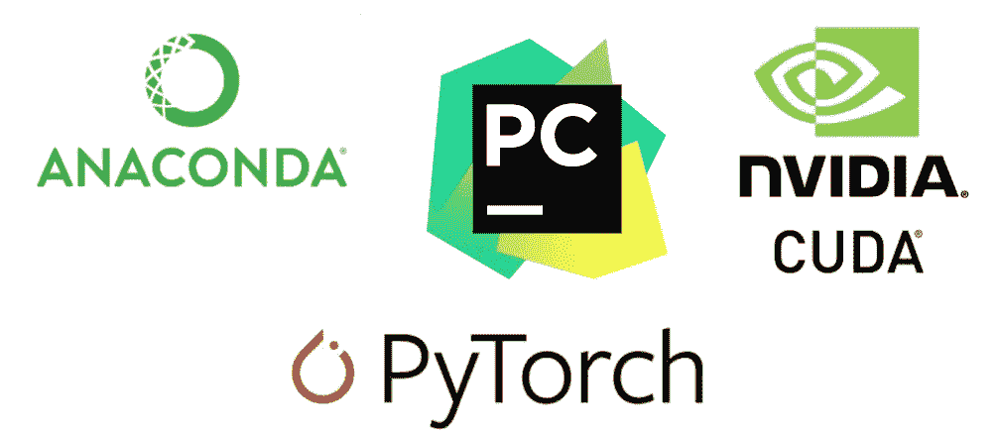
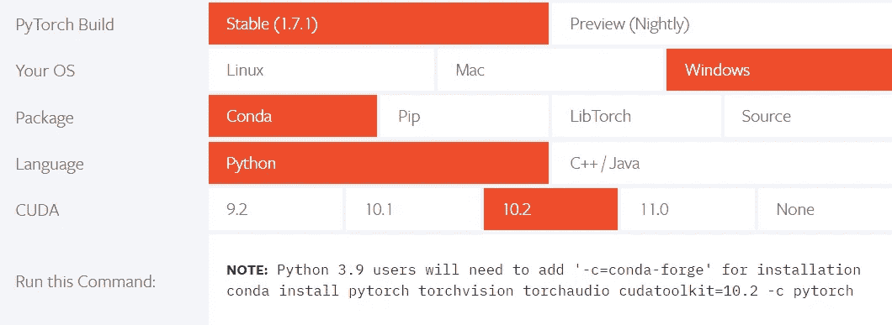
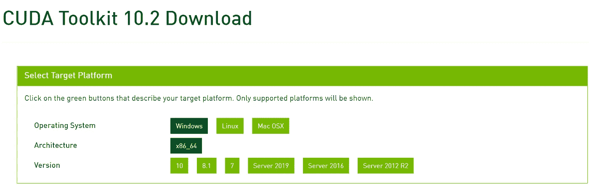
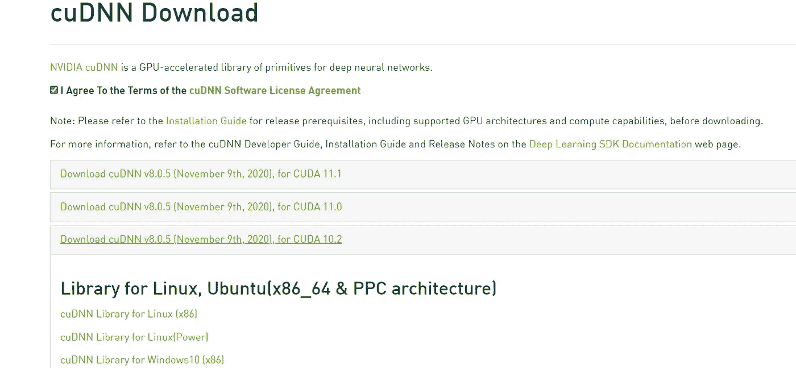
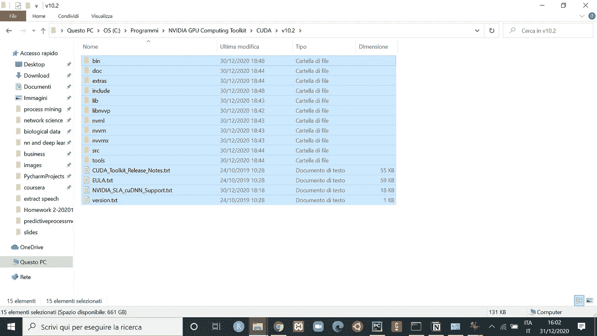
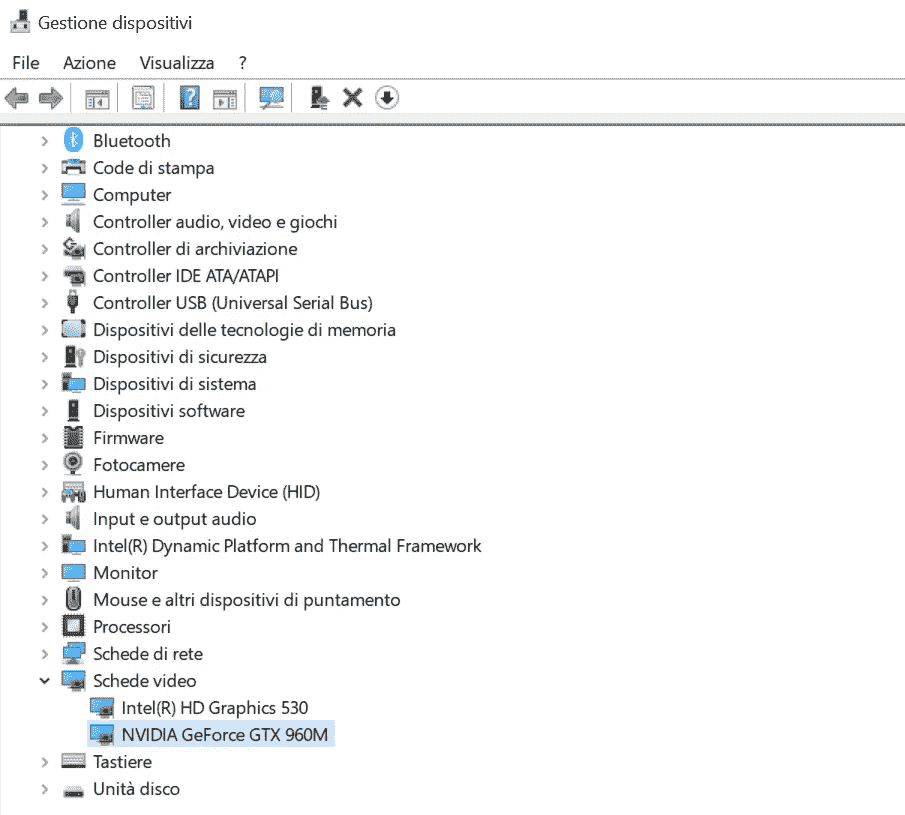
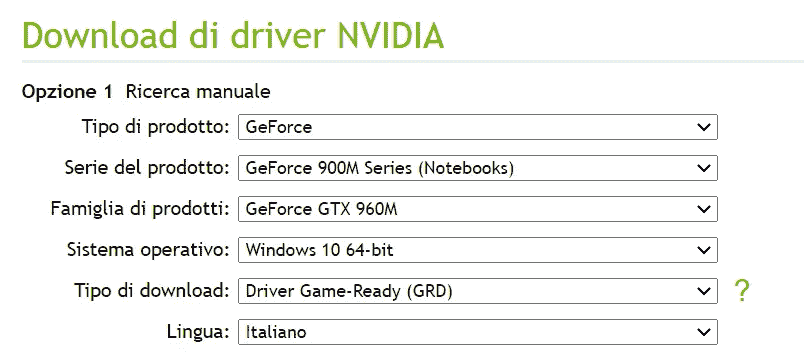
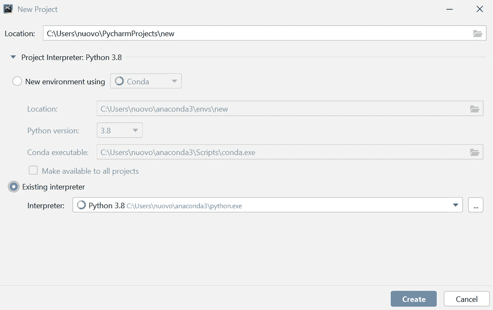
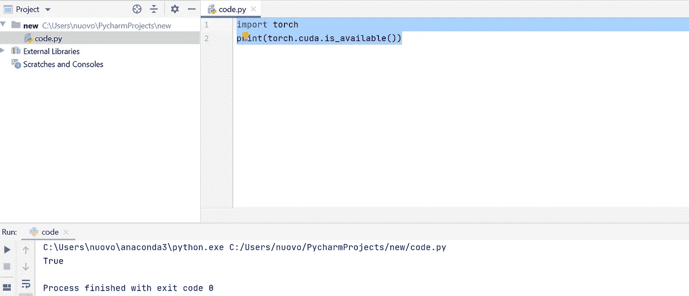

# 在 Windows 10 上安装支持 CUDA 的 Pytorch

> 原文：<https://pub.towardsai.net/installing-pytorch-with-cuda-support-on-windows-10-a38b1134535e?source=collection_archive---------0----------------------->

## [深度学习](https://towardsai.net/p/category/machine-learning/deep-learning)

## 在 Pycharm 中配置一个 Conda 环境，以便能够使用 CUDA



作者制作的图像

[Pytorch](https://pytorch.org/get-started/locally/) 是一个 Python 包，用于开发深度学习模型，具有最大的灵活性和速度。Pytorch 的特点是 [**张量**](https://pytorch.org/docs/stable/tensors.html) ，本质上是 n 维数组，用于矩阵计算。所以，它类似于 NumPy 数组。使用 Pytorch 张量代替 Numpy 数组的优点是 PyTorch 张量可以在 GPU 上运行[1]。

Pytorch 安装本身并不难，但是在本地机器上启用 GPU 的步骤并不乏味。本文将指导您完成设置所需工具和安装在 Windows 机器上启用 GPU 所需的驱动程序的整个过程。

编写高效 Python 代码的一个好的 IDE 是 Pycharm。它是最好的编程工具之一，因为它提供了许多额外的功能，代码分析，一个有用的图形调试器来分析你的代码中的错误，并支持和允许建立一个已经创建的 **Anaconda** 虚拟环境。即使您更喜欢 Pycharm 之外的其他工具，如 Jupiter Notebook，您仍然可以按照指南了解如何在 Anaconda 中集成加速库。



信用:[Pytorch.org](https://pytorch.org/)

上表很好地恢复了安装 Pytorch 和 CUDA 支持的先决条件。Pytorch 的最新版本是 Pytorch 1.7.1。将 Pytorch 版本与其他特性、操作系统、python 包、语言和 CUDA 版本相匹配的方法有很多。在这种情况下，我会选择 python ch 1 . 7 . 1，Anaconda 的最新版本，CUDA 10.2。

内容:

1.  [**下载 NVIDIA CUDA 工具包**](#98b9)
2.  [**下载安装 cuDNN**](#98b9)
3.  [**获取 GPU 的驱动软件**](#d233)
4.  [**下载蟒蛇**](#c60e)
5.  [**下载 Pycharm**](#d2a)

# **1。英伟达 CUDA 工具包**

这是一个创建 GPU 加速应用程序的开发环境。它包括使用 GPU、调试、优化工具和许多其他功能的库。为了安装 CUDA，您需要安装与 Pytorch 1.7.1 兼容的版本 **CUDA Toolkit 10.2** 。选择与您的操作系统兼容的选项。



信用: [CUDA 工具包 10.2](https://developer.nvidia.com/cuda-10.2-download-archive?target_os=Windows&target_arch=x86_64)

# **2。下载并安装 cuDNN**



信用: [cuDNN](https://developer.nvidia.com/cuDNN)

**CUDA 深度神经网络**库是为深度神经网络设计的库，通过使用 GPU 来加速。它允许计算开销很大的操作，如卷积、最大池化、批量标准化和激活层。

一旦库的安装完成，您需要下载 CuDNN 的兼容版本。只有在您创建帐户并输入所需的详细信息后，才可能做到这一点。您必须安装对应 **CUDA toolkit 10.2** 的版本，即 **CuDNN v8.0.5** 。而且，你需要选择“cuDNN 库 for Windows10”。

下载完成后，您需要:

*   解压缩 cuDNN 文件
*   复制文件夹“cuda”中包含的文件
*   在 NVIDIA CUDA 10.2 的道路上移动它们。


cuDNN 下载



CUDA 工具包 10.2

# **3。获取 GPU 的驱动软件**

NVIDIA driver 是一款免费软件下载，旨在连接您的操作系统和 GPU，以选择图形设计、摄影、广播和视频编辑的创意应用程序。可以从 Nvidia 网站下载驱动程序。在这样做之前，你需要在**设备管理器** (Gestione Dispositivi)中检查你的**显示适配器** (schede video)的正确版本。



我的情况是**英伟达 GeForce GTX 960M** 。一旦你选择了你在设备管理器上找到的选项，你就可以下载了。



信用: [NVIDIA 驱动](https://www.nvidia.it/Download/index.aspx?lang=it)

# **4。下载蟒蛇**

我们需要安装 [Anaconda](https://www.anaconda.com/products/individual) ，它将在 Pycharm 的虚拟环境中用作解释器。安装很容易，但需要一些时间。同时，你可以放松，做任何你想做的事。一旦完成，打开命令提示符，在搜索栏中运行' *cmd* ，然后右击 **Anaconda 提示符**选择'以管理员身份运行'。在提示符下写下下面一行代码后:

```
**conda install pytorch torchvision torchaudio cudatoolkit=10.2 -c pytorch**
```

使用 Pytorch 启用 GPU 非常重要。所以，不要跳过这一步，否则是不行的。

# **5。下载 Pycharm**


信用: [Pycharm](https://www.jetbrains.com/pycharm/download/#section=windows)

有两个版本，完整的专业版和免费版。我关注的是免费的社区版本，它是免费的并且运行得足够好。下载完成后，我们可以打开 Pycharm 并创建一个新项目，在其中选择解释器。在这里是 Anaconda 环境。您需要检查文件系统中 Anaconda 可执行文件的路径。比如我的路径是**C:\ Users \ nuovo \ anaconda 3 \ python . exe**。



一旦您选择了解释器，您就可以创建项目了。要查看解释器，需要点击菜单中的文件，进入**设置→项目:名称→解释器**。


看看是不是和这个截图差不多。如果不一样，你需要检查你电脑里的正确路径。要检查 CUDA 是否工作，可以用格式写一个文件。py 下面两行代码:

```
import torch
print(torch.cuda.is_available())
```



如果该行代码返回 True，这意味着您的系统支持 CUDA。

# **最终想法:**

这些是我在 Windows 10 上安装 CUDA toolkit、cuDNN、NVIDIA driver、Anaconda 和 Pycharm 的步骤。CUDA 的出现将有助于加快 Pytorch 模型的速度。我希望这个故事对你有用，并能帮助你建立你的深度学习环境。感谢一路阅读。

有兴趣看其他文章吗？下面我给你推荐几个故事:

[](/pytorch-tutorial-for-beginners-8331afc552c4) [## Pytorch 初学者教程

### Pytorch 是脸书人工智能研究实验室于 2016 年开发的深度学习框架。它因计算机而广为人知…

pub.towardsai.net](/pytorch-tutorial-for-beginners-8331afc552c4) [](https://medium.com/datadriveninvestor/train-a-cnn-using-skorch-for-mnist-digit-recognition-53d7d2f971c7) [## 使用 MNIST 数字识别 Skorch 训练 CNN

### 结合了 scikit-learn 的灵活性和 PyTorch 的强大功能的库

medium.com](https://medium.com/datadriveninvestor/train-a-cnn-using-skorch-for-mnist-digit-recognition-53d7d2f971c7) [](/k-fold-cross-validation-for-machine-learning-models-918f6ccfd6d) [## 机器学习模型的 k 重交叉验证

### 使用 sklearn 的交叉验证技术概述

pub.towardsai.net](/k-fold-cross-validation-for-machine-learning-models-918f6ccfd6d) 

**参考文献:**

[1][https://github.com/pytorch/pytorch#from-source](https://github.com/pytorch/pytorch#from-source)