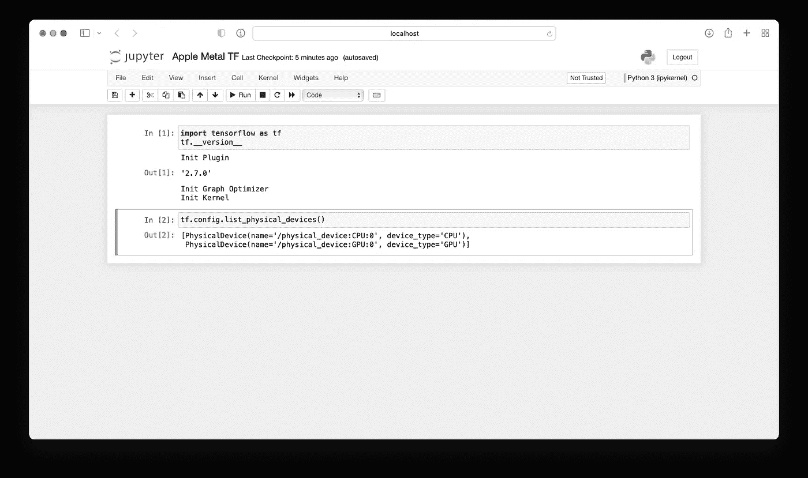

# 在 Mac M1 专业版和 M1 Max 上安装 Tensorflow

> 原文：<https://pub.towardsai.net/installing-tensorflow-on-mac-m1-pro-m1-max-2af765243eaa?source=collection_archive---------0----------------------->

在普通的 Mac M1 上也能工作！


照片由[米恰伊尔·萨皮顿](https://unsplash.com/@sapiton?utm_source=medium&utm_medium=referral)在 [Unsplash](https://unsplash.com?utm_source=medium&utm_medium=referral) 拍摄

苹果公司的 M1 芯片**的出现彻底改变了 MacOS 社区的深度学习领域。M1 芯片包含一个内置的图形处理器，支持 **GPU 加速**。这反过来使得苹果电脑适合深度学习任务。**

一年后，苹果发布了新的 M1 变种。这些被称为 **M1 专业**和 **M1 最大**。它们远远优于最初的 M1 版本，其中 M1 Max 是最好的:它有更多的 CPU 和 GPU 核心，因此比它的对手更快。

苹果的这一突破是至关重要的:它允许 MacOS 粉丝留在他们最喜欢的苹果生态系统中，同时专注于深度学习，而不必选择其他替代品——基于英特尔的芯片或 Colab。

> *你可以从* [*这里*](https://medium.com/@nikoskafritsas/list/setup-apple-m1-for-deep-learning-75e74b9f7cb4) *访问“为深度学习设置苹果 M-Silicom”系列的所有文章，包括如何在 Mac M1 上安装 Pytorch 的指南* [*。*](https://betterprogramming.pub/how-to-install-pytorch-on-apple-m1-series-512b3ad9bc6)

当然，我们不能在谈论深度学习的采用时不提到目前最流行的深度学习框架之一: **Tensorflow** ！本文提供了如何在 M1 专业版上安装 Tensorflow 的详细指南。**该指南也适用于 M1 的其他变体。**

## **要求**

1.  **Tensorflow 金属插件**只适用于 **MacOS 12.0+** (Monterey)。一些用户可以通过使用以前的`tensorflow-metal`版本(例如`0.1.2`)在 Big Sur 上安装它。然而，你不会注意到在 CPU 上的传统训练有任何速度上的提高。
2.  你至少要使用`Python 3.9.0`。

# 步骤 1:安装 Xcode

现在大部分 Macbooks 都预装了 **Xcode** 。或者，你可以很容易地从应用商店下载它。之后，你还应该安装 *Xcode 命令行工具*。为此，请执行以下命令:

```
$ xcode-select --install
```

# 步骤 2:安装 MiniForge

对于不知道的人来说， **MiniForge** 是一个 conda 安装程序，类似于 MiniConda。此外，MiniForge 是苹果友好的，这使它成为 MacOS，包括 M1 设备的理想候选。

要下载它，请进入此[页面](https://github.com/conda-forge/miniforge)并选择苹果芯片的安装程序，如下图所示:


图 1:适用于苹果芯片的 conda Miniforge 封装([来源](https://github.com/conda-forge/miniforge))

要安装它，请执行:

```
$ bash Miniforge3-MacOSX-arm64.sh
```

**注 1:** 这是最简单的安装过程。你不必涉及自制软件或定制下载脚本(这些通常都有问题)。

**注 2:** 值得一提的是，在一个给定的时间内，只有一个 conda 发行版，例如 Anaconda 或 MiniConda 可以“运行”。如果你已经有一个预先存在的 conda 安装，没有必要卸载它来使用 MiniForge。这篇[文章](https://betterprogramming.pub/switching-between-multiple-conda-distributions-on-macos-b78b6b21720)描述了一个可以帮助你同时管理许多 conda 发行版的技巧！

# 步骤 3:设置 conda 环境并安装 MiniForge

现在，让我们在 MiniForge 中创建一个新的 conda 环境，比如说 *tensorflow_silicon。*根据官方指南，我们至少应该使用*python 3 . 9 . 0 版本*。不要忘记激活它:

```
$ conda create --name *tensorflow_silicon* python=3.9
$ conda activate *tensorflow_silicon*
```

然后，安装`tensorflow-macos`底座和`tensorflow-metal` 插件:

```
$ conda install -c apple tensorflow-deps
$ pip install tensorflow-macos
$ pip install tensorflow-metal
```

之后，安装 Jupyter 笔记本或 Jupyter lab:

```
$ conda install -c conda-forge jupyter jupyterlab
```

就是这样！

执行下面的代码片段，检查一切是否如预期进行。您可以使用命令行或 Jupyter:

```
import tensorflow as tf
tf.__version__
tf.config.list_physical_devices()
```



图 2: Jupyter 代码片段

如果一切顺利，您应该在设备列表中看到 GPU。换句话说， **Tensorflow 有权限访问 GPU！**

最后，运行一个使用 MNIST 数据集的简单示例来检查一切是否正常:

```
import tensorflow as tf
mnist = tf.keras.datasets.mnist(x_train, y_train), (x_test, y_test) = mnist.load_data()
x_train, x_test = x_train / 255.0, x_test / 255.0model = tf.keras.models.Sequential([
 tf.keras.layers.Flatten(input_shape=(28, 28)),
 tf.keras.layers.Dense(128, activation=’relu’),
 tf.keras.layers.Dropout(0.2),
 tf.keras.layers.Dense(10)
])loss_fn = tf.keras.losses.SparseCategoricalCrossentropy(from_logits=True)model.compile(optimizer=’adam’,
 loss=loss_fn,
 metrics=[‘accuracy’])model.fit(x_train, y_train, epochs=10)
```

# 常见问题和解决方法

## 1.安装 tensorflow-deps(例如 grpcio 包)时出现问题

有些依赖项并不是真正必要的，因此您可以放心地忽略它们。因此，如果你遇到任何困难，安装`tensorflow-deps`没有依赖:

```
$ pip install tensorflow-macos --no-dependencies
```

## 2.不正确的数字版本

在某些情况下，`tensorflow-deps`的安装会获取不兼容的非 conda-forge NumPy 版本。当您尝试导入 Numpy 时会遇到此错误。您将看到类似这样的内容:

```
IMPORTANT: PLEASE READ THIS FOR ADVICE ON HOW TO SOLVE THIS ISSUE!Importing the numpy C-extensions failed. This error can happen formany reasons
```

要解决这个问题，请安装`openblas`包:

```
$ conda install -c conda-forge openblas
```

# 注意事项

*   MiniForge 是一个很好的 conda 环境，但是它并不与每个 conda 库兼容。不要担心，这只是很小的一部分，随着 MiniForge 社区的发展，这一比例很可能会降低。因此，为“棘手”的情况保留一个单独的 Anaconda 或 Miniconda 环境是个好主意。
*   你应该使用`conda-forge`通道安装每一个 python 库，即使你可以在官方的 conda 通道找到它们。这保证了 MiniForge conda 环境的一致性。

# **结束语**

毫无疑问，MacOS 通过让 Tensorflow 有资格获得原生 GPU 加速，拥抱了深度学习。

然而，还有很长的路要走。例如，Python 并不被广泛接受，尽管你可以在苹果芯片上运行 Pytorch。

如果你是 MacOS 的粉丝，请随意查看所有苹果芯片相关文章的列表:

[](https://medium.com/@nikoskafritsas/list/setup-apple-msilicon-for-deep-learning-75e74b9f7cb4)

**感谢阅读！**