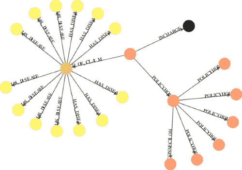
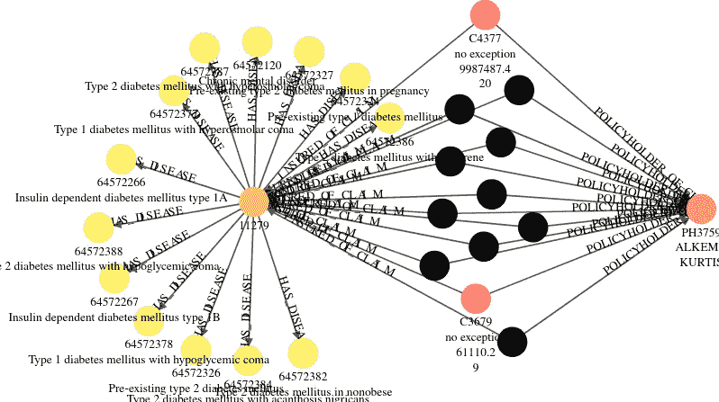
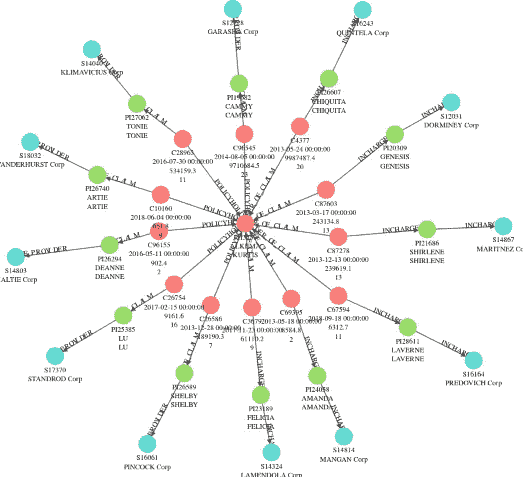
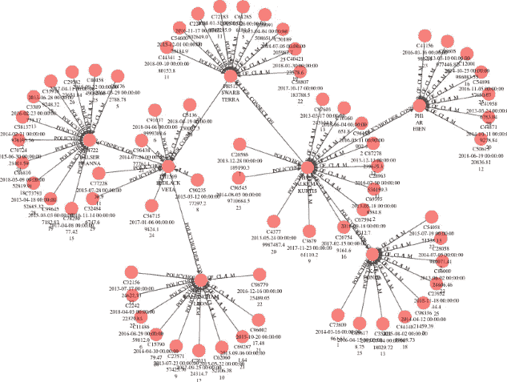
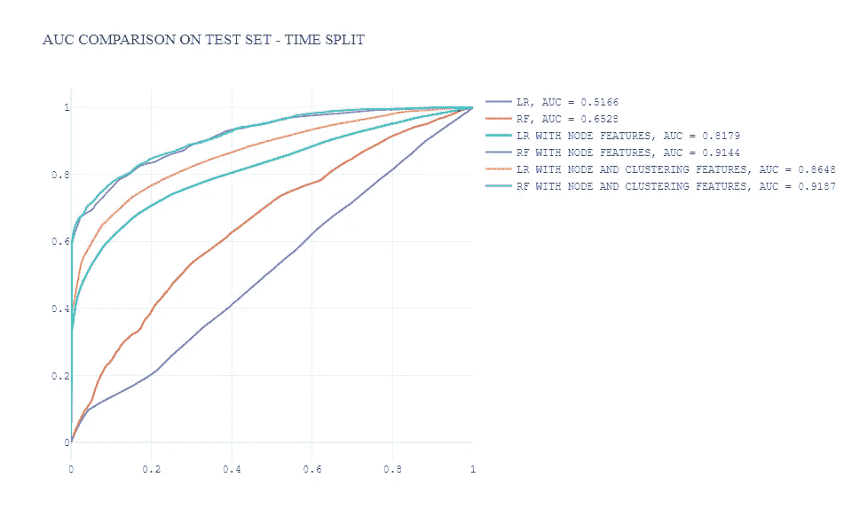

# 利用图形分析检测保险欺诈

> 原文：<https://pub.towardsai.net/insurance-fraud-detection-with-graph-analytics-91d10c5e5ec9?source=collection_archive---------1----------------------->

## 探索图形数据库并提取图形特征以增强机器学习模型


康尼·施耐德在 [Unsplash](https://unsplash.com?utm_source=medium&utm_medium=referral) 上的照片

保险欺诈是一个巨大的问题，保险业长期以来一直在打击欺诈。我们来看看下面的头条新闻和统计数据:

> [根据反保险欺诈联盟(CAIF)的数据，保险欺诈每年给美国消费者带来至少 800 亿美元的损失。CAIF 还估计，仅工伤保险欺诈一项每年就让保险公司和雇主损失 300 亿美元。美国联邦调查局报告称，总体问题中的非健康保险部分每年高达 400 亿美元。最终，这个问题的巨大规模意味着普通美国家庭每年将多支付 400 到 700 美元的保费。](https://www.iii.org/article/background-on-insurance-fraud)

健康保险欺诈是一种白领活动，通过不诚实的索赔来获取利润。欺诈活动可能涉及提供商、医生和受益人的同行一起提出欺诈索赔。因此，鉴于所涉各方的复杂性，很难发现欺诈活动。异常行为可能是一个欺诈环，其中提供商、医生和客户随着时间的推移提交小额索赔。这种小索赔可能很难用传统工具来检测，传统工具单独查看索赔，无法发现不同参与者之间的联系。

图形数据库旨在通过存储和处理高度关联的数据来填补空白，其中的关系与单个数据点一样重要。因此，我们可以利用图形分析来理解这些关系。在本文中，您将了解到:

*   图形基本
*   图形搜索和查询以了解关系
*   用图特征增强机器学习模型

# 图形基本

## 什么是图形？

> 在数学中，更具体地说在图论中，图是相当于一组对象的结构，其中一些对象对在某种意义上是“相关的”。这些对象对应于被称为*顶点*(也被称为*节点*或*点*)的数学抽象，并且每对相关的顶点被称为*边*(也被称为*链接*或*线*)。



图形概念，作者提供的图像

简而言之，图是任何类型网络的数学表示，包括:

*   顶点，有时称为节点，在保险上下文中可以是:
    -索赔
    -投保人
*   边是节点之间的关系/交互/行为:
    -索赔的投保人
    -索赔的被保险人

图算法概念将在第三章中介绍——用图特征增强机器学习模型。

# 图形搜索和查询

图形数据库是专门为利用顶点之间的连通性来存储和导航关系而构建的。最终用户不需要执行无数的连接，因为图形查询语言是关于节点之间的模式匹配的。**这种方式使用起来更自然，也更容易被商业用户使用，他们的反馈可以被输入到欺诈检测系统中。**

通过图形查询语言实现的图形可视化有助于分析大量数据，并识别指示欺诈活动的模式。在本节中，我将分享几个场景，可视化基于:

*   数据来源:[使用 IBM Db2 图表分析保险索赔](https://github.com/IBM/analyzing-insurance-claims-using-ibm-db2-graph)
*   图形数据库:[星云图](https://github.com/vesoft-inc/nebula)

## 欺诈信号警告

查找欺诈索赔“C4377”的投保人提交的所有索赔，并显示索赔“C4377”患者的疾病。



潜在的欺诈性索赔信号，图片由作者提供

为了深入了解该投保人(PH3759)，我们看到此人在不同的医疗机构看了不同的医生，这是不正常的。



作者图片

## 与欺诈索赔相关的投保人关联

该图显示了具有欺诈索赔“C4377”的高风险配置文件的连接。我们在一级关联中看到一个高风险投保人，在三级关联中看到另一个高风险投保人。



作者图片

# 用图特征增强机器学习模型

特征工程是从现有数据中形成有用特征的艺术。定义是:

> *特征工程是将原始数据转换为更好地代表预测模型潜在问题的特征，从而提高未知数据的模型准确性的过程。*

许多机器学习应用程序通常依赖于表格数据模型，而忽略了关系&上下文数据，这是行为的最强预测因素。这一点至关重要，因为通过避免危险信号，每个索赔/供应商看起来都是合法的。

在这一节中，我将通过一个具体的例子来演示如何将表格数据转换为图形，并提取图形特征来增强机器学习模型。总体方法是:

*   用 Python 将表格数据摄取到图形结构中
*   图形数据的特征工程
*   将图形特征纳入机器学习管道

**注意事项:**

*   **我们根据提供商的欺诈标志**预测索赔是否是欺诈性的
*   **这个想法是展示创造潜在预测特征的过程，并增强当前的机器学习管道**

## 将表格数据纳入图表结构

在本节中，我将使用:

*   数据来源:[医疗保健提供商欺诈检测分析](https://www.kaggle.com/datasets/rohitrox/healthcare-provider-fraud-detection-analysis)
*   Python 图形包: [iGraph](https://igraph.org/python/)

该数据集来自 Medicare，由提供者提交的索赔以及每项索赔的受益人信息组成:

*   患者相关特征:年龄、性别、位置、健康状况等。
*   索赔相关功能:开始和结束日期、索赔金额、诊断代码、程序代码、提供商、主治医生、手术医生等。

本文中的节点是提供者和主治医师，他们分别是源和目标。

```
# import package
from igraph import *# create graph from dataframe
G = Graph.DataFrame(G_df, directed=False)
```

## 图形数据的特征工程

使用图算法，我创建了新的潜在的有意义的特征，例如连通性度量和基于关系的聚类特征。为了防止目标泄漏，我使用基于时间的分割来生成图形特征。在这一节中，我将提供图形特性的代码:

**度**

节点可以定义为与一个节点相关的边的数量。

```
degree = pd.DataFrame({'Node': G.vs["name"],
        'Degree': G.strength()})
degree.shape
```

**接近度**

在连通图中，节点的紧密度中心性(或紧密度)是网络中中心性的度量，计算为该节点和图中所有其他节点之间的最短路径长度之和的倒数。

```
closeness = pd.DataFrame({'Node': G.vs["name"],
        'Closeness': G.closeness()})
closeness.shape
```

**信息图**

Infomap 是一种能够实现高质量社区的图聚类算法。

```
communities_infomap = pd.DataFrame({'Node': G.vs["name"],
        'communities_infomap': G.community_infomap().membership})
communities_infomap.shape
```

从图算法得到的度量被转换成表格，使得生成的特征可以在机器学习模型中使用。

```
# merge graph features
graph_feature = [degree, closeness, communities_infomap]
graph_feature = reduce(lambda left,right: pd.merge(left,right, how = 'left',on='Node'), graph_feature)
```

## 将图形特征纳入机器学习管道

图形特征被合并到原始模型就绪数据中，并且基于时间的分割被用来为机器学习模型准备数据。

```
train = Final_Dataset_Train[Final_Dataset_Train['ClaimStartDt'] < '2009-10-01'].reset_index(drop = True).drop('ClaimStartDt', axis = 1)
print(train.shape)
test = Final_Dataset_Train[Final_Dataset_Train['ClaimStartDt'] >= '2009-10-01'].reset_index(drop = True).drop('ClaimStartDt', axis = 1)
print(test.shape)x_tr = train.drop(axis=1,columns=['PotentialFraud'])
y_tr = train['PotentialFraud']x_val = test.drop(axis=1,columns=['PotentialFraud'])
y_val = test['PotentialFraud']
```

在本文中，我结合两种算法和三个特征空间探索了 6 个场景:

*   算法:
    -逻辑回归
    -随机森林
*   特征空间:
    -原始特征
    -原始特征+节点级特征
    -原始特征+节点级特征+聚类特征

```
lr = LogisticRegression(penalty='none', solver='saga', random_state=42, n_jobs=-1)
rf = RandomForestClassifier(n_estimators=300, max_depth=5, min_samples_leaf=50, 
                            max_features=0.3, random_state=42, n_jobs=-1)
lr.fit(x_tr, y_tr)
rf.fit(x_tr, y_tr)
preds_lr = lr.predict_proba(x_val)[:,1]
preds_rf = rf.predict_proba(x_val)[:,1]
```

这里，我使用 AUC 作为测试集的评估指标，ROC 曲线如下:



AUC 比较，按作者分类的图像

总的来说，正如上面的情节，我们可以总结为:

*   具有图形特征的模型的优越性能
*   通过具有节点级和聚类特性的随机森林获得更好的性能

在本文中，我没有深入研究模型解释和模型诊断。之前我写过一篇关于模型解释的文章——[利用 SHAP](https://towardsdatascience.com/deep-learning-model-interpretation-using-shap-a21786e91d16) 进行深度学习模型解释，你可能会感兴趣。

# 结论

*   商业用户可以查询、可视化和分析图形数据库，以发现欺诈方案，特别是试图通过复杂网络结构隐藏的欺诈活动，这在传统数据结构中是非常困难的任务。
*   将关系信息合并，并将这些潜在的预测特征添加到当前的机器学习管道中，可以提高模型性能，特别是对于多方参与欺诈活动的场景。

# 参考

https://www.iii.org/article/background-on-insurance-fraud

[https://en . Wikipedia . org/wiki/Graph _(离散数学)](https://en.wikipedia.org/wiki/Graph_(discrete_mathematics))

[https://github . com/IBM/analyzing-insurance-claims-using-IBM-DB2-graph](https://github.com/IBM/analyzing-insurance-claims-using-ibm-db2-graph)

[https://github.com/vesoft-inc/nebula](https://github.com/vesoft-inc/nebula)

[https://machine learning mastery . com/discover-feature-engineering-how-to-engineering-features-and-how-to-get-good-it/](https://machinelearningmastery.com/discover-feature-engineering-how-to-engineer-features-and-how-to-get-good-at-it/)

[https://www . ka ggle . com/datasets/rohitrox/health care-provider-fraud-detection-analysis](https://www.kaggle.com/datasets/rohitrox/healthcare-provider-fraud-detection-analysis)

[https://igraph.org/python/](https://igraph.org/python/)

[https://en . Wikipedia . org/wiki/Degree _(graph _ theory)](https://en.wikipedia.org/wiki/Degree_(graph_theory))

[https://en.wikipedia.org/wiki/Closeness_centrality](https://en.wikipedia.org/wiki/Closeness_centrality)

[https://towards data science . com/deep-learning-model-interpretation-using-shap-a 21786 e 91d 16](https://towardsdatascience.com/deep-learning-model-interpretation-using-shap-a21786e91d16)