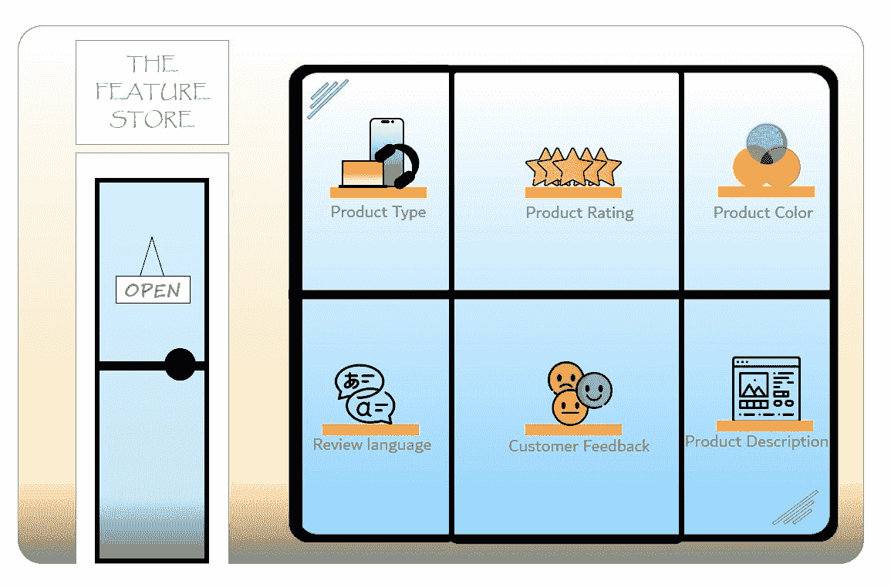
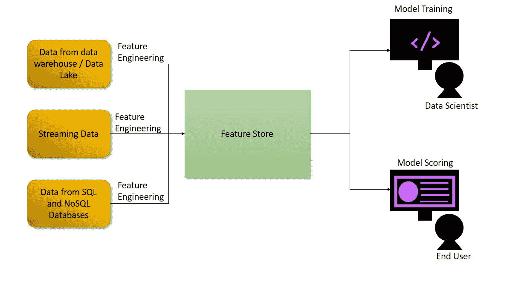
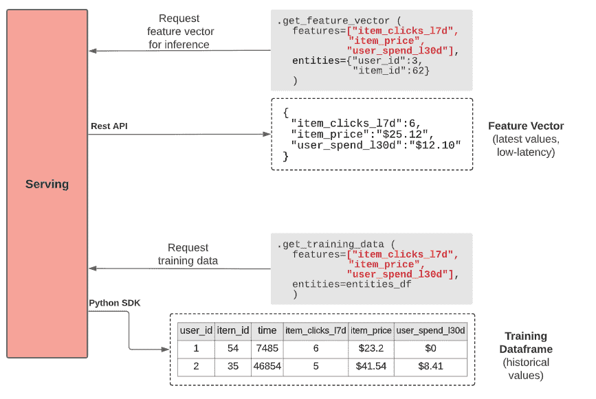

# 在 ML 架构中集成特征库。

> 原文：<https://pub.towardsai.net/integrating-feature-stores-in-ml-architecture-48494824c0ae?source=collection_archive---------2----------------------->

**简介:**

世界经济论坛称，2020 年初，数字世界的字节数是可观测宇宙中可用恒星数的 40 倍。这当然是巨大的，但我们必须问的真正问题是，我们能理解这些丰富的数据吗？这些数据必须被清理、转换、设计和存储，以使其有意义。

在这个过程中，必须非常小心地减少冗余。必须有组织级的集中存储，以便所有团队都知道已经存在哪些功能。所以他们不会在已经可用的工程特性上浪费时间。由于特征存储被拥有大量数据的公司采用来解决冗余和分散问题，因此得到了高度的重视。

**我们为什么需要特色商店？**

特征工程是对一堆原始数据进行预处理后衍生出新特征的过程。对于单一功能的工程设计，我们收集相关数据、设计管道、分析其商业价值、讨论格式等。这些步骤本身是详尽的，除此之外，这是一个迭代的过程，我们这样做多次，直到我们得到满意的结果。基于它是批量数据还是流数据，特征工程过程和结构是不同的。需要适当的规划和管理来存储功能和必要的元数据。

大型组织会有多个团队。每个团队都会产生和消耗大量的数据。如果没有一个集中的位置来访问这些数据，就很有可能出现冗余。由于团队之间没有协作，他们可能会衍生相同的要素，并将数据存储在不同的位置。这损害了整个组织的生产力。

从质量的角度来看，一个组织的数据需求应该由单一的真实来源来满足。如果团队之间不相互协作，不制定关于数据质量的严格规则，那么每个团队都将拥有自己的数据版本，对于整个组织来说，将没有单一的真实来源。这对组织来说将是灾难性的。这些是在 ML 架构中包含一个特性库的主要原因。

**什么是特色店？**

Feature Story 是整个组织功能的集中存储库。原始数据在添加到特征库之前将被管理、转换和特征工程化。在向功能存储添加值之前，将遵循严格的标准。某些团队将致力于生成特性，而其他团队可以消费这些特性。因为它是一个集中的存储库，所以特征将被计算一次并被多次使用。因为特征是由主题专家创建的，所以数据的质量会非常高。由于数据版本控制在特性故事中启用，它自动获得了它的所有优点。

功能存储没有固定的结构。这取决于组织的数据需求和基础设施。功能存储应该是分布式的、高度可用的，并且具有低延迟。一个功能存储中可以有多个项目。每个项目都有一个实体 ID 和一个特性列表。实体 ID 将用于唯一标识实体。实体可以是产品 ID、评论 ID 或电影 ID。数据科学家可以使用特征存储中的特征来训练和测试模型，并且某些特征可以直接用于模型服务。

**功能存储的组件:**

功能存储通常由注册、监控、服务、存储和转换组成。

**注册中心** —注册中心也被称为元数据存储，它包含诸如每个实体中存在什么特性之类的信息。这在不同团队的开发人员需要关于特定实体可用特性的信息时非常有用。基于实体 ID 的查询，返回特征。

**监控** —监控是功能商店提供的新功能。监视器可以根据失败或数据质量下降发出警报。可以将警报配置为邮件，这有助于及时恢复和管理数据。

**服务** —这是特征库的一部分，为训练和推理目的提供特征。出于训练目的，通常提供 SDK 来与特性库交互。为了进行推断，特征存储基于请求提供单个实体。

[图像参考](https://www.tecton.ai/blog/what-is-a-feature-store/)

**存储** —特色商店包含在线和离线存储。离线存储包含转换为要素的所有历史数据。它们存储在数据湖和数据仓库中。雪花和 BigQuery 可以用于离线存储。在线存储由非常新的数据组成。它们主要包含流数据。在线存储层必须具有非常小的延迟。Kafka 和 Redis 可以用于在线存储。

**转换** —通过数据管道生成机器学习模型的特征。功能存储充当这些管道的协调器。基于指定的时间间隔重新计算特征，并且转换管道逻辑可以被重新用于此目的。

**摄取特征:**

功能存储体系结构由摄取和消费机制组成。摄取是收集原始数据、对其进行特征工程处理以获得所需特征，并将其存储在存储解决方案中的过程。有两种类型的摄取:批处理和流。

**批处理接收** —当大量数据在预定时间到达时，批处理完成。频率可以是一天一次、一小时两次、一周一次等。由于数据将大量出现，这些数据将存储在亚马逊 S3、数据库、HDFS、数据仓库和数据湖中。Spark 可用于轻松处理批量数据，并将实体 ID 和特性存储在特性存储中。

**流接收** —流是实时数据。数据将在没有任何预先信息的情况下到来。因此，卡夫卡将是流媒体摄取的理想候选人。数据将被存储为日志文件，或者我们可以通过 API 调用来获取它们。

**消费功能:**

消费是以有效的方式消费存储的特征的过程。消费的类型是模型训练和模型服务。

**模型训练** —在这种情况下，我们只选择总体特征的子集，但我们将选择所有实体。我们可能会用这种方法消耗实验或生产数据。对于实验，我们使用 Google Colab 或 Jupyter notebook，对于产品，我们使用 Spark 或 TensorFlow 或 Pytorch。

**模型服务** —在这种情况下，我们使用一个 API 调用从特性库中消费特性。输出将被发送到 web 或移动应用程序。我们将根据收到的实体 ID 只调用某些实体。这种方法的主要要求是支持非常低的延迟。

**特色商店的优势:**

**改进协作** —因为功能存储将所有数据集中在一个存储库中。它改善了团队之间的协作。这些特性可以被多个团队重用，这在很大程度上有助于避免冗余。

**数据质量保证** —由于接收由主题专家完成，因此可以保证数据的高质量。多个主题专家聚在一起将有助于组织建立高质量的单一事实来源。

**抽象** —特性存储为用户带来了一个抽象层。预处理、转换和工程是完全抽象的，因此用户可以专注于手头的工作。

**结论:**

功能商店架构的最新进展使得组织将它们集成到他们的 MLOps 管道中。当前在生产环境中使用要素存储来处理数据集和数据管道。由于其集中的性质，特征存储提高了协作并减少了冗余。

**参考文献:**

1.  [每天产生多少数据？世界经济论坛(weforum.org)](https://www.weforum.org/agenda/2019/04/how-much-data-is-generated-each-day-cf4bddf29f/)
2.  [什么是特色店？|泰克顿](https://www.tecton.ai/blog/what-is-a-feature-store/)
3.  [(7009) ML 系统设计:特色商店— YouTube](https://www.youtube.com/watch?v=ZxHo9WGn6KQ)
4.  [什么是特征存储，为什么它们对扩展数据科学至关重要？|作者 Adi Hirschtein |走向数据科学](https://towardsdatascience.com/what-are-feature-stores-and-why-are-they-critical-for-scaling-data-science-3f9156f7ab4)

***想要连接？*** *如果你喜欢这篇文章，请在 Medium 上关注我，了解更多关于机器学习和计算机科学的故事。*

*链接于—*[*Prithivee Ramalingam*](https://www.linkedin.com/in/prithivee-ramalingam-032b42110/)