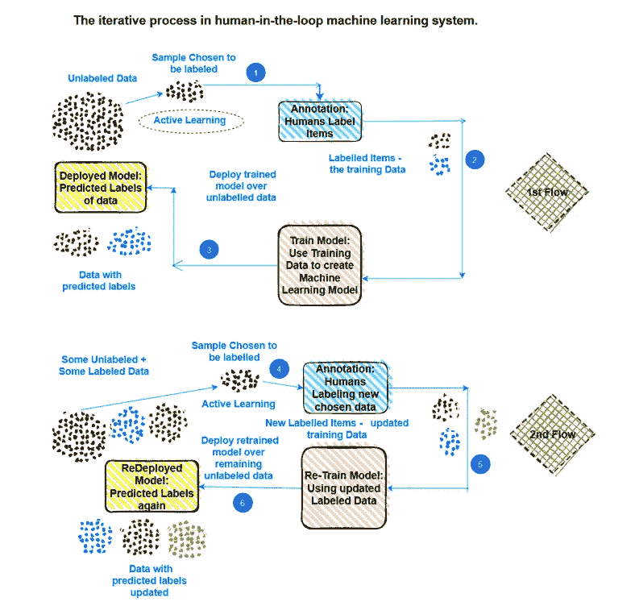
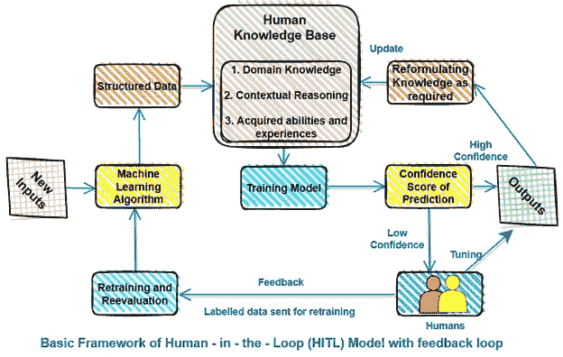
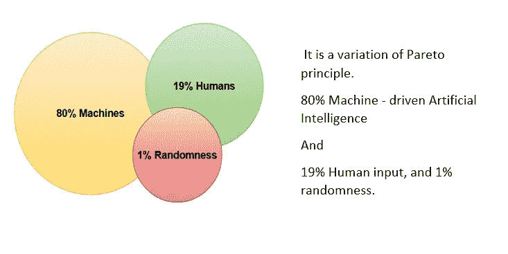

# 将人在回路(HITL)融入机器学习是一种必要，而不是一种选择。原因如下？

> 原文：<https://pub.towardsai.net/integrating-human-in-the-loop-hitl-in-machine-learning-application-is-a-necessity-not-a-choice-f25e131ca84e?source=collection_archive---------0----------------------->

## [机器学习](https://towardsai.net/p/category/machine-learning)

来源——图片由安迪·凯利在 Unsplash 上拍摄

到集成，**人在回路(HITL)** 在机器学习中，首先也是最重要的是理解 **HITL** ，它的需要、好处和方法。

**什么是人在回路(HITL)？**

> **人在回路(HITL)** 在机器学习自动化的架构中，通过各种手段将人类的输入和他们的反馈编织在一起。

它首先将人类标记/注释的数据集成到机器学习模型中，然后经过一个反馈周期来训练模型，以便通过人类的持续支持来产生期望的输出。

作者图片

如果业绩下滑到某个置信水平以下，反馈会触发预测模型的改进。

> 在实践中，总是希望预先设置模型可接受的置信度。
> 
> 这意味着，如果有一些错误的预测“进来”是好的，那么阈值可以设置得低一些，这反过来需要更少的人(手动)干预。
> 
> 另一方面，如果需要高水平的精确预测，人类(人工)干预的程度会增加。

简而言之，**，****人在回路(HITL)** 方法结合了人类智能的精华和机器智能的精华。

**HITL 设计是如何集成到机器学习应用中的？**

> 机器擅长从庞大的数据集做出明智的决定，而人更擅长在信息较少的情况下做出合理的决定，有时是基于他们的经验和直觉，因此设计必须包含机器的智能计算决定和人类的正确/道德决定。

机器学习中的人在回路(HITL)的设计方式允许双方(机器和人类)持续交互，并包括一个持续的反馈回路，使来自训练、参数调整和测试任务的反馈能够反馈到算法中，以便它变得更智能、更自信、更准确。

作者图片

这对于系统来说特别有效，它自己选择下一步需要学习的内容，并将这些数据发送给人类进行标记和训练。这个机器的学习和改进过程被称为**主动学习**。

> 主动学习是一种确保模型从人类创建的每个新的带标签/带注释的数据点中学习有用的东西的方式，在前进的过程中，模型不断遇到这些数据点。
> 
> 主动学习是机器学习模型的一个最重要的方面，当与人在回路(HITL)结合时，可以提供最佳的结果。

几个好例子是

*   随着智能设备听到越来越多的语音信号和命令，它们变得越来越智能。
*   搜索引擎通过观察人们点击哪个网站来搜索特定的词，从而变得更好。
*   随着观察越来越多的人类驾驶员和骑手，自动驾驶汽车变得越来越智能。

**HITL 为机器学习应用提供了什么好处？**

**1。**很多时候数据是不完整和不明确的。人类注释/标记原始数据以提供有意义的上下文，以便机器学习模型可以学习产生期望的结果、识别模式并做出正确的决策。

**2。**人工检查模型是否过度拟合。他们向模型传授极端情况或意想不到的情景。

**3。**人类评估算法是否过于自信或信心不足，以确定正确的决策。如果准确度较低，机器会经历一个主动学习周期，在此周期中，人类会为机器提供反馈，以达到正确的结果并提高其可预测性。

**4。**它显著提高了透明度，因为应用程序不再像黑匣子一样，每个步骤都需要人工参与。

**5。**它以最有效的方式结合了人类的判断，并将压力从构建“100%完美的机器”算法转移到提供最大商业利益的最佳模型。这反过来提供了更强大和有用的应用程序。

**什么样的 HITL 策略将被用于机器学习以获得最大收益？**

**1。**包括所有与应用中涉及的数据打交道的人，包括收集、标注、培训和对数据进行质量控制的人。

**2。**在流程的每个阶段战略性地部署人员，以改进和优化模型及其结果。

**3。**部署训练有素、管理有序的人力资源，加快上市速度，减轻数据返工负担。

4.考虑在生命周期的早期引入资源，如果可能的话，在模型开发开始之前，因为机器学习模型比标准软件系统更快地面临过时的危险，因为它们的性能严重依赖于不断发展的数据。

5.避免在整个生命周期中对人的不良利用，因为这会导致数据质量差、成本高和模型失败。

6.完全自动化不应该是最终目标，因为有时最好的结果只能通过人类(那些具有适当知识和专业技能的人)和机器的合作与协调来获得。

7.自动化应该在我们认为自动化有用的方面和人类参与仍然有意义的任务之间取得适当的平衡。拥抱两个极端，即匆忙实现一切自动化或坚持什么都不自动化，从来都不是双赢的局面。相反，理想的解决方案往往介于两者之间。

8.每当涉及道德决策时，例如，在没有明确正确或错误答案的情况下，或者由于决策的复杂性而存在机器故障的危险时，应允许优先考虑增强人的权能。

9.为解决复杂的环境管理问题，应采用以人为主导的决策框架，并进行适当的风险评估。在这种情况下，人工检查站不应被否决。

10.应该有人对人工智能和人工智能应用程序的决策结果负责，这当然不能被机器化。它必须是一个人，因为赌注和风险太高，甚至一个错误的转折。

**科学家和研究人员的人机参与比例**

作者图片

尽管有大量不同的领域和组织使用机器学习，但针对**人在回路(HITL)** 的方法还没有被利用到所需的程度。它仍然是一个新的领域，需要仔细考虑，以便与所有的机器学习应用程序集成。

但好消息是——大多数行业专家现在已经意识到了它的价值，并准备在每个人工智能和人工智能应用中包括 **HITL** 。

感谢阅读！！！

你可以在媒体上跟踪我

LinkedIn: [Supriya Ghosh](https://www.linkedin.com/in/supriya-ghosh)

推特: [@isupriyaghosh](https://twitter.com/isupriyaghosh)