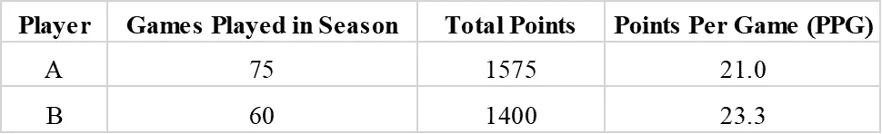
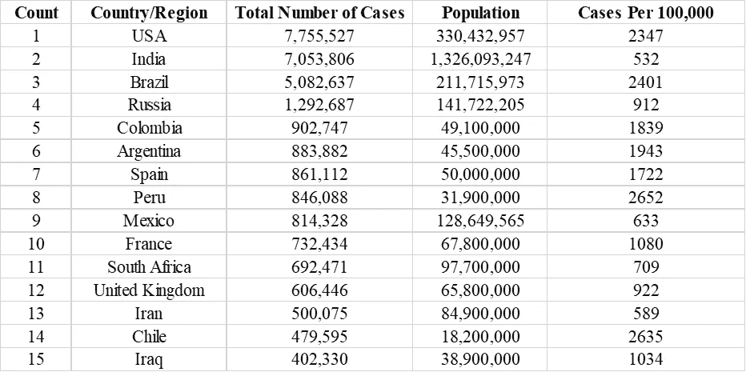
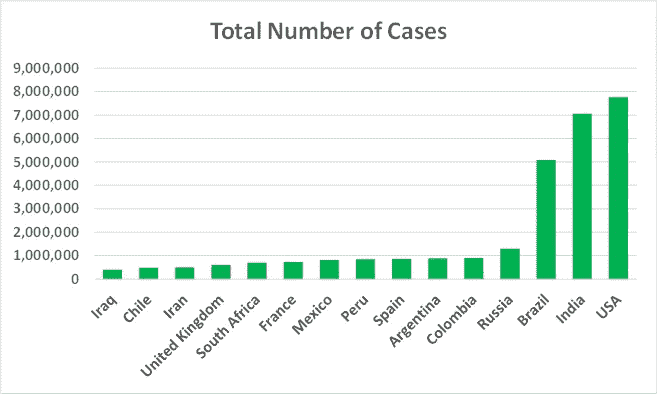
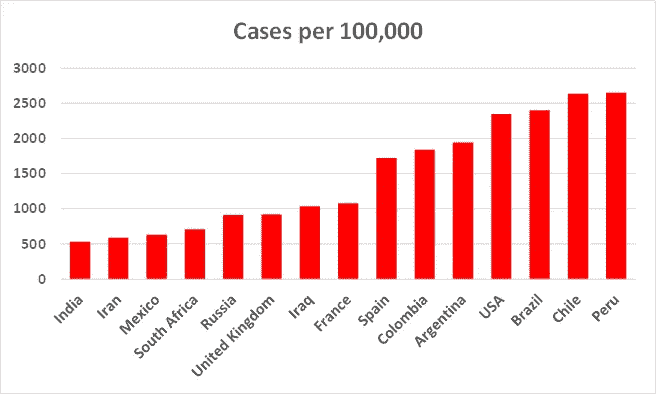

# 数据科学中的密集和广泛特征

> 原文：<https://pub.towardsai.net/intensive-and-extensive-features-in-data-science-73de3ac70e40?source=collection_archive---------3----------------------->

阿诺·斯密特在 [Unsplash](https://unsplash.com?utm_source=medium&utm_medium=referral) 上拍摄的照片

## [数据科学](https://towardsai.net/p/category/data-science)

## 密集变量比广泛变量告诉我们更多关于系统的信息。

# 一.导言

在物理学中，**广延变量**是一个依赖于系统大小的变量(如质量或体积)。另一方面，**密集变量**是不依赖于系统大小的变量(如温度、压力或密度)。虽然可能不是立即显而易见，但是**密集变量**比**广泛变量**告诉我们更多关于系统的信息。

基于大范围的特征比较被称为**绝对比较**。同样，基于密集尺度的特征比较被称为**相对比较**。

为了说明广泛变量和密集变量之间的差异，让我们考虑国家篮球协会(NBA)联盟中的两个假设的球员。我们将这些球员称为球员 A 和球员 B。下面的表 1 显示了球员 A 和 B 在常规赛结束时的统计数据。

**表 1** 。比较两个假想的 NBA 球员的赛季。Benjamin O. Tayo 的图片

我们还将假设球员 A 和 B 在赛季中分别总共打了 75 场和 60 场比赛。球员 B 因为伤病比球员 A 少打了 15 场比赛。我们还会假设，当两个球员都健康时，他们平均每场比赛的上场时间是一样的。

我们从**表 1** 中观察到，根据广泛的特征(总分数)，球员 A 比球员 B 表现得更好。鉴于一个赛季的总分数与比赛次数成正比，仅根据总分数来比较球员 A 和 B 是没有意义的。一个更有意义的功能是称为每场比赛点数(PPG)的强化功能。我们看到，就 PPG 而言，球员 B 是一个更好的得分手，他有 23.3 个 PPG，而球员 A 则有 21.0 个 PPG。

# 二。案例研究:新冠肺炎数据集

为了说明广泛和密集特征在数据科学中的重要性，我们将分析新冠肺炎数据集，如下面的**表 2** 所示。

**表 2** :新冠肺炎病例数最多的前 15 个国家/地区的病例数。2020 年 10 月 11 日星期日下午 5:00(中部时间)从[约翰的霍普金冠状病毒资源中心](https://coronavirus.jhu.edu/)获得的数据。

数据集是从以下来源获得的:

*   病例数量的数据是在 2020 年 10 月 11 日周日下午 5:00(中部时间)从[约翰的霍普金冠状病毒资源中心](https://coronavirus.jhu.edu/)获得的。
*   世界人口来源:[美国人口普查局](https://www.census.gov/popclock/)2020 年 10 月 11 日周日下午 5:00(中部时间)。

为了更好地比较广泛和密集特征之间的差异，我们为广泛变量(病例总数)和密集变量(每 100，000 例)生成了条形图。柱状图如下图**1**和 **2** 所示。

**图 1** 。病例数最多的前 15 个国家/地区的新冠肺炎病例数。2020 年 10 月 11 日星期日下午 5:00(中部时间)从[约翰的霍普金冠状病毒资源中心](https://coronavirus.jhu.edu/)获得的数据。图像由本杰明·欧·塔约拍摄。

**图二**。新冠肺炎病例数最多的前 15 个国家/地区每 100，000 人中的病例数。2020 年 10 月 11 日星期日下午 5:00(中部时间)从[约翰的霍普金冠状病毒资源中心](https://coronavirus.jhu.edu/)获得的数据。图像由本杰明·欧·塔约拍摄。

**图 1** 显示，就病例总数而言，美国、印度、巴西和俄国是病例数最多的国家，均超过百万例。

**图 2** 显示了基于密集变量的病例数比较，每 10 万例；秘鲁是每 10 万人中病例最多的国家。值得注意的是，在病例数最多的前 15 个国家/地区中，印度每 10 万人中的病例数最少，仅为每 10 万人中 532 例，而美国每 10 万人中有 2347 例。

# 三。总结和结论

总之，我们已经讨论了广泛和密集变量在数据科学和机器学习中的意义。我们已经看到，广泛的特征是基于绝对规模，而密集的特征是基于相对规模。使用新冠肺炎数据集作为案例研究，我们已经表明**密集变量**比**广泛变量**告诉我们更多关于任何系统的信息。

# 其他数据科学/机器学习资源

数据科学需要多少数学知识？

[数据科学课程](https://medium.com/towards-artificial-intelligence/data-science-curriculum-bf3bb6805576)

[进入数据科学的 5 个最佳学位](https://towardsdatascience.com/5-best-degrees-for-getting-into-data-science-c3eb067883b1)

[数据科学的理论基础——我应该关心还是仅仅关注实践技能？](https://towardsdatascience.com/theoretical-foundations-of-data-science-should-i-care-or-simply-focus-on-hands-on-skills-c53fb0caba66)

[机器学习项目规划](https://towardsdatascience.com/machine-learning-project-planning-71bdb3a44349)

[如何组织你的数据科学项目](https://towardsdatascience.com/how-to-organize-your-data-science-project-dd6599cf000a)

[大型数据科学项目的生产力工具](https://medium.com/towards-artificial-intelligence/productivity-tools-for-large-scale-data-science-projects-64810dfbb971)

[数据科学作品集比简历更有价值](https://towardsdatascience.com/a-data-science-portfolio-is-more-valuable-than-a-resume-2d031d6ce518)

***如有疑问，请发邮件给我***:benjaminobi@gmail.com