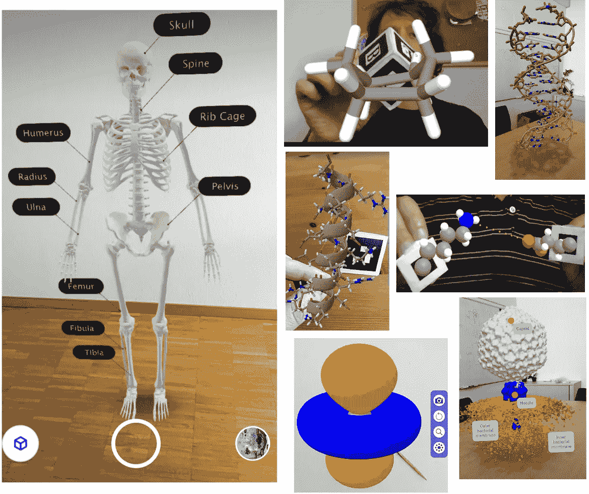
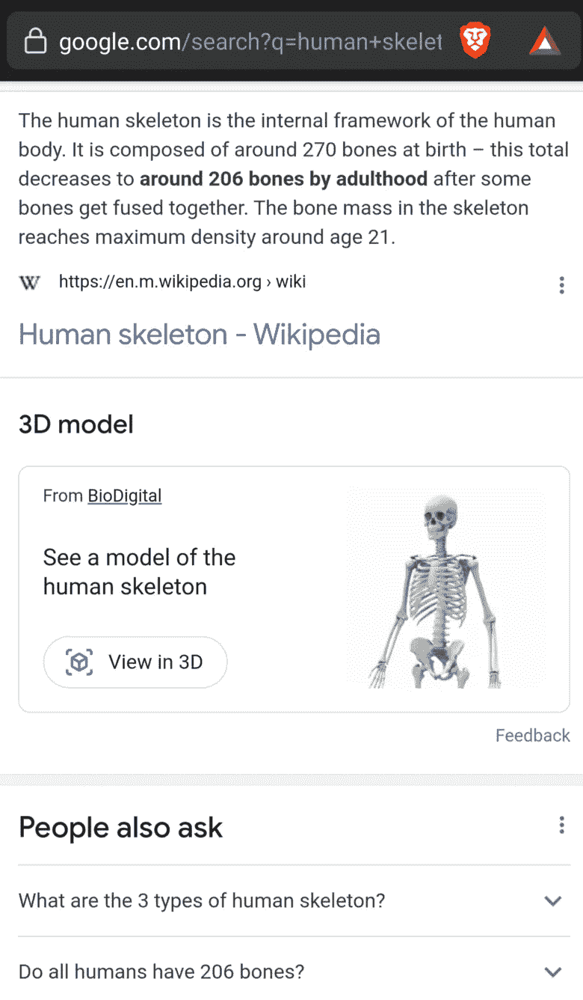
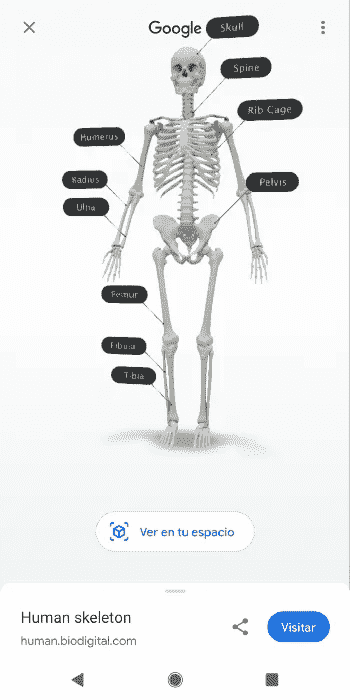
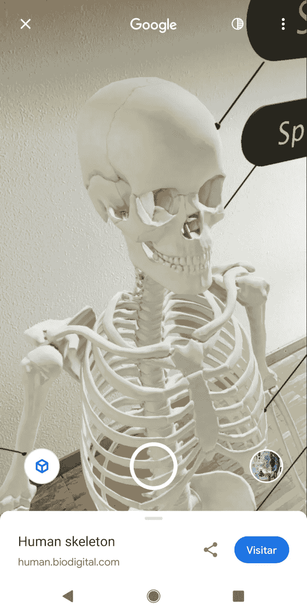
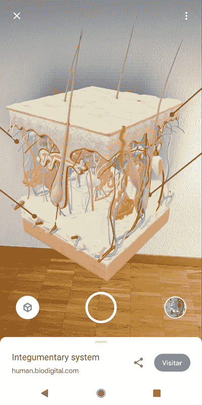
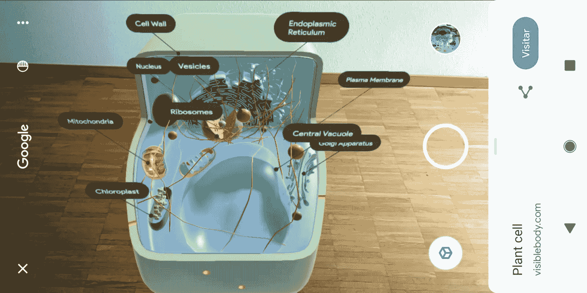
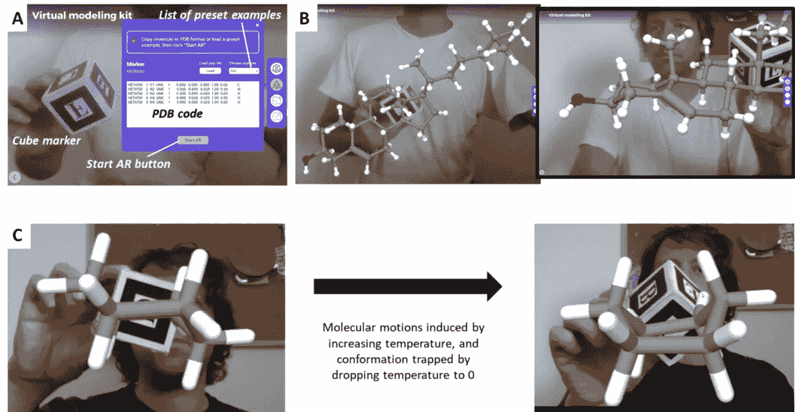
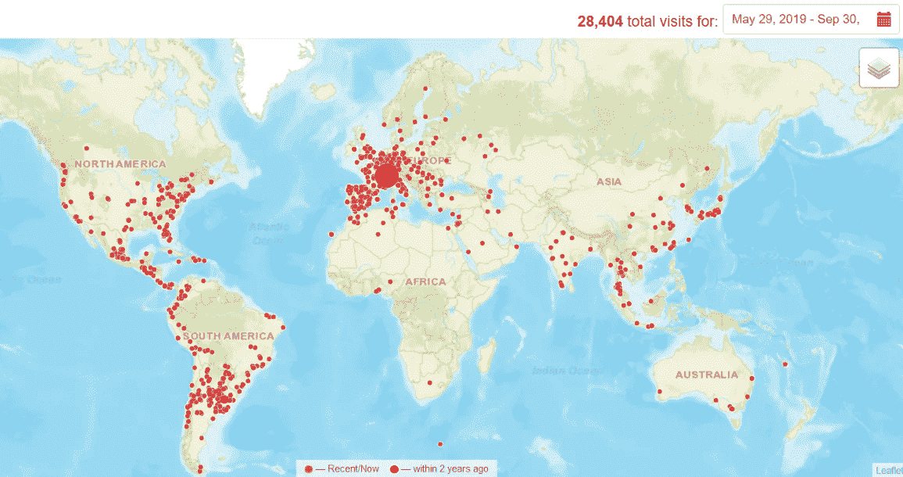
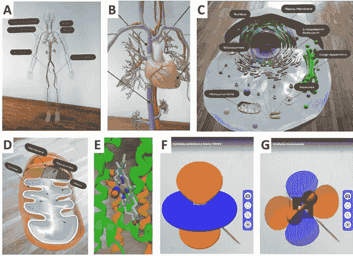

# 交互式增强现实网络应用，免费为全球科学教育提供身临其境的体验

> 原文：<https://pub.towardsai.net/interactive-augmented-reality-web-apps-to-enable-immersive-experiences-for-science-education-dce51889473f?source=collection_archive---------0----------------------->

在常规设备的网络浏览器中运行的对化学和生物教育有用的增强现实视图的各种例子。本文通过一些例子描述了这项技术及其应用范围。作者 Luciano Abriata 图。

## [计算机视觉](https://towardsai.net/p/category/computer-vision)

## 多媒体材料以独特的方式帮助教师更好地传递知识，帮助学生掌握概念。虚拟、增强和混合现实(XR，其中 X=V，A，R)可以通过允许用户在他们的空间中处理虚拟对象并与之互动，潜在地增强学习体验。虽然“经典”XR 通常需要昂贵、设置复杂的硬件和软件，即使是富裕国家也负担不起，但在智能手机等消费设备上运行的基于网络的 XR 的出现使这种体验随时随地都可以获得，无需任何专门的硬件或软件，使最新教学工具的使用民主化。

**快速目录:**

*   [简介](#d08b)
*   XR 的这种基于网络的范例有什么特别之处？
*   [用于生物学的商品、基于网络的增强现实内容，基于 ModelViewer 对从谷歌搜索中检索到的 3D 模型的 WebXR 控制使用](#38c8)
*   [molecular web 站点:商品，基于网络的化学 AR 内容，由 Three.js、A-Frame、Cannon.js、AR.js 和 ModelViewer 构建](#f3da)
*   [覆盖范围非常广，使用障碍最小，不需要专门的硬件或软件安装](#34d4)
*   [AR 和 VR 对学生学习的实际效果如何？](#8f2c)
*   [结论](#7084)
*   [关键参考资料、链接和进一步阅读](#11ce)

**===这里展示的工具是由** [**法比奥·科尔特斯**](https://medium.com/u/15e939a09b4a?source=post_page-----7fce5205ce6f--------------------------------) **和我在 EPFL Dal Peraro 实验室其他成员的帮助下开发的。===**

# 介绍

抽象的物体和概念，极端的尺寸，很难获得，或者很贵，通常很难理解和实验。例如，试着去理解一个原子的结构，或者一个星系，或者人体的内部运作。看到重要的细节并不容易！

我们人类经常在没有意识到的情况下，使用各种模型以可理解的方式来表示实体，不仅是为了教育，也是为了我们的工作。计算机图形提供了一种生成、存储和显示这种模型的特别方便的方式，但是有几个限制，特别是关于与这些对象交互的方式。XR 技术能够实现计算机模型的身临其境的 3D 视图，以及在空间中与它们进行交互的直观方式。然而，获得这种技术远非主流；因此，它渗透到应用程序中的速度很慢，推迟了它们应该为工作、娱乐和教育带来的“革命”。通常，主要问题是所涉及的 AR 和 VR 头戴设备的高成本和笨重的性质，市场上许多不同的设备竞争，每个设备都有自己的技术和软件驱动程序，以及不断发展的硬件和有限的跨设备支持。

最近，XR 在智能手机、平板电脑和笔记本电脑等消费设备上的出现让这些技术的应用范围更加广泛。因此，现在许多软件开发提供廉价的体验，主要是在增强现实中，带有科学教育的内容。尽管它们引起了很大的兴趣并且报道了对学生学习的积极结果，但是这些程序中的大多数仍然提供相当静态的内容，除了可视化之外，用户对这些内容具有有限的控制或者没有控制，并且具有额外的缺点，例如需要安装软件。但是，用于 web 浏览器的 XR 应用程序开发的新库，以及新的 WebXR 标准，可能会给教育领域的多媒体内容带来真正的革命，也许还会给未来的工作带来革命。简而言之，这些库和 API 提供了对设备的用户姿势信息源及其输出显示的客户端代码访问，统一了跨设备的 XR 体验的创建。

# XR 的这种基于网络的范例有什么特别之处？

从内容开发人员的角度来看，特别是对于那些在编程方面没有深入专业知识的学者和教育工作者来说，web 编程提供了一种相对简单的实现想法的方法。事实上，像 [AR.js](https://ar-js-org.github.io/AR.js-Docs/) 和 [A-Frame](https://aframe.io/) 这样的工具允许开发 AR 场景，用户可以使用专门的 HTML 代码处理带有基准标记的对象。此外，为 web 浏览器创建的 AR 体验可以受益于浏览器可用的无数其他功能，从语音识别 API 到外部信息源和计算。

从用户端来看，网络软件不需要安装或更新，因为它是作为一个普通的网页来交付和运行的。此外，这是一个非常大的问题，不需要特殊的硬件，因为应用程序可以专门定制，以便在智能手机、平板电脑和计算机等常规设备上工作。(当然，也可以开发像 MS HoloLens、HTC Vive 或 Oculus Quest 这样的更具沉浸感的设备的特定内容，但它们的覆盖范围要有限得多！)

# 商品、基于网络的生物增强现实内容，基于 ModelViewer 控制的 WebXR 在从 Google 搜索中检索的 3D 模型上的使用

让我们用具体的例子来说明这个问题，从谷歌免费提供的由 [BioDigital](https://www.biodigital.com/) 或 [Visible Body](https://www.visiblebody.com/) 等公司开发的生物实体模型开始。当一个人在智能手机上谷歌“骷髅”这样的词时，首先找到的是这样一个框:

手机上谷歌搜索“人骨”的结果。作者 Luciano Abriata 截图。

点击这个框会启动一个[模型查看器](https://modelviewer.dev/) web 组件的实例，用户可以用手指移动对象:

启动 AR 视图之前的人体骨骼模型。作者 Luciano Abriata 截图。

现在事情变得更酷了。当用户点击“在我的空间中查看”(或取决于设备语言设置的等效功能)时，AR 模式会激活，并提示用户扫描平坦的水平表面，如地板或桌子。一旦应用程序识别出平面，它就会在其上设置虚拟对象，产生一种非常身临其境的 AR 体验，用户可以看到模型(在本例中，是人体循环系统)就站在他或她的旁边，并可以在它周围移动，以检查其内部结构和器官，就像一年级医学学生使用的物理模型一样:

从不同角度检查人体骨骼模型。作者 Luciano Abriata 截图。

这种特定的人体骨骼模型是由 [BioDigital](https://www.biodigital.com/) 开发的，该公司正在将人体解剖的不同结构和系统绘制成与 WebXR 兼容的模型。另一家公司， [Visible Body](https://www.visiblebody.com/) ，为生物学中更广泛的主题开发模型，包括详细的细胞和细胞器。然而，其他公司提供非常详细的昆虫和动物模型，甚至是恐龙等灭绝物种的模型，而像 [Sketchfab](https://sketchfab.com/) 这样的合作平台允许每个人发布、分享、购买和出售任何 AR/VR 兼容的 3D 模型。从谷歌搜索中查看更多与生物学相关的主题:

左图:皮肤系统的模型。右图:植物细胞的模型。作者 Luciano Abriata 截图。

为了说明科学传播中的一个具体应用，我最近使用 Modelviewer 加载了我自己的 3D 模型，并制作了一个关于“增强现实中的病毒”的基于照片的故事:

 [## 增强现实中的病毒镜头

### 不仅仅是图画，而是真实的实验重建。你可以在增强现实中查看这些模型，用你自己的…

medium.com](https://medium.com/snap-shots/shots-of-viruses-in-augmented-reality-8492bd120f56) 

# moleculARweb 站点:商品，基于网络的化学 AR 内容，由 Three.js、A-Frame、Cannon.js、AR.js 和 ModelViewer 构建

谷歌提供的 3D 对象范围涵盖了生物学(以及其他科学和技术领域),但它对化学概念的覆盖相当有限。此外，谷歌提供的内容在很大程度上是静态的，我的意思是它只是“站”在那里，尽管它是探索 3D 对象的一个很好的工具，但除了一些 3D 模型是动画之外，没有交互性或机械性。我们的 [moleculARweb](https://molecularweb.epfl.ch/) 网站涵盖了所有这一切:它致力于化学，并提供静态视图(也通过使用 ModelViewer ),以及将对象连接到常规打印的基准标记的视图，以便用户可以在空间中用他或她的手处理它们。

我们的网站 molecular web([https://molecular web . epfl . ch](https://molecularweb.epfl.ch/))建立在使用基准标记和 3D 图形的 web 增强现实开源库的基础上，它提出了一大组 web-AR 活动，涉及从普通、无机、有机和生物化学到介绍性结构生物学的不同主题。在这些活动中，学生、教育工作者和科学传播者只需使用支持网络摄像头的设备和打印在普通纸上的基准标记，就可以直接在 3D 中操纵分子和其他对象。此外，由于*特设的*代码和用于刚体力学的 Cannon.js 库，moleculARweb 的许多活动呈现出高度互动的内容。事实上，它的活动之一是塑料分子建模套件的完全虚拟替代方案，用户可以在其中构建任何分子，分子显示真实的物理特性:

(A)启动分子的 AR 视图。(B)将一个胆固醇分子装载到立方体上，然后移动以检查其 OH 基团(红色原子与白色原子相连)。(C)环己烷分子被加载，即处于其椅子构象，并且处于通过模拟原子运动实现的船构象。由作家卢西亚诺·阿布利亚塔创作的人物。

为了更好地体验 moleculARweb 活动的感受，请在我的 YouTube 频道上观看[这些视频](https://www.youtube.com/playlist?list=PLZqPrSO9_r6-eRVBYhFOwRn9H3ixyEBfb)(音频是西班牙语的，但自动翻译效果很好):

关于我们化学和生物教育的分子网站的播放列表，在我的 YouTube 频道。

# 覆盖范围非常广，使用障碍最小，不需要专门的硬件或软件安装

描述这类应用的学术出版物(仍然很少)，如描述 moleculARweb 的[文章，以及许多其他使用非网络商品 XR 的文章，都表明了这些媒体资源对学习的积极影响(但见下一节)。此外，这种内容在简单的消费设备中开箱即用的事实使这种技术广泛可用和可访问，因为几乎每个拥有网络摄像头设备的用户都可以在任何有互联网连接的房子或学校中使用它们。事实上，我们在新冠肺炎疫情期间的研究表明，大多数学生在家里使用 moleculARweb，用户连接的全球地图显示来自世界各地的定期访问。](https://pubs.acs.org/doi/10.1021/acs.jchemed.1c00179)

moleculARweb 自 2019 年年中发布以来的使用情况，在[https://clustrmaps.com/site/1ar2f](https://clustrmaps.com/site/1ar2f)实时记录。作者 Luciano Abriata 截图。

# AR 和 VR 对学生学习的实际效果如何？

尽管有报告表明这些技术确实有助于学习，但这是我们不能确定的事情。关于增强现实和虚拟现实工具在学习中的积极作用已经说了很多，但很少得到证实。**当然，这些工具激发了强烈的参与**，[，正如我们通过对学生的调查](https://pubs.acs.org/doi/10.1021/acs.jchemed.1c00179)所测量的那样，并且我们可以亲眼目睹他们使用分子网络。但是这些技术是否对学习有实际影响，很难评估。

当然，影响不仅取决于技术本身，还取决于所创造的内容，以及教师如何将这些工具融入他们的课程。至少可以肯定的是，这些技术现在应该能够实现这种评估，因为它们可以很容易地部署在大量的学生身上——与使用传统 AR 和 VR 技术的内容相反，传统 AR 和 VR 技术的范围更加有限。

# 结论

化学和生物特别适合 XR。随着 WebXR 标准的不断发展，越来越多的设备采用它，媒体开发人员也越来越多地与教育工作者合作，我们乐观地认为，实际应用也将扩展到科学教育的其他领域。

通过智能手机上基于网络的增强现实，从系统到细胞、分子及其电子属性。“旅行”从谷歌提供的循环系统模型(A)开始，用户可以四处走动并放大特定的器官(B)。另一个模型描述了真核动物细胞，另一个是线粒体(D)。moleculARweb 提供多种活动；我们在此展示了末端呼吸酶的实验结构，一氧化氮结合在氧还原铁中心(E ),以及涉及铁(F)和氧(G)之间相互作用的电子轨道的基准市场驱动观点。由作家卢西亚诺·阿布利亚塔创作的人物。

# 关键参考资料、链接和进一步阅读

*   基于网络的 AR 使用 [AR.js](https://medium.com/arjs) 并且从只有 [10 行 HTML](https://medium.com/arjs/augmented-reality-in-10-lines-of-html-4e193ea9fdbf) 代码开始，作者[亚历山德拉·艾蒂安](https://medium.com/u/c04bc48628bc?source=post_page-----7fce5205ce6f--------------------------------)。如果你想开始玩，这是一个很好的入门故事
*   moleculARweb 核心的另外两个惊人的库: [Three.js](https://threejs.org/) 和 [Cannon.js](https://schteppe.github.io/cannon.js/)
*   我对如何使用 moleculARweb 的深入解释:

 [## 化学和生物教育使用商品网络增强现实-在任何设备！

### 感谢现代教育内容在我们的分子网站和互联网上使用了基于网络的增强现实技术

medium.com](https://medium.com/geekculture/chemistry-and-biology-education-using-commodity-web-augmented-reality-in-any-device-9fa9fdc4ab35) 

*   我写了一篇关于科技如何在 Covid19 疫情期间帮助科学教育的文章:

 [## 在疫情期间，丰富的极客文化如何在家中维持动手科学教育

### 从用于家庭实验的 DIY 仪器和智能手机传感器，到商用增强现实、在线视频…

medium.com](https://medium.com/geekculture/how-the-rich-geek-culture-sustained-hands-on-science-education-at-home-during-the-pandemic-84da320c813f) 

*   使用这些技术进行科学交流的一个具体例子，以快照中的照片文章的形式:

 [## 增强现实中的病毒镜头

### 不仅仅是图画，而是真实的实验重建。你可以在增强现实中查看这些模型，用你自己的…

medium.com](https://medium.com/snap-shots/shots-of-viruses-in-augmented-reality-8492bd120f56) 

*   我们在*化学教育杂志*上发表的关于分子网络的论文:

 [## 分子网:一个通过交互式网络提供化学和结构生物学教育的网站。

### 增强/虚拟现实(ARs/VRs)有望彻底改革 STEM 教育。然而，大多数易于使用的工具是…

pubs.acs.org](https://pubs.acs.org/doi/10.1021/acs.jchemed.1c00179) 

*   我们对所有这些问题的看法载于*自然计算科学*:

 [## 利用 WebXR - Nature 为科学教育提供大众化的交互式沉浸式体验…

### 对编辑来说——抽象的物体和概念，极端的尺寸，差的可用性或高的购买成本…

www.nature.com](https://www.nature.com/articles/s43588-021-00142-8) 

*   我们在 *PeerJ 计算机科学*发表的关于化学 XR 的所有这些基于网络的技术的论文:

 [## 网络中基于商品增强现实的分子可视化和建模的构建模块…

### 多年来，使用虚拟和增强现实(AR)进行分子可视化和建模的沉浸式界面已经…

peerj.com](https://peerj.com/articles/cs-260/) 

*   我撰写的两篇关于客户端 web 编程的作用和力量的同行评议文章:

 [## 分子科学的网络应用已经成熟

### 尽管服务器端程序对于维护数据库和运行数据分析管道和模拟是必不可少的…

www.mdpi.com](https://www.mdpi.com/2227-9709/4/3/28)  [## 用客户端 Web 编程增加研究、教育和推广

### 在过去的十年中，计算和网络技术的发展使得成熟的…

www.sciencedirect.com](https://www.sciencedirect.com/science/article/pii/S0167779917303074) 

我是一个自然、科学、技术、编程和 DIY 爱好者。生物技术专家和化学家，在潮湿的实验室和计算机里。我写我广泛兴趣范围内的一切。查看我的 [*列表*](https://lucianosphere.medium.com/lists) *了解更多故事。* [*成为媒介会员*](https://lucianosphere.medium.com/membership) *访问我和其他作家的所有故事，* [*订阅通过邮件获取我的新故事*](https://lucianosphere.medium.com/subscribe) *(平台原创附属链接)。*