# 具有聊天机器人和预测功能的交互式新冠肺炎仪表板

> 原文：<https://pub.towardsai.net/interactive-covid-19-dashboard-with-chatbot-and-prediction-capabilities-ad3dc4fa4058?source=collection_archive---------3----------------------->

## [数据可视化](https://towardsai.net/p/category/data-visualization)

## 一种展示机器学习技能和帮助全球的实用方法。

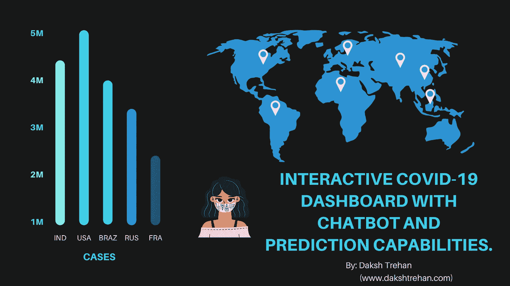

新冠肺炎可以被标记为这十年中最突出的亮点，而模糊的信息传播可以被视为一个值得关注的问题。由于这个原因，一些数据可视化研究人员和专业人士参与了提供广泛使用的工具，以便更好地公开解释。

加入从业者的名单，我们设计了一个实时交互式新冠肺炎仪表板，其中包括频繁更新的全球数据的动态可视化，以及一个聊天机器人来帮助和解决新手的查询，以及一个预测器，它能够使用机器学习技术预测全球和不同国家的活跃病例、恢复病例和伤亡人数。

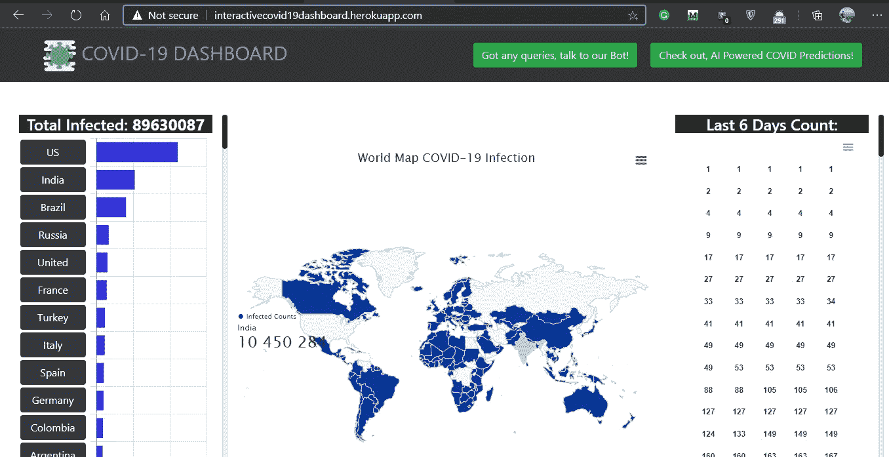

仪表板主页

***内容表:-***

1.  *数据采集和准备*
2.  *统计数据的动态部署*
3.  *聊天机器人*
4.  *预测疫情爆发*
5.  *链接到资源*

# 数据获取和准备

已用于预测和建模任务的数据集取自约翰·霍普金斯大学系统科学与工程中心(CSSE)管理的存储库“2019 年新型冠状病毒可视化仪表板”，该存储库也由 ESRI Living Atlas 团队和约翰·霍普金斯大学应用物理实验室(JHU APL)支持。

获取的数据被参数化，包括相关参数，如州、国家、纬度、经度和日期。一个单独的数据集被用来更好地理解确诊、死亡和恢复的病例。

# 统计数据的动态部署

使用几种数据清理技术清理从上述存储库中获取的数据并使其可用。

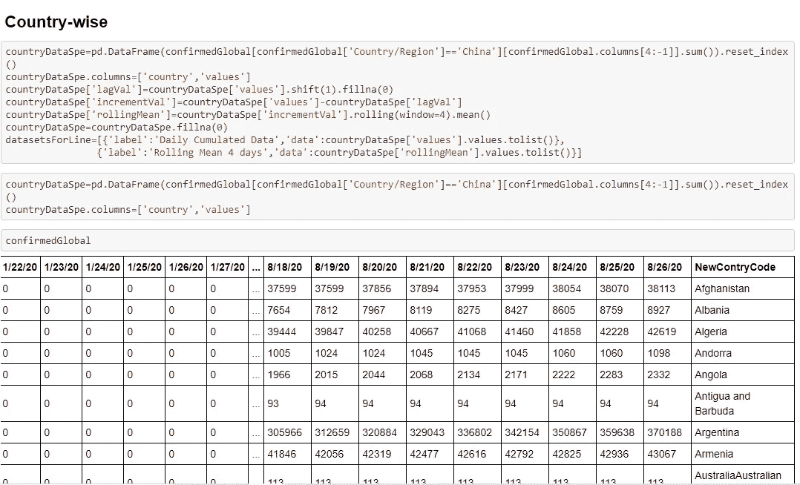

为了以动态和生动的方式部署统计数据，使用了 JavaScript，并且使用 Heroku 服务器将程序放在 web 上。

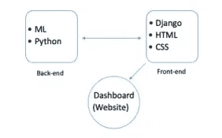

## 仪表板的显著特点:

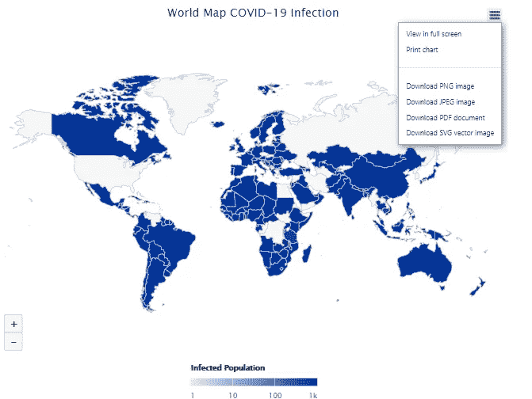

下载各种格式的图表

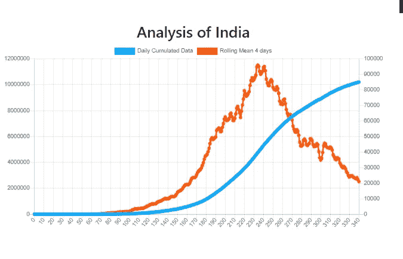

滚动平均值与每日累积数据

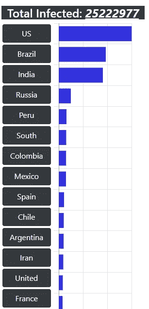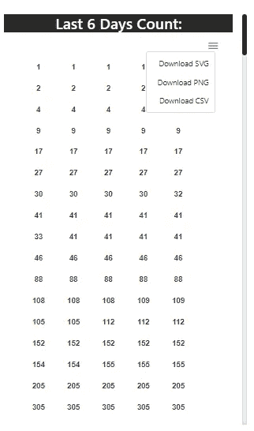

不同国家的表格表示和过去 6 天的计数

# 聊天机器人

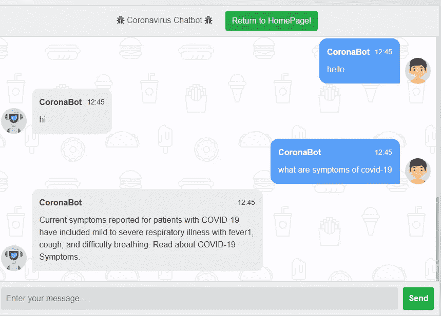

为了让新手或对致命的冠状病毒了解有限的人更容易使用我们的仪表板，我们尝试使用聊天机器人来帮助解决关于疫情疫情的疑问。
数据是使用 requests 和 BeautifulSoup 库从疾病控制和预防中心官方网站的常见问题部分获得的。该数据包括 70 个不同的问题，涉及对新型 2019 冠状病毒的一般认识。查询及其解决方案被单独收集并转储到 JSON 文件中，然后这些文件被聚集起来创建一个有用的数据框。
在聊天机器人的跟进下，使用 TF-IDF 矢量化来采用词袋模型。通常，我们不能直接将文本数据输入到模型中，而是需要将它们转换成特征向量。这就是 TF-IDF 帮忙的地方。它代表“术语频率-逆文档频率”,存储分配给每个单词的结果分数的组成部分。像“the”、“is”这样的词可能会在我们的文档中经常出现，但这对我们的编码向量肯定没有帮助。TF-IDF 向量的目标是计算更有趣的突出显示文本的词频分数。“术语频率(TF)”计算每个单词的频率，而“逆向文档频率(IDF)”缩小频繁出现的单词的分数。
请记住，用户很有可能不会输入与我们的语料库中提取和存储的问题相同的问题，尽管我们可以期望将相同问题的含义和见解匹配到我们的模型中是很牵强的。为了解决这一挑战，我们使用余弦相似度来确定文本之间的相似性，而不管它们的大小。它倾向于确定在多维空间中投影的两个向量之间的余弦角。

余弦相似性

# 预测疾病爆发

我们的仪表板的另一个显著特征可以被认为是活动、恢复和死亡病例的预测。数据获取连续数据集，因此非常适合回归分析，因为它需要从各种独立变量中的连续因变量进行预测。因变量和自变量之间的关系可以由两个变量的回归数学表达式的系数来定义。

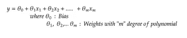

由于[线性回归](https://medium.com/towards-artificial-intelligence/linear-regression-explained-f5cc85ae2c5c)是监督学习，因此，我们需要向其提供过去的数据，为此，我们收集了“2020 年 1 月 1 日”的数据，并向其提供实际值，以绘制超平面并预测活动、康复和死亡病例的未来值。

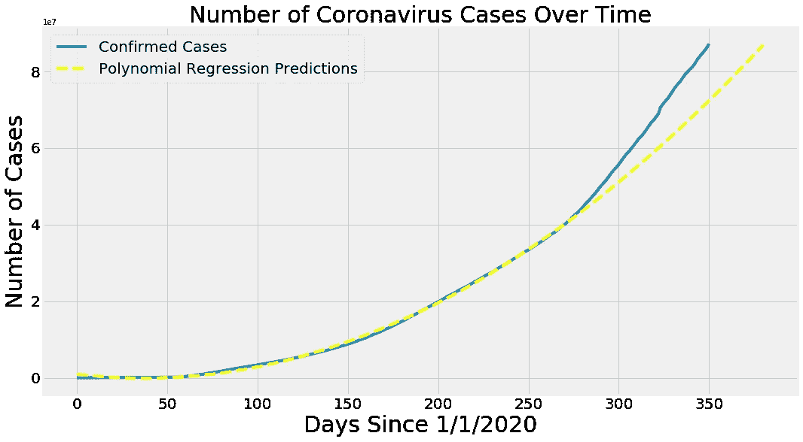

SVM 回归遵循同样的趋势。SVM 基本上被用作分类器，但是当我们试图增加而不是减少差值时，它显示出回归的性质，并且可以用于预测建模。

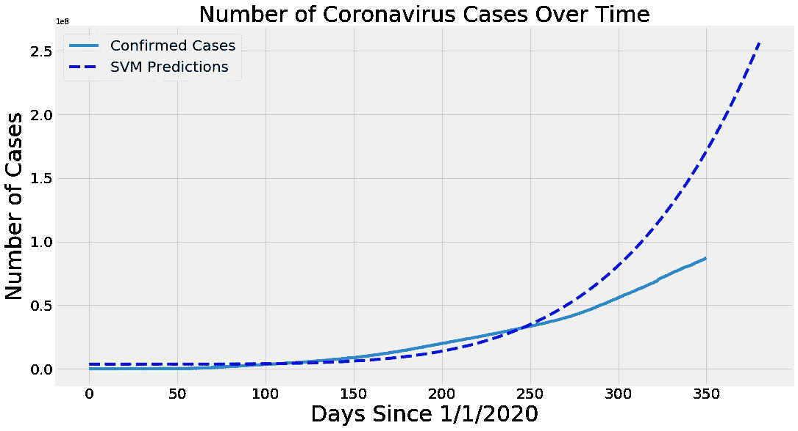

预测全球治愈病例:

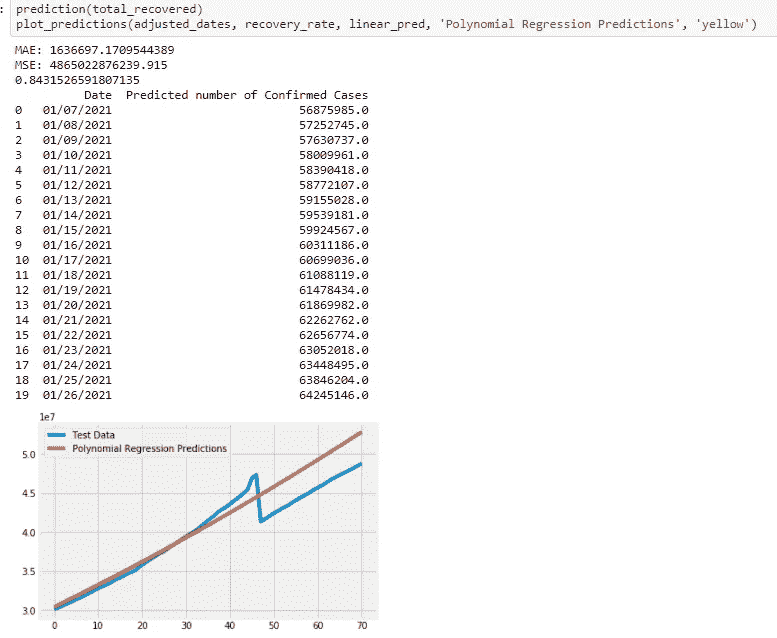

预测全球死亡病例:

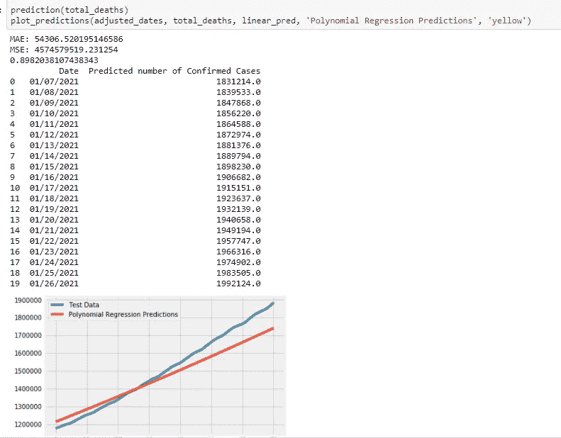

预测美国的死亡案例:

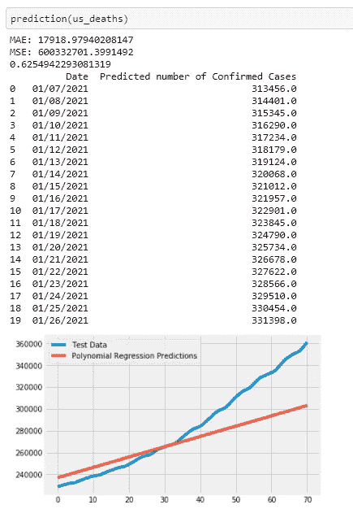

# 链接到资源

链接到存储库:[达克什特里汉/互动-新冠肺炎-仪表板](https://github.com/dakshtrehan/Interactive-Covid-19-Dashboard)

链接到仪表板:【http://interactivecovid19dashboard.herokuapp.com/ 

链接到已发表的论文:[使用机器学习技术的 COVID 19 趋势分析——IJSER 日报出版物](https://www.ijser.org/onlineResearchPaperViewer.aspx?COVID-19-Trend-Analysis-using-Machine-Learning-Techniques.pdf)

投资组合链接:[www.dakshtrehan.com](http://www.dakshtrehan.com)

请随意连接:

> *LinkedIn ~*[*https://www.linkedin.com/in/dakshtrehan*](https://www.linkedin.com/in/dakshtrehan/)

关注更多机器学习/深度学习博客。

> *中等~*[*https://medium.com/@dakshtrehan*](https://medium.com/@dakshtrehan)

# 想了解更多？

[准备好拜 AI 神了吗？](https://medium.com/swlh/are-you-ready-to-worship-ai-gods-818c9b7490dc)
[利用深度学习检测新冠肺炎](https://towardsdatascience.com/detecting-covid-19-using-deep-learning-262956b6f981)
[逃不掉的 AI 算法:抖音](https://towardsdatascience.com/the-inescapable-ai-algorithm-tiktok-ad4c6fd981b8)
[GPT-3: AI 否决开始了？](https://medium.com/@dakshtrehan/gpt-3-ai-overruling-started-15fd603470f2)
[Tinder+AI:一场完美的牵线搭桥？](https://medium.com/towards-artificial-intelligence/tinder-ai-a-perfect-matchmaking-b0a7b916e271)
[使用机器学习的卡通化内幕指南](https://medium.com/towards-artificial-intelligence/an-insiders-guide-to-cartoonization-using-machine-learning-ce3648adfe8)
[强化强化学习背后的科学](https://medium.com/towards-artificial-intelligence/reinforcing-the-science-behind-reinforcement-learning-d2643ca39b51)
[解码生成性对抗网络背后的科学](https://medium.com/towards-artificial-intelligence/decoding-science-behind-generative-adversarial-networks-4d188a67d863)
[了解 LSTM 和 GRU 的](https://medium.com/towards-artificial-intelligence/understanding-lstms-and-gru-s-b69749acaa35)
[用于假人的递归神经网络](https://medium.com/towards-artificial-intelligence/recurrent-neural-networks-for-dummies-8d2c4c725fbe)
[用于假人的卷积神经网络](https://medium.com/towards-artificial-intelligence/convolutional-neural-networks-for-dummies-afd7166cd9e)

> *欢呼*