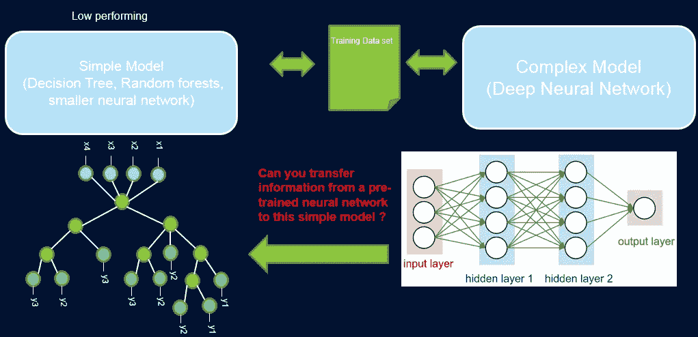
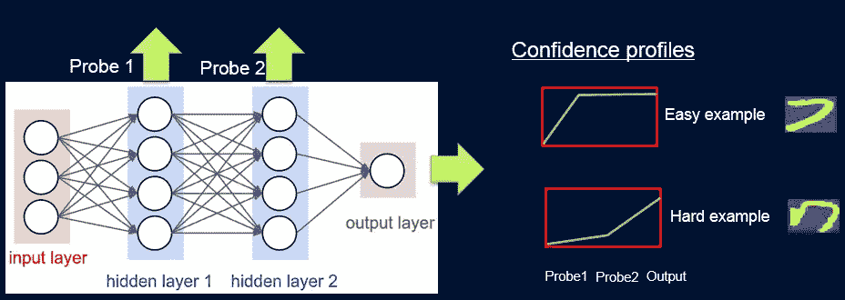
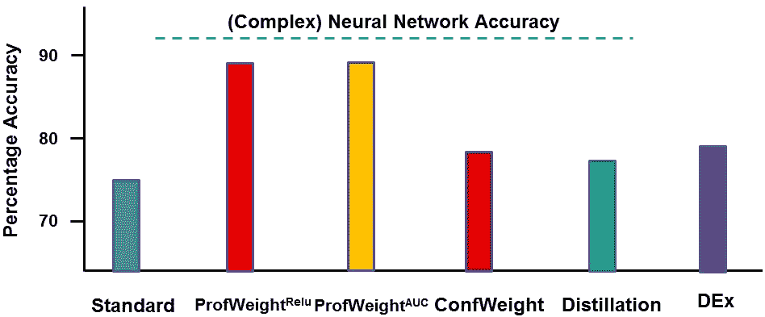

# 单一模型中的可解释性和性能

> 原文：<https://pub.towardsai.net/interpretability-and-performance-in-a-single-model-1b5246b595e7?source=collection_archive---------0----------------------->

## [机器学习](https://towardsai.net/p/category/machine-learning)

## IBM Research 发表了一些聪明的研究来构建模型复杂且可解释的模型。

来源:[https://www . exper fy . com/blog/ai-ml/guide-to-interpretable-machine-learning/](https://www.experfy.com/blog/ai-ml/guide-to-interpretable-machine-learning/)

> 我最近创办了一份专注于人工智能的教育时事通讯，已经有超过 70，000 名订户。《序列》是一份无废话(意思是没有炒作，没有新闻等)的 ML 导向时事通讯，需要 5 分钟阅读。目标是让你与机器学习项目、研究论文和概念保持同步。请通过订阅以下内容来尝试一下:

 [## 序列

### 该序列解释了主要的机器学习概念，让你与最相关的项目和最新的…

thesequence.substack.com](https://thesequence.substack.com/) 

机器学习是一门充满摩擦和权衡的学科，但没有比准确性和可解释性之间的平衡更重要的了。原则上，深度神经网络等高度精确的机器学习模型往往很难解释，而决策树等简单模型在许多复杂的场景中表现不佳。传统的机器学习智慧告诉我们，准确性和可解释性是模型架构中相反的力量，但事实总是如此？我们能建立既高性能又易于理解的模型吗？来自 IBM 的研究人员最近发表了[一篇论文，提出了一种利用更复杂模型的知识来提高简单机器学习模型性能的统计方法](https://arxiv.org/abs/1807.07506)。

在机器学习模型中找到性能和可解释性之间的平衡绝非易事。从心理学上来说，我们更容易被我们能够解释的事情所吸引，而我们内心的经济人更喜欢给定问题最好的结果。许多真实世界的数据科学场景可以使用简单和高度复杂的机器学习模型来解决。在这些场景中，简单性和可解释性的优势往往超过性能的优势。

# 机器学习简单的优势

透明度和性能之间的平衡可以描述为研究和现实世界应用之间的关系。如今，大多数人工智能(AI)研究都集中在超级复杂的学科上，如强化学习或生成模型。然而，当涉及到实际应用时，对更简单的机器学习模型的信任往往占上风。我们一直看到计算生物学和经济学中的复杂场景使用简单的稀疏线性模型或复杂的仪器化领域(如使用决策树解决的半导体制造)来解决。机器学习模型的简单性有许多实际优势，在你面对真实世界的场景之前，这些优势不会被轻易忽视。以下是我最喜欢的一些:

**小数据集:**公司通常为其业务问题收集有限的可用数据。因此，简单模型在这里更受青睐，因为它们不太可能过度拟合数据，此外还能提供有用的见解。

**资源有限的环境:**简单模型在有功率和内存限制的环境中也很有用。

**信任:**更简单的模型激发了对领域专家的信任，这些专家通常对模型的结果负责。

尽管机器学习模型的简单性具有显著的优势，但我们不能简单地忽视顶级性能模型的好处。然而，如果我们可以使用来自更复杂的替代方案的知识来提高更简单的机器学习模型的性能，会怎么样呢？这是 IBM 研究人员决定采用一种叫做 ProfWeight 的新方法的途径。

# 重量

ProfWeight 背后的想法令人难以置信地富有创造性，以至于对许多机器学习专家来说是反直觉的。从概念上讲，ProfWeight 将信息从具有高测试精度的预训练深度神经网络转移到更简单的可解释模型或低复杂性和先验低测试精度的非常浅的网络。在这种情况下，ProfWeight 使用复杂的深度学习模型作为高绩效教师，这些课程可用于教授简单、可解释但通常表现不佳的学生模型。

来源:[https://arxiv.org/abs/1807.07506](https://arxiv.org/abs/1807.07506)

为了实现教师模型和学生模型之间的知识传递，ProfWeight 引入了探针，探针根据网络的难易程度对样本进行加权分类。每个探头从其中一个隐藏层获取输入，并通过一个完全连接的层进行处理，该层附有一个网络输出大小的 softmax 层。特定层中的探测器充当分类器，仅使用直到该层的网络前缀。尽管复杂，但 ProfWeight 可以总结为四个主要步骤:

1)在高性能神经网络的中间表示上附加和训练探针。

2)在原始数据集上训练简单模型。

3)学习作为简单模型和探针的函数的数据集中的例子的权重。

4)在最终加权数据集上重新训练简单模型。

来源:https://arxiv.org/abs/1807.07506

整个 ProfWeight 模型可以被视为一个探测、获取置信度权重和重新训练的管道。为了计算权重，IBM 团队使用了不同的技术，如曲线下面积(AUC)或校正线性单位(ReLu)。

# 结果呢

IBM 在不同的场景中测试了 ProfWeight，并根据传统模型对结果进行了基准测试。其中一个实验集中在测量制造工厂生产的金属质量。输入数据集由金属制造过程中的不同测量值组成，例如酸浓度、电气读数、金属沉积量、蚀刻时间、自上次清洁以来的时间、玻璃雾化以及各种气体流量和压力。ProfWeight 使用的简单模型是决策树算法。对于复杂的教师模型，IBM 使用了一个深度神经网络，它具有一个输入层和五个完全连接的隐藏层，大小为 1024，在这个特定的场景中显示出超过 90%的准确性。使用不同的 ProfWeight 变量，决策树模型的准确性从 74%提高到 87%以上，同时保持了相同水平的可解释性。

来源:https://arxiv.org/abs/1807.07506

ProfWeight 是我见过的最具创造性的方法之一，它试图解决机器学习模型中透明度和性能之间的困境。ProfWeight 的结果表明，利用复杂备选方案的知识来提高较简单的机器学习模型的性能是可能的。这项工作可能是弥合深度学习和统计模型等机器学习中不同思想流派的基础。