# 用 SHAP 解读《隔离林》

> 原文：<https://pub.towardsai.net/interpretation-of-isolation-forest-with-shap-d1b6af93ae71?source=collection_archive---------0----------------------->

## [数据科学](https://towardsai.net/p/category/data-science)

## 了解异常检测最重要功能的简单方法


作者插图

隔离林是检测数据异常最常用的技术之一。它基于树的“森林”,其中每个隔离树将异常观察与其余数据点隔离开来。尽管它简单、快速、直观，但也有一个缺点。缺乏解释。为什么特定的观察被算法认为是异常的？如何解释输出？

有两种可能的解释，全局的和局部的。**全局**因为目标是从整体上解释模型，并理解哪些特性在通用模型中有更重要的作用。另一方面，我们需要局部地查看模型**，以了解影响模型特定预测的特性。这些特征可以从局部解释到全局解释变化，反之亦然。**

**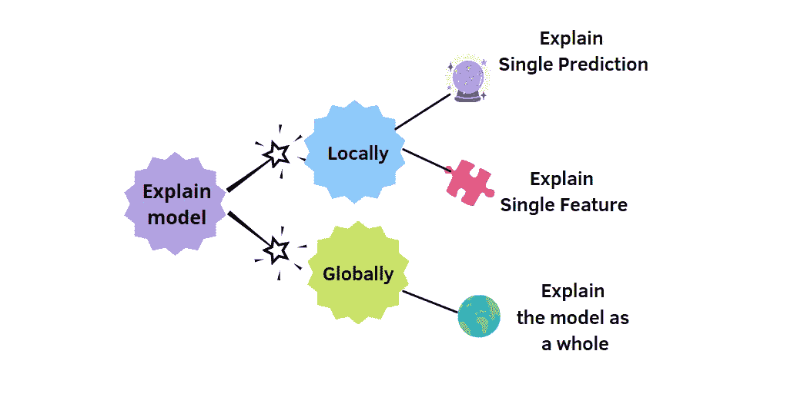**

**如何解释模型？作者插图。**

**为了解释隔离森林，我将使用 SHAP，这是 Lundberg 和 Lee 在 2017 年的论文“[解释模型预测的统一方法](https://arxiv.org/abs/1705.07874)中提出的框架。SHAP 主张沙普利附加解释。它是基于沙普利值，建立在博弈论的概念。其目的是解释每个预测因子对模型输出的贡献。怎么才能算出来？通过比较感兴趣的预测和平均预测，这是可能的。**

**在本文中，我将展示如何理解隔离林在检测数据异常时所采取的决策。使用 SHAP 提供的数据可视化，这是可能的。对于*全局解释*，您将看到汇总图和全局条形图，而对于*局部解释*，两个最常用的图形是力图、瀑布图和分散/相关性图。**

```
**Table of Contents:****1.** [**Shapley value**](#5e2c)**2\.** [**Train Isolation Forest**](#0985)**3\.** [**Compute SHAP values**](#c8e1)**4\.** [**Explain Single Prediction**](#4a47)**5\.** [**Explain Single Feature**](#8633)**6\.** [**Global Interpretability**](#8fbb)**7\.** [**Save SHAP’s objects with Pickle**](#5ffe)**8\.** [**Undersampling the dataset**](#0ad2)
```

# **1.沙普利值**

**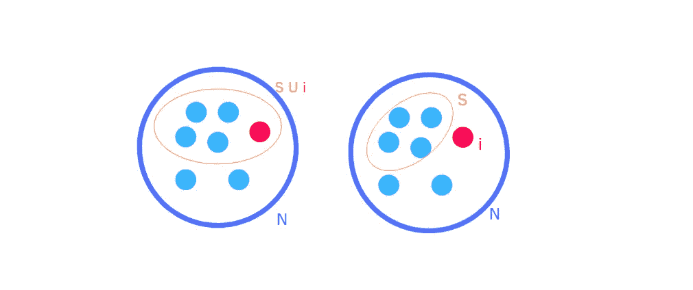**

**沙普利值是由著名数学家和经济学家沙普利在 1953 年创造的。解决的问题如下:**

> ***一群不同技能的参与者为了集体奖励而相互合作。奖励应该如何在小组中公平分配？***

**每个玩家对游戏的贡献都不一样，有些人贡献多，有些人贡献少。n 是玩家总数，S 是玩家子集，I 是特定玩家，v 是游戏。**

****

**在模型的背景下，我们的游戏是模型的结果，而玩家是数据集的特征。然后，*Shapley 值量化每个特征对模型预测的贡献。***

**我们可以将这个等式分成多个部分:**

*   **特征 i 的**边际贡献由下式表示:****

**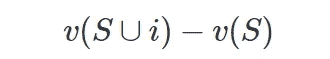**

*   **如果我们取|N|-1 个特征，其中我们把特征 I 排除在外，我们能用它们组成多少个大小为|S|的群？**

**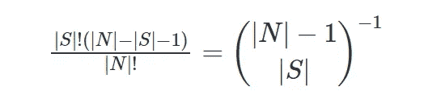**

**该公式允许获得每个子集大小的排列数，如果我们可以的话，不包括特征 I。一旦计算出该数，它将用于划分特征 I 对所有大小|S|的组的边际贡献。**

*   **最终目标是了解特征 I 独立于特征数量|N|的贡献大小。然后我们用|N|除前面所有的项。**

# **2.火车隔离林**

**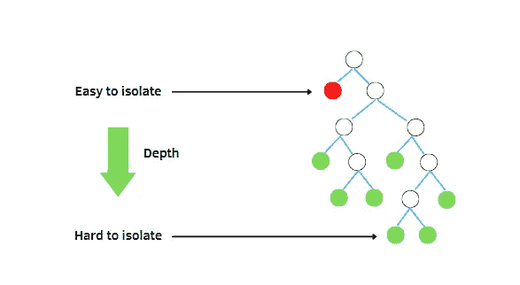**

**隔离树。作者插图。**

**首先，让我们安装 shap 库:**

```
!pip install shap
```

**现在，我们可以导入库和数据集。我们将使用需要安装的 sklearn 库和 shap 库中的波士顿房价数据集。**

**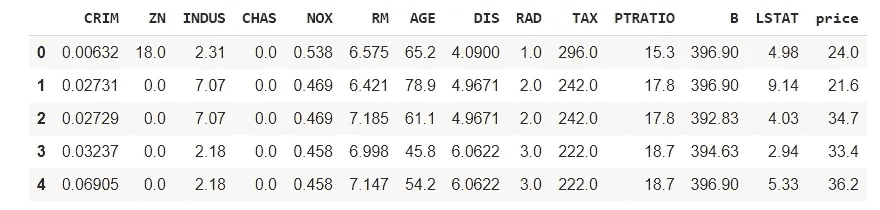**

**它包含波士顿周围的 506 个邻近区域。典型的任务是预测业主自住房屋的中值，但在这种情况下，我们希望训练隔离林将数据集分为正常和异常观察。该数据集中有 13 个要素和目标变量:**

**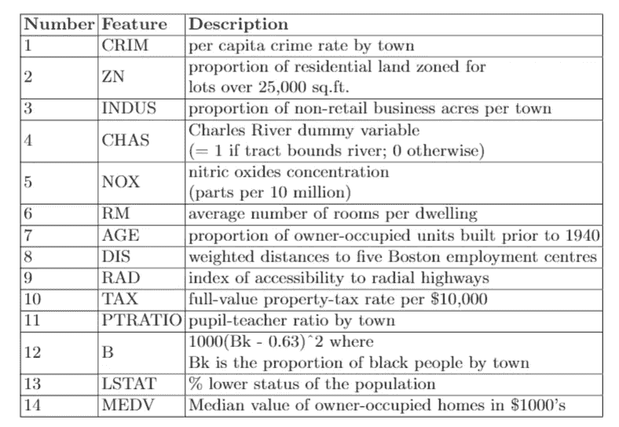**

**数据集最初不是为异常检测任务设计的，但是让我们假设有异常数据条目。例如，在列表中，我们可以在波士顿市中心买到价格非常低的房子，相对于同一地区的建筑来说有点太便宜了。然后，目标是将这些异常情况与正常情况区分开来。**

**对于这个异常检测问题，我们将使用隔离林。使用这种模型有一些优点。首先，它是无监督的，我们不需要目标标签(我们没有)来训练模型。第二，有两个有用的属性被考虑用于检测异常:**

*   **异常在数量上很少，所以它构成了一个少数类**
*   **异常观察的特征在于具有与实例非常不同的特征值。**

**其思想是，隔离过程应该快速隔离小深度的异常值，而正常实例通常在树的底部。对于所有这些属性，波士顿住房数据集中考虑了隔离树。**

**让我们使用 sklearn 库中的 IsolationForest 函数来创建模型。我们将固定随机状态等于 42，以便每次都再现相同的输出。我们的数据集中异常的比例由参数“污染”指定，并且将被自动确定。典型值为 0.1，通常取决于数据集的维度。**

**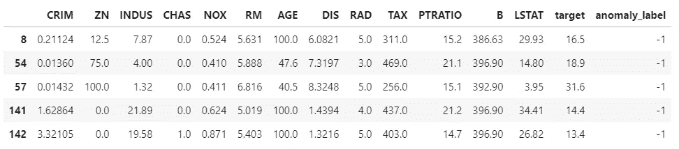**

**为了训练模型，我们将使用所有数据集，因为我们没有异常观察的先验知识。所以，这是一个无人监管的问题。一旦模型经过训练，我们就可以进行预测，并将其保存在一个名为 anomaly_label 的列中。它将-1 分配给异常观察值，1 分配给内部值。**

# **3.计算 SHAP 值**

**SHAP 提供了利用沙普利值的解释的实现。用于基于树的模型的 TreeExplainer，用于神经网络的 DeepExplainer 和 GradientExplainer。最后，KernelExplainer 和 Explainer 适用于任何类型的模型。**

**即使它是基于树的模型，TreeExplainer 也不能很好地与隔离林一起工作。所以，我将应用**解释器**函数。**

**现在，我将展示神奇的代码行，让您发现模型输出的秘密。**

**瞧。首先，我们定义了 explainer 对象，使用函数 Explainer 通过预测方法执行隔离森林。一旦创建了这个对象，就可以获得 Shapley 值[2]。在开始显示 SHAP 的图之前，您需要加载 Javascript 库:**

# **4.解释单一预测**

**我们可以从解释我们模型的单个预测开始。观察每个特征在模型结果中的贡献的一个清晰方法是显示**力图**。我将展示第 142 项的结果，之前被算法归类为异常。**

**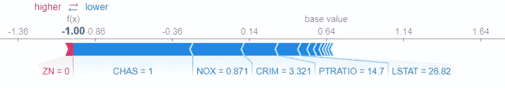**

**这个情节有三个重要方面:**

*   ****预测的** **值 f(x)** 是-1，意味着我们出现了异常。在正常情况下，输出值应该等于 1。**
*   ****基值**，即目标变量在数据集所有行中的平均值，为 0.64。您可以看到特征值如何增加或减少预测。双箭头表示每个特性相对于基线 0.64 的影响[3]。**
*   **红色的特征显示了它们如何有助于增加预测值[4]。蓝色表示特征如何有助于降低预测。在这种情况下，蓝色的特征是发现异常项目的决定因素，而变量 ZN 的贡献不足以将该观察分类为正常。每个箭头的长度表示该特征对预测的影响。**

**图中显示了第 142 行的特征值，如您在数据框中选择的观察值所示:**

**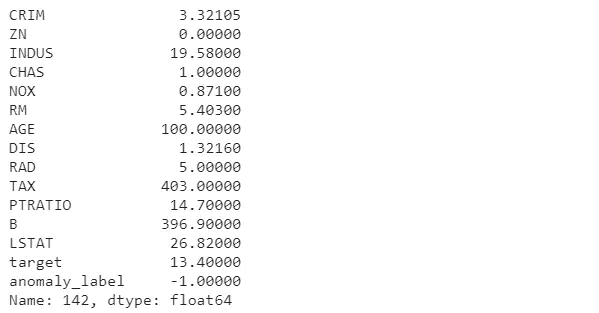**

**现在，我们可以看到一个被归类为正常的观察的例子:**

**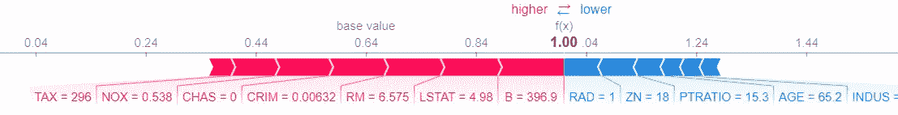**

**在这个例子中，有许多红色的特征增加了结果，然后该项目被认为是正常的。**

**一个更容易理解的图表是**瀑布图**。我们不是将所有的变量放在一行中，而是将每个特性放在一行中。最重要的特征以降序列出，基于该观测中每个特征的绝对 Shapley 值。**

**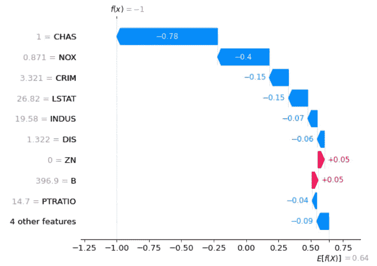**

**与力图不同的是，瀑布图提供了一个更优雅的图表来直观地显示预测的输出是如何获得的，给出了每个特性的贡献。更明显的是，每个变量的正(红色标记)和负(蓝色标记)贡献如何将底部的基础值移动到顶部的模型输出。**

# **5.解释单一特征**

**在前面的内容中，您看到了最相关的特征在观测预测中的作用。但是检查单个特征可能会更好，以便更好地理解它们对结果的影响。使用**散点图**可以做到这一点。也叫依赖情节。**

**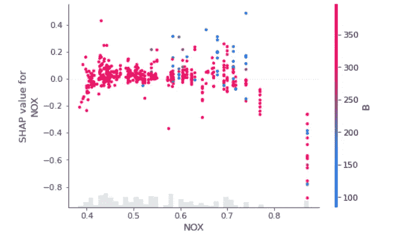**

**你可以看到当一氧化氮浓度增加时，预测是如何变化的。较高的 NOX 值意味着出现异常项目的风险较高。**

# **6.全局可解释性**

**最后，我们可以从整个数据集的角度对预测的特征重要性进行概述。事实上，这个图表叫做**概要图**:**

**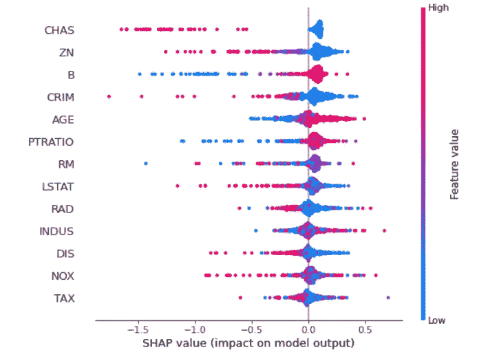**

**需要注意一些相关特征:**

*   **基于数据中每个特征的绝对 Shapley 值的总和**对特征进行排序。然后，顶部特征对模型输出的贡献更大，因为它们具有最大的绝对值。****
*   **不同的颜色表示数据集中要素的值。例如，如果您查看一氧化氮(NOX)的浓度，很明显，该特性的高值意味着我们有一个异常项目，而较低的值则意味着一个正常项目。**

**我们还可以显示一个条形图，称为**全局特征重要性图**，其中的特征按照全局重要性递减排序。每个要素的全局重要性计算为该要素在数据集的所有给定行中的平均绝对值。我们指定 max_display 来显示数据集的所有特征。**

**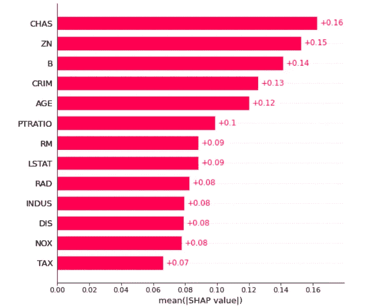**

**最重要的变量是 CHAS、ZN、B、CRIM 和年龄。然后，它们在预测中扮演相关的角色。**

# **7.用泡菜保存沙普利值**

**即使 SHAP 提供了一种解释你的模型的方法，实际上它也是计算密集型和耗时的。为了避免每次都计算 explainer 和 Shapley 值，最好将它们保存到两个不同的文件中。做这件事的一个工具是 [pickle](https://docs.python.org/2/library/pickle.html) ，这是一个序列化/反序列化 Python 对象结构的强大算法。**

**因此，pickle 模块提供了保存和加载许多 Python 对象的方法，包括 Explainer 和 Shapley 值。**

# **8.数据集采样不足**

**由于数据集不平衡，SHAP 运行非常慢，并且目标是检测异常，一个更快的解决方案是对数据集进行欠采样。SHAP 允许对数据集进行采样，但是在我们的例子中，我们只想对正常的观测值进行欠采样，同时保留所有的异常值。我在 sample 和 shuffle 函数中都包含了随机种子，以便在运行代码时每次都能获得相同的结果。我还重置了索引，以记忆之前显示的异常数据点的索引。**

**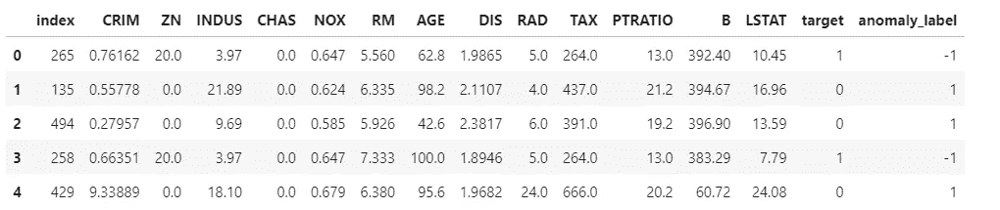**

**我们可以再次计算 SHAP 值，但这次使用的数据较少:**

**让我们再来看看概要情节:**

**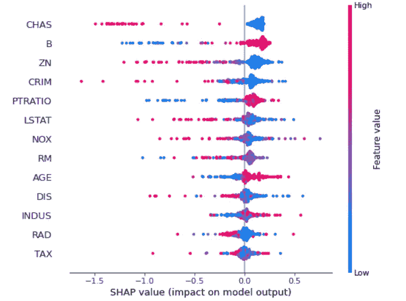**

**欠采样汇总图**

**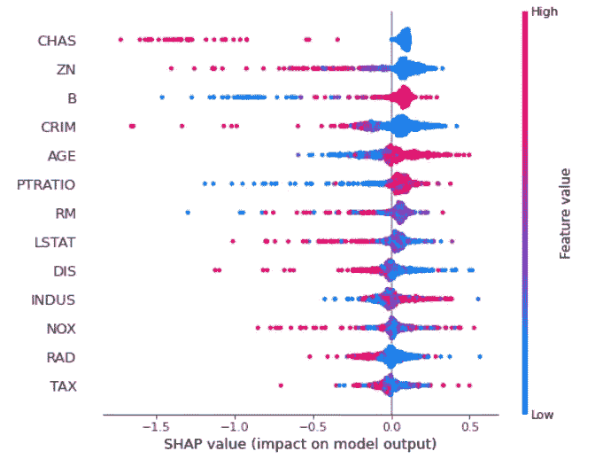**

**包含所有数据集的汇总图**

**差别很小，你不觉得吗？让我们试着再次解释以前观察到的同样的反常现象。我们可以通过使用索引列进行过滤来找到观察结果，我们直接显示瀑布图，因为它比力图更具可读性:**

**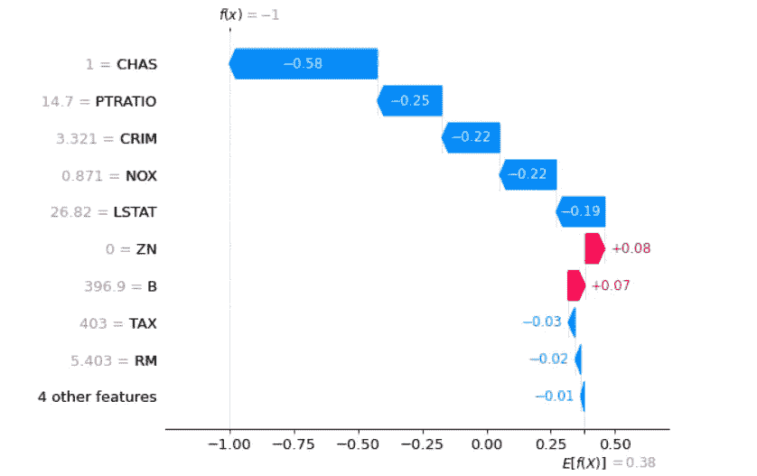**

**欠采样的局部可解释性**

****

**所有数据集的本地可解释性**

**通过所有数据集获得的局部可解释性与通过欠采样获得的局部可解释性之间存在更多差异。数据集 E[f(X)]的所有行的目标变量的平均值是所有数据达到的平均值的一半，因为我们删除了 60%的正常项。这些特征的影响会减小或增大。特征 CHAS 仍然是最重要的，而其他变量根据重要性改变顺序。NOX 以一半的重量从第二名升至第四名，而 PRATIO 变得更加重要。我们可以说每个特征的贡献值发生了变化，但同时权重为负或正的特征保持不变。**

# **最终想法:**

**恭喜你！你已经解释了隔离林的结果。有趣的见解，你不觉得吗？您已经看到了解释您的模型是如何帮助理解您真正在做什么，以及对模型的结果贡献最大的特性是什么。一个没有任何解释可能性的有效模型是不够的。你需要更多关于你的模型的信息。**

**我希望这篇教程能帮助你对 SHAP 有一个大致的了解。它可以应用于任何机器学习和深度学习模型。每种类型的模型都有不同的解释器，所以在第 3 步要小心。你可以在 [Github](https://github.com/eugeniaring/Medium-Articles/blob/main/Anomaly%20Detection/iforestwithshap.ipynb) 上找到代码。**

**我还应该指出，这种方法的唯一缺点是计算量很大。如果您有一个非常大的数据集，一个解决方案可能是只使用样本计算 Shapley，而不是整个数据集，如我所示。这不是一个完美的方法，但它比等待太多时间来执行代码要好。**

**感谢阅读。祝你有愉快的一天。**

****参考文献:****

**[1]https://arxiv.org/pdf/1705.07874.pdf**

**[2][https://towards data science . com/explain-any-models-with-the-shap-values-use-the-kernel explainer-79de 9464897 a](https://towardsdatascience.com/explain-any-models-with-the-shap-values-use-the-kernelexplainer-79de9464897a)**

**[3][https://towards data science . com/shap-how-to-interpret-machine-learning-models-with-python-2323 F5 a F4 be 9](https://towardsdatascience.com/shap-how-to-interpret-machine-learning-models-with-python-2323f5af4be9)**

**[4][https://towards data science . com/introducing-shap-decision-plots-52 ed 3 B4 a1 CBA](https://towardsdatascience.com/introducing-shap-decision-plots-52ed3b4a1cba)**

**你喜欢我的文章吗？ [*成为会员*](https://eugenia-anello.medium.com/membership) *每天无限获取数据科学新帖！这是一种间接的支持我的方式，不会给你带来任何额外的费用。如果您已经是会员，* [*订阅*](https://eugenia-anello.medium.com/subscribe) *每当我发布新的数据科学和 python 指南时，您都会收到电子邮件！***