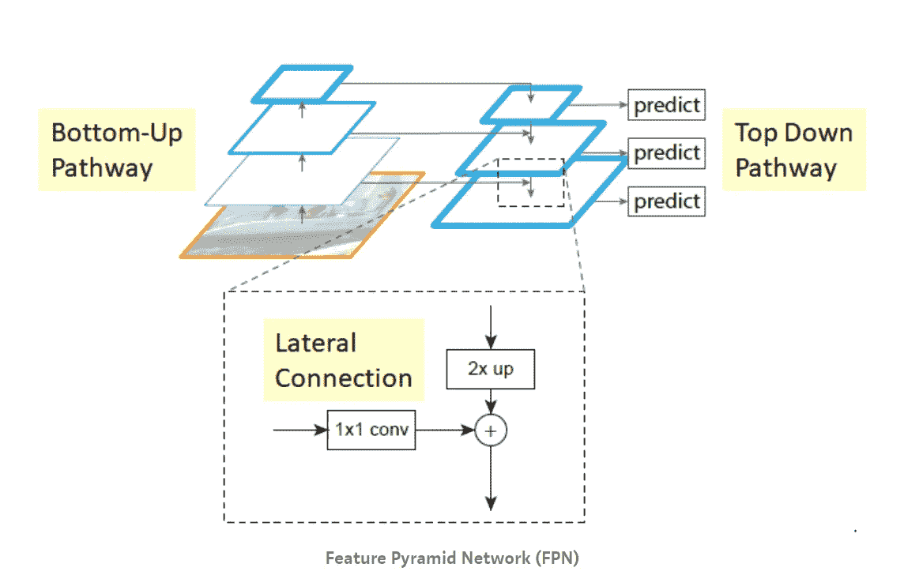
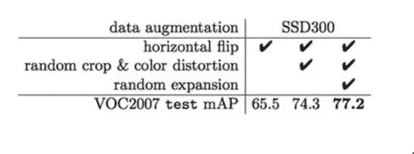
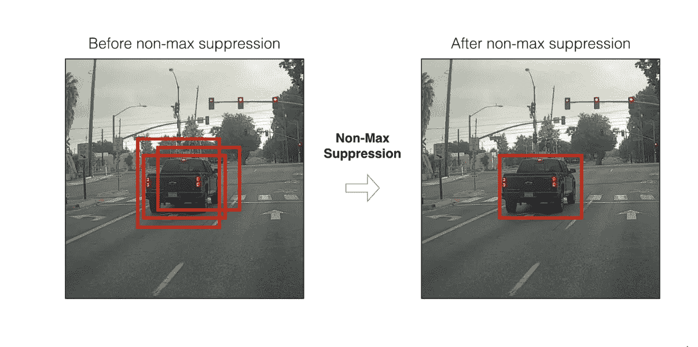
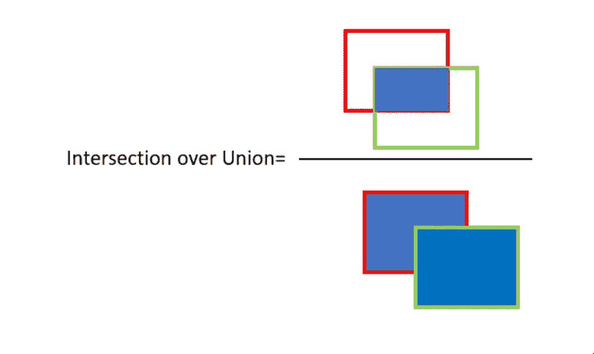
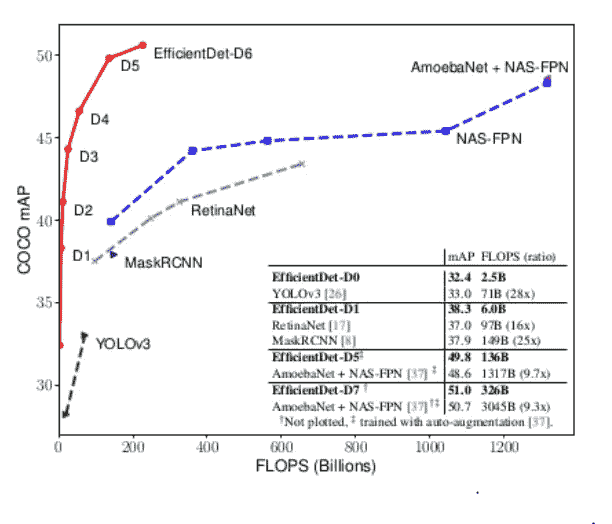

# 面试问题:物体检测

> 原文：<https://pub.towardsai.net/interview-questions-object-detection-9430d7dee763?source=collection_archive---------0----------------------->

在 [Unsplash](https://unsplash.com/s/photos/confused?utm_source=unsplash&utm_medium=referral&utm_content=creditCopyText) 上[pisuikan](https://unsplash.com/@pisauikan?utm_source=unsplash&utm_medium=referral&utm_content=creditCopyText)拍摄的照片

我目前正在找一份计算机视觉工程师的工作。在这篇文章中，我试图分享我所学到的东西。我要感谢[乔纳森](https://medium.com/@jonathan_hui)带来了这个令人敬畏的[物体探测系列](https://medium.com/@jonathan_hui/object-detection-series-24d03a12f904)。

**“这是我个人参考。如果您发现任何错误，请评论我将纠正它们。”**

📌***YOLO 的损失函数是什么？【***[***src***](https://medium.com/@jonathan_hui/real-time-object-detection-with-yolo-yolov2-28b1b93e2088)***】***

💡YOLO 使用预测和地面实况之间的误差平方和来计算损失。损失函数包括:

*   **分类损失**。
*   **定位损失**(预测边界框与地面真实值之间的误差)。
*   **信心丧失**(箱子的对象性)。

> 损失函数=分类损失+定位损失+置信度损失

📌 ***两阶段法的优势是什么？【***[***src***](https://towardsdatascience.com/retinanet-how-focal-loss-fixes-single-shot-detection-cb320e3bb0de)***】***

💡在像 R-CNN 这样的两阶段方法中，他们首先预测*几个*候选物体位置，然后使用卷积神经网络将这些候选物体位置中的每一个分类为类别之一或背景。

📌 ***单镜头方法面临的主要问题是什么？[***[***src***](https://towardsdatascience.com/retinanet-how-focal-loss-fixes-single-shot-detection-cb320e3bb0de)***][***[***src***](https://medium.com/@jonathan_hui/what-do-we-learn-from-single-shot-object-detectors-ssd-yolo-fpn-focal-loss-3888677c5f4d)***]***

💡像 SSD 这样的单次拍摄方法会受到类*不平衡的严重影响。* SSD 在训练期间重新采样对象类别和背景类别的比率，因此它不会被图像背景淹没。

📌 ***视网膜局灶性丢失是什么？【***[***src***](https://medium.com/@jonathan_hui/what-do-we-learn-from-single-shot-object-detectors-ssd-yolo-fpn-focal-loss-3888677c5f4d)***】***

💡焦点丢失有助于处理阶级不平衡。焦点损失(FL)采用一种方法来减少训练有素的班级的损失。所以只要模型擅长检测背景，就会减少其损失，重新强调对对象类的训练。

📌***SSD 中的损失函数是什么？【***[***src***](https://towardsdatascience.com/understanding-ssd-multibox-real-time-object-detection-in-deep-learning-495ef744fab)***】***

💡SSD 的损失函数是两个关键组件的组合:

*   **置信度损失**:测量网络对计算边界框的*对象*的置信度。分类[交叉熵](https://rdipietro.github.io/friendly-intro-to-cross-entropy-loss/#cross-entropy)用于计算这种损失。
*   **位置损失:**这衡量*距离*网络的预测边界框与训练集中的地面真实边界框有多远。[此处使用 L2 规范](https://rorasa.wordpress.com/2012/05/13/l0-norm-l1-norm-l2-norm-l-infinity-norm/)。

***SSD _ loss = confidence _ loss+alpha * location _ loss***

*α*项帮助我们平衡位置损失的贡献。

📌 ***什么是 FPN？【***[***src***](https://medium.com/@jonathan_hui/what-do-we-learn-from-single-shot-object-detectors-ssd-yolo-fpn-focal-loss-3888677c5f4d)***】***

💡特征金字塔网络( **FPN** )是一个用特征金字塔概念设计的特征提取器，用来提高精度和速度。图像首先通过 CNN 路径，产生语义丰富的最终层。然后，为了重新获得更好的分辨率，它通过对该特征图进行上采样来创建自上而下的路径。虽然自上而下的路径有助于检测不同大小的对象，但空间位置可能会有偏差。在原始特征图和相应的重建层之间添加横向连接，以改善对象定位。它目前提供了一种在多个尺度上检测物体的领先方法，YOLOv3，更快的 R-CNN 就是用这种技术建立起来的。

📌 ***我们为什么要使用数据增强？【***[***src***](https://github.com/andrewekhalel/MLQuestions)***】***

💡数据扩充是一种通过修改现有数据来合成新数据的技术，其方式是不改变目标或以已知方式改变目标。数据扩充对于提高准确性非常重要。增强数据技术，如翻转、裁剪、添加噪声和颜色失真。

数据增强有助于提高 SSD300 的性能:

[来源](http://www.cs.unc.edu/~wliu/papers/ssd_eccv2016_slide.pdf)

📌***SDD 比更快的 R-CNN 有什么优势？【***[***src***](https://medium.com/@jonathan_hui/ssd-object-detection-single-shot-multibox-detector-for-real-time-processing-9bd8deac0e06)

*💡SSD 通过消除在更快的 R-CNN 中使用的区域提议网络(RPN)的需要来加速该过程。*

*📌 ***物体检测用的度量是什么？【***[***src***](https://medium.com/@jonathan_hui/map-mean-average-precision-for-object-detection-45c121a31173)*

**💡mAP (mean Average precision)是测量物体检测器精度的常用度量。平均精度计算 0 到 1 之间的召回值的平均精度值。**

**📌**什么是 NMS？【**[***src***](https://medium.com/@jonathan_hui/real-time-object-detection-with-yolo-yolov2-28b1b93e2088)***】*****

**💡非最大值抑制(NMS)是许多计算机视觉对象检测算法中使用的技术。为单个类从许多重叠的包围盒中选择一个包围盒是一类算法。**

**NMS 实施:**

1.  **按降序对预测可信度分数进行排序。**
2.  **从最高分数开始，如果我们发现任何先前的预测与当前预测具有相同的类别和 IoU >阈值(通常我们使用 0.5)，则忽略任何当前预测。**
3.  **重复上述步骤，直到检查完所有预测。**

****

**📌 ***什么是欠条？【***[***src***](https://medium.com/@jonathan_hui/ssd-object-detection-single-shot-multibox-detector-for-real-time-processing-9bd8deac0e06)***】*****

**💡NMS 使用了并集交集(IoU)的概念。IoU 计算两个边界框(地面真实的边界框和预测的边界框)的并集上的交集。**

********

**📌 ***什么时候你说一个物体检测方法是高效的？*****

**💡检测的性能效率用每秒浮点运算次数(FLOPS)来衡量。**

****

**在上图中，你可以看到 EfficientDet 和 YOLOv3 的 FLOPS 更少，所以我们可以说它们是高效的。**

**📌自定义对象检测中的一些实践问题**

**💡试用 Monk 对象检测库**

** [## 镶嵌成像/Monk_Object_Detection

### 低代码、易于安装的对象检测管道的一站式存储库。…

github.com](https://github.com/Tessellate-Imaging/Monk_Object_Detection/tree/master/application_model_zoo)** 

**我对计算机视觉和深度学习充满热情。我是 [Monk](https://github.com/Tessellate-Imaging/Monk_Object_Detection) 库的开源贡献者。如果你喜欢蒙克，给我们 GitHub 回购⭐️。**

**你也可以在以下网址看到我的其他作品:**

** [## 阿库拉·赫曼思·库马尔培养基

### 阅读阿库拉·赫曼思·库马尔在媒介上的作品。💟计算机视觉| Linkedin…

medium.com](https://medium.com/@akulahemanth)**