# 进入逻辑回归

> 原文：<https://pub.towardsai.net/into-the-logistic-regression-75847b0e6f1e?source=collection_archive---------0----------------------->

## [数据科学](https://towardsai.net/p/category/data-science)，[机器学习](https://towardsai.net/p/category/machine-learning)

## 打破逻辑回归的概念和多类分类的一对一和一对一方法

之前我已经深入写过线性回归的封闭形式(方程)和梯度下降。你可以从下面的网址阅读它们。

 [## 用 Python 解释封闭形式和梯度下降回归

### 回归问题简化和实施的封闭形式的方程和梯度下降从零开始和…

pub.towardsai.net](/closed-form-and-gradient-descent-regression-explained-with-python-1627c9eeb60e) 

在本文中，我将重点介绍逻辑回归算法，分解概念，像机器一样思考，并了解使用逻辑回归的多类分类器背后的概念。

# 线性回归再探…

在开始逻辑回归之前，让我们快速回顾一下线性回归。

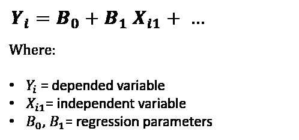

线性回归方程

线性回归模型适用于因变量连续且分类失败的回归问题，因为它将类视为数字(0 和 1)并拟合使点和超平面之间的距离最小化的最佳超平面，因此减少了误差(为简单起见，您可以将超平面视为模型方程)。

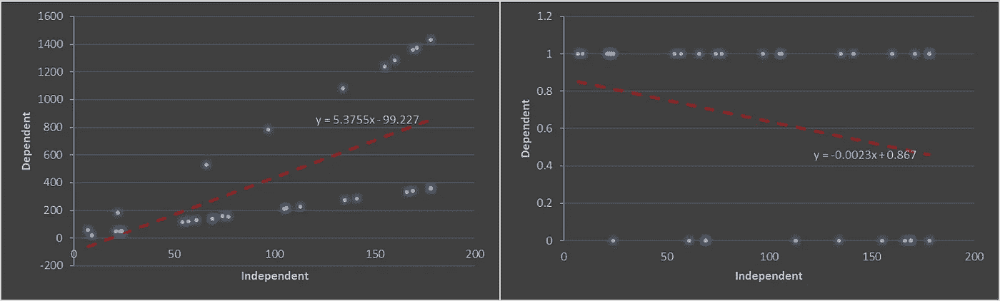

不同问题中的线性回归(a)左图是用回归(b)右图是用分类问题

可以看出，线性回归的预测可以走 **(-∞，∞)** 。此外，它没有给出概率作为输出。

这就是对数概率的来源。

# 但是什么是赔率和对数赔率…

如前所述，线性回归无法计算概率。然而，如果我们观察概率，通过计算**比值比**的对数，它可以很容易地从对数比值转换而来。概率、优势比和对数优势都是相同的，但表达方式不同。

**概率**是事件发生的可能性(即学生通过数学考试的几率为 60%)。

**赔率**，或成功的赔率或赔率比，是一种暴露和结果之间关联的度量，或者简单地说，是成功的概率与失败的概率之比(从上面的例子来看，那就是 0.6/0.4 = 1.5)。

**对数赔率**是赔率的对数(ln(1.5) ≅ 0.405)。

*备注:在正常计算中，可以使用任意底数的对数，但需要一致。*

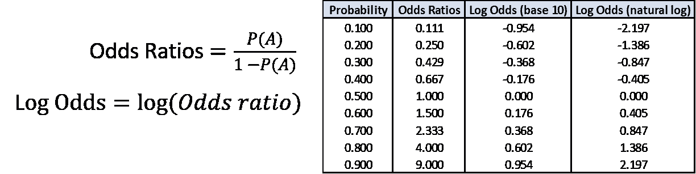

概率到比值比和对数比值比的方程和转换

我们可以想象出概率的比值比和比值比的对数比值比。观察比值比可以在[0，∞]之间变化，而对数比值可以在(-∞，∞)之间变化。

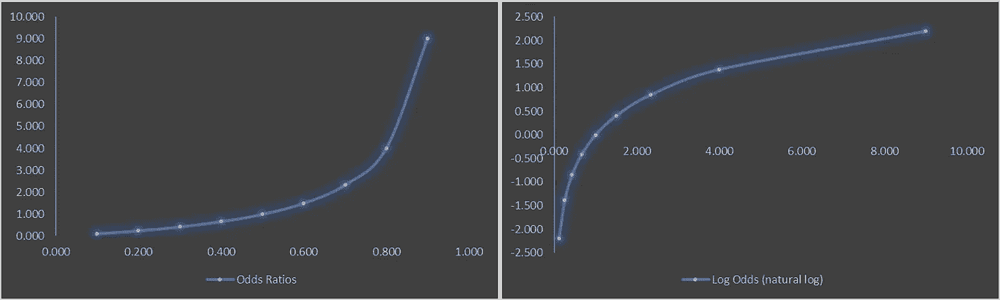

(a)赔率对概率和(b)对数赔率对赔率的可视化

现在让我们快速看一下如何解读比值比；

*   OR = 1，暴露不影响结果的几率
*   或> 1，暴露与更高的结果几率相关
*   或者< 1, exposure associated with lower odds of the outcome

Using the above example, the odds of students passed math exams are 1.5 times as large as the odds of students failed math exams. **记住这并不等同于 1.5 倍的可能性！**

# 回到逻辑回归

我假设我们都知道逻辑回归的定义，逻辑回归模型(或 *logit* 模型)是对某一类或某一事件(即学生通过考试，客户流失)的概率进行建模的统计方法。在这个模型中，我们假设自变量和因变量的对数优势之间有一个**线性关系**，它可以表示为下面的等式。

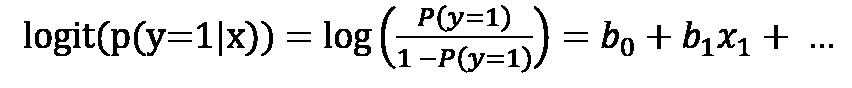

逻辑斯蒂方程

将对数优势转换为概率的函数是逻辑函数，对数优势标度的测量单位称为 **logit** ，它来自 **log** istic un **it** (因此得名)。

所以从上面的等式，最终，我们尝试预测等式的左边路径(不是右边)，因为 ***p(y=1|x)*** 是我们想要的。所以我们可以取这个 logit 函数的逆，那么我们会得到类似于我们的东西。

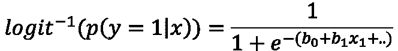

逆 logit 函数

上面的等式是常见的 sigmoid 函数，逻辑 sigmoid，它从输入 ***b0 + b1x1 + …*** 中返回 ***p(y=1|x)*** 的类概率

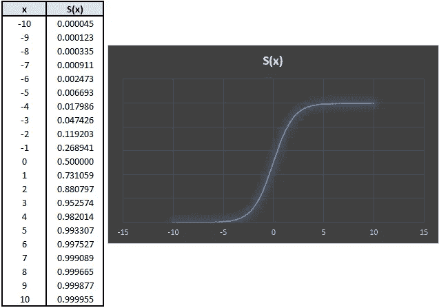

逻辑曲线

正如 y 轴中暗示的逻辑曲线，这种映射是概率(0，1)。最终，我们使用赔率的对数的原因是它可以取任何正值或负值(如前所述)。因此，逻辑回归是对数优势的线性模型。

请注意，在逻辑方程式中，选择参数是为了最大化观察样本值的可能性(或 MLE—**M**axi mize**L**ikelihood**E**估计)，而不是最小化误差平方和(或 LSE—**L**east**S**quare**E**估计)。

## 回顾:线性回归和逻辑回归之间的比较

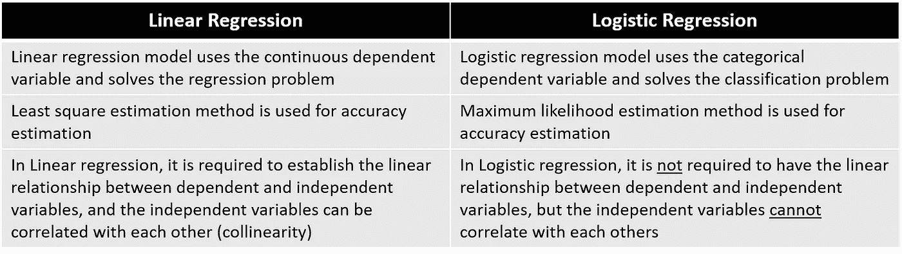

线性回归和逻辑回归的主要区别

# 如果我们有两个以上的类要预测…

我到目前为止所讨论的只是针对二元逻辑回归(因变量只包含两类——是或否，0 或 1)。在本节中，我们将经历**多项式**逻辑回归，或者我们可以称之为多类逻辑回归。

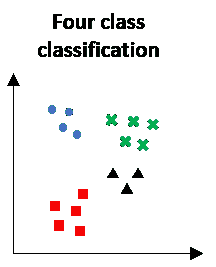

4 类分类的可视化

为了打破这一点，我们已经有了一个二元分类模型(逻辑回归)，最终，我们可以将多类数据集分割成多个二元分类数据集，并使模型适合每个数据集。

## 那么它是如何工作的呢…

良好的..你有没有遇到过需要猜一猜的情况(让我们在考试中想象一下——选择题考试)。你读问题，比较选择，去掉没意义的，比较剩下的选择，挑一个。

实际上，这可以应用于二元分类模型如何针对多类问题工作。因此，这取决于您如何进行比较，假设我们有四个类别:A、B、C 和 D。您可以选择通过 A 与[B、C、D]进行比较，或者将 A 与每个单独的类别进行比较(即 A 与 B、A 与 C)。这两种比较实际上是有名称的，它们是一对一策略。

# 一对多策略

One-vs-All，OvA(或 One-vs-Rest，OvR)是使用二元分类算法进行多类分类的策略之一。

在这种方法中，我们将把一个类作为正面类，而其他类被假定为负面类(考虑将一个类与其他类进行比较)。

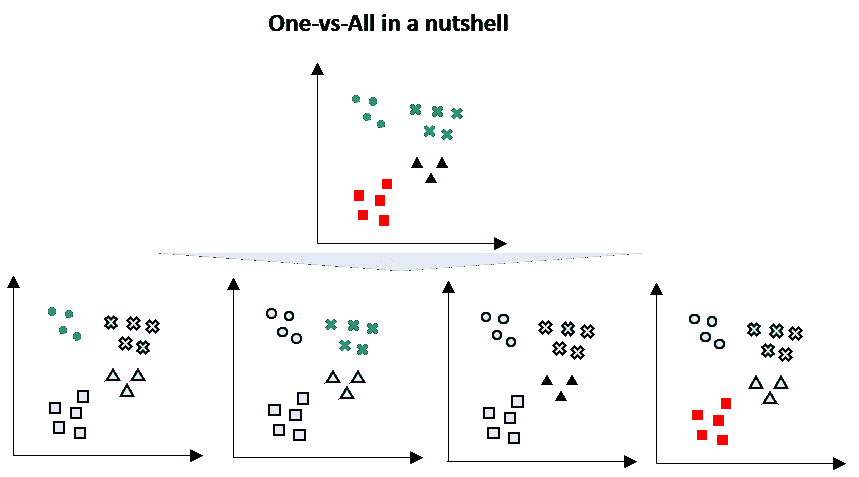

一对一战略的可视化

例如，给定一个具有四个类的多类问题(按照上面的可视化)，那么我们可以将这些分成四个二进制分类数据集；

*   **1:** 蓝色 vs【绿色、黑色、红色】
*   **2:** 绿色 vs【蓝色、黑色、红色】
*   **3:** 黑色 vs【蓝色、绿色、红色】
*   **4:** 红色 vs【蓝色、绿色、黑色】

这种策略要求每个模型预测一个类似概率的分数。这些分数的 argmax 随后被用于预测类别。这种策略通常用于以下算法:

1.  逻辑回归
2.  感觉
3.  以 ***softmax 函数*** 为输出层的深度神经网络

因此，当使用这些算法解决多类问题时，scikit-learn 库默认实现 OvA / OvR。

当处理非常大的数据集时，这种方法可能会有一些缺点。

# 一对一策略

与一对一策略类似，一对一策略是一种通过将数据集拆分为二元分类数据集来对多类问题进行二元分类的方法。与一对一策略不同，一对一策略将数据集分成两个特定的类，下面举例说明。

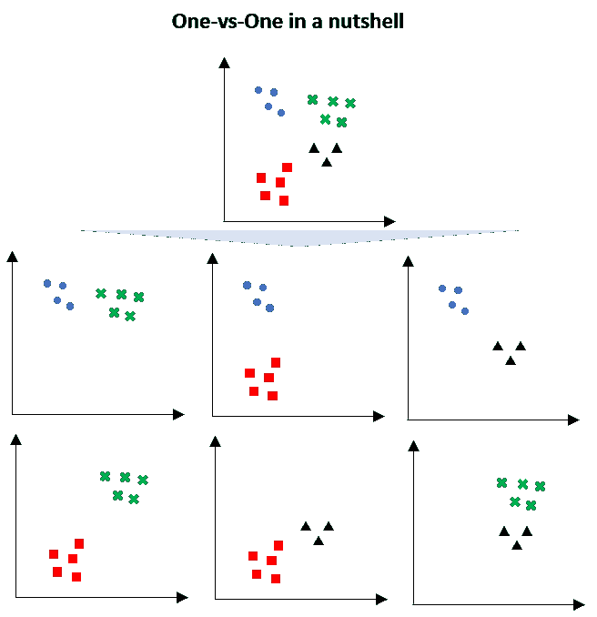

一对一策略的可视化

由于这种分裂，二进制分类模型比一对一的策略更多；

1.  蓝色 vs 绿色
2.  蓝色对红色
3.  蓝色 vs 黑色
4.  红色 vs 绿色
5.  红色 vs 黑色
6.  绿色 vs 黑色

生成的模型数量=*(n _ classes *(n _ classes-1))/2*

一旦生成了所有模型，该点将被测试到所有模型，并记录一个类相对于其他类优先多少次。得票最多的班级获胜。

通常，这种策略被建议用于支持向量机和相关的基于核的算法，因为核方法的性能不与训练数据集的大小成比例，并且仅使用训练数据的子集可以抵消这种影响。

# 那么哪种策略更好呢？

如上所述，一个对所有的策略在处理大型数据集时可能具有挑战性，因为我们仍然会多次使用所有的数据。然而，一对一策略将整个数据集分割成每对类的二进制分类(参见上面的 OvA 和 OvO 的可视化)。

一对一策略训练的分类器数量较少，因此速度更快。但是，一对一策略不太容易在数据集中造成不平衡。

# 结论

在这篇文章中，我有一个演练；

*   复习线性回归；
*   对数优势的基本概念及其使用原因；
*   深入探究逻辑回归的概念；
*   多类分类器的一对一和一对一策略。

希望你获得更多的知识和逻辑回归的背景知识来扩展你的思想并在此基础上构建(而不是仅仅导入逻辑回归库/包并使用它)。

# 参考和外部链接

 [## 4.2 逻辑回归|可解释的机器学习

### 逻辑回归对具有两种可能结果的分类问题的概率进行建模。这是一个扩展…

christophm.github.io](https://christophm.github.io/interpretable-ml-book/logistic.html)  [## 逻辑回归-维基百科

### 在统计学中，逻辑模型(或 logit 模型)用于模拟某一类或某一事件的概率…

en.wikipedia.org](https://en.wikipedia.org/wiki/Logistic_regression)  [## sk learn . multi class . onevsrestclassifier-sci kit-learn 0 . 24 . 1 文档

### 也称为一对一，这种策略包括为每个类安装一个分类器。对于每个分类器，类是…

scikit-learn.org](https://scikit-learn.org/stable/modules/generated/sklearn.multiclass.OneVsRestClassifier.html)  [## sk learn . multi class . onevsoneclassifier-sci kit-learn 0 . 24 . 1 文档

### 该策略包括为每个类对安装一个分类器。在预测时间，收到最多的班级…

scikit-learn.org](https://scikit-learn.org/stable/modules/generated/sklearn.multiclass.OneVsOneClassifier.html)