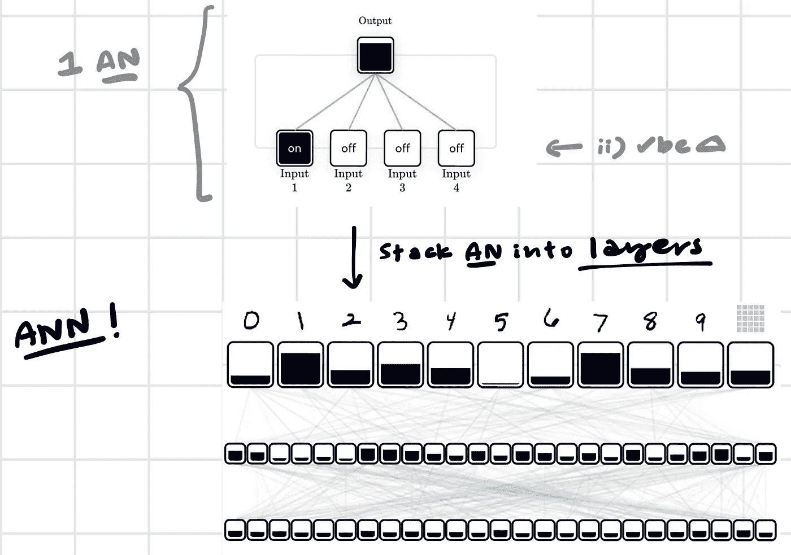
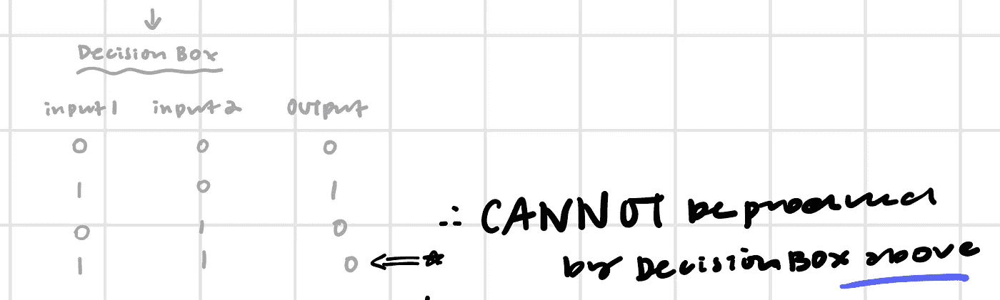
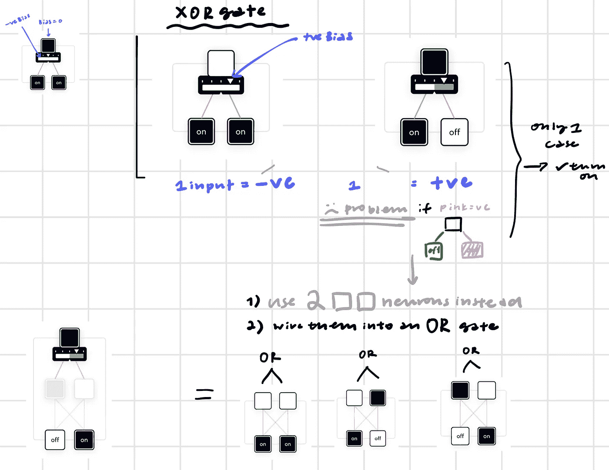

# 神经网络介绍(Brilliant.org)

> 原文：<https://pub.towardsai.net/intro-to-neural-network-brilliant-org-fcf47687918f?source=collection_archive---------4----------------------->

## [机器学习](https://towardsai.net/p/category/machine-learning)

这些是我在 Brilliant.org 大学学习这门课程时做的笔记。:)由于高级会员可能无法普及，他们在用简单的术语解释这个概念方面做得非常出色，我决定分享一些见解😊

**注:**所有积分归 Brilliant.org 所有！

## 一.导言

**A .为什么选择人工神经网络(ann)？**

因为有些问题可以通过编程来解决。

例如视觉问题:物体识别[简单物体分类]

→主要区别:拐角数量不同

**B .什么是安？**

人工神经网络是由人工神经元组成的。

的特点:

I)从输入到输出机械地遵循规则

ii)通过反馈强化学习:

1.安被灌输了信息→做出最好的猜测

2.如果正确→什么也没发生 VS

如果错误→调整内部配置以改变计算

## 二。神经元

*   **类型:1。二进制神经元，2。乙状结肠，3。身份**
*   充当:1)分类器→ 2)预测器

可以调整:1) *偏差*(阈值)，2) *权重*(影响)

1.  二元神经元(~决策框)

**a)** 通过改变*偏置*执行“与”、“或”

例如具有两个输入(I1，I2)

如果 I1 + I2 ≥ *偏置* →“开”

**b)** 可通过引入-ve 输入执行“异或”→运算

