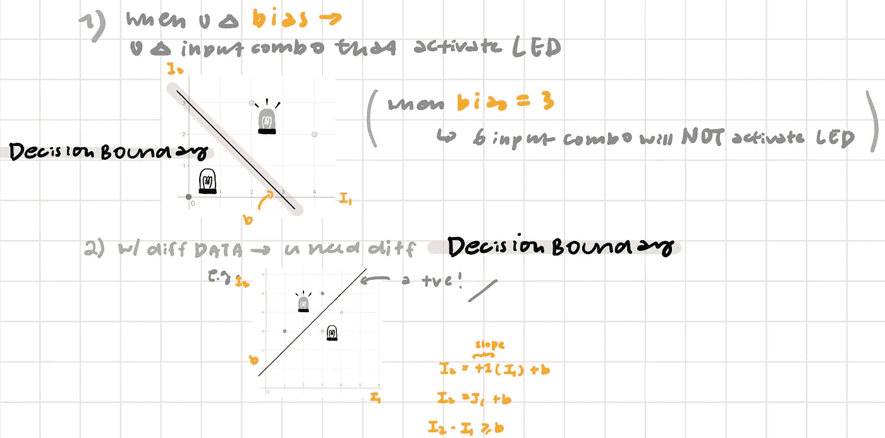
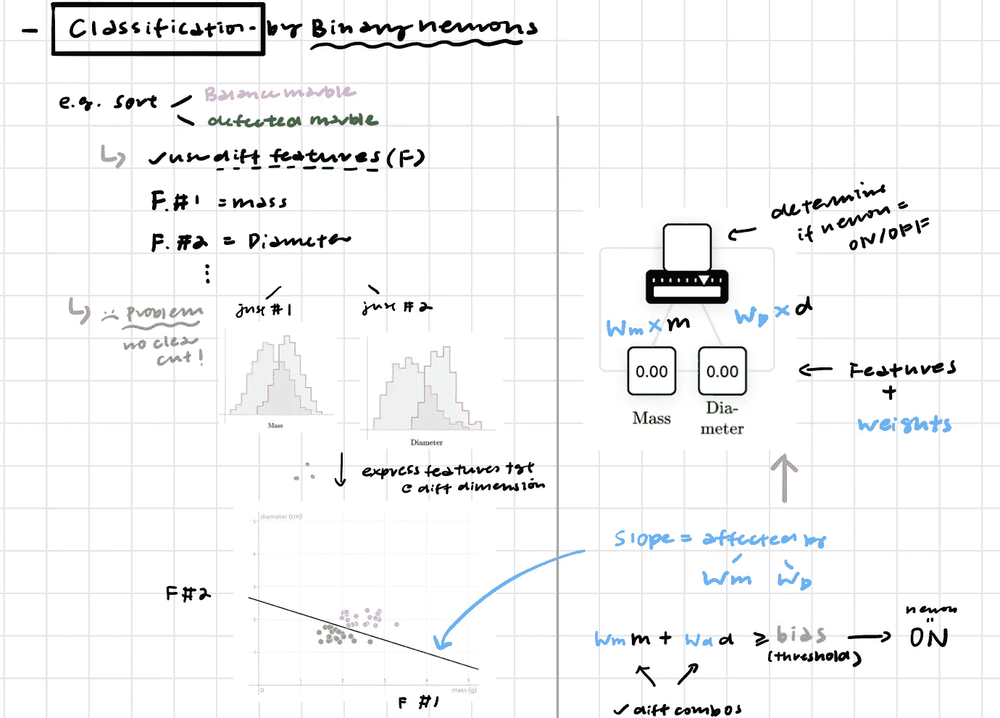
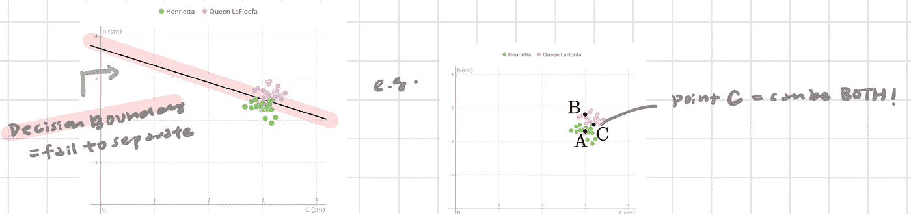
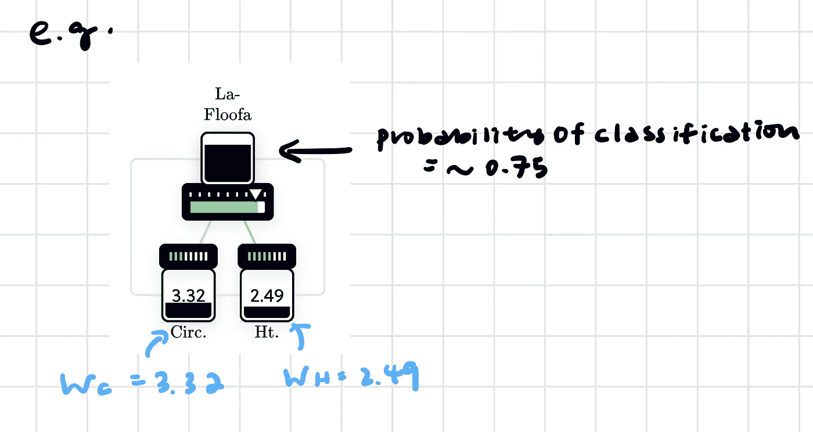
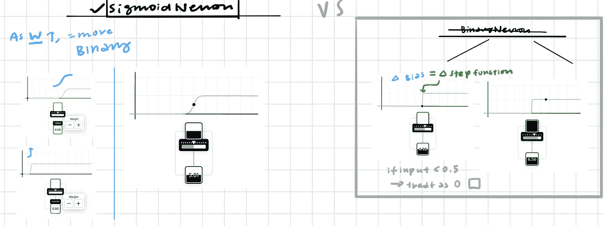
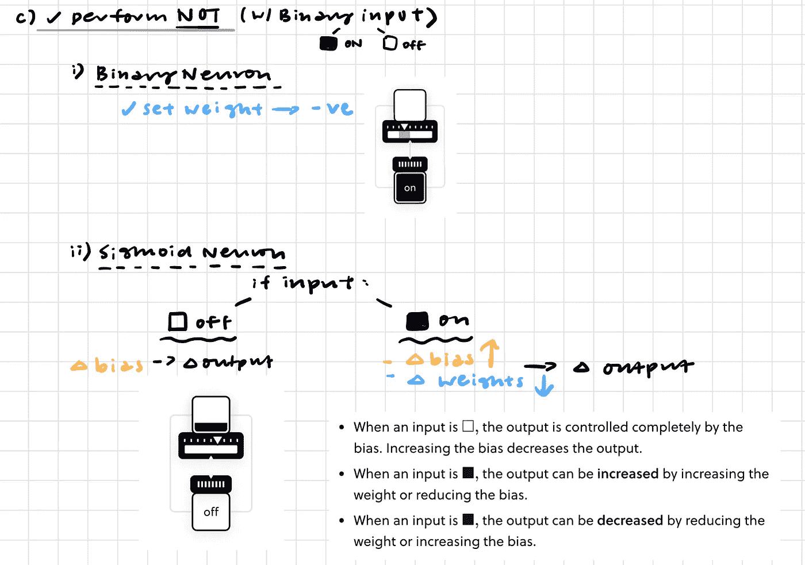
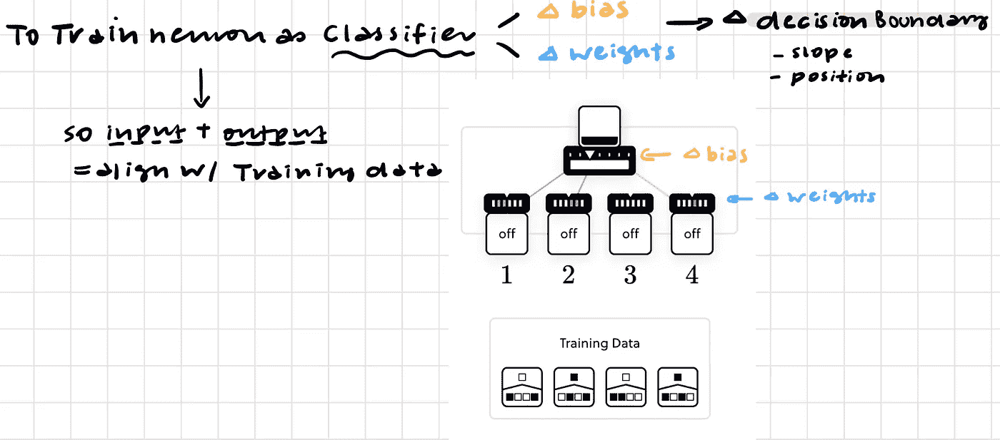

# 神经网络导论第二部分——Brilliant.org

> 原文：<https://pub.towardsai.net/intro-to-neural-networks-part-ii-brilliant-org-bba17ef58b98?source=collection_archive---------2----------------------->

## [机器学习](https://towardsai.net/p/category/machine-learning)

这些是我在 Brilliant.org 大学学习这门课程时做的笔记。:)由于高级会员可能无法普及，而且他们在用简单的术语解释这个概念方面做得非常出色，所以我决定分享一些见解😊

**注:**所有积分归 Brilliant.org 所有！

零件 1 可以在朝向 AI 的[上找到。](https://towardsai.net/p/machine-learning/intro-to-neural-networks-brilliant-org)

## 什么是训练神经网络？

1.收集一组标记数据

2.调整*权重* + *平衡* →找到一个**最优"*决策边界。***

我们记得，二元神经元可以充当“分类器”

因此，本质上，二进制神经元=充当分类器

然而，二元神经元也有缺点

→有些数据不是简单的“非黑即白”。

例如，这些数据不能使用一个简单的"*决策边界来分离。*

因此，我们需要一个新的决策边界来考虑不确定性

→也就是说，对于每个分类，→还应该指定一个概率(p)

→这可以通过使用“乙状结肠神经元”来实现。

Sigmoid 神经元=非线性/概率分类器

与二进制神经元不同，乙状结肠神经元不以阶跃函数运行，然而随着重量的增加，乙状结肠神经元将表现得更像二进制神经元

在我以前的文章(第 1 部分)中，我已经展示了二进制神经元如何执行“与”/“或”逻辑门功能。事实上无论是 I .二进制神经元还是 II。乙状结肠神经元也可以执行“非”功能

## “不是”一个函数

## 训练单个神经元

