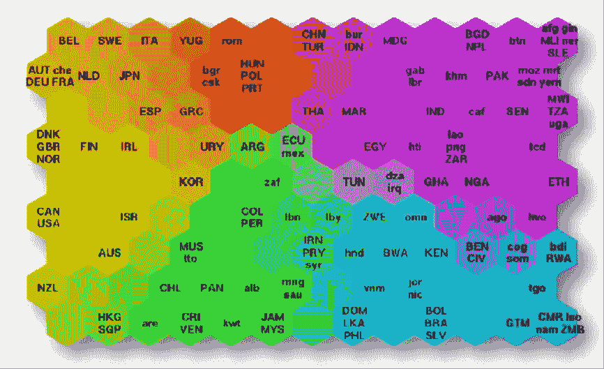
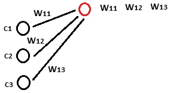

# 人工神经网络中的自组织映射

> 原文：<https://pub.towardsai.net/introduction-on-self-organizing-maps-som-in-an-artificial-neural-network-e63a91de58d9?source=collection_archive---------1----------------------->

## [人工智能](https://towardsai.net/p/category/artificial-intelligence)

## SOM 的工作和学习方式

由[马库斯·温克勒](https://unsplash.com/@markuswinkler?utm_source=medium&utm_medium=referral)在 [Unsplash](https://unsplash.com?utm_source=medium&utm_medium=referral) 上拍摄

在本文中，我们将讨论自组织映射是如何工作的，这将使我们像使用人工神经网络一样，了解 som 的预期目标，以便它们如何学习，然后我们知道我们的目标或我们正在努力的目标。

然后，我们需要 K-means 聚类的基础知识，这将有助于我们理解自组织映射。

来看一点有用的有监督和无监督方法深度学习的信息。

## 监督学习

*   人工神经网络用于监督学习，即回归和分类。
*   用于计算机视觉的卷积神经网络。
*   递归神经网络用于与时间序列分析相关的数据集。

## 无监督学习

*   用于特征检测的自组织映射。
*   用于推荐系统的深度波尔兹曼机器和自动编码器。

本文将介绍自组织映射的基本工作方法。自组织地图是由芬兰教授 Teuvo Kohonen 在 20 世纪 80 年代发明的。

自组织映射用于减少维度或列数。它们采用一个多维数据集，其中可能有许多列是数据集的维度。

我们更容易知道自组织地图的结果是什么，从而理解我们为什么以及如何学习它的性能。

图像[来源](https://www.superdatascience.com/blogs/the-ultimate-guide-to-self-organizing-maps-soms)

上图是 SOM 输出的一个例子，描绘了不同国家的不同繁荣和贫困状态，这里我们有世界各国，这个自组织地图根据许多不同的指标(列)将它们分成不同的组。

 [## 改进 Python 代码的优化技巧和诀窍

### 提高 python 程序的速度和性能

pub.towardsai.net](/optimization-tips-and-tricks-to-improve-python-codes-80785240c99)  [## MLOps:机器学习管道中的工具堆栈需求

### 机器学习生命周期中的工具和技术

medium.com](https://medium.com/pythoneers/mlops-tool-stack-requirement-in-machine-learning-pipeline-474b39f09dfc) 

> ***自组织映射如何学习***

它们与我们在监督学习的神经网络中所学的非常不同。学习 SOM 的概念是非常简单直接的，但是请注意它们是不同的，可能相同名称的概念有不同的含义，因此我们对 ANN、CNN、RNN 的概念可能会使我们混淆含义。

*   自组织地图中没有激活功能。
*   权重是下一层的节点或神经元的特征。

*   C1 是列值，W 是权重。所有下一层节点的计算基于以下公式。

*   这是输入节点和下一层节点之间的距离。该公式应用于所有第 2 层节点并计算距离。
*   计算完所有距离后，算法会找到最近或最低的距离。因此，对于每一行，我们找到节点之间最近的距离数，自组织映射试图在算法中更新最佳最近点的权重。
*   具有最近点的节点被称为最佳匹配单元。
*   因此，在更新权重之后，最佳匹配单元在地图中的位置不同。
*   地图中的周围单元正在根据更接近的最佳匹配单元改变颜色，并改变与其相似的颜色。

> ***结论***

保持输入属性的自组织映射。它对不容易被注意到的特征之间的相关性进行分类和揭示。本文是对自组织地图的一个基本认识。

我希望你喜欢这篇文章。通过我的 [LinkedIn](https://www.linkedin.com/in/data-scientist-95040a1ab/) 和 [twitter](https://twitter.com/amitprius) 联系我。

# 推荐文章

1.[8 Python 的主动学习见解收集模块](/8-active-learning-insights-of-python-collection-module-6c9e0cc16f6b?source=friends_link&sk=4a5c9f9ad552005636ae720a658281b1)
2。 [NumPy:图像上的线性代数](/numpy-linear-algebra-on-images-ed3180978cdb?source=friends_link&sk=d9afa4a1206971f9b1f64862f6291ac0)3。[Python 中的异常处理概念](/exception-handling-concepts-in-python-4d5116decac3?source=friends_link&sk=a0ed49d9fdeaa67925eac34ecb55ea30)
4。[熊猫:处理分类数据](/pandas-dealing-with-categorical-data-7547305582ff?source=friends_link&sk=11c6809f6623dd4f6dd74d43727297cf)
5。[超参数:机器学习中的 RandomSeachCV 和 GridSearchCV](/hyper-parameters-randomseachcv-and-gridsearchcv-in-machine-learning-b7d091cf56f4?source=friends_link&sk=cab337083fb09601114a6e466ec59689)
6。[用 Python](https://medium.com/towards-artificial-intelligence/fully-explained-linear-regression-with-python-fe2b313f32f3?source=friends_link&sk=53c91a2a51347ec2d93f8222c0e06402)
7 全面讲解了线性回归。[用 Python](https://medium.com/towards-artificial-intelligence/fully-explained-logistic-regression-with-python-f4a16413ddcd?source=friends_link&sk=528181f15a44e48ea38fdd9579241a78)
充分解释了 Logistic 回归 8。[数据分发使用 Numpy 与 Python](/data-distribution-using-numpy-with-python-3b64aae6f9d6?source=friends_link&sk=809e75802cbd25ddceb5f0f6496c9803)
9。[机器学习中的决策树 vs 随机森林](/decision-trees-vs-random-forests-in-machine-learning-be56c093b0f?source=friends_link&sk=91377248a43b62fe7aeb89a69e590860)
10。[用 Python 实现数据预处理的标准化](/standardization-in-data-preprocessing-with-python-96ae89d2f658?source=friends_link&sk=f348435582e8fbb47407e9b359787e41)