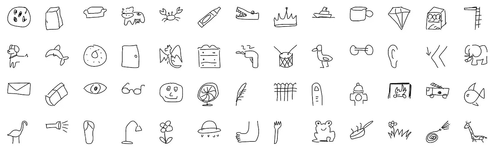
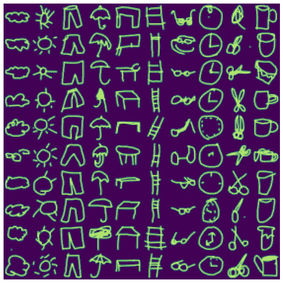
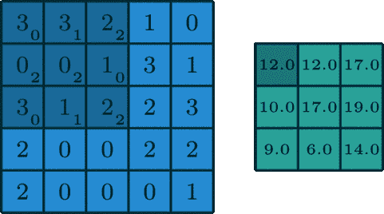
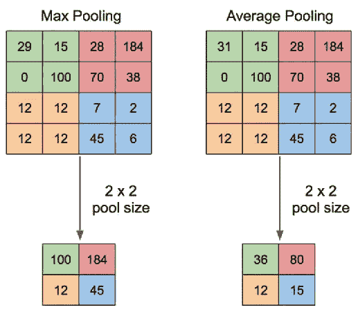

# CNN 简介——不使用 MNIST！

> 原文：<https://pub.towardsai.net/introduction-to-cnns-without-using-mnist-ea62040341d0?source=collection_archive---------2----------------------->

## [计算机视觉](https://towardsai.net/p/category/computer-vision)，[深度学习](https://towardsai.net/p/category/machine-learning/deep-learning)

## CNN 简介，为深度学习的初学者提供易于访问的数据集。



[来源](https://quickdraw.withgoogle.com)

# 介绍🍵

MNIST 数据集是开始影像分类时使用最频繁的数据集。Yann LeCun 在 1998 年引入的由 10 类手写数字组成的 MNIST 数据集在科学论文、博客帖子等中反复出现。它包含手写数字的 28×28(也是 32×32)灰度图像，每个图像包含 0 到 9 之间的整数。

MNIST 如此受欢迎的原因与其规模有关，它允许深度学习实践者快速检查、训练和发布他们的算法。MNIST 有一定的变化和局限性。

主要目标是提出一个新的数据集来理解使用 CNN 的图像分类。

# 如果不是 MNIST，那是什么？🤔

出于简单解释的目的，我选择了谷歌的快速绘制图像。这些图像是在人工智能实验中生成的涂鸦。

从这个视频中了解更多关于数据集的信息，

[谷歌云平台](https://www.youtube.com/channel/UCJS9pqu9BzkAMNTmzNMNhvg)

你也可以在这里自己尝试快速绘图，

[](https://quickdraw.withgoogle.com) [## 快，画！

### 这是一个用机器学习构建的游戏。你画画，神经网络试图猜测你在画什么。的…

quickdraw.withgoogle.com](https://quickdraw.withgoogle.com) 

数据被格式化成各种类型。我用过 NumPy 版本(。npy 文件)。这些已被渲染成 NumPy 格式的 28x28 灰度位图。通过下面分享的文档了解更多信息，

[](https://github.com/googlecreativelab/quickdraw-dataset) [## Google creative lab/quick draw-dataset

### 快速抽奖数据集是由游戏玩家提供的 345 个类别的 5000 万张图片的集合…

github.com](https://github.com/googlecreativelab/quickdraw-dataset) 

# 🧐使用的图像和类别

数据集很大，类别也很广。为了演示的目的，我使用了 **10 个类**和大约 **60，000 张图片**。本来数据集就很大。如果您使用 Colab，那么它可能会在执行操作时崩溃。以下是所考虑的 10 个类别的直观表示。



来源: [Jupyter 笔记本](https://github.com/pr2tik1/blog/blob/master/_notebooks/2020-09-08-Sketch-Recognition.ipynb)

这些类别是:

```
'cloud', 'sun', 'pants', 'umbrella', 'table', 'ladder', 'eyeglasses', 'clock', 'scissors', 'cup'
```

我将分享完整的代码和脚本，以改变图像和类的数量。请在这篇文章的结尾找到它。

您可能会注意到，这与 MNIST 的数据有些相似，

*   它有灰度图像(没有 RGB 通道)
*   28 x 28 尺寸的图像
*   它有 10 个班级，而 MNIST 有 0-9 个班级。

# 卷积神经网络💪

与传统的线性和非线性分类算法相比, **CNN** 在图像分类中产生更好的结果。这是因为它们减少了要学习的参数数量。

CNN 使用图像和滤波器的卷积来提取每一层的复杂不变特征。提取的特征的复杂性随着层的深度而增加。它们成功地捕捉了图像中的空间和时间相关性。

特征的复杂性—

*   第 1 层:边缘
*   第 2 层:形状
*   第三层:形状图案
*   ….
*   输出

要了解更多关于各层之间实际发生的情况，

[](https://distill.pub/2018/building-blocks/) [## 可解释性的基石

### 随着神经网络的日益成功，相应地需要能够解释它们的决定…

蒸馏. pub](https://distill.pub/2018/building-blocks/) 

# 🛠有线电视新闻网的组成部分

以下是卷积神经网络的特征，

## 1.回旋



[一个标准卷积](https://arxiv.org/abs/1603.07285)

卷积是一种矩阵运算，由一个核(一个小的权重矩阵)组成，它在输入数据上滑动，与输入数据所在的部分执行逐元素乘法，然后将结果相加得到一个输出。

这些基本上是合并两组信息。数学上，卷积是指两个函数的组合产生第三个函数。在 CNN 的情况下，卷积是将滤波器/内核应用于输入图像，导致激活。

## 2.联营

池图层通过汇总要素地图的图片中要素的存在情况，提供了一种对要素地图进行缩减采样的方法。两种常见的联营方法是平均联营和最大联营。



[T5【最大池】和 CNNT7【平均池】](https://arxiv.org/abs/1603.07285)

# PyTorch 实现💻

编码部分使用 PyTorch 完成。它可以分为:

*   定义模型
*   定义超参数
*   培训和测试

## 1.定义模型

我们使用 PyTorch 的 NN 模块定义一个模型或 CNN 架构。以下是具有两个卷积层和两个全连接层的神经网络架构。

```
**class** **CNN(**nn**.**Module**):**
    **def** __init__**(***self***,** input_size**,** n_feature**,** output_size**):**
        *super***(**CNN**,** *self***).**__init__**()**
        *self***.**n_feature **=** n_feature
        *self***.**conv1 **=** nn**.**Conv2d**(**in_channels**=**1**,** 
                               out_channels**=**n_feature**,** 
                               kernel_size**=**5**)**
        *self***.**conv2 **=** nn**.**Conv2d**(**n_feature**,** n_feature**,** kernel_size**=**5**)**
        *self***.**fc1 **=** nn**.**Linear**(**n_feature*****4*****4**,** 50**)**
        *self***.**fc2 **=** nn**.**Linear**(**50**,** 10**)**

    **def** **forward(***self***,** x**,** verbose**=False):**
        x **=** F**.**relu**(***self***.**conv1**(**x**))**
        x **=** F**.**max_pool2d**(**x**,** kernel_size**=**2**)**
        x **=** F**.**relu**(***self***.**conv2**(**x**))**
        x **=** F**.**max_pool2d**(**x**,** kernel_size**=**2**)**
        x **=** x**.**view**(-**1**,** *self***.**n_feature*****4*****4**)**
        x **=** F**.**relu**(***self***.**fc1**(**x**))**
        x **=** F**.**log_softmax**(**x**,** dim**=**1**)**
        **return** x
```

## 2.定义超参数

采用的模型尺寸取决于所考虑的输入和输出。CNN 将把 784(= 28x28)作为输入，并产生 10 个类。

我选择的损失函数是负对数似然损失。优化函数是随机梯度下降。这将更新我们网络的权重和偏好。我把学习率设为 0.03，动量设为 0.9。

```
model **=** CNN**(**784**,** 24**,** 10**)**
model **=** model**.**to**(**device**)**

*#Loss criterian*
criterion **=** nn**.**NLLLoss**()**

*#Optimization Function/Weights and Bias Updating Rule*
optimizer **=** optim**.**SGD**(**model**.**parameters**(),** lr**=**0.03**,** momentum**=**0.9**)**
```

## 3.培训和测试

如需培训和测试，请关注以下分享的博客帖子。在这里，我对网络进行了训练和测试。这是我的个人博客网站，在这里我分享了完整的代码和 Jupyter 笔记本。此外，我还探索了降维技术。

我的网络运行良好，准确率为 96.7%，损耗为 0.122%，T2 为 0.3%。您还可以通过 Colab 运行并测试自己的实现。

[](https://pr2tik1.github.io/blog/pytorch/cnn/pca/t-sne/2020/09/08/Sketch-Recognition.html) [## 基于 PyTorch 的涂鸦图像分类

### 在这本笔记本中，我实现了 LeNet-5 的修改版本，这是一个神经网络模型，包括…

pr2tik1.github.io](https://pr2tik1.github.io/blog/pytorch/cnn/pca/t-sne/2020/09/08/Sketch-Recognition.html) 

# 资源和参考资料📚

1.  [CS231n](https://cs231n.github.io)
2.  [Jupyter 笔记本](https://github.com/pr2tik1/blog/blob/master/_notebooks/2020-09-08-Sketch-Recognition.ipynb) —代码
3.  [博文](https://pr2tik1.github.io/blog/pytorch/cnn/pca/t-sne/2020/09/08/Sketch-Recognition.html) —涂鸦图片分类完整说明。

# 谢谢大家！😇


照片由 [Niclas Illg](https://unsplash.com/@nicklbaert?utm_source=medium&utm_medium=referral) 在 [Unsplash](https://unsplash.com?utm_source=medium&utm_medium=referral) 上拍摄

希望你喜欢。谢谢你阅读这篇文章！请务必检查上面共享的存储库，如果需要解释，请联系。要了解更多关于我的信息，请访问我的投资组合网站[这里。](https://pr2tik1.github.io)

总之，我们已经研究了 CNN 及其实现。此外，您可以探索胶囊网络和 rnn。

你也可以关注我分享的博文，在那里我也研究了 t-SNE 和 PCA 对这些数据的表示。如果你对这篇文章有任何疑问，请随时联系我。

***谢谢！***

# 更多来自作者:

[](https://towardsdatascience.com/understanding-kaplan-meier-estimator-68258e26a3e4) [## 了解卡普兰-迈耶估计量

### 一种生存分析技术的介绍。

towardsdatascience.com](https://towardsdatascience.com/understanding-kaplan-meier-estimator-68258e26a3e4) [](https://pr2tik1.medium.com/what-happens-to-programmers-in-2020-d04a6bd7452f) [## 开发者趋势

### 根据调查数据分析开发人员和编程趋势。

pr2tik1.medium.com](https://pr2tik1.medium.com/what-happens-to-programmers-in-2020-d04a6bd7452f) [](https://medium.com/towards-artificial-intelligence/neural-networks-from-scratch-a-brief-introduction-for-beginners-d3776599aaac) [## 探索神经网络(第一部分)

### 理解深度学习的概念以及使用 Python 和它的神经网络的实现…

medium.com](https://medium.com/towards-artificial-intelligence/neural-networks-from-scratch-a-brief-introduction-for-beginners-d3776599aaac) [](https://towardsdatascience.com/explore-new-github-readme-feature-7d5cc21bf02f) [## 如何创建令人敬畏的 Github 个人资料-自述文件！

### 探索展示你作为开发者或开源贡献者的“GitHub 简历”的新方法。每一个开源…

towardsdatascience.com](https://towardsdatascience.com/explore-new-github-readme-feature-7d5cc21bf02f)