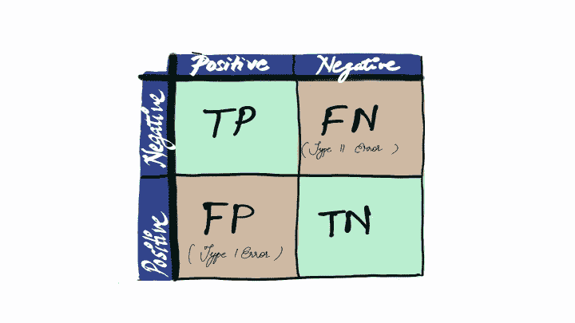
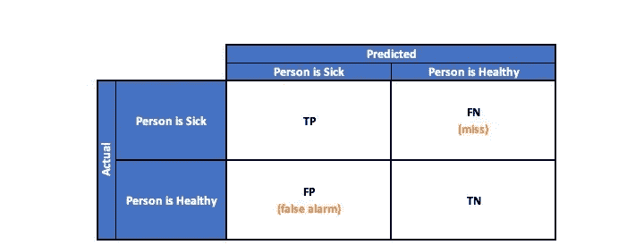
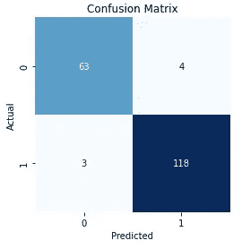

# 混淆矩阵介绍

> 原文：<https://pub.towardsai.net/introduction-to-confusion-matrix-50676f2756ee?source=collection_archive---------0----------------------->

## 模型评估

## 混淆矩阵是什么，如何用 Python 绘图？



作者图片

混淆矩阵是实际值与预测值的直观表示。它是分类算法的性能评估工具，也称为**误差矩阵**。

有多少预测的类或类别被正确预测以及有多少没有被正确预测的二维表格布局允许算法性能的可视化，通常在监督学习中。

在预测分析中，用于二进制分类的**混淆矩阵**是一个两行两列的表格，报告了*真阳性*、*假阴性*、*假阳性*和*真阴性*的数量。这允许进行比简单观察准确性更详细的分析。


作者图片

# 为什么混淆矩阵多于准确度？

当不同类中的观测值数量相差很大时，如果用于不平衡数据集，精度度量可能会产生误导。而混淆矩阵提供了正面和负面之间的详细比较。

混淆矩阵由四个重要指标组成**真阳性(TP)、真阴性(TN)、假阳性(FP)、假阴性(FN)** 。

让我们用一个类比来理解它们，算法必须对一个人是健康的还是生病的进行分类。



二元分类的混淆矩阵|作者图片

**(1)真阳性(TP)**

该算法预测了一个生病的“人生病了”。这表明该算法已经正确地将阳性分类。它是实际类为正时的正确预测数。

**(2)真阴性(TN)**

该算法预测一个健康的“人是健康的”。这就得出结论，该算法已经正确地对否定进行了分类。它是实际类为负时的正确预测数。

**(3)假阳性(FP)**

该算法预测了一个健康的“病人”。这里的算法给出了一个错误的警报，将它误分类为阳性而不是阴性。它是实际类为正时的错误预测数，也称为**I 型误差**。

**(4)假阴性(FN)**

该算法预测一个生病的“人是健康的”。在这里，算法通过将病人归类为健康人而遗漏了病人。它是实际类别为负时的错误预测数，也称为**第二类错误**。

```
from sklearn.datasets import load_breast_cancer
from sklearn.model_selection import train_test_split 
from sklearn.linear_model import LogisticRegression
from sklearn.metrics import confusion_matrixX, y = load_breast_cancer(return_X_y=True)
X_train, X_test, y_train, y_test = train_test_split(X, y,                                          
                                                    test_size=0.33,
                                                    random_state=42)
lr= LogisticRegression() 
lr.fit(X_train,y_train) 
y_pred=lr.predict(X_test)
confusion_matrix(y_test, y_pred)**Output:** array([[ 63,   4],
       [  3, 118]])
```

sklearn 中的 confusion_matrix API 提供了一个数组作为输出，该数组分别具有 TN、FP、FN 和 TP，并且可以使用任何可视化库的 ConfusionMatrixDisplay API 或 Heatmap API 绘制该数组。

下面是评估和绘制混淆矩阵的 python 方法。它将给出一个包含 tn、fp、fn 和 tp 的数组作为返回类型，并打印 seaborn 主题中由创建的混淆矩阵。

```
from sklearn.datasets import load_breast_cancer
from sklearn.model_selection import train_test_split 
from sklearn.linear_model import LogisticRegression
from sklearn.metrics import confusion_matrixX, y = load_breast_cancer(return_X_y=True)
X_train, X_test, y_train, y_test = train_test_split(X, y,                                          
                                                    test_size=0.33,
                                                    random_state=42)
lr= LogisticRegression() 
lr.fit(X_train,y_train) 
y_pred=lr.predict(X_test)
conf_mat, ax = confusion_matrix(y_test, y_pred)
```

*下面是代码*的输出



困惑矩阵|作者图片

**目标是保持尽可能多的总磷和总氮值。**

在这篇博客中，我们了解了什么是混淆矩阵，以及如何用 Python 绘制它。对真阳性(TP)、真阴性(TN)、假阳性(FP)和假阴性(FN)的解释是混淆矩阵的构建度量。

然而，可以从混淆矩阵中导出多个度量，如准确度、精确度、召回率、ROC 等等。详见 [**深潜困惑矩阵**](/deep-dive-into-confusion-matrix-6b8111d5c3f7) 。

**参考文献:**

[1] sklearn 混淆矩阵 API。[https://sci kit-learn . org/stable/modules/generated/sk learn . metrics .混淆 _matrix.html#sklearn.metrics .混淆 _matrix](https://scikit-learn.org/stable/modules/generated/sklearn.metrics.confusion_matrix.html#sklearn.metrics.confusion_matrix)

[2] sklearn 混淆矩阵显示 API。[https://sci kit-learn . org/stable/modules/generated/sk learn . metrics . confusionmatrix display . html # sk learn . metrics . confusionmatrix display](https://scikit-learn.org/stable/modules/generated/sklearn.metrics.ConfusionMatrixDisplay.html#sklearn.metrics.ConfusionMatrixDisplay)

[3] seaborn 热图 API。[https://seaborn.pydata.org/generated/seaborn.heatmap.html](https://seaborn.pydata.org/generated/seaborn.heatmap.html)