# TensorFlow 深度学习简介

> 原文：<https://pub.towardsai.net/introduction-to-deep-learning-with-tensorflow-f7d2c53f93c8?source=collection_archive---------2----------------------->

## [人工智能](https://towardsai.net/p/category/artificial-intelligence)、[深度学习](https://towardsai.net/p/category/machine-learning/deep-learning)

## 温和地介绍和实施前三种类型的人工神经网络；使用张量流的前馈神经网络、RNNs 和 CNN

随着当前数据分析和数据科学的发展，许多组织开始实施基于人工神经网络(ANN)的解决方案来自动预测各种业务问题的结果。

有各种类型的人工神经网络，例如；前馈神经网络(人工神经元)、递归神经网络(RNN)、卷积神经网络(CNN)等。在本文中，我们将讨论所有这三种类型的人工神经网络。对于这里显示的所有示例，我都使用了 2.3.0 版的 ***TensorFlow*** 。某些命令和方法可能在以前的版本中不可用。

# 前馈神经网络

这是最简单的人工神经网络形式之一，其中输入仅在一个方向上传播。数据通过输入层，在输出层输出。它可能有隐藏层，也可能没有。顾名思义，它只有前向传播，没有后向传播。

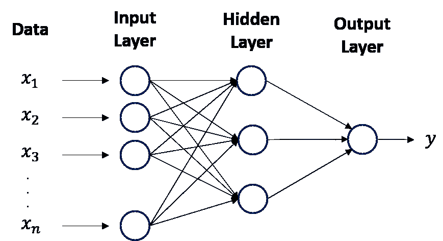

具有一个隐藏层的前馈神经网络的简单视图

Tensorflow 的实现可以通过使用`dense`层的 sequential 从下面的代码片段中完成。

我们可以通过调用`model.get_weights()`得到神经元的权重和偏差。第一个是针对该层中 16 个神经元的 5 个特征输入的权重，第二个数组表示每 16 个神经元的偏差。第三和第四个数组表示来自前一层(16 个神经元)的输出的权重和输出神经元的偏差。

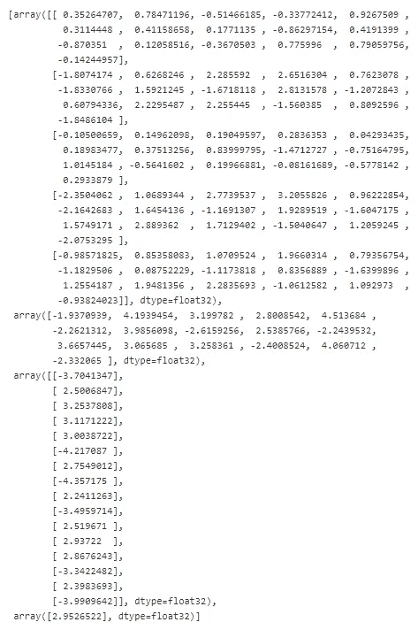

model.get_weights()的结果

此外，通过可视化训练日志和预测误差，我们可以了解关于模型学习过程(历史)和模型性能的更多信息。

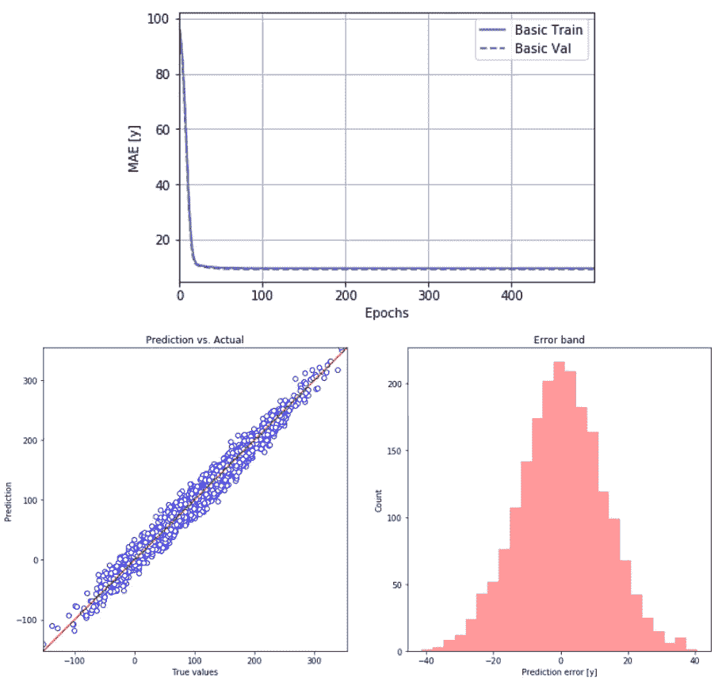

模型性能可视化

# RNN 递归神经网络

递归神经网络不同于传统的前馈神经网络。递归神经网络旨在更好地处理顺序信息。它们引入状态变量来存储过去的信息，结合当前的输入来确定当前的输出。RNN 的一些常见示例基于文本数据和时间序列数据。

让我们想象隐藏状态的 RNN。

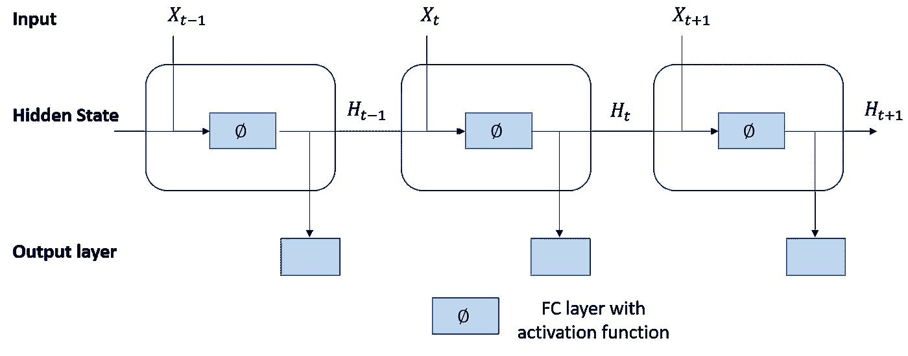

隐藏状态的 RNN

我们可以看到，当前时间步的隐变量的计算是由当前时间步的输入和前一个时间步的隐变量共同决定的。这些激活被存储在网络的内部状态中，该网络可以保存长期的时间上下文信息。该上下文信息用于将输入序列转换成输出序列。因此，**上下文是递归神经网络的关键**。

然而，RNN 不足以解决今天的序列学习问题，例如；梯度计算过程中的数值不稳定性。

如上所述，网络具有可以表示上下文信息的内部状态(存储)。存储器也可以由另一个网络或图形来代替。这种受控状态是指门控状态或门控记忆，是*长短期记忆*网络(*lstm*)和*门控循环单元(GRUs)* 的一部分。该网络也可称为*反馈神经网络*。

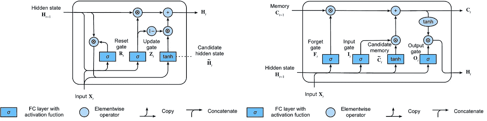

GRU(左)和 LSTM(右)

rnn 可以是单向和双向的。如果我们相信数据周围有一个环境，不仅仅是数据出现在它之前。我们应该使用双向 rnn，例如，上下文出现在单词前后的文本数据。关于 RNN 的更多解释，我建议观看视频[。](https://www.youtube.com/watch?v=UNmqTiOnRfg)

GRUs 和 LSTMs 都消耗[批量大小、时间步长、特征]的输入形状。

*   ***批量*** 是神经网络在调整权重之前要查看的样本数。小批量会降低训练速度，但如果批量太大，模型将无法进行归纳，并消耗更多内存(以保持每批的样本数量)
*   ***时间步长*** 是神经网络查看的时间回溯单位(即时间步长= 30 可以表示我们回溯并输入 30 天的数据作为一次观察的输入
*   ***特征*** 是每个时间步中使用的属性数量。例如，如果我们仅使用 60 天时间步长的股票收盘价，特征大小将仅为 1

下面是同时实现 GRUs 和 LSTMs 来预测 Google 股价的例子。

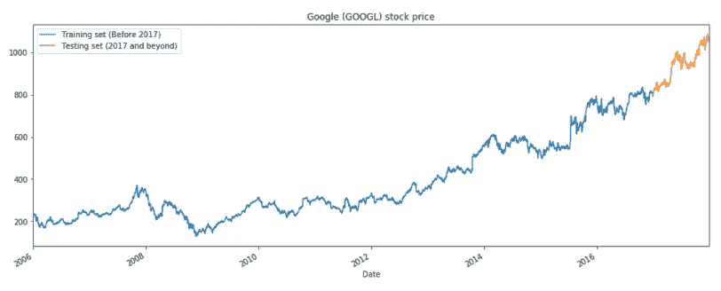

2006 年至 2018 年谷歌股价

通常，当我们使用递归神经网络来预测数值时，我们需要对输入值进行标准化。

预测股票价格的 GRU 模型的代码片段

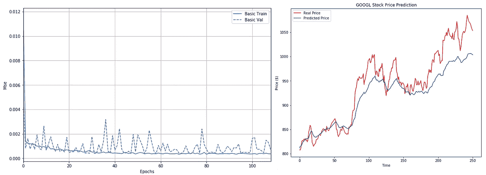

每个时期的性能(左)和实际与预测之间的可视化(右)

预测股票价格的 LSTM 模型的代码片段

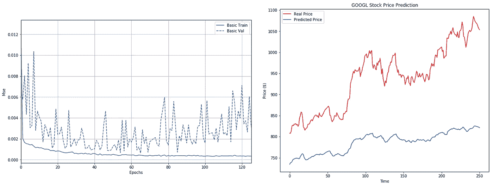

每个时期的性能(左)和实际与预测之间的可视化(右)

正如我们所看到的，LSTM 可以察觉到这一趋势，但仍有很大的改进空间。然而，在这篇文章中，我将只关注用法。

总之，gru 是:

*   更擅长捕捉具有大时间步长距离的时间序列的相关性
*   重置门有助于捕捉短期相关性，而更新门有助于捕捉时间序列数据中的长期相关性

LSTMs 有；

*   控制信息流的三种门(输入门、遗忘门和输出门)
*   LSTM 的隐藏层输出包括隐藏状态和存储单元。隐藏状态被传递到输出层，但是存储单元完全是内部的
*   它可以处理消失和爆炸梯度

# 卷积神经网络

CNN 像神经网络一样，由具有可学习的权重和偏差的神经元组成。然而，它们是为计算机视觉设计的强大的神经网络家族。细胞神经网络的应用涉及图像识别、目标检测、语义分割等。

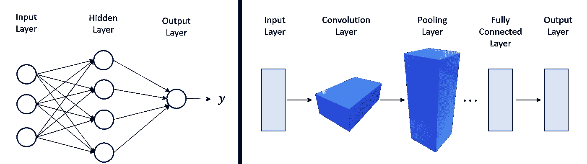

神经网络(左)和卷积神经网络(右)之间的比较

CNN 往往计算效率高，因为它们比全连接架构需要更少的参数，也因为它们易于跨 GPU 并行化。有了这些，CNN 被用于一维序列结构(即音频、文本和时间序列数据)。此外，一些人在图形结构数据和推荐系统中采用了 CNN。我建议阅读卷积的每个功能的细节，更详细的池层[在这里](https://cs231n.github.io/convolutional-networks/)。

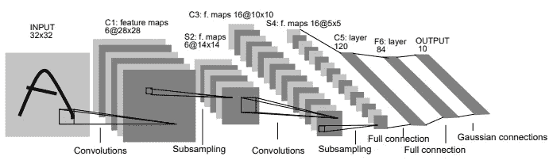

LeNet-5 架构(参考:[http://vision . Stanford . edu/cs 598 _ spring 07/papers/le Cun 98 . pdf](http://vision.stanford.edu/cs598_spring07/papers/Lecun98.pdf))

通常对于计算机视觉任务，CNN 接受形状的输入(图像高度、图像宽度、颜色通道)，忽略批量大小。颜色通道或深度指的是(R，G，B)配色方案。

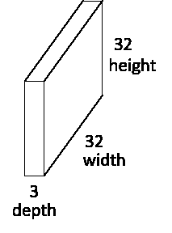

张量输入形状

下面是我们如何实现一个基本的 CNN 模型来对图像进行分类。

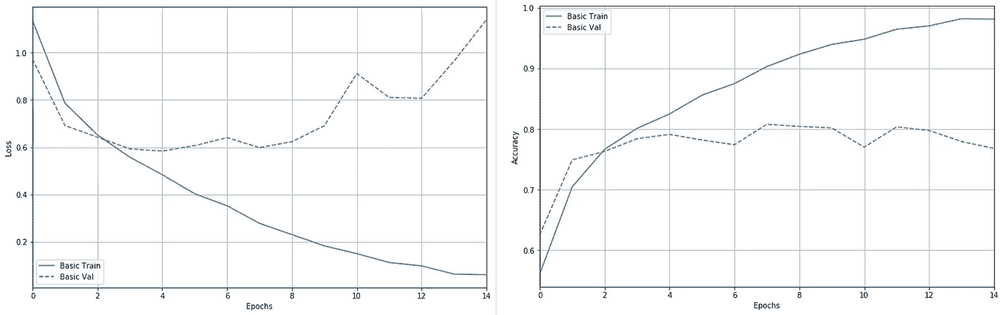

CNN 模型在每个历元的性能

我们可以看到，该模型变得与训练数据过度拟合，并且在验证数据上的性能变得最差。训练数据的模型性能为 93.1%，而测试数据为 76.4%。

然而，我们可以通过添加一个**数据扩充**过程来扩展训练数据集，从而帮助模型更好地泛化，从而改善模型结果。

前几行显示我们实现了数据扩充，并直接从文件夹中输入图像

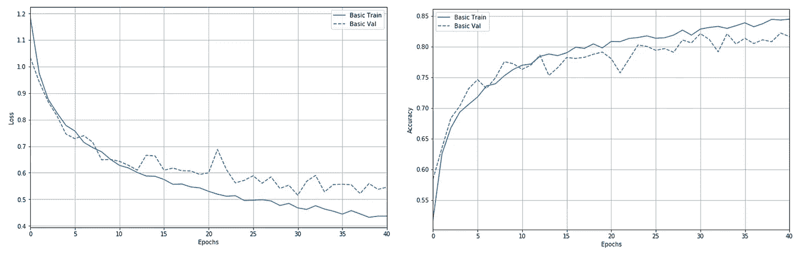

相同 CNN 结构的性能，但增加了数据

使用这种简单的技术，模型对数据更加一般化。对训练数据的准确度降低到 85.1%，但是测试准确度现在是 81.7%。

综上所述；

*   卷积层从输入数据中提取特征
*   卷积层的排列使得它们逐渐降低表示的空间分辨率，同时增加通道的数量
*   它通常由卷积、非线性和通常的池操作组成
*   在网络的末端，它在计算输出之前连接到一个或多个完全连接的层

# 尾注

我介绍了最常用的网络类型及其使用 python 和 TensorFlow 的实现。关于本文中使用的完整代码，请参考 GitHub 资源库或单击此处阅读笔记本。

一旦你完全理解了每一种网络类型，你就可以把它们结合起来解决更复杂的问题，例如；并行 LSTM 解决实时预测中的流数据，卷积 LSTM 解决视频问题(想象它是一个图像序列)。代码和数据请参考我下面的 GitHub 库。

# 附加阅读和 Github 知识库

 [## 用于视觉识别的 CS231n 卷积神经网络

### 目录:卷积神经网络非常类似于以前的普通神经网络…

cs231n.github.io](https://cs231n.github.io/convolutional-networks/)  [## 8.递归神经网络-深入学习 0.14.3 文档

### 到目前为止，我们遇到了两种类型的数据:一般矢量和图像。对于后者，我们设计了专门的层来…

d2l.ai](https://d2l.ai/chapter_recurrent-neural-networks/index.html)  [## netsatsawat/Introduction _ to _ ANN _ tensor flow

### 有许多类型的人工神经网络，但最流行的类型，我们已经使用和实施，是前馈神经…

github.com](https://github.com/netsatsawat/Introduction_to_ANN_tensorflow)