# Deepnote 简介:Jupyter 笔记本上的实时协作

> 原文：<https://pub.towardsai.net/introduction-to-deepnote-real-time-collaboration-on-jupyter-notebook-18509c95d62f?source=collection_archive---------1----------------------->

## [数据科学](https://towardsai.net/p/category/data-science)

## 轻松包装和运输您的笔记本电脑

# 动机

你有没有想过使用 Jupyter Notebook 与你的队友合作完成一个项目？Google Colab 允许你和其他人编辑和评论同一个项目，但是你不能实时看到他们的变化。要查看其他人的评论或更改，您需要刷新页面。

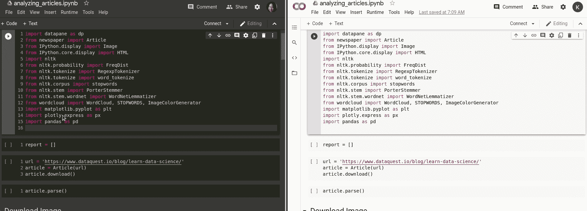

作者 GIF

这种方法是可行的，但是如果您正在运行一个需要很长时间才能运行的单元，这种方法可能会有问题。因为在页面刷新之前，你不会意识到其他人的评论，所以你不能给他们即时的反馈。

如果能看到下图这样的实时变化不是很好吗？

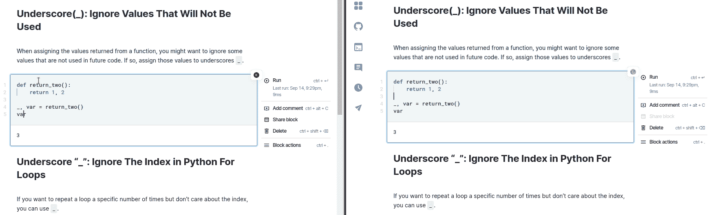

作者 GIF

这时 Deepnote 就派上用场了。Deepnote 的其他一些很酷的功能有:

*   预览和可视化熊猫数据帧，无需额外的代码
*   检查笔记本旁边的全局变量
*   自动为您的笔记本建立依赖关系
*   使用四种不同的访问级别共享项目
*   与其他平台集成
*   轻松共享数据集
*   为您的笔记本构建报告

在本文中，我将详细介绍这些功能如何提升您的笔记本使用体验。

# 什么是 Deepnote？

[Deepnote](https://deepnote.com/) 是一款在浏览器中运行的协作笔记本。要试用 Deepnote，在 [Deepnote](https://deepnote.com/) 上注册，然后点击“新项目”创建一个新项目。

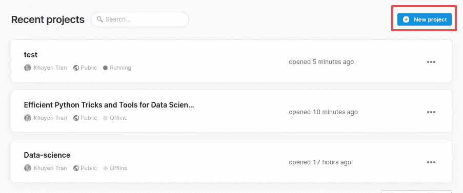

作者图片

您现在可以开始使用 Deepnote 了！

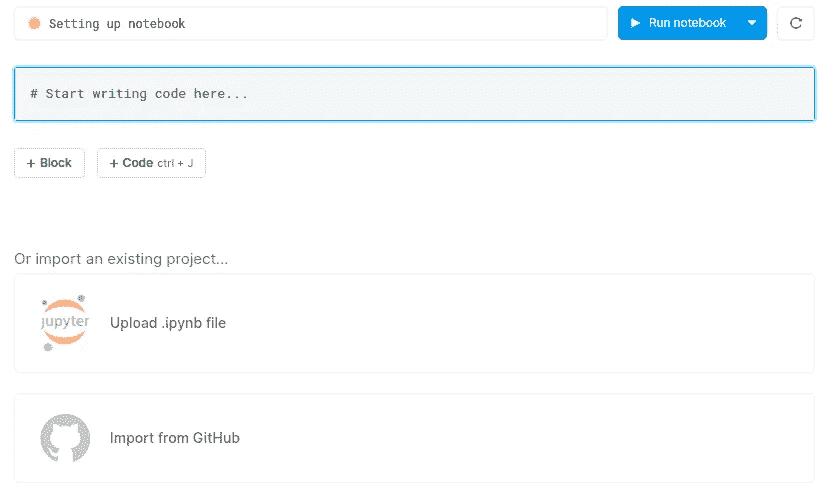

作者图片

# 预览和可视化熊猫数据帧，无需额外的代码

由于 pandas DataFrame 是许多数据科学家的流行工具，如果您可以检查和可视化数据而无需额外的代码，那不是很好吗？Deepnote 可以让你做到这一点。

要预览数据帧，只需在单元格中键入该数据帧的名称并执行该单元格。您不仅会看到数据的条目，还会看到每一列的分布。

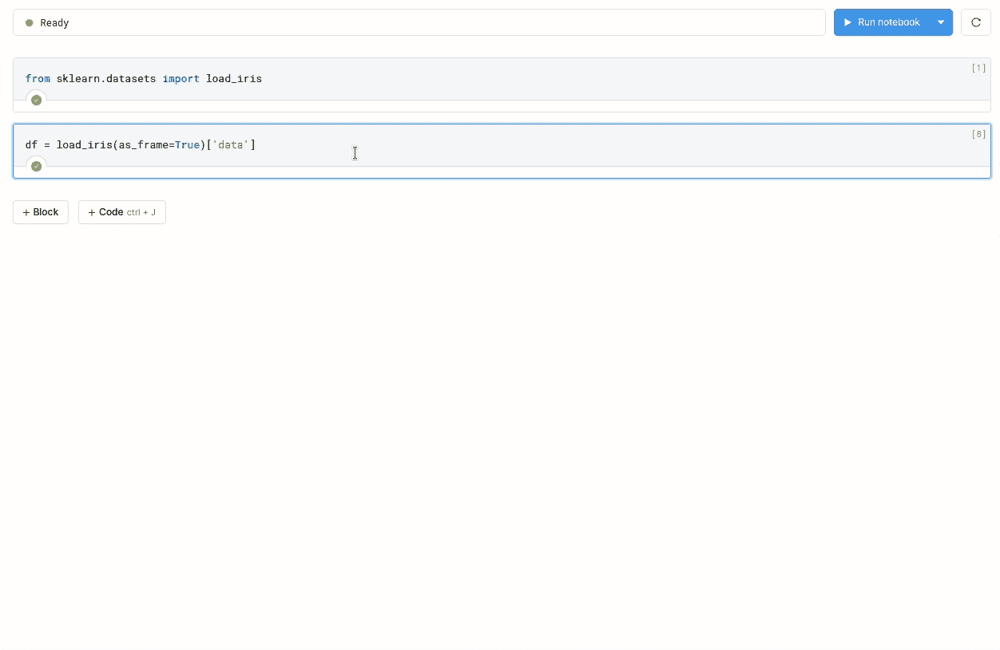

作者 GIF

您也可以通过单击数据帧旁边的“可视化”按钮来快速可视化数据帧:

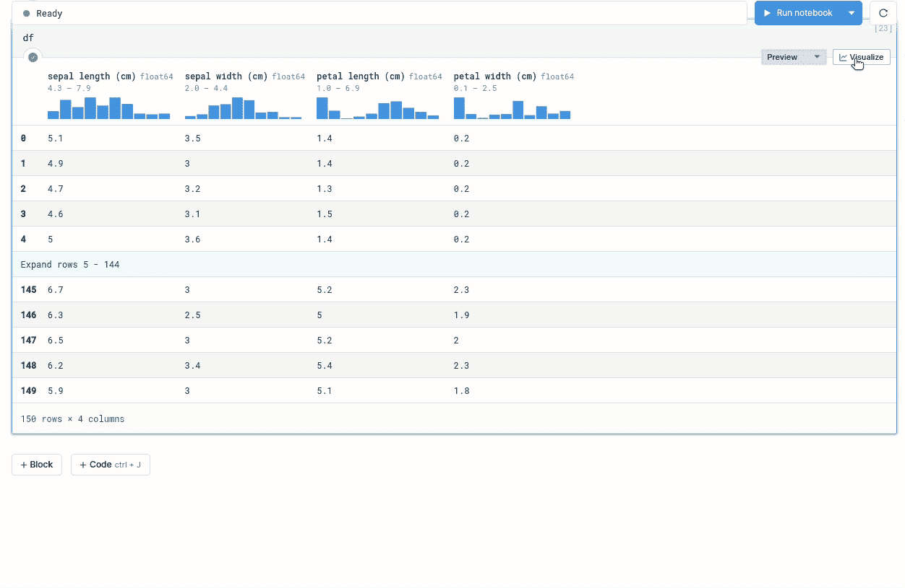

作者 GIF

# 检查全局变量

你有没有试过上下滚动来检查某个特定变量的值？如果所有的变量都显示在笔记本旁边的一个表格里不是很好吗？

Deepnote 允许你在笔记本左下方的表格中查看笔记本中的所有全局变量。

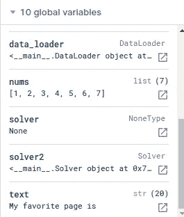

作者图片

# 自动为您的笔记本建立依赖关系

Deepnote 安装了大多数[常见 Python 包](https://docs.deepnote.com/environment/pre-installed-packages)。但是，如果你想安装没有预装在 Deepnote 中的包，你可以通过你的笔记本单元、requirements.txt 或者 Docker 镜像来安装新的依赖项。

让我们来看一下这些方法。

## 安装在您的单元中

如果没有预装 Python 包，可以使用`!pip install package-name`来安装该包。

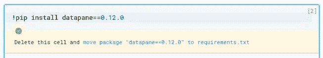

作者图片

安装完成后，您可以选择将包移动到位于项目根目录下的 requirements.txt 文件中。

## 通过 Requirements.txt 安装

除了安装在笔记本内核中，您还可以在 requirements.txt 文件中指定项目的依赖项。

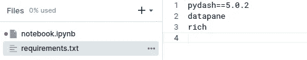

作者图片

下次打开笔记本时，Deepnote 会**自动安装 requirements.txt 中指定的依赖项。**这非常方便，因为:

*   不需要每次使用笔记本都手动运行`!pip install package-name`。
*   其他人可以使用自定义软件包**运行您的笔记本，而无需安装任何依赖项**！

为了测试这一点，您可以转到[我创建的项目](https://deepnote.com/project/test-lURJACXDTrKnVJFQH1cpYA/%2Fnotebook.ipynb)并运行导入定制包的代码。

## 上传您的 Docker 图像

Deepnote 还允许你上传自定义的 Docker 图片。这非常酷，因为你可以从公共存储库中挑选图片，比如 [Dockerhub](https://hub.docker.com/) ，或者带上你自己的 Docker 图片。

要上传新的 Docker 映像，请单击“环境”选项卡，然后单击“设置新的 Docker 映像”。

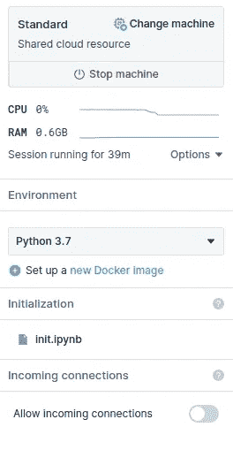

作者图片

将出现一个框，允许您插入关于 Docker 图像的信息。

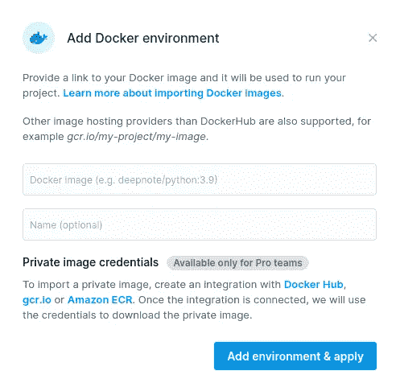

作者图片

# 共享您的项目

您可以通过点击屏幕右上角的“共享”按钮来共享您的项目。在这里，您可以选择希望协作者拥有的访问权限。

您可以授予您的协作者以下权限:

*   视角
*   评论
*   执行
*   编辑

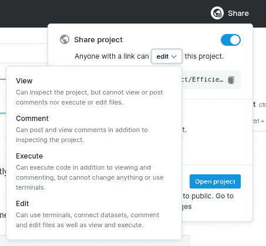

作者图片

下面的 GIF 显示了每个访问权限级别之间的差异。

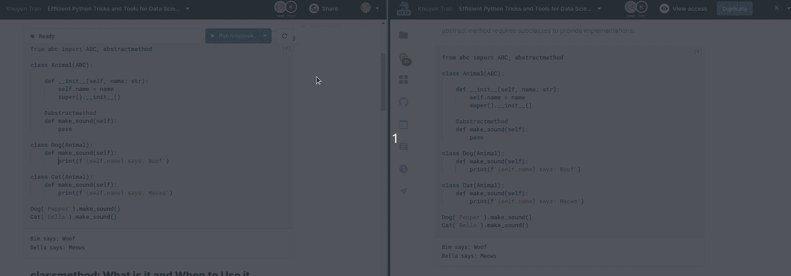

作者 GIF

# 与其他平台集成

## 开源代码库

你有没有想过把你 GitHub 仓库里的静态笔记本变成一个交互式笔记本？不用手动上传这些笔记本，你只需要给 Deepnote 你的 GitHub 库的链接，就可以在 Deepnote 上启动你的库。

首先点击屏幕左侧的“GitHub”图标。

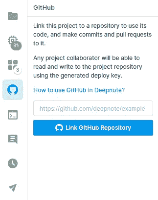

作者图片

…然后将指向存储库的链接添加到文本框中。

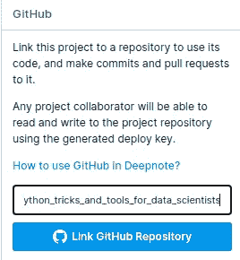

作者图片

整个 GitHub 库将会在你当前的项目中！

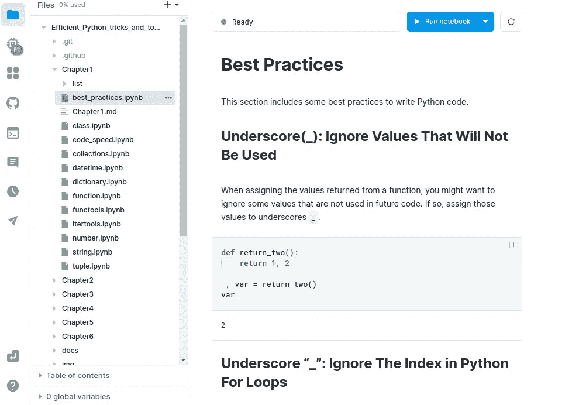

作者图片

## 环境变量

环境变量非常适合存储秘密信息，比如 API 密钥、用户名和密码。要在 Deepnote 中插入环境变量，请单击左侧栏中的“Integrations”选项卡，然后单击“environment variables”。

您应该会看到如下所示的环境变量编辑器:

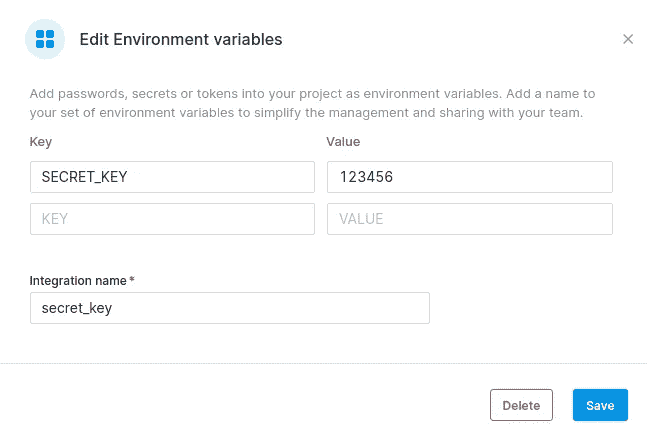

作者图片

在指定新环境变量的信息后，您可以使用`os`将变量加载到您的笔记本单元格中:

# 轻松共享您的数据集

在数据科学项目中，您很可能希望您的团队成员访问您笔记本中的数据集。Deepnote 提供了多种方式让你的队友无缝访问你的数据集。

## 从 Google Drive 加载数据集

你可以通过点击“集成”标签中的“Google Drive”将 Deepnote 连接到你的 Google Drive。点击“授权 Google Drive”让 Deepnote 访问您的 Google Drive。

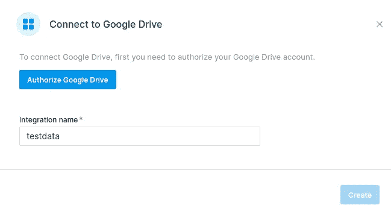

作者图片

现在，您的 Google Drive 中的数据集位于`/datasets/your-integration-name`中！要列出该文件夹中的所有数据集，请键入:

然后，您可以像平常一样在本地目录中读取文件。

## 通过上传到 Deepnote 来共享您的数据集

您也可以通过点击“集成”选项卡中的“共享数据集”将您的数据集直接上传到 Deepnote。

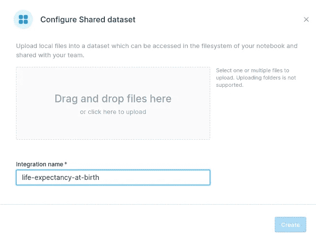

作者图片

上传数据集后，可以在`/datasets/your-integration-name/filename`访问该文件:

很酷，不是吗？

以下是其他集成选项:

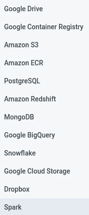

作者图片

# 为您的笔记本创建报告

有时，您可能希望构建一份精美的报告，向您的团队成员和经理展示笔记本中的结果。然而，将笔记本上的结果复制粘贴到 Google Docs 或 PowerPoint 上可能会很繁琐。

如果你能用你的笔记本创建一个报告不是很好吗？Deepnote 可以让你做到这一点。

要为您的笔记本创建报告，请单击项目页面右上角的“共享”按钮，然后单击“转到发布编辑器进行更改”。

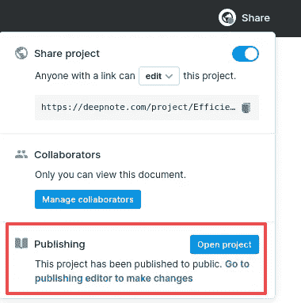

作者图片

现在，您的报告草稿可供您编辑，如下所示！您可以删除单元格、隐藏输入或输出，使报表看起来更整洁。对报告满意后，点击“发布更改”。

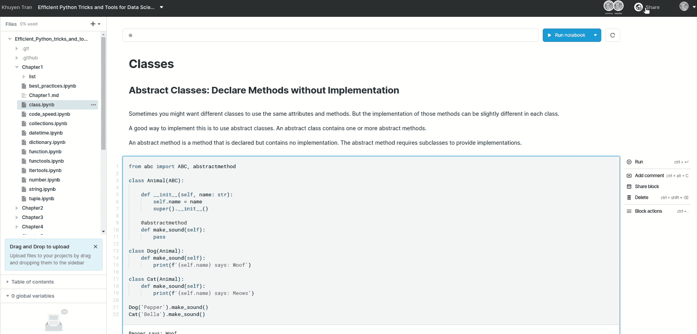

作者 GIF

点击“打开”,您将看到[一份准备好分享的精美报告。](https://deepnote.com/@khuyen-tran/Efficient-Python-Tricks-and-Tools-for-Data-Scientists-Qmaf1AoKR-yDKFmq4udiiA)

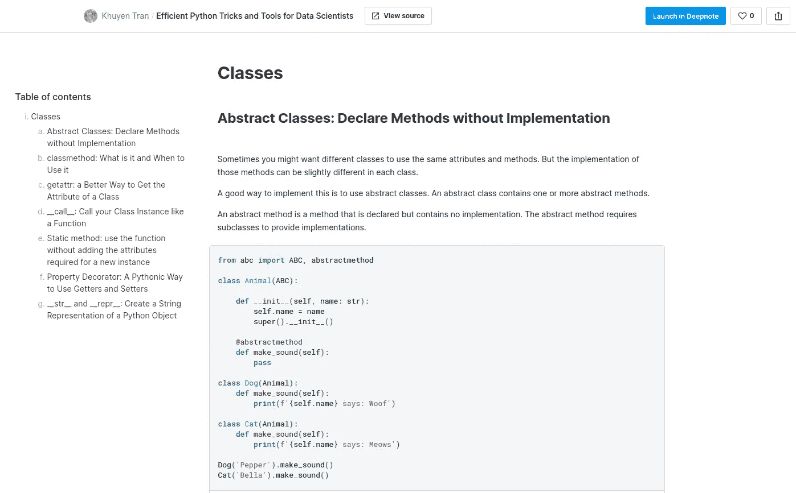

作者图片

# 结论

恭喜你！您刚刚了解了 Deepnote 的功能及其优势。现在你的队友会很高兴运行你的笔记本，知道他们不需要安装任何额外的依赖项和导入任何外部数据。

因为它只需要不到 1 分钟的时间来设置，尝试你不试试吗？

我喜欢写一些基本的数据科学概念，并尝试不同的算法和数据科学工具。你可以在 LinkedIn 和 T2 Twitter 上与我联系。

星[这个回购](https://github.com/khuyentran1401/Data-science)如果你想检查我写的所有文章的代码。在 Medium 上关注我，了解我的最新数据科学文章，例如:

 [## 3 个跟踪和可视化 Python 代码执行的工具

towardsdatascience.com](https://towardsdatascience.com/3-tools-to-track-and-visualize-the-execution-of-your-python-code-666a153e435e)  [## 如何使用 Python 创建类似 3Blue1Brown 的数学动画

### 利用您的 Python 技能创建美丽的数学动画

towardsdatascience.com](https://towardsdatascience.com/how-to-create-mathematical-animations-like-3blue1brown-using-python-f571fb9da3d1)  [## Patsy:用任意 Python 代码构建强大的特性

### 一行代码中的数据转换

towardsdatascience.com](https://towardsdatascience.com/patsy-build-powerful-features-with-arbitrary-python-code-bb4bb98db67a)  [## kats:Python 中分析时间序列数据的通用框架

### 预测、检测变化点、异常，并获得时间序列中的关键统计数据

towardsdatascience.com](https://towardsdatascience.com/kats-a-generalizable-framework-to-analyze-time-series-data-in-python-3c8d21efe057)