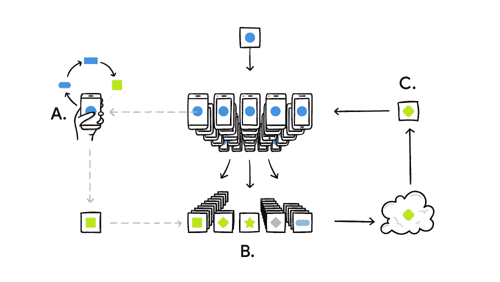

# 联邦学习简介

> 原文：<https://pub.towardsai.net/introduction-to-federated-learning-bae7ab3766a3?source=collection_archive---------0----------------------->

# 介绍

任何深度学习模型都从数据中学习，数据必须收集或上传到服务器上(一台机器或数据中心)。一个最现实最有意义的深度学习模型可以从个人数据中学习。个人数据是非常隐私和敏感的，没有人愿意把它发送或上传到服务器上。联合学习是一种合作的机器学习方法，在这种方法中，我们训练了一个模型，而没有将数据集中在服务器上，这是一种主要的革命。

如果我们把模型带到数据产生的地方，而不是把数据带到一个地方来训练一个模型，会怎么样？

主要使用案例是当我们想要使用来自多个移动设备的数据来重复改进预训练模型时，或者它可以是任何类型的嵌入式设备，如连接到互联网的各种物联网，而无需将数据上传到终端服务器或云。

这真的很有趣，因为这个问题的实际解决方案非常简单。首先，客户端、移动设备获得预训练的模型，然后使用本地数据改进该模型。因此，实际模型在本地设备上进行训练，并将模型发送回服务器。

服务器结合了它从客户端获得的所有模型。这个组合模型将成为下一个发送给客户的初始模型，我们只需重复这个过程。所有这些设备都受益于每个设备的数据。

[**密学**](https://1.bp.blogspot.com/-K65Ed68KGXk/WOa9jaRWC6I/AAAAAAAABsM/gglycD_anuQSp-i67fxER1FOlVTulvV2gCLcB/s1600/FederatedLearning_FinalFiles_Flow%2BChart1.png)

## **联合学习方法的挑战**

*   **性能:**如果客户端只有几个训练样本，它仍然可以了解一些数据。如果我们有 50，000 个客户端，每个客户端都有小数据，他们会花大部分时间来回发送模型，如果模型非常大，他们不会花太多时间训练
*   **隐私:**通过查看权重的变化，有人可以算出个人数据。因此，如果有人知道了来自权重更新的训练数据，我们就不能使用联合学习。

为了解决这两个问题，Google 开发了一个[安全聚合协议](https://eprint.iacr.org/2017/281)，其中的主要思想是服务器生成一个公钥和私钥对，并向每个客户端共享公钥。

然后，客户端直接相互对话，并使用服务器的公钥共享其加密的更新权重。所有客户端只有服务器共享的公钥，因此任何客户端都无法看到其他权重的更新。

所有客户端将其模型的所有权重累积到一个单一的最终更新中，并发送回服务器。然后，服务器使用私钥对其进行解密，并更新服务器的模型权重。在这个过程中，服务器会累积权重，因此服务器也看不到任何特定客户端的权重更新。在这个安全聚合协议中，在服务器进行平均之前，不能检查任何个人电话的更新。服务器可以请求将更新共享给客户端，并且客户端只有在已经与其他客户端同步并且将它们的权重累积到某个阈值|客户端数量| >阈值时才会做出响应。在从客户端获得响应后，服务器用一个私钥重建累积的权重，并计算聚合值。

一个问题，你可能会问，客户端如何积累加密的权重？答案是同态加密。同态加密允许您对加密值执行计算，而无需解密它们。你可以通过安装 [python-paillier](https://github.com/n1analytics/python-paillier) 库(pip install phe)自己试试。

Python 中的同态加密

# 结论

使用联合学习，现在我们可以开发一个非常有用和精确的模型，从医疗保健和个人管理等个人数据中学习，这些数据通常被严格锁定，这使得研究很困难。

我希望这篇文章能够帮助您理解使用用户个人和私有数据的联合学习。我还试图解释用户的数据是如何安全的，没有客户端的深度学习模型可以嗅探用户的敏感数据，甚至服务器的深度学习模型也不能看到用户的敏感数据。

# 参考

 [## 联合学习:没有集中训练数据的协作机器学习

### 标准的机器学习方法需要将训练数据集中在一台机器或数据中心。还有…

ai.googleblog.com](https://ai.googleblog.com/2017/04/federated-learning-collaborative.html)  [## 基于用户持有数据的联邦学习的实用安全聚合——Google AI

### 安全聚合是一类安全的多方计算算法，其中一组相互不信任的成员…

ai.google](https://ai.google/research/pubs/pub45808)