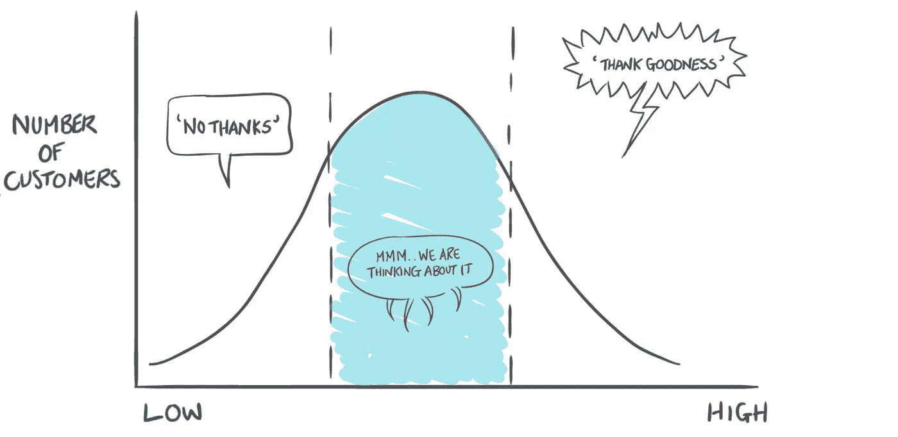
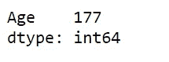
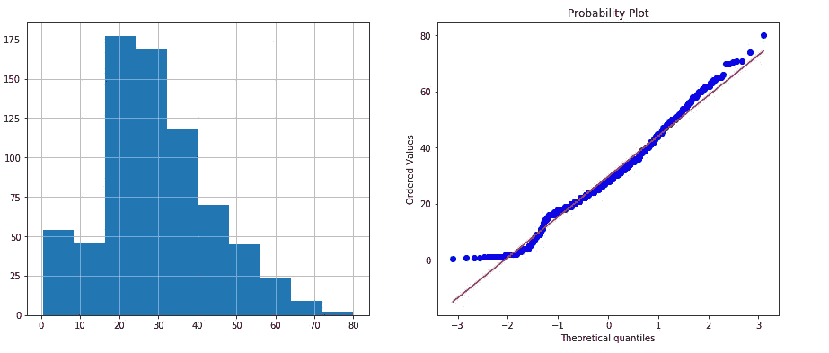
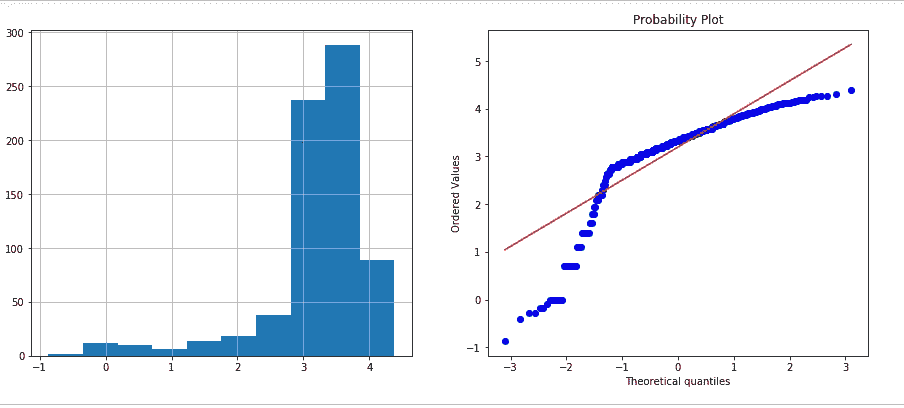
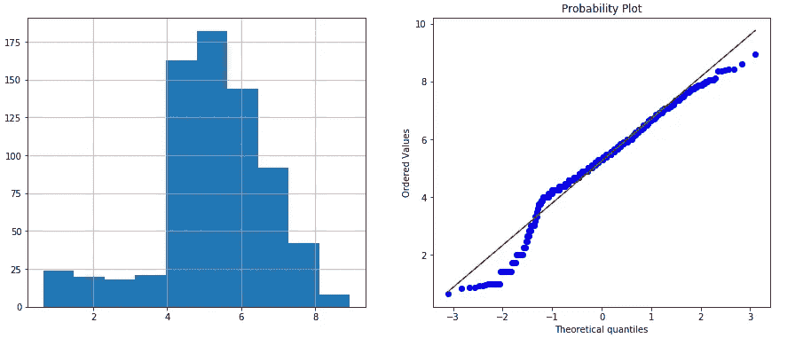
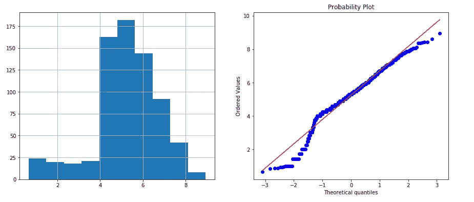
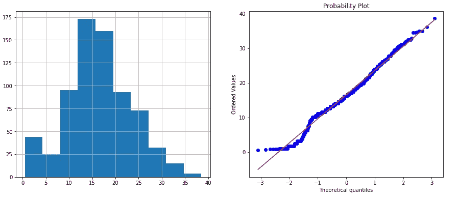

# 高斯分布简介

> 原文：<https://pub.towardsai.net/introduction-to-gaussian-distribution-726be7dc5046?source=collection_archive---------1----------------------->

## 朝向 AI 的高斯分布 101 |



样本正态分布

线性和逻辑回归等机器学习模型假设变量呈正态分布。其他人受益于具有“类高斯”分布的变量。在这种情况下，可用于预测 Y(输出)的 X(输入)的观测值在更大的值范围内变化，从而给出更好的结果。

如果一个变量不是正态分布的，有时可以找到一个数学变换来将一个变量转换成一个类似高斯的分布。

## 遵循高斯分布的变量变换:

这些是一些直接的数学方法来转换变量，使它们遵循高斯分布。他们谁也不比谁强。它们主要取决于变量的原始分布。他们是，

1.  对数变换
2.  相互转化
3.  平方根变换
4.  指数变换

在本文中，我们将比较著名的[泰坦尼克号数据集](https://www.kaggle.com/c/titanic/data)的“年龄”变量的所有这些转换。

让我们从导入包和加载数据集开始

```
#Importing Packages
import numpy as np 
import pandas as pd
import matplotlib.pyplot as plt
import pylab
import scipy.stats as stats#Importing dataset
data = pd.read_csv("train.csv", usecols = ['Age'])
```

然后让我们检查是否有任何丢失的值，并使用 Pandas dropna 方法删除它们(为了这个例子)

```
data.apply(lambda x: sum(x.isnull()),axis=0)
```



“年龄”中空值的数量

```
data = data.dropna()
```

## 原始分布:

让我们从可视化变量的分布开始，在我们的例子中，年龄，来自泰坦尼克号数据集。我们绘制了一个直方图来显示钟形和 Q-Q 图(两者都用于显示变量是否遵循高斯分布)。请记住，如果变量是正态分布的，我们应该在理论分位数上看到一条 45 度的直线。也就是说，真实的分位数值应该与理论值完全一致。

```
def diagnostic_plots(df, variable): 

    plt.figure(figsize=(15,6))
    plt.subplot(1,2,1)
    df[variable].hist()
    #plt.xlim((0, 100))

    plt.subplot(1,2,2)
    stats.probplot(df[variable], dist="norm", plot = pylab)

    plt.show()

diagnostic_plots(data, 'Age')
```

在这里，我创建了一个函数 diagnostic_plots，用于可视化变量是否遵循高斯分布。它将数据框和目标变量作为输入参数。函数的第一部分是直方图，第二部分是 Q-Q 图。我调用了变量“年龄”上的函数。



原始分布

变量遵循近似高斯分布。它稍微有点倾斜，这解释了下端偏离 45 度线(红线)的原因。

现在，让我们对年龄变量应用上述所有转换，并评估结果。

## 对数变换:

让我们应用 Numpy 的 log 函数并绘制诊断图。

```
data['Age_log'] = np.log(data.Age)diagnostic_plots(data, 'Age_log')
```



对数变换

我们可以看到，转换根本没有使年龄遵循高斯分布。请记住，0 的日志没有定义。因此，如果您的数据包含 0 —给它一个偏移量或使用另一种变换方法。

## 相互转换:

```
data['Age_reciprocal'] = 1 / data.Agediagnostic_plots(data, 'Age_reciprocal')
```



相互转化

我们可以看到，这种转变也没有帮助。

## 平方根变换:

接下来，我们将尝试平方根变换。

```
data['Age_sqrt'] = data.Age**(1/2)diagnostic_plots(data, 'Age_sqrt')
```



平方根变换

结果比其他的好一点，但仍然不是高斯的。开头和结尾有些偏差。最后，我们来试试指数变换。

## 指数变换:

在这里，我们可以尝试任何我们想要的指数。我选择 1.2 作为指数。但是你可以尝试不同的指数，看看分布如何变化。

```
data['Age_exp'] = data.Age**(1/1.2)diagnostic_plots(data, 'Age_exp')
```



指数变换

正如您在直方图中看到的，这种转换使“年龄”变量几乎遵循高斯分布。直方图中的峰值更居中，并且在 Q-Q 图中，在较低端值附近只有一些偏差。因此，在这种特殊情况下，我们可以看到指数变换效果最好。

## 那么，你应该转换变量吗？

这取决于你的最终目标。在商业环境中，最好使用变量的原始分布来训练模型，因为这样更容易解释，并且将来使用模型进行预测时可能会出现较少的问题。另一方面，在竞争的情况下，最好选择一个表现最好的变量。

参考资料:[https://www . udemy . com/feature-engineering-for-machine-learning/learn/](https://www.udemy.com/feature-engineering-for-machine-learning/learn/lecture/8749894#overview)