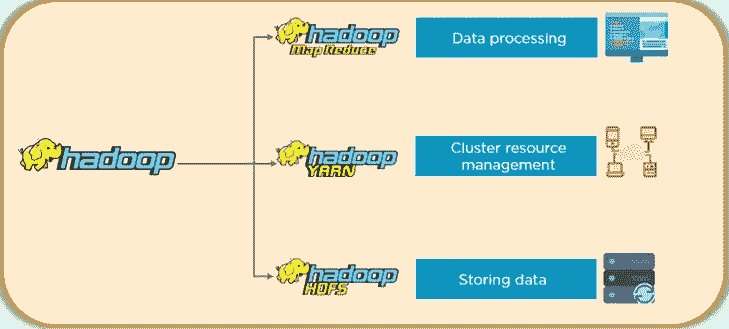
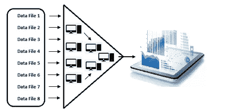
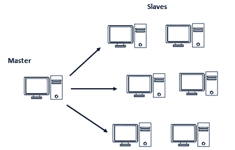
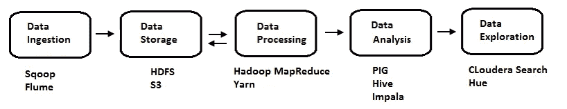

# Hadoop 生态系统简介

> 原文：<https://pub.towardsai.net/introduction-to-hadoop-ecosystem-206b7f58f001?source=collection_archive---------1----------------------->

## [数据分析](https://towardsai.net/p/category/data-analytics)

## 大型数据集的分布式处理框架

图片[来源](https://www.quora.com/What-is-hadoop-programming)

在本文中，我们将尝试学习大数据概念中 Hadoop 这个术语的基础知识。使用 Hadoop 的原因是为了处理大量的数据信息，并使其能够获得业务洞察力。大多数数据都是在几年内产生的。所有的数据都来自智能手机、社交网络、交易平台、机器和其他资源。

## 涵盖的主题:

**第一节:**简介

**第 2 部分:**处理大数据的挑战

**第 3 节:**分布式系统与挑战

**第四节:**传统数据库和 Hadoop

**第 5 节:**Hadoop 中的核心组件

**第 6 部分:**Hadoop 生态系统中的不同组件

> ***第一节:简介***

由于大部分数据已经可用，问题是我们是否要获取数据并做出有用的见解。过去，当需要查询大量数据时，企业会向他们选择的数据库供应商写一份大量的清单。

在早期，Google 发现很难通过单个数据库瓶颈抽取大量数据，他们根本无法编写足够大的检查来处理数据。为了简化这个问题，谷歌实验室团队开发了一种算法，允许将大型数据计算分割成较小的块，并映射到许多计算机上，然后在计算完成后，将它们组合在一起，产生最终的数据集。这种算法被命名为 Map-reduce。

Map-reduce 旨在简化作为搜索优化网站数据运行的大量数据集群。Hadoop 是作为 Nutch 项目下的一个子项目引入 Apache 的，Nutch 项目使用 Map-reduce 算法，Hadoop 项目用于在大量数据库上提供文本搜索。因此，我们是并行处理数据，而不是串行处理。

> ***第二节:处理大数据的挑战***

访问和处理不同类型的大量数据存在一些挑战。

*   第一个挑战是在单个数据存储系统上访问，因此解决这一挑战的方法是将单个存储转换为不同机器上的分布式存储。
*   第二个挑战是数据的处理。解决方法是通过 Map-reduce 将串行处理转换为并行处理。
*   存储非结构化数据的第三个挑战是 Hadoop 组件通过不验证数据模式来实现 HDFS。

因此，Hadoop 是一种以分布式方式并行处理大量数据的框架。

 [## Python 中的内存和垃圾收集

### 内存分配和释放

medium.com](https://medium.com/pythoneers/memory-and-garbage-collection-in-python-764e36bf8190)  [## 大数据项目中的银行市场客户分析

### 这个分析中使用的工具和语言是 spark 和 scala

pub.towardsai.net](/banking-market-customer-analysis-in-big-data-project-387ec95b56e5) 

> ***第三节:分布式系统及其挑战***

分布式系统是称为节点的分离且独立的软件或硬件组件的集合，这些组件使用网络链接在一起，并通过消息传递进行协调和通信来协调地一起工作，以实现系统的一个最终目标。根据系统要求，系统可以是非结构化的或高度结构化的。

普通的 RDBMS 不足以处理大量数据，所以每个大公司都在使用分布式系统。

## 挑战

由于该分布式系统中有许多计算机，可能会出现如下所示的问题:

*   有可能出现带宽有限的问题:因为大公司也想限制基础设施成本，所以带宽总是有限制。
*   分布式系统中的系统故障之一:故障是一种常态，而不是例外。因此，在分布式系统中，如果其中一个系统出现故障，我们的网站或服务不会受到影响。

> ***第四节:传统数据库与 Hadoop***

*   在传统系统中，数据发送给程序，而在 Hadoop 系统中，程序发送给数据。
*   RDBMS 处理结构化数据，Hadoop 可以处理结构化和非结构化数据。
*   处理是有限的，在 Hadoop 中，处理是与数据结合在一起的。
*   模式在 RDBMS 和 Hadoop 中是必需的，但不是强制性的/灵活的。
*   就速度而言，RDBMS 读取速度快，Hadoop 写入速度快。

> ***第五节:Hadoop 中的核心组件***

这些核心组件是 Hadoop 生态系统的支柱。除了核心组件之外，基于需求、用例和需求，在核心组件之上还有多个组件。Hadoop 中的三个主要核心组件对于任何发行版都是相同的，如下所示:

*   数据处理
*   资源管理
*   储存；储备

## 数据处理

数据处理包含 Map-reduce 框架，但被称为用于创建逻辑和程序的处理引擎

## 资源管理

该组件中的资源管理系统是 Yarn，也称为资源协商器，它为每个正在运行的进程提供资源。

## 储存；储备

Hadoop 系统中的存储引擎是 HDFS，即 Hadoop 分布式文件系统。

> ***第六节:Hadoop 生态系统中的不同组件***

假设一个客户端通过共享 RDMS 表给出某种格式的数据。Hadoop 系统中的数据工作流程解释如下:

1.  **数据摄取:**在这种方法中，借助工具 Sqoop 将结构化数据从 RDBMS 提取到 HDFS。如果数据是半结构化或非结构化的，那么我们需要数据摄取的另一个工具是 Flume。
2.  **数据存储:**数据摄取后存储在 Hadoop HDFS 中，然后进行逻辑和程序的 Map-reduce 处理。存储可以在 HDFS 或 S3。
3.  **数据处理:**逻辑的代码是用 Java 或者 C++写的，大部分时间我们看到的代码会是 Java。
4.  **资料分析:**但是大多数情况下，大多数人并不了解 java。因此，脸书发明了 Hive 工具，这是一种基于 SQL 的基于查询的接口，Hive 将其转换为结构化数据的 java 代码。由于 java 的困难，Yahoo 发明了另一个工具。PIG 也是基于过程语言，用于半结构化和非结构化数据。还有一个基于 SQL 但不同于 hive 的工具叫 Impala。Impala 不会转换为 Map-reduce，但会执行 Cloudera 开发的大规模并行处理(MPP)。
5.  **数据探索:**如果一个人来自一个纯粹的非技术背景，那么 Cloudera 使用基于 GUI 的工具进行搜索。另一个工具是用于数据探索的 Hadoop 用户体验(Hue)。

我希望你喜欢这篇文章。通过我的 [LinkedIn](https://www.linkedin.com/in/data-scientist-95040a1ab/) 和 [twitter](https://twitter.com/amitprius) 联系我。

# 推荐文章

1.[8 Python 的主动学习见解收集模块](/8-active-learning-insights-of-python-collection-module-6c9e0cc16f6b?source=friends_link&sk=4a5c9f9ad552005636ae720a658281b1)
2。 [NumPy:图像上的线性代数](/numpy-linear-algebra-on-images-ed3180978cdb?source=friends_link&sk=d9afa4a1206971f9b1f64862f6291ac0)3。[Python 中的异常处理概念](/exception-handling-concepts-in-python-4d5116decac3?source=friends_link&sk=a0ed49d9fdeaa67925eac34ecb55ea30)
4。[熊猫:处理分类数据](/pandas-dealing-with-categorical-data-7547305582ff?source=friends_link&sk=11c6809f6623dd4f6dd74d43727297cf)
5。[超参数:机器学习中的 RandomSeachCV 和 GridSearchCV](/hyper-parameters-randomseachcv-and-gridsearchcv-in-machine-learning-b7d091cf56f4?source=friends_link&sk=cab337083fb09601114a6e466ec59689)
6。[用 Python](https://medium.com/towards-artificial-intelligence/fully-explained-linear-regression-with-python-fe2b313f32f3?source=friends_link&sk=53c91a2a51347ec2d93f8222c0e06402)
7 全面讲解了线性回归。[用 Python](https://medium.com/towards-artificial-intelligence/fully-explained-logistic-regression-with-python-f4a16413ddcd?source=friends_link&sk=528181f15a44e48ea38fdd9579241a78)
充分解释了 Logistic 回归 8。[数据分发使用 Numpy 与 Python](/data-distribution-using-numpy-with-python-3b64aae6f9d6?source=friends_link&sk=809e75802cbd25ddceb5f0f6496c9803)
9。[机器学习中的决策树 vs 随机森林](/decision-trees-vs-random-forests-in-machine-learning-be56c093b0f?source=friends_link&sk=91377248a43b62fe7aeb89a69e590860)
10。[用 Python 实现数据预处理的标准化](/standardization-in-data-preprocessing-with-python-96ae89d2f658?source=friends_link&sk=f348435582e8fbb47407e9b359787e41)