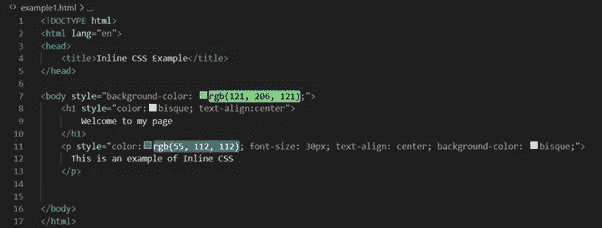
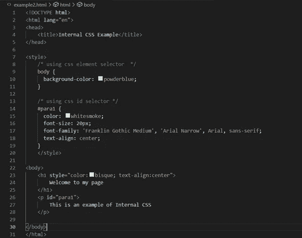
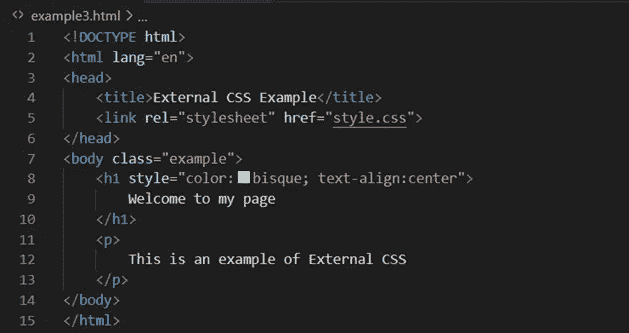
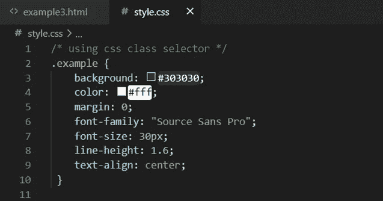
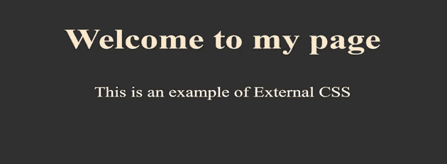

# 用于 Web 开发的 HTML 和 CSS 介绍

> 原文：<https://pub.towardsai.net/introduction-to-html-and-css-for-web-development-473eb25bd7c9?source=collection_archive---------2----------------------->

## 网页创建和格式化


潘卡杰·帕特尔在 [Unsplash](https://unsplash.com?utm_source=medium&utm_medium=referral) 上的照片

## 什么是 HTML？

HTML 是*超文本标记语言*的缩写，它是在网络浏览器中显示文档的标准标记语言。HTML 中的超文本指的是包含到其他文本的链接的文本，而标记指的是经常用于控制文档显示的数据，就像报纸印刷过程中，编辑标记应该出现在第一列、第二段等中的方式。因此，标记语言是一种用于将布局和格式约定应用于文本文档的语言，它由一系列定义内容在页面中显示方式的特殊标记组成。HTML 使用“标记”来注释文本、图片和其他内容，以便在 Web 浏览器中显示。HTML 标记由特殊的“元素”组成，如<头>、<标题>、<正文>、<头>、<尾>、<条>、<节>、< p >、< div >、< span >、< img >、<等等

HTML“标签”由包含在“”中的元素名称组成，将 HTML 元素与页面上的其他内容分开。标记中的元素名称不区分大小写，可以用大写、小写或两者的组合来写。例如，<title>标签可以写成<title>、<title>或任何其他变体。</title>

HTML 元素是 HTML 文档的一部分，它指示 web 浏览器如何解释和组织文本的特定部分。格式说明、语义和内容都可以在 HTML 元素中找到。例如，文档的标题由 title 元素表示。HTML 元素由开始标签、一些内容和结束标签指定。

示例:

这是一个示例文本

是一个 html 元素，

```
<p> is the starting tag
```

里面的字符串就是内容

```
</p> is the ending tag
```

HTML 类是一个文档属性，它允许您为具有相同类名的项目建立相同的样式。它主要用来指代一个特定的 HTML 标签。

示例:在上面的示例中，要将类名分配给 p 标签，需要编写以下内容:

```
<p class= “example”>
```

这是一个课堂例子

```
</p>
```

这里的一个例子是类名，我们用。我们的 CSS 中的例子。

HTML id 是一种属性，它为 HTML 元素指定唯一的标识符来标识它。

示例:在上面的示例中，为了将 id 分配给 p 标签，要进行以下操作，

```
<p id= “para1”>
```

这是一个 id 示例

```
</p>
```

## 什么是 CSS？

层叠样式表(CSS)是一种简单的设计语言，用来让网页看起来更好看。网页是通过 CSS 格式化的，CSS 可以附加到任何 HTML 元素上，根据开发者的选择来设置样式和位置。这给了他们自由，让屏幕上的任何东西看起来像一个人的选择。

CSS 中的**【层叠】**表示高优先级样式覆盖低优先级规则；如果我们在文档的前面应用了一种类型，然后在文档的后面对同一个元素应用了另一种样式，那么后者会胜出。

CSS 命令由选择器和声明块组成。

```
CSS Syntax: selector {
                      Property1: val1;
                      Property2: val2;
                     }
```

选择器定位想要设计样式的 HTML 元素。声明块包括一个或多个用分号分隔的声明。每个声明由一个 CSS 属性名和值组成，用冒号分隔。分号用于分隔多个 CSS 声明，声明块用花括号括起来。

## CSS 选择器的不同种类如下:

1.  元素选择器:元素选择器根据元素名称选择 HTML 元素。
2.  类选择器:类选择器用于查找具有指定类属性的 HTML 元素。为了将元素作为特定类的目标，我们编写了一个点(。)，后面是类名。人们还可以指出，通过使用格式元素 classname，在一个类中只有特定的元素受到影响。
3.  Id 选择器:id 选择器使用 HTML 元素的惟一 id 属性来选择特定的元素。具有特定 id 的元素是使用哈希(#)字符后跟元素 id 来指定的。
4.  通用选择器:用(*)字符表示的通用选择器用于选择页面上的所有 HTML 元素。
5.  分组选择器:它将精确的样式定义应用于一组 HTML 元素。在这里，每个选择器都用逗号分隔开，以便对一些选择器进行分组。

讨论了 HTML 和 CSS 的基本组件后，让我们了解如何在 HTML 中使用 CSS。

[](https://medium.com/pythoneers/make-webapp-with-streamlit-with-python-ecc59e488a5) [## 使用 Python 和 Streamlit 制作 WebApp

### 机器学习和数据科学网络框架

medium.com](https://medium.com/pythoneers/make-webapp-with-streamlit-with-python-ecc59e488a5) 

## 可以通过以下三种*方式在 HTML 中添加 CSS:*

1.  内联 CSS:通过在 HTML 元素中使用样式属性。这是一种将 CSS 规则插入 HTML 页面的简单方法，因此对于测试和快速修复页面非常有用。一个缺点是为每个 HTML 元素逐个添加样式非常耗时，并且会使结构变得非常混乱。



2.内部 CSS:通过在部分使用一个



3.外部 CSS:通过使用一个<link>元素链接到一个外部 CSS 文件。它用于设置多个 HTML 页面的样式。在这种情况下，由于 CSS 代码在一个单独的文档中，HTML 文档具有更清晰的结构，并且同一个 CSS 文件可以用于多个页面。外部 CSS 的缺点是，在加载外部 CSS 之前，页面可能无法正确显示，并且上传或链接多个 CSS 文件会增加网站的下载时间。



我希望你喜欢这篇文章。通过我的 [LinkedIn](https://www.linkedin.com/in/data-scientist-95040a1ab/) 和 [twitter](https://twitter.com/amitprius) 联系我。

# 推荐文章

1.[8 Python 的主动学习见解收集模块](/8-active-learning-insights-of-python-collection-module-6c9e0cc16f6b)
2。 [NumPy:图像上的线性代数](/numpy-linear-algebra-on-images-ed3180978cdb?source=friends_link&sk=d9afa4a1206971f9b1f64862f6291ac0)3。[Python 中的异常处理概念](/exception-handling-concepts-in-python-4d5116decac3?source=friends_link&sk=a0ed49d9fdeaa67925eac34ecb55ea30)
4。[熊猫:处理分类数据](/pandas-dealing-with-categorical-data-7547305582ff?source=friends_link&sk=11c6809f6623dd4f6dd74d43727297cf)
5。[超参数:机器学习中的 RandomSeachCV 和 GridSearchCV](/hyper-parameters-randomseachcv-and-gridsearchcv-in-machine-learning-b7d091cf56f4?source=friends_link&sk=cab337083fb09601114a6e466ec59689)
6。[用 Python](https://medium.com/towards-artificial-intelligence/fully-explained-linear-regression-with-python-fe2b313f32f3?source=friends_link&sk=53c91a2a51347ec2d93f8222c0e06402)
7 全面讲解了线性回归。[用 Python](https://medium.com/towards-artificial-intelligence/fully-explained-logistic-regression-with-python-f4a16413ddcd?source=friends_link&sk=528181f15a44e48ea38fdd9579241a78)
充分解释了 Logistic 回归 8。[数据分发使用 Numpy 与 Python](/data-distribution-using-numpy-with-python-3b64aae6f9d6?source=friends_link&sk=809e75802cbd25ddceb5f0f6496c9803)
9。[机器学习中的决策树 vs 随机森林](/decision-trees-vs-random-forests-in-machine-learning-be56c093b0f?source=friends_link&sk=91377248a43b62fe7aeb89a69e590860)
10。[用 Python 实现数据预处理的标准化](/standardization-in-data-preprocessing-with-python-96ae89d2f658?source=friends_link&sk=f348435582e8fbb47407e9b359787e41)