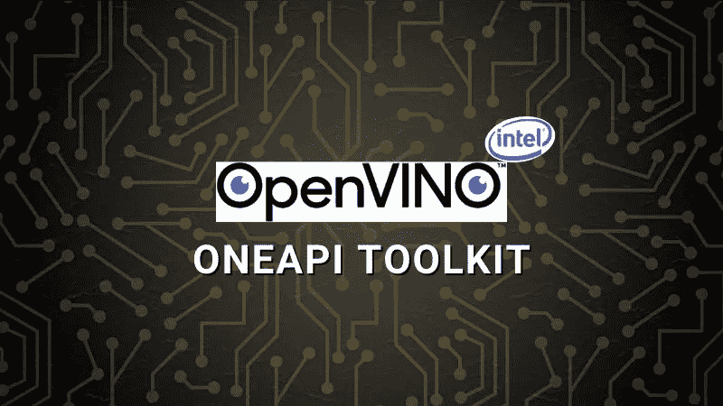
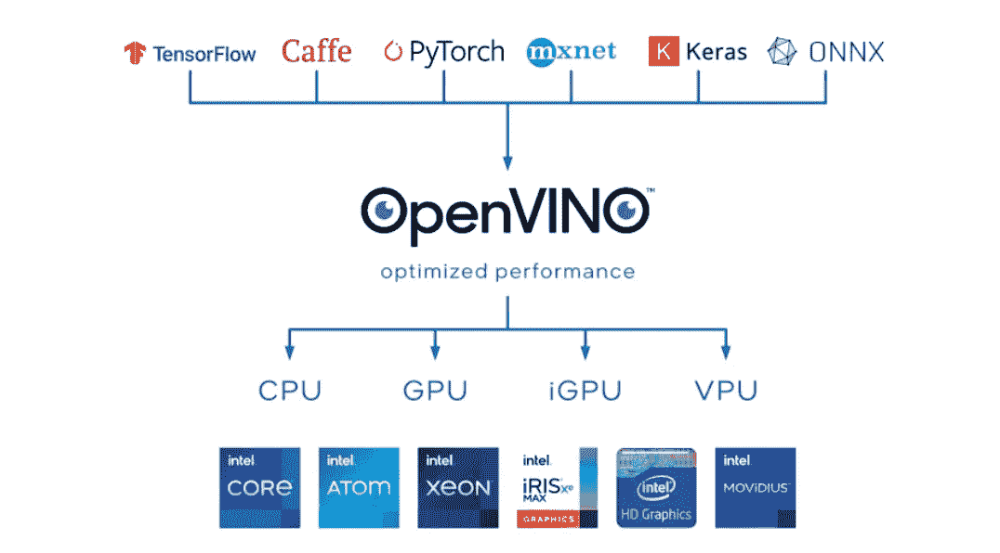
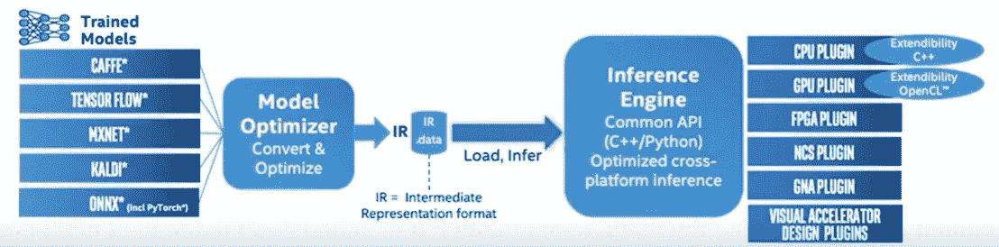

# OpenVINO Toolkit 英特尔发行版简介

> 原文：<https://pub.towardsai.net/introduction-to-intel-distribution-of-openvino-toolkit-b1ba5b0cf24f?source=collection_archive---------1----------------------->

## 优化深度学习模型以加快推理速度，并在异构英特尔架构上部署



作者图片

**目录**

[简介](#2ef4)
什么是 OpenVINO Toolkit？
[open vino 工具包是如何工作的？](#f6d6)
∘ [英特尔发布的 OpenVINO 工具包内容](#9f90)
∘ [英特尔发布的 OpenVINO 工具包的基本工作流程](#920a)
[安装](#935e)
[示例](#92e7)
∘ [步骤 1—下载模型](#d13c)
∘ [步骤 2—导入库](#006a)
∘ [步骤 3—将模型转换为 IR【t3t](#79f7)
∘ [第六步—加载一张图片](#4850)
∘ [第七步—推断](#7640)
[汇总](#6fca)
[引用](#1bd6)

# 介绍

oneAPI 是由英特尔开发的统一编程语言。借助 oneAPI 工具包，可以在 CPU、GPU、FPGA、AI 加速器等上运行相同的代码。没有任何代码更改。oneAPI 工具包进一步提高了性能。快速的性能是通过高度优化的低级库实现的，如 oneDAL、oneMKL 等。

有七个 oneAPI 工具包，每个工具包都是为不同的用户设计的。比如你看到的，AI Analytics Toolkit 是给数据科学家用的，HPC Toolkit 是给 HPC 开发者用的，等等。

*   [英特尔 oneAPI 基础工具包](https://www.intel.com/content/www/us/en/developer/tools/oneapi/toolkits.html#base-kit)(面向大多数开发人员)
*   [英特尔 oneAPI HPC 工具包](https://www.intel.com/content/www/us/en/developer/tools/oneapi/toolkits.html#hpc-kit)(面向 HPC 开发人员)
*   [英特尔 oneAPI 人工智能分析工具包](https://www.intel.com/content/www/us/en/developer/tools/oneapi/toolkits.html#analytics-kit)(面向数据科学家)
*   [**英特尔发布的 OpenVINO 工具包**](https://www.intel.com/content/www/us/en/developer/tools/oneapi/toolkits.html#openvino-kit) **(针对深度学习)**
*   [英特尔 oneAPI 渲染工具包](https://www.intel.com/content/www/us/en/developer/tools/oneapi/toolkits.html#rendering-kit)(面向视觉创作者、科学家和工程师)
*   [英特尔 oneAPI 物联网工具包](https://www.intel.com/content/www/us/en/developer/tools/oneapi/toolkits.html#iot-kit)(面向边缘设备和物联网开发人员)
*   [英特尔系统启动工具包](https://www.intel.com/content/www/us/en/developer/tools/oneapi/toolkits.html#bring-up-kit)(面向系统工程师)

[](/introduction-to-intels-oneapi-ai-analytics-toolkit-8dd873925b96) [## 英特尔 oneAPI 人工智能分析工具包简介

### 借助英特尔优化的 oneAPI AI 分析工具包，加快您的数据处理和机器学习流程

pub.towardsai.net](/introduction-to-intels-oneapi-ai-analytics-toolkit-8dd873925b96) 

在本文中，我们将介绍 OpenVINO toolkit 的英特尔发行版，它是什么，它是如何工作的，以及如何通过示例使用它。让我们开始吧。

# 什么是 OpenVINO Toolkit？

您是否正在尝试加速与视觉相关的推理任务，如图像分类、图像字幕、物体检测等。在你的深度学习应用上？那么只需看看英特尔发布的 OpenVINO toolkit 就够了。

OpenVINO 代表 Open**V**I**I**N**N**eural Network**O**optimization。顾名思义，它用于优化深度学习模型的神经网络，以完成与视觉相关的任务。

OpenVINO toolkit 包含通过应用不同的技术(如修剪、量化等)来优化神经网络的工具和库。在英特尔架构上以*与硬件无关的*方式加速推理。因此，通过使用 OpenVINO toolkit，您可以获得更快的推理、对英特尔架构上异构执行的支持、优化库 OpenCV 等优势。

# OpenVINO Toolkit 是如何工作的？

正如你所看到的，OpenVINO 采用了使用任何框架开发的深度学习模型，如 *TensorFlow、PyTorch、Mxnet、Keras、ONNX* 和 *Caffe* ，并将它们转换为一种标准格式(IR——中间表示格式),可以在任何英特尔硬件架构上运行，如 CPU、GPU、集成 GPU、FPGA、VPU 等。同时，OpenVINO 还为推理提供了优化的性能。



来源:[https://www . Intel . com/content/www/us/en/developer/tools/open vino-toolkit/overview . html](https://www.intel.com/content/www/us/en/developer/tools/openvino-toolkit/overview.html)

## **英特尔发布 OpenVINO 工具包内容**

英特尔发布的 OpenVINO toolkit 包含-

*   **模型优化器—** 模型优化器加载任何经过训练的深度学习，并将其转换为 IR(中间表示)格式。IR 格式为更快的推断进行了优化。
*   **推理机**—推理机读取 IR 格式，并负责在不同的硬件架构上运行模型，如 CPU、GPU、集成 GPU 等。
*   **模型动物园—**open vino 的模型动物园包含经过英特尔优化的预训练模型(如 VGG16、Alexnet、Yolo 等)以及公开发布的预训练模型。这些预训练模型包括涉及对象检测、图像分类、图像分割等的用例。Model Zoo 资源库包含许多示例，可以帮助您快速入门 OpenVINO。

## 英特尔发布 OpenVINO 工具包的基本工作流程

**步骤 1 —** 作为第一步，将已经训练好的深度学习模型加载到模型优化器中，然后模型优化器将模型转换成中间表示。这种红外格式包含两个文件—

*   *。XML*——描述网络拓扑。
*   *。bin* -包含二进制格式的权重和偏差。



基本工作流程(来源:英特尔)

注意，可以使用应用训练后量化方法的 [**训练后优化**](https://docs.openvino.ai/latest/pot_introduction.html#doxid-pot-introduction) 对生成的 IR 文件进行进一步优化。

**步骤 2 —** 接下来，在用户应用中，推理引擎加载 IR 文件，并使用它们在云、边缘或内部的英特尔架构上进行推理。

# 装置

既然我们已经理解了什么是 OpenVINO 以及它做什么，让我们安装这个工具包，然后在下一节中，我们看两个例子。

在开始安装之前，请检查 [***系统需求***](https://www.intel.com/content/www/us/en/developer/tools/openvino-toolkit/system-requirements.html) 。

(1).安装 OpenVINO 工具包有两个选项。根据您的需求选择合适的产品。

*   ***OpenVINO Runtime***—如果您已经完成了模型开发并准备好进行部署，那么继续使用 open vino Runtime。
*   ***OpenVINO 开发工具—*** 如果需要开发模型，将其转换为 IR 格式，优化后安装 OpenVINO 开发工具。

(2).转到下面的链接，并按照屏幕上的指示下载。[https://www . Intel . com/content/www/us/en/developer/tools/open vino-toolkit/download . html](https://www.intel.com/content/www/us/en/developer/tools/openvino-toolkit/download.html)。

选择*环境:开发工具*、*操作系统:Linux* 、 *OpenVINO 工具包版本:2022.1* 、*发行版:pip* 、*框架:TensorFlow 2.x* 后，要求我使用命令`pip install openvino-dev[tensorflow2]==2021.4.2`安装 OpenVINO。根据您的操作系统、框架等遵循类似的步骤，并安装软件。

```
# Create environment 
conda create -n openvino_env python=3.8# Activate the environment
conda activate openvino_env# Install OpenVINO
pip install openvino-dev[tensorflow2]==2021.4.2# Install and Open Jupyter notebook
pip install jupyter
jupyter notebook
```

要确认安装，请在命令提示符下运行`mo -h`,如果您获得了关于 model optimizer 命令的详细信息，那么您的安装就成功了。

# 例子

在这一节中，我们将使用预先训练好的张量流模型`inception-resnet-v2-tf`来完成使用 OpenVINO 工具包的图像分类任务。从您在上一节中创建的虚拟环境`openvino_env`中打开 Jupyter 笔记本。

## **步骤 1—下载模型**

执行以下命令，将预先训练好的模型`inception-resnet-v2-tf`下载到`/home/chetan/public`文件夹。

```
**!omz_downloader --name inception-resnet-v2-tf**
################|| Downloading inception-resnet-v2-tf ||################========== Downloading /home/chetan/public/inception-resnet-v2-tf/inception_resnet_v2_2018_04_27.tgz
... 100%, 220587 KB, 6325 KB/s, 34 seconds passed========== Unpacking /home/chetan/public/inception-resnet-v2-tf/inception_resnet_v2_2018_04_27.tgz
```

## **步骤 2—导入库**

```
import cv2
import matplotlib.pyplot as plt
import numpy as np
from openvino.runtime import Core
from pathlib import Path
from IPython.display import Markdown
```

## **步骤 3—将模型转换为 IR**

**步骤 3a——设置预训练和转换模型的路径**

```
model_path = Path("/home/chetan/public/inception-resnet-v2-tf/inception_resnet_v2.pb")
ir_path = Path(model_path).with_suffix(".xml")
```

**步骤 3b —构建运行模型优化器的命令**

接下来，我们需要构造命令来运行模型优化器。要获得对`mo`所有参数的概述，请运行`mo --help`。以下是对以下代码中使用的参数的解释—

*输入模型:*预训练模型或源模型的路径(TensorFlow、PyTorch、Caffe、Mxnet 等)

*input_shape* :应该馈入模型输入节点的形状。

*mean_values:* 是用于每个通道的输入图像的平均值，遵循[R，G，B]格式。请注意，顺序取决于用于训练的模型。

*scale_values:* 所有的值都除以这个值。

*data_type* :指定中间张量和权重的数据类型。例如，如果原始模型是 FP32，那么指定 FP16 将导致模型权重和偏差压缩到 FP16。

*output_dir* :您要存储转换后的 ir 格式模型的文件夹。

```
mo_command = f"""mo
                 --input_model "{model_path}"
                 --input_shape "[1,299,299,3]"
                 --mean_values="[127.5,127.5,127.5]"
                 --scale_values="[127.5]"
                 --data_type FP16
                 --output_dir "{model_path.parent}"
                 """
mo_command = " ".join(mo_command.split())
print("Model Optimizer command to convert TensorFlow to OpenVINO:")
display(Markdown(f"`{mo_command}`"))
```

**步骤 3c —运行模型优化器**

在前面的步骤中构建了模型优化器命令后，运行下面的命令。这将把模型转换成红外格式。请注意，这需要几分钟时间。

```
print("Exporting TF model to IR. This may take a few minutes.")
! $mo_command
```

模型优化器将创建 3 个文件— `inception_resnet_v2.xml`、`inception_resnet_v2.mapping`和`inception_resnet_v2.bin`。

## 步骤 4-加载转换后的模型

在上一步中，我们已经将模型转换为 IR。接下来，用`Core()`初始化推理机，然后用`read_model()`加载 IR，最后用`compile_model()`编译特定设备的模型。因为我们是在 CPU 上做的，所以设置 device_name='CPU '。

```
# Load the converted model
ie = Core()
model = ie.read_model(model="public/inception-resnet-v2-tf/inception_resnet_v2.xml")
compiled_model = ie.compile_model(model=model, device_name="CPU")
```

我们只通过了。要读取的 xml 文件 _model。但是 read_model 需要。bin 文件放在同一个目录中。

## 步骤 5-获取型号信息

我们可以从`model.inputs`和`model.outputs`或者`compiled_model.inputs`和`compiled_model.outputs`得到模型的输入和输出信息。

```
input_key = next(iter(compiled_model.inputs))
output_key = next(iter(compiled_model.outputs))
network_input_shape = input_key.shape
```

## 步骤 6 —加载图像

下面我们从网上加载一张孟加拉虎 [**图片**](https://biologydictionary.net/bengal-tiger/) 。inception_resnet 模型需要 RGB 格式的图像，因此我们将图像从 BGR2RGB 转换，并根据模型调整图像大小，最后调整图像大小。

```
# The Inception Resnet network expects images in RGB format
image = cv2.cvtColor(cv2.imread(filename="data/cat.jpeg"), code=cv2.COLOR_BGR2RGB)# Resize image to network input image shape
resized_image = cv2.resize(src=image, dsize=(299, 299))# Transpose image to network input shape
input_image = np.expand_dims(resized_image, 0)plt.imshow(image);
```


来源:[https://biologydictionary.net/bengal-tiger/](https://biologydictionary.net/bengal-tiger/)

## 第七步——推理

在最后一步，我们通过调用`compiled_model()`进行推理。该模型将`result_index`输出为 293，为了获得该值的含义，我们需要相应的标签`labels.txt`，即“ ***tiger*** ”。

```
result = compiled_model([input_image])[output_key]
result_index = np.argmax(result)# Convert the inference result to a class name.
imagenet_classes = open("/home/chetan/public/inception-resnet-v2-tf/labels.txt").read().splitlines()imagenet_classes[result_index]
```

输出:

```
Result index 293
Predicted class: tiger
```

您刚刚通过 OpenVINO workflow 运行了一个 TensorFlow 模型。万岁！给自己一个鼓励！！这是你应得的👏。这是向您介绍 OpenVINO 工具包的一个简单例子。

在[官方文档](https://docs.openvino.ai/latest/index.html)上有数百个教程和演示可以用来开始使用 OpenVINO，涵盖了各种用例。我强烈建议你尽可能多的看一些例子。以便您可以在下一个深度学习应用程序中轻松使用 OpenVINO 工具包。

# 摘要

在这篇博客中，我们介绍了什么是 OpenVINO toolkit，它是如何工作的，该工具包包含什么，最后通过一个使用预训练模型的图像分类示例。希望这篇文章对你有用。

注意，OpenVINO 工具包包含了很多工具和库。在这篇文章中，我仅仅触及了皮毛🙂。要学的东西太多了比如*模型动物园*、 *OpenVINO 深度学习工作台*、*优化后量化(POT)* 、*附加组件(OpenVINO 模型服务器*、 *OpenVINO 安全*等等。)、*媒体处理&计算机视觉库(OpenCV、OpenCL)* 等。对于那些好奇的头脑，我建议你多探索一下 OpenVINO。

# 进一步阅读

*   [Python 中 a=a+b 和 a+=b 的区别](/the-difference-between-a-a-b-and-a-b-in-python-a7338d96e408)
*   [使用 Faker 和 Python 生成假数据](https://pythonsimplified.com/generate-fake-data-using-faker-and-python/)
*   [Python 中 sort()和 sorted()的区别](https://pythonsimplified.com/difference-between-sort-and-sorted-in-python/)
*   [最有争议的蟒蛇海象运营商](https://pythonsimplified.com/the-most-controversial-python-walrus-operator/)
*   [了解 Python 中的索引和切片](https://pythonsimplified.com/understanding-indexing-and-slicing-in-python/)
*   [理解 Python 中的可迭代项和迭代器](https://pythonsimplified.com/making-sense-of-python-iterables-and-iterators/)
*   [理解 Python 中的生成器](https://pythonsimplified.com/understanding-generators-in-python/)

我希望你喜欢阅读这篇文章。如果你喜欢我的文章并想订阅 Medium，你可以点击这里的[](https://chetanambi.medium.com/membership)**。你的会员费直接支持我和你看的其他作家。你也可以在媒体上看到所有的故事。**

**[](https://chetanambi.medium.com/membership) [## 通过我的推荐链接加入媒体- Chetan Ambi

### 阅读 Chetan Ambi 的每一个故事(以及媒体上成千上万的其他作家)。您的会员费直接支持…

chetanambi.medium.com](https://chetanambi.medium.com/membership)** 

# **参考**

**[1].[https://docs.openvino.ai/latest/index.html](https://docs.openvino.ai/latest/index.html)**

**[2].[https://www . Intel . com/content/www/us/en/developer/tools/dev cloud/edge/learn/open vino . html](https://www.intel.com/content/www/us/en/developer/tools/devcloud/edge/learn/openvino.html)**

**#oneAPI**