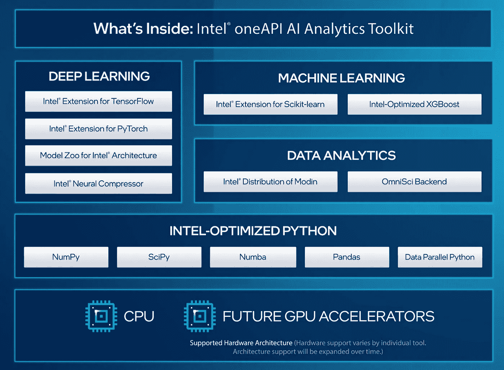

# 英特尔 oneAPI 人工智能分析工具包简介

> 原文：<https://pub.towardsai.net/introduction-to-intels-oneapi-ai-analytics-toolkit-8dd873925b96?source=collection_archive---------2----------------------->

## 借助英特尔优化的 oneAPI AI 分析工具包，加快您的数据处理和机器学习流程


作者图片

**目录**

[oneAPI 是什么？](#c34d)
[oneAPI AI 分析工具包](#130b)
∘ [1。英特尔优化的摩丁](#410d)∘[2。英特尔优化的 sci kit-学习](#b830)
∘ [3。英特尔优化 XGBoost](#6761)
∘ [4。英特尔优化张量流&py torch](#3ccf)t19】∘[5。英特尔优化的 python](#fa2d)t22】∘[6。英特尔架构模型动物园](#9a45)
∘ [7。英特尔神经压缩器](#651f)
[概要](#bf43)
[参考文献](#5185)

# oneAPI 是什么？

有 CPU、GPU、FPGAs、AI 加速器等不同的硬件架构。为一种架构编写的代码不容易在另一种架构上运行。比如为 CPU 写的代码，不做一些改动就不会在 GPU 上运行。这是开发者想把代码从 CPU 迁移到 GPU(或者 FPGAs 或者 AI 加速器)时面临的问题之一。

英特尔提出了一个名为 oneAPI 的统一编程模型来解决同样的问题。有了 oneAPI，无论您使用哪种硬件架构(CPU、GPU、FGPA 或加速器)或库或语言或框架，相同的代码都可以在所有硬件架构上运行，无需任何更改，并提供额外的性能优势。

> *“oneAPI 是一种跨行业、开放、基于标准的统一编程模型，可跨加速器架构提供通用的开发人员体验，以实现更快的应用性能、更高的工作效率和更大的创新。* "- [oneAPI](https://www.oneapi.io/) 。

英特尔提供了大约七种 oneAPI 工具包。您可以根据自己的需要选择工具包。我是一名数据科学家，因此我想尝试一下英特尔 oneAPI 人工智能分析工具包。在本文中，我们将主要介绍 oneAPI AI 分析工具包。

*   [英特尔 oneAPI 基础工具包](https://www.intel.com/content/www/us/en/developer/tools/oneapi/toolkits.html#base-kit)(面向大多数开发人员)
*   [英特尔 oneAPI 高性能计算工具包](https://www.intel.com/content/www/us/en/developer/tools/oneapi/toolkits.html#hpc-kit)(面向高性能计算开发人员)
*   [**英特尔 oneAPI AI 分析工具包**](https://www.intel.com/content/www/us/en/developer/tools/oneapi/toolkits.html#analytics-kit) **(针对数据科学家)**
*   [英特尔发布 OpenVINO toolkit](https://www.intel.com/content/www/us/en/developer/tools/oneapi/toolkits.html#openvino-kit) (面向深度学习开发者)
*   [英特尔 oneAPI 渲染工具包](https://www.intel.com/content/www/us/en/developer/tools/oneapi/toolkits.html#rendering-kit)(面向视觉创作者、科学家和工程师)
*   [英特尔 oneAPI 物联网工具包](https://www.intel.com/content/www/us/en/developer/tools/oneapi/toolkits.html#iot-kit)(面向边缘设备和物联网开发人员)
*   [英特尔系统启动工具包](https://www.intel.com/content/www/us/en/developer/tools/oneapi/toolkits.html#bring-up-kit)(面向系统工程师)

> 起初，我不愿意学习 oneAPI，因为我期望有一个陡峭的学习曲线。事实证明我错了。安装完成后，只需修改几行代码，您就可以立即开始使用该工具包。通过阅读本文的其余部分，您将会看到安装和使用它是多么容易。

# oneAPI 人工智能分析工具包

英特尔 oneAPI 人工智能分析工具包(以下简称为工具包)由许多工具和框架组成。该工具包可以帮助数据科学家显著加快他们的数据分析和机器学习工作流程。

下图总结了工具箱中所有可用的工具。请注意，所有这些工具都针对英特尔家族架构进行了优化。



来源:[https://www . Intel . com/content/www/us/en/developer/videos/accelerate-end-to-end-ai-pipelines-with-one API . html # GS . ula 394](https://www.intel.com/content/www/us/en/developer/videos/accelerate-end-to-end-ai-pipelines-with-oneapi.html#gs.ula394)

在接下来的小节中，我们将介绍工具箱中所有可用的工具和库。我们将通过例子介绍 *Modin、Scikit-learn、*和 *XGBoost* 。但是我们简要地涉及了 *TensorFlow* 、 *Pytorch* 、 *Model Zoo* 、 *Neural Compressor* 和 *Intel Python* ，因为我计划在未来的文章*中讨论这些。*

请注意，以下代码是在 Ubuntu 20.04 LTS 环境下使用英特尔酷睿 i5–6200 CPU 和 16GM RAM 进行测试的。

## 1.英特尔优化的摩丁

摩丁是熊猫的替代者，以加快熊猫的运作。Pandas 使用单个内核，而 Modin 则利用系统上所有可用的内核来加速 Pandas 的运行。

借助英特尔优化的 Modin，您可以进一步提高 Pandas 的运行速度。锦上添花的是，你只需要做一行修改就可以使用它。

从终端运行以下命令。这将创建一个名为`aikit-modin`的独立环境。安装将需要几分钟时间，因为它必须安装许多英特尔优化库。

```
>>> conda create -n aikit-modin -c intel intel-aikit-modin
>>> conda activate aikit-modin
>>> jupyter notebook
```

> 请注意，`*intel-aikit-modin*`软件包包括**英特尔分发的 Modin** 、**英特尔 Scikit-learn 扩展**，以及**英特尔 XGboost 优化**。所以你不必在下面的 2 个部分分别安装 Scikit-learn 和 XGboost。

**示例:**在下面的示例中，Modin 能够成功读取 CSV 文件。您可以继续在数据帧上使用任何 Pandas 操作。摩丁覆盖了几乎 90%的熊猫 API(函数/方法)。摩丁的美妙之处在于，如果有任何 API 没有被摩丁覆盖，它将退回到默认的熊猫 API，这样我们就不会遇到任何错误。

```
import numpy as np
import modin.pandas as pddf = pd.read_csv('Reviews.csv')
```

## 2.英特尔优化的 sci kit-了解

Scikit-learn 是最流行和最广泛使用的实现机器学习算法的库。英特尔优化的 Scikit-learn 有助于加快单节点和多节点系统上的模型构建和推理。

如果你已经安装了`intel-aikit-modin`，那么英特尔优化的 Scikit-learn 应该已经安装了。如果您只想使用 Scikit-learn，您可以使用下面的任何命令来安装它。

```
pip install scikit-learn-intelex 
OR
conda install scikit-learn-intelex -c conda-forge
```

为了使用英特尔优化的 Scikit-learn，我们只需添加以下两行。英特尔优化的 Scikit-learn 自动修补 Scikit-learn 算法，以使用 oneAPI 数据分析库，而不会影响模型性能。

```
from sklearnex import patch_sklearn
patch_sklearn()
```

要取消修补，运行这行代码-

```
sklearnex.unpatch_sklearn()
```

**示例:**在下面的示例中，我们使用亚马逊食品评论数据集，通过英特尔优化的 Scikit-learn 运行一个简单的朴素贝叶斯分类器。

## 3.英特尔优化 XGBoost

XGBoost 是数据科学中使用最广泛的提升算法之一。在与 XGBoost 社区的合作中，英特尔优化了 XGBoost 算法，以提供高性能的 w.r.t .模型训练和更快的英特尔架构推断。

**示例**

## 4.英特尔优化的 TensorFlow 和 Pytorch

英特尔与谷歌和 Meta(脸书)合作，针对英特尔架构优化了两个流行的深度学习库 TensorFlow 和 Pytorch。通过使用英特尔优化的 TensorFlow 和 Pytorch，您将受益于更快的训练时间和推断。

锦上添花的是，要使用英特尔优化的 TensorFlow 和 Pytorch，你不需要修改任何东西。你只需要根据你的需求安装`intel-aikit-tensorflow`或者`intel-aikit-pytorch`就可以开始使用框架了。就这么简单！！

```
>>> conda create -n aikit-pt -c intel intel-aikit-pytorch
OR
>>> conda create -n aikit-tf -c intel intel-aikit-tensorflow
```

## 5.英特尔优化的 Python

AI 分析工具包还附带了英特尔优化的 Python。当您安装上述任何工具( *Modin 或 TensorFlow、*或 *Pytorch* )时，默认情况下也会安装英特尔优化的 Python。

Python 的英特尔发行版包括常用的库，如 *Numpy、SciPy、Numba、Pandas* 和 D *ata 并行 Python* 。所有这些库都经过优化以提供高性能，这是通过有效使用多线程、矢量化以及更重要的内存管理来实现的。

有关英特尔发布 Python 的更多详情，请参考 [**此处**](https://www.intel.com/content/www/us/en/developer/tools/oneapi/distribution-for-python.html) 。

## 6.英特尔架构的模型动物园

英特尔模型动物园包含预训练模型(如 ResNet、UNet、BERT 等)的链接。)、样本脚本、最佳实践和分步指南，在英特尔架构上运行流行的机器学习模型。

关于模型动物园的更多详情，请参见 [**此处**](https://github.com/IntelAI/models) 。

## 7.英特尔神经压缩器

英特尔神经压缩器是一个开源的 Python 库，可以帮助开发人员在流行的深度学习框架上部署低精度推理解决方案——tensor flow、Pytorch 和 ONNX。

该工具通过应用不同的压缩技术，如量化、修剪、混合精度等，自动优化低精度配方。从而在不损失准确性的情况下提高推理性能。

关于神经压缩器的更多细节，参见 [**本**](https://www.intel.com/content/www/us/en/developer/tools/oneapi/neural-compressor.html) 。

# 摘要

在这篇博文中，我们介绍了什么是 oneAPI 以及可用的不同工具包。然后，我们介绍了英特尔 oneAPI 人工智能分析工具包库在 Modin、Scikit-learn 和 XGBoost 上的重要性，并举例说明。我们简要介绍了其他可用的工具，如 TensorFlow、Pytorch、Neural Compressor 和 Model Zoo。

**#oneAPI**

我希望你喜欢阅读这篇文章。如果你喜欢我的文章并想订阅 Medium，你可以点击这里的[](https://chetanambi.medium.com/membership)**。你的会员费直接支持我和你看的其他作家。你也可以在媒体上看到所有的故事。**

**[](https://chetanambi.medium.com/membership) [## 通过我的推荐链接加入媒体- Chetan Ambi

### 阅读 Chetan Ambi 的每一个故事(以及媒体上成千上万的其他作家)。您的会员费直接支持…

chetanambi.medium.com](https://chetanambi.medium.com/membership)** 

# **参考**

**[1].[https://www . Intel . com/content/www/us/en/developer/tools/oneapi/ai-analytics-toolkit . html # GS . vsqlib](https://www.intel.com/content/www/us/en/developer/tools/oneapi/ai-analytics-toolkit.html#gs.vsqlib)**

**[2].[https://github . com/oneAPI-src/oneAPI-samples/tree/master/AI-and-Analytics](https://github.com/oneapi-src/oneAPI-samples/tree/master/AI-and-Analytics)**