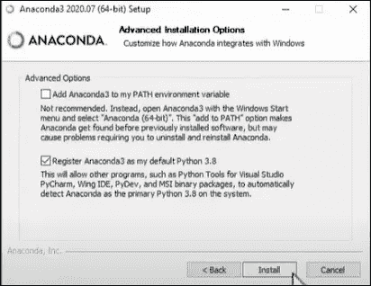
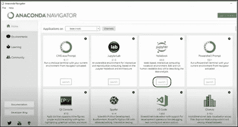
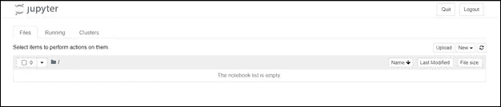
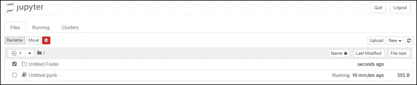
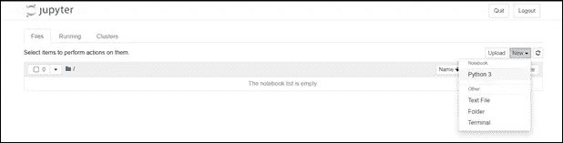
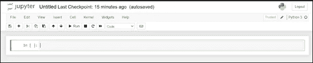
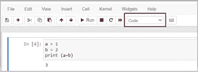
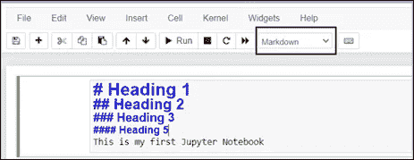
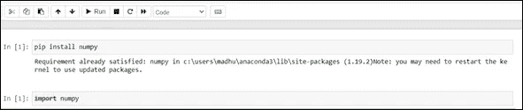
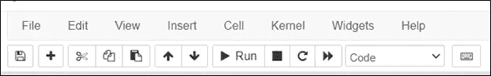

# Jupyter 笔记本及其特点介绍

> 原文：<https://pub.towardsai.net/introduction-to-jupyter-notebook-and-its-features-3929e6b5c54a?source=collection_archive---------1----------------------->

## [工程](https://towardsai.net/p/category/engineering)

## Jupyter Notebook 是一个开源的 web 应用程序

图片[来源](https://hackersandslackers.com/running-jupyter-notebooks-on-a-ubuntu-server/)

> ***Jupyter 笔记本简介***

你有没有遇到过在同一个应用程序中编写代码和文档的情况？Jupyter notebook 就是这样一个应用程序，它可以让你做到这一点。

Jupyter Notebook 是一个开源的 web 应用程序；这使得数据科学家能够创建和共享文档，包括实时代码、等式、计算输出、可视化、多媒体资源和解释性文本。只使用“shift + enter”键，Jupyter Notebook 中的代码就会被执行，这有助于确定代码是否有效。正因为如此，它已经成为数据科学家使用的日常工具之一，因为它易于探索和绘制数据。

好了，现在你可能想知道为什么对一个用于文档和编码目的的工具大肆宣传，因为 Jupyter Notebook 处理的不是 1 种而是 40 种编程语言，包括 Scala、R、Python 和 Julia。

*现在我们已经对这个应用程序有了一个简单的展望，让我们来看看使用 Jupyter Notebook 的一些优点和缺点:*

> ***优点:***

*   这是简单而基本的。
*   它可以在没有服务器或浏览器的情况下运行
*   它只需要安装 Anaconda
*   它还有一个内置的调试器

> ***记过:***

*   我们编码时，所做的更改不会自动保存。
*   它不太适合运行长时间的异步任务。
*   它以无序的方式运行细胞。
*   它的安全性较低。

 [## 你要转行做数据科学和机器学习吗？

### 分析角色和成为数据科学家的路线图

pub.towardsai.net](/are-you-switching-careers-to-data-science-and-machine-learning-5fab0b75470e) 

> ***Jupyter 笔记本安装必备***

在安装 Jupyter 笔记本之前，有必要在您的系统中安装编程语言。

**举个例子:**让我们考虑一下，如果你想用 Python 在 Jupyter 笔记本中工作。要做到这一点，你必须安装 Python(版本 3.7 或以上)，然后继续安装 Jupyter Notebook。同样的过程也适用于其他语言。例子:Scala，R，Julia 等。

## **第一步:安装 Jupyter 笔记本**

安装 Jupyter notebook 最简单的方法之一是使用 Anaconda。可以访问 [Anaconda](https://www.anaconda.com/products/individual) 网站；根据您的系统要求下载并安装它。

***注意:*** *在安装过程中，当你遇到‘高级安装选项’部分:*

如果您的系统中已经安装了 python，请选择第二个选项，说明您正在使用的默认 Python 版本。如果您没有安装 Python，请继续使用第一个选项。

## **第二步:启动 Jupyter 笔记本**

安装完成后，只需两步即可启动 Jupyter 笔记本电脑:

1.  在你的系统中搜索 Anaconda navigator，打开它。
2.  点击 Jupyter 笔记本下的“启动”。

当您启动 Jupyter 笔记本时，您会看到类似这样的内容。

这是保存所有项目的根文件夹的路径。

您也可以创建一个新文件夹来保存您将要处理的项目。

1.  转到“新建”→文件夹。
2.  选择文件夹，然后单击重命名。

3.双击文件夹，现在你已经准备好开始你的第一个笔记本了。

4.要开始使用笔记本，您只需点击“新建”，然后选择编程语言。

举个例子:这里，是 Python(3.7 版本)。

你会得到这样的东西:

## **第三步:制作你的第一个 Jupyter 笔记本(Python)**

将创建一个新文件(笔记本),您可以在其中输入 python 命令。现在让我们看一些使用 Python 命令的例子。

**简单命令**

在 Jupyter notebook 中，命令是在单元格中编写/执行的。

有三种类型的细胞:

1.  **编码单元格:**

在此单元格中编写的任何内容都被视为编程语言的语句。默认情况下，编程语言是 Python。因此，在单元中执行的语句将在输出单元中显示结果。您可以通过单击“运行”(显示在任务栏中)或 Shift + Enter 键来显示输出。

例如:图 1。

2.**降价单元格:**

减价单元格将您在此处写的任何内容视为文本。这种类型的单元格提供了使文本加粗、斜体、呈现表格内容、显示有序或无序列表等选项。当您想在编写代码的同时提供一些文档时，Markdown 单元格非常有用。

一旦你点击“Shift+Enter”键，这将是你的输出:

**3。原始单元格:**

该单元格将笔记本转换为另一种格式，如 Html 或 Latex。

***比如:*** *让我们考虑一下，如果你要把一个. ipynb 文件转换成. html 文件。*

使用命令行工具，您可以将笔记本转换为另一种格式。这意味着标记为“Raw NBConvert”的单元格将被转换为 to.html 格式。

> ***安装包***

我们现在知道了使用 Python 来使用 Jupyter 笔记本的基本知识。但是当我们需要一个 python 包，而这个包在我们已经安装的版本中不可用时，会发生什么呢？Jupyter 笔记本让你安装包暂时放心。

您可以使用“pip”命令安装 python 包，如下所示:

这样，你就可以安装其他的包了。

 [## 如何用 Python 创建虚拟环境

### 具有特定 python 版本和一些附加包的环境

medium.com](https://medium.com/pythoneers/how-to-create-a-virtual-environment-in-python-9c243ed3a54c) 

## **使用 Jupyter 笔记本中的工具栏**

除了编码和文档功能，Jupyter Notebook 还提供了一些有趣的选项。让我们看一看:

1.  **文件:**

在“文件”中，你有和每个应用程序一样的选项。例如:创建新笔记本、保存和重命名。但是有一些新增加的功能，如:

*   **保存和检查点:**当您点击“保存和检查点”时，笔记本和检查点文件都会更新。当遇到意外问题时，检查点允许您恢复任何未保存的工作。
*   **下载为:**“下载为”选项允许我们以 Jupyter 笔记本规定的格式下载 python 笔记本。

2.**编辑:**在编辑中，您可以选择剪切、复制、粘贴、删除、拆分、合并和移动笔记本中选定的单元格。

3.**视图:**在视图中，您可以选择隐藏和取消隐藏标题和工具栏部分，以便更清楚地了解您正在处理的内容。

4.**插入:**在插入中，您可以根据自己的喜好选择在上方或下方添加新单元格。

5. **Cell:** 在 Cell 中，Jupyter notebook 为你提供了多种运行代码的方式。它可以是单个细胞，也可以同时是所有细胞。

6.内核:在内核中，如果你遇到任何网络问题，Jupyter Notebook 为你提供了重启、关机或中断的选项。

> ***结论:***

总之，本文涵盖了从安装 Jupyter 笔记本到使用它们的基础知识。我强烈建议使用 Python 或任何首选语言探索各种命令和库。

我希望你喜欢这篇文章。通过我的 [LinkedIn](https://www.linkedin.com/in/data-scientist-95040a1ab/) 和 [twitter](https://twitter.com/amitprius) 联系我。

# 推荐文章

1.[8 Python 的主动学习见解收集模块](/8-active-learning-insights-of-python-collection-module-6c9e0cc16f6b)
2。 [NumPy:图像上的线性代数](/numpy-linear-algebra-on-images-ed3180978cdb?source=friends_link&sk=d9afa4a1206971f9b1f64862f6291ac0)3。[Python 中的异常处理概念](/exception-handling-concepts-in-python-4d5116decac3?source=friends_link&sk=a0ed49d9fdeaa67925eac34ecb55ea30)
4。[熊猫:处理分类数据](/pandas-dealing-with-categorical-data-7547305582ff?source=friends_link&sk=11c6809f6623dd4f6dd74d43727297cf)
5。[超参数:机器学习中的 RandomSeachCV 和 GridSearchCV](/hyper-parameters-randomseachcv-and-gridsearchcv-in-machine-learning-b7d091cf56f4?source=friends_link&sk=cab337083fb09601114a6e466ec59689)
6。[用 Python](https://medium.com/towards-artificial-intelligence/fully-explained-linear-regression-with-python-fe2b313f32f3?source=friends_link&sk=53c91a2a51347ec2d93f8222c0e06402)
7 全面讲解了线性回归。[用 Python](https://medium.com/towards-artificial-intelligence/fully-explained-logistic-regression-with-python-f4a16413ddcd?source=friends_link&sk=528181f15a44e48ea38fdd9579241a78)
充分解释了 Logistic 回归 8。[数据分发使用 Numpy 与 Python](/data-distribution-using-numpy-with-python-3b64aae6f9d6?source=friends_link&sk=809e75802cbd25ddceb5f0f6496c9803)
9。[机器学习中的决策树 vs 随机森林](/decision-trees-vs-random-forests-in-machine-learning-be56c093b0f?source=friends_link&sk=91377248a43b62fe7aeb89a69e590860)
10。[用 Python 实现数据预处理的标准化](/standardization-in-data-preprocessing-with-python-96ae89d2f658?source=friends_link&sk=f348435582e8fbb47407e9b359787e41)