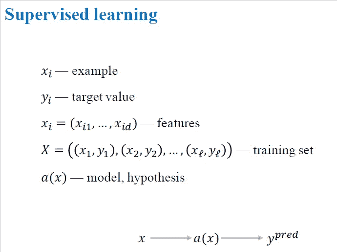
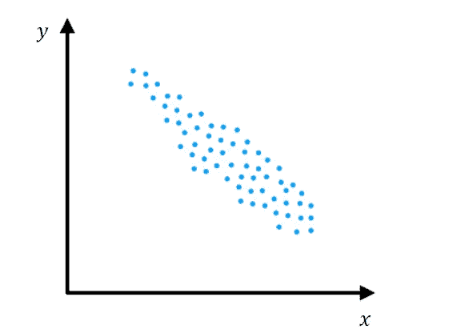
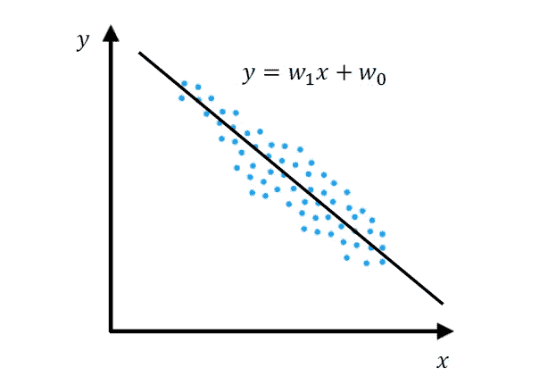
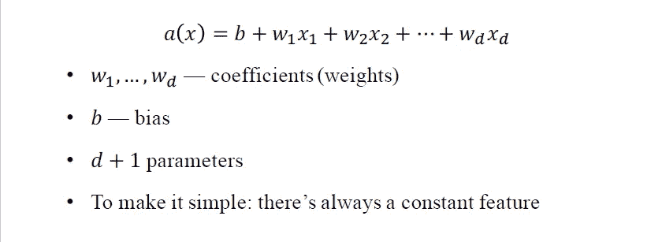
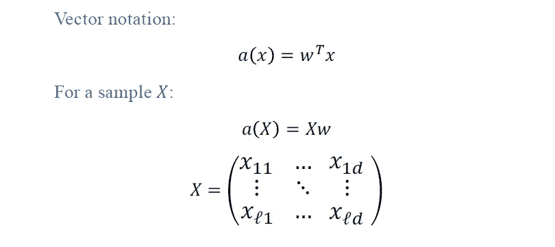
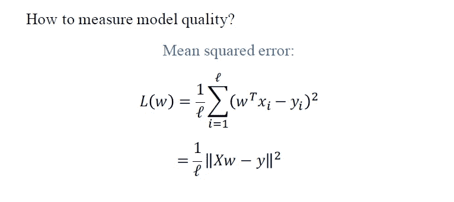
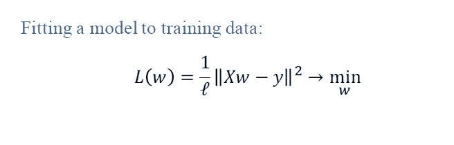
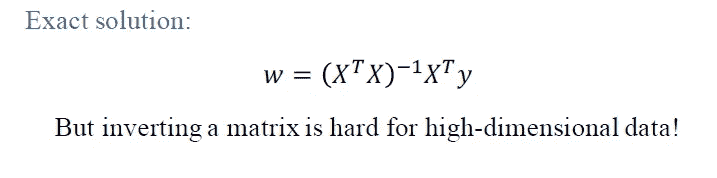

# 线性回归简介

> 原文：<https://pub.towardsai.net/introduction-to-linear-regression-dbcd767ceb26?source=collection_archive---------1----------------------->

# 介绍

机器学习最简单的模型之一是线性回归，但线性模型是深度神经网络的构建模块，它们非常重要。监督学习问题主要有两类，**回归**和**分类**。在回归中，目标的值是一个真实值，例如，我们试图预测给定职位描述的工资。
在分类中，目标的值是一组有限的类，例如，如果给我们一部电影的评论，我们试图在一到五的范围内预测一部电影的评级。在这篇文章中，我将尝试解释线性回归。

## 线性回归

让我们给出一些理解起来非常有用的定义。考虑一个图像，我们在机器学习中尝试分析的叫做例子。我们用 x 表示这个例子，我们用一些特征来描述每个例子，称之为特征。我们用 x₁,x₂,x₃,…x𝒹).来表示这些特征在图像的情况下，特征是每个像素的强度。在监督学习中，我们有目标值，这意味着我们对每个例子都有答案。我们用 y 表示这些目标值。所以对于每个例子，xᵢ.目标值是 **y** ᵢ.

**监督学习**

由 X large 表示的一组示例和标签对，其中对的总数为 l。每对都有一个示例及其功能描述和目标值。最后，我们希望找到一个模型，一个将示例映射到目标值的函数。我们用 a(x)表示这个函数，也称为模型或假设，机器学习的目标是找到一个以最佳方式拟合训练数据集的模型。

## 数据集分布

**数据集**

上面的图像显示了我们的数据集的分布，我们可以看到有一个线性趋势。如果特征增加两倍，那么目标减少大约两倍。我们可以用一些线性模型来描述这些数据，建立一个预测模型。

## 线性模型

**线性模型**

在上面的图像中，黑色斜线是线性模型。它非常简单，只有两个参数，w₁和 w₀.如果我们找到最好的重量，w₁和 w₀，那么我们将有一个像这样的模型。它很好地描述了数据。它不会预测每个示例的确切目标值，但它与数据非常吻合。在大多数机器学习任务中，有许多特征，所以我们可以使用像这样的通用线性模型。

**线性回归模型**

它将每个特征 xⱼ乘以权重 wⱼ，并将所有特征的乘积求和，然后添加有偏项 b。这是一个线性模型。它有 d+1 个参数，其中 d 是数据集中要素的数量。有 d 个权重或系数和一个偏差项 b。

## 向量记法

**向量符号**

把我们的线性模型写成向量形式是非常方便的。从线性代数可知，上述乘法是权重向量和特征向量的转置的点积。就是向量相乘然后求和。所以，我们的线性模型基本上是权重向量 W 和特征向量 x 的点积。

如果我们想将我们的模型应用于整个训练数据集。为此，我们用样本构成一个矩阵 X。矩阵 X 很大，它有 L 行和 d 列。每行对应一个示例，每列对应每个示例中一个特征的值。我们将矩阵 X 乘以向量 w，这就是我们的预测。这个乘法将给我们一个大小为 L 的向量，每个分量都是每个例子的线性模型的预测。

## 损失函数

**损失函数**

机器学习中的下一个问题是如何在一些数据集、训练数据集或测试数据集上测量模型的准确性或误差。回归中损失函数最受欢迎的选择之一是均方误差。

## **均方误差**

它是这样工作的。我们以 xᵢ为例，然后计算我们的模型对这个例子的预测，然后减去目标值。我们计算目标值与预测值的偏差，然后取其平方，然后对所有训练集的这些偏差平方进行平均。这就是所谓的均方误差。它衡量我们的模型与数据的吻合程度。均方差越小，模型对数据的拟合越好。当然，我们可以把均方误差写成向量形式。我们将矩阵 X 乘以向量 w，得到集合中所有示例的预测向量，然后减去真实答案的目标值向量，再取该向量的欧几里德范数。这与我之前描述的均方误差相同。因此，我们有一个损失函数来衡量我们的模型对数据的拟合程度，然后我们所要做的就是根据我们模型的参数将其最小化。

## 模特培训

**训练一个模特**

我们希望找到在我们的训练数据集上给出最小均方误差值的参数集 w。这就是机器学习的本质。我们优化损失以找到最佳模型。实际上，如果你懂一些微积分，那么你可以求导，解方程。

**训练一个模特**

这些优化问题也有一个解析解。我们也可以使用线性代数方法找到权重向量，如上图所示，但这涉及到矩阵的逆运算。如果我们有超过 100 或 1000 个功能，这是一个非常昂贵的操作。我们可以将这个问题简化为一个线性方程组来求解，但这仍然很困难，并且需要大量的计算资源。在后面的另一篇文章中，我将尝试解释一个更好、更可扩展地优化此类问题的框架。

# 结论

在这篇文章中，我讨论了回归的线性模型。它们非常简单，但是对于深度神经网络非常有用。我还讨论了均方差，回归问题的损失函数，我们发现它有一个解析解，但它不是很好，也很难计算。在接下来的文章中，我们将尝试找到一种更好的方法来优化这些模型。