# Python 中的 Numpy 简介

> 原文：<https://pub.towardsai.net/introduction-to-numpy-in-python-1d7e0be2d7c8?source=collection_archive---------1----------------------->

## [编程](https://towardsai.net/p/category/programming)

## 什么是 NumPy？

NumPy 代表 numeric python，这是一个 python 模块，允许您计算和操作多维和一维数组项。它附带了一个高性能的多维数组对象以及使用它们的实用程序。

在 2005 年，Travis Oliphant 通过结合祖先模块 Numeric 的特性和另一个模块 Numarray 的特性创建了 NumPy 包。NumPy 实现了多维数组和矩阵以及其他复杂的数据结构。这些数据结构有助于以最有效的方式计算数组和矩阵。NumPy 允许您对数组进行数学和逻辑运算。许多其他著名的 Python 包，如 pandas 和 matplotlib，都与 Numpy 兼容并使用它。


## 需要在 Python 中使用 NumPy？

[NumPy](https://www.interviewbit.com/python-interview-questions/#python-numpy) 是处理大量数据的一个有价值且高效的工具。NumPy 快；因此，处理大量数据很容易。由于数据科学革命，像 NumPy、SciPy、Pandas 和其他的数据分析库已经流行起来。就语法而言，Python 是最简单的语言，是许多数据科学家的优先选择；所以 NumPy 日渐流行。
科学计算中常用的许多**数学程序**都通过 Numpy 变得快速而简单，包括:

*   向量或矩阵与向量或矩阵的乘法。
*   在元素级别上对向量和矩阵的运算(即，加、减、乘和除以一个数)
*   对向量/矩阵元素逐个应用函数(如幂、对数和指数)。
*   NumPy 内置了线性代数和随机数生成函数。
*   NumPy 还使矩阵乘法和数据整形变得简单。
*   使用 NumPy 可以有效地实现多维数组。
*   Python 中的 NumPy 数组提供了集成 C、C++和其他语言的能力。它在线性代数和随机数生成等方面也很有用。NumPy 数组还可以用于在多维容器中存储通用数据。
*   它比标准 Python 数组更快，后者没有 NumPy 的预编译 C 代码(预编译代码是一个头文件，它被编译成中间形式，对于编译器来说处理起来更快)。

## NumPy 的安装

进入命令提示符并运行“pip install numpy”来安装 Python NumPy。安装完成后，只需到你的 IDE(比如 VS Code、Jupyter Notebook、PyCharm)输入“import numpy as np”即可导入；现在您已经准备好使用 NumPy 了。

## 什么是 NumPy 数组？

Numpy 数组对象是一个具有行和列的强 N 维数组对象。NumPy 数组可以从嵌套的 Python 列表中创建，并且可以访问它们的元素。它指的是一组类型相同的项目，可以使用从零开始的索引来访问。ndarray 中的每一项都与内存块大小相同。ndarray 中的每个条目都是一个数据类型对象(称为 dtype)。

## Numpy 数组的类型:

*   **一维 NumPy 数组**
    一维数组只有一维的元素。换句话说，一维 NumPy 数组应该只包含一个元组值。
    **举例:**

```
# One-Dimensional Array
import numpy as np
val=np.array([1, 5, 2, 6])
print(val)
```

**实施:-**

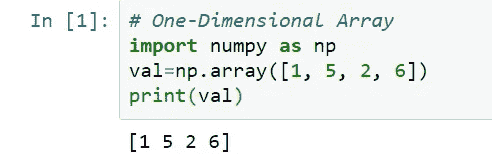

**说明:** print()函数用于打印提供的整个数组。

*   **多维 NumPy 数组**
    一个多维数组可以有 n 维的元素。换句话说，多维 NumPy 数组可以包含许多元组值。
    **举例:**

```
# Multi-Dimensional Array
import numpy as np
val=np.array([(3, 4, 2, 5),(3, 6, 2, 4),(1, 5, 2, 6)])
print(val)
```

**实施**:

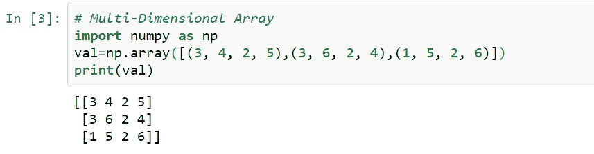

**说明:** print()函数用于打印提供的整个数组。

## **访问数组中的元素**

索引或访问 NumPy 数组中的数组索引可以通过多种方式完成。
1。切片用于打印数组的范围。内置切片函数用于创建 Python 切片对象，方法是向其传递开始、停止和步进参数。分割数组包括在新数组中建立一个范围，用于打印原始数组元素的子集。因为切片数组包含原始数组元素的子集，所以编辑内容会改变原始数组的内容。
**例 1:**

```
# Accessing Array Element
import numpy as np
val=np.array([1, 5, 2, 6])
# Zero based indexing
print(val[1])
val_mul=np.array([(3, 4, 2, 5),(3, 6, 2, 4),(1, 5, 2, 6)])
print(val_mul[1][1])
```

**实施:**

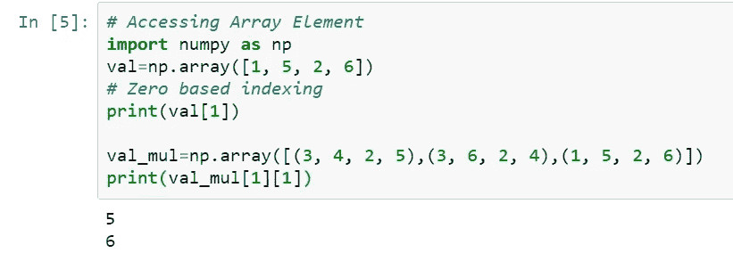

**解释:**这里我们通过写 val[1]来访问一维数组的第一个索引值，并访问二维数组的第 2 行第 2 列中的值，因为数组具有从零开始的索引。

**例 2:**

```
#Accessing Range of Elements 
#in array using slicing
val_mul=np.array([(3, 4, 2, 5),(3, 6, 2, 4),(1, 5, 2, 6)])
slice_val = val_mul[:2, :2]
print (“First 2 rows and columns of the array\n”, slice_val)
Implementation:
```

**实施:**


**解释:**在这里，我们试图通过将“:2”作为第一个参数来访问从第一行到第二行开始的行和列中的值，并且类似地访问对应于那些行并且具有从第一行到第二行的列的所有值。

**例 3:**

```
val_mul1=np.array([(3, 4, 2, 5),(3, 6, 2, 4),(1, 5, 2, 6),(1, 5, 0, 1),(7, 3, 3, 0)])
slice_step_row = val_mul1[::2, :2]
print (“All rows and 2 columns of the array with step size of 2 along the row\n”, slice_step_row)
```

**实施:**

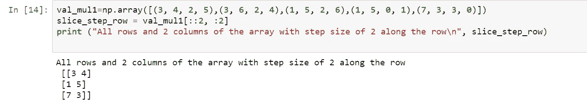

**解释:**这里，我们试图访问从第一行开始到第二行结束的行和列中的值，步长为 2，这意味着通过将“::2”作为第一个参数来访问连续行之间的差值为 2，并且类似地访问与这些行相对应的所有值，并且从开始到第二列都有列。

**例 4:**

```
# Accessing multiple elements at one go
val_mul1=np.array([(3, 4, 2, 5),(3, 6, 2, 4),(1, 5, 2, 6),(1, 5, 0, 1),(7, 3, 3, 0)])
mul_idx_arr = val_mul1[
 [1, 2, 2, 3], 
 [1, 2, 3, 3]
 ]
print (“\nAccessing Elements at multiple indices (1, 1),(2, 2), (2, 3), (3, 3) →”, mul_idx_arr)
```

**实施:**

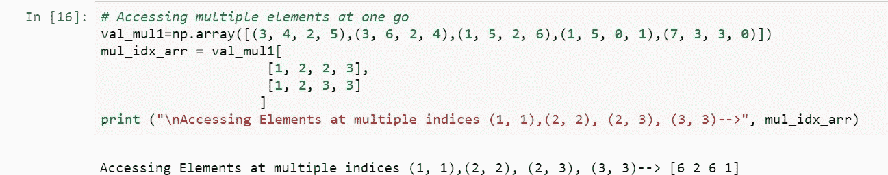

**解释:**这里我们试图从数组中访问索引(1，1)、(2，2)、(2，3)和(3，3)处的值。

2.另一种类型的访问技术是布尔数组索引，其中我们可以给出条件，在该条件下的元素被打印。

**举例:**

```
# Boolean array indexing
val_mul=np.array([(3, 4, 2, 5),(3, 6, 2, 4),(1, 5, 2, 6),(1, 5, 0, 1),(7, 3, 3, 0)])
condition = val_mul > 3 
res = val_mul[condition]
print (res)
```

**实现:**

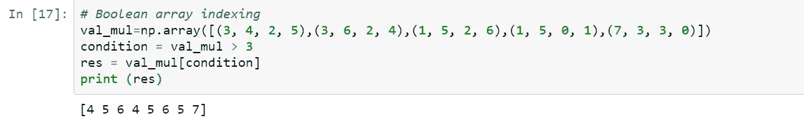

**解释:**这里我们访问的是符合给定条件的值，即元素的值应该大于 3。

# **对 Numpy 数组的常用操作**

*   **ndim** -该操作用于计算数组的维数。

**示例:**

```
# Dimension of the array
val1 = np.array([1, 5, 2, 6])
print(val1.ndim)# 2-D array
val2 = np.array([(3, 4, 2, 5),(3, 6, 2, 4),(1, 5, 2, 6)])
print(val2.ndim)
```

**实施:**

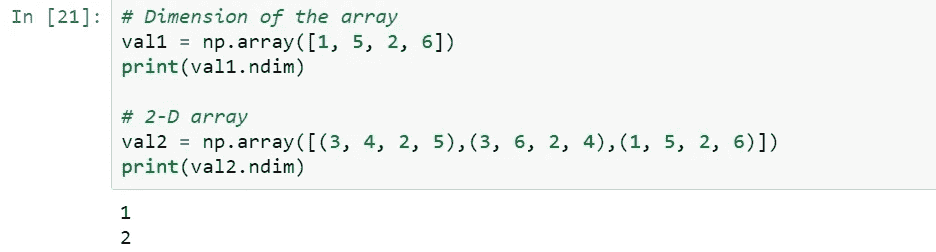

**解释:**这里 val1 是一个一维数组，值为 1，5，2 和 6，因此我们得到 val1.ndim 的值 1，val2 是一个二维数组
3 4 2 5
3 6 2 4
1 5 2 6
因此我们得到 val2.ndim 对应的值 2

*   **Size** —该操作用于计算数组中元素的个数。

**例如:**

```
# Calculate Array Size 
val2 = np.array([(3, 4, 2, 5),(3, 6, 2, 4),(1, 5, 2, 6)])
print(val2.size)
```

**实施:**

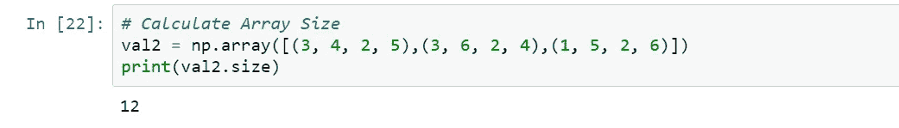

**解释:**这里 val2 包含 12 个值 3，4，2，5，3，6，2，4，1，5，2，6 因此我们得到 val2 数组的大小为 12。

*   **形状** —该操作用于计算数组的形状。

**例如:**

```
# Calculate Array Shape 
val = np.array([(3, 4, 2, 5),(3, 6, 2, 4),(1, 5, 2, 6)])
print(val.shape)
```

**实施:**

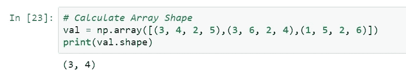

**解释:**这里 Val 数组是一个二维数组
3 4 2 5
3 6 2 4
1 5 2 6
它有 3 行 4 列，val.shape 用于获取每个维度对应的大小。

*   **整形** —整形用于根据给定的参数对数组进行整形

**例如:**

```
# Reshape the Array
val = np.array([(3, 4, 2, 5),(3, 6, 2, 4),(1, 5, 2, 6)])
print(val)val=val.reshape(2,6)
print(val)
```

**实施:**

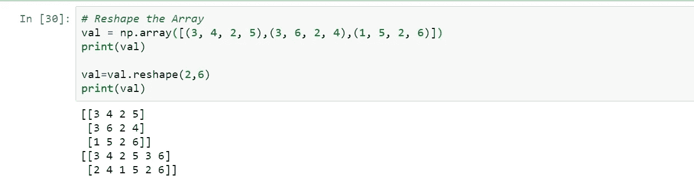

**说明:** reshape 函数帮助我们对数组进行整形，并相应地填充数组的值。这里我们有 12 个值，我们希望将数组从(3，4)调整为(2，6)，所以现在只有 2 行 6 列。

*   **转置** — T 运算符用于获取数组的转置。
    **举例:**

```
# Transpose of an array
val = np.array([(3, 4, 2, 5),(3, 6, 2, 4),(1, 5, 2, 6)])
print(val.T)
```

**实施:**

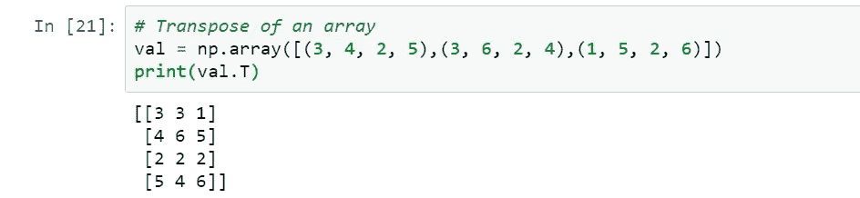

**解释:**当我们需要用列替换数组的所有行，用行替换列时，我们需要调用 val。获取数组的转置。在转置中，数组的形状会改变，因为现在行数变成了列数，反之亦然。因为这里 3，4，2，5 最初是第一行，但是在转置之后，它变成了第一列。

*   **Ravel** — ravel 用于将数组转换成单列
    例如:

```
# Convert Array to Single Column
val = np.array([(3, 4, 2, 5),(3, 6, 2, 4),(1, 5, 2, 6)])
print(val.ravel())
```

**实施:**

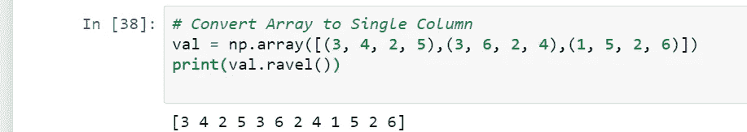

**解释:**当我们想要将数组转换为一维数组时，我们使用 ravel 函数，因为它组合了数组的所有值，如上例所示，我们最初有一个 3 行 4 列的二维数组，但在应用 ravel 函数后，我们得到了一个包含 12 个值的一维数组。

*   **Itemsize:** Itemsize 用于计算每个元素的大小，以字节为单位。
    **例如:**

```
# Calculate Array Itemsize
val = np.array([(3, 4, 2, 5),(3, 6, 2, 4),(1, 5, 2, 6)])
# size of each element in bytes
print(val.itemsize)
```

**实施:**

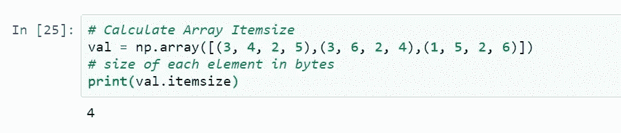

**解释:**当我们想要以字节为单位获得每个元素的大小时，我们使用(array_name.itemsize)如上例，数据类型是 int32，这意味着 32 位的整数，我们知道 1 字节等于 8 位，因此它的大小为 4 字节。

*   **Dtype** - Dtype 用于获取数组中元素的数据类型。
    **举例:**

```
# Calculate Data type of each element
val = np.array([(3, 4, 2, 5),(3, 6, 2, 4),(1, 5, 2, 6)])
print(val.dtype)
```

**实施:**

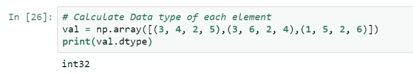

**解释:**当我们想要计算数组中元素的数据类型时，我们使用 val.dtype，它给出了数据类型。在上面的例子中，数组的值是整数，所以给出的数据类型是 int32，这意味着它表示 32 位的整数。

*   **NP . zeros()/NP . ones()**—numpy 的 one()和 zeros()函数用于生成分别全为 1 和 0 的数组。
    **举例:**

```
# Generating array having all 1's
val = np.ones(3)
print(val)

# Generating array having all 0's
val0 = np.zeros(3)
print(val0)
```

**实施:**

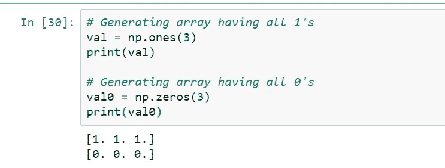

**解释:**当我们想要生成一个全是 1 或 0 的数组时，我们使用上面给出的函数，这些函数帮助我们生成一个大小为 n 的数组。这里我们给定数组的大小为 3，因此生成一个大小为 3、全是 1 和 0 的数组。

-**linspace**-linspace 函数用于生成一个数组，该数组包含在给定范围内均匀分布的元素。范围的开始和结束以及数组中存在的元素数量需要 3 个参数。

**示例:**

```
# Linspce generate 8 numbers present in range 2–5
val = np.linspace(2,5,8)
print(val)
```

**实现:**

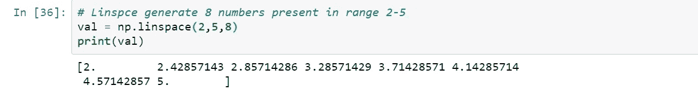

**解释:**当我们想要生成一个具有特定顺序的数组，如范围 x 到 y，数组的大小为 n 时，我们使用 linspace 函数，因为我们想要生成一个大小为 8 的数组，其值在范围 2 到 5 之间等间距分布。

*   **Max** — Max 用于获取整个数组中的最大元素。

**示例:**

```
# Find maximum element in whole array
val = np.array([(3, 4, 2, 5),(3, 6, 2, 4),(1, 5, 2, 6)])
print(val.max())
```

**实现:**

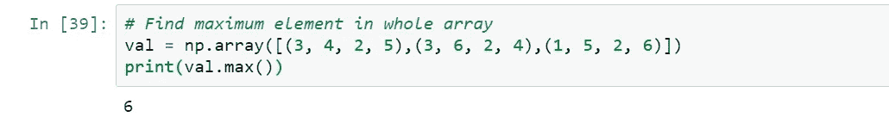

**解释:**当我们想要计算数组中所有元素的最大值时，我们可以简单地编写 array_name.max()并获得最大值元素，因为这里我们得到 6，这是所有元素的最大值。

*   **Min** — Min 函数用于获取整个数组中的最小元素。

**举例:**

```
# Find minimum element in whole array
val = np.array([(3, 4, 2, 5),(3, 6, 2, 4),(1, 5, 2, 6)])
print(val.min())
```

**实现:**

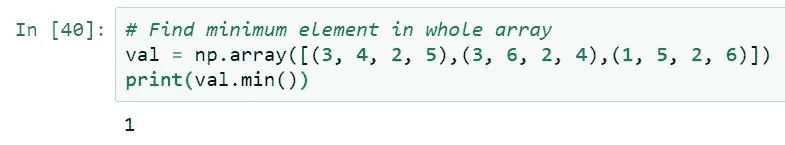

**解释:**当我们想要计算数组中所有元素的最小值时，我们可以简单地编写 array_name.min()并得到最小元素，因为在这里我们得到 1，这是所有元素的最小值。

*   **Sum** — Sum 函数用于获取数组中所有元素的总和。

**示例:**

```
# Sum of all elements in whole array
val = np.array([(3, 4, 2, 5),(3, 6, 2, 4),(1, 5, 2, 6)])
print(val.sum())
```

**实施:**

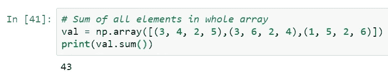

**解释:**当我们想要计算数组中所有元素的和时，我们可以简单地编写 array_name.sum()。

*   **np.sqrt()** —此函数用于获取数组中所有元素的平方根。

    **例如:**

```
# Used to calculate square root of each element
val=np.array([1, 4, 9])
print(np.sqrt(val))
```

**实施:**

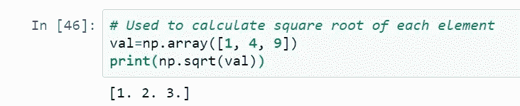

**解释:**当我们想要计算一个数组中每个值的平方根时，我们可以简单地写 np.sqrt(array_name ),我们得到每个值对应的平方根，例如 2 对应于 4，3 对应于 9。

*   **np.std()** :该函数用于计算数组所有元素的标准差。

**例如:**

```
# Used to calculate standard deviation of all elements
val=np.array([1, 4, 9])
print(np.std(val))
```

**实施:**

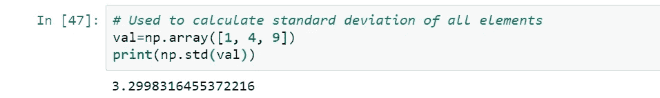

**解释:**当我们想求数组所有值的标准差时我们不需要做计算标准差的忙乱的数学计算，我们可以简单地写(np.std(array_name))。

*   **对数组的求和操作** —当我们需要将某个特定的数 n 加到数组的所有元素上，或者将一个数组加到另一个数组上。

**例 1:**

```
# Add number 3 to all elements of array val
val = np.array([(3, 4, 2, 5),(3, 6, 2, 4),(1, 5, 2, 6)])
print(val+3)
```

**实现:**

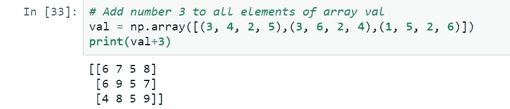

**解释:**当我们想要从数组的每个值中添加值 n 时，我们可以简单地写(array_name+n)。

**例 2:**

```
# Add array val to another array val1
val = np.array([(3, 4, 2, 5),(3, 6, 2, 4),(1, 5, 2, 6)])
val1 = np.array([(4, 4, 8, 2),(9, 0, 3, 5),(6, 8, 3, 3)])
print(val+val1)
```

**实现:**

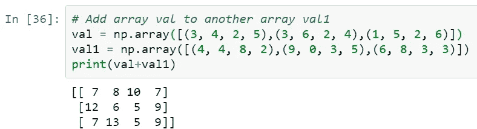

**解释:**当我们想得到两个数组的和时，我们可以简单地写出(array1+array2)来得到数组的和，但是要记住两个数组的维数必须相同。

*   **对数组的减法运算** —当我们需要从一个数组的所有元素中减去某个特定的数 n 或者从另一个数组中减去一个数组时。

**例 1:**

```
# Subtract number 3 from all elements of array val
val = np.array([(3, 4, 2, 5),(3, 6, 2, 4),(1, 5, 2, 6)])
print(val-3)
```

**实现:**

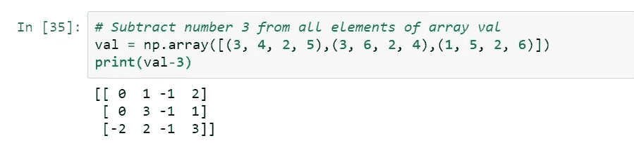

**解释:**当我们想要从数组的每个值中减去值 n 时，我们可以简单地写(array_name-n)。

**例二:**

```
# Subtract array val from another array val1
val = np.array([(3, 4, 2, 5),(3, 6, 2, 4),(1, 5, 2, 6)])
val1 = np.array([(4, 4, 8, 2),(9, 0, 3, 5),(6, 8, 3, 3)])
print(val1-val)
```

**实现:**

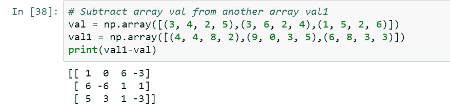

**解释:**当我们想找出两个数组之间的差异时，我们可以简单地写出(array1-array2)来得到数组的差异，但要记住两个数组的维数必须相同。

*   **阵列中每个元素的幂提高到数字** r n:

**示例:**

```
# Power of each element of the array raise to 3
# Cube of each element
val = np.array([(3, 4, 2, 5),(3, 6, 2, 4),(1, 5, 2, 6)])
print(val**(3))# Power of each element of the array raise to 0.5
# Square root of each element
val = np.array([(3, 4, 2, 5),(3, 6, 2, 4),(1, 5, 2, 6)])
print(val**(0.5))
```

**实施:**

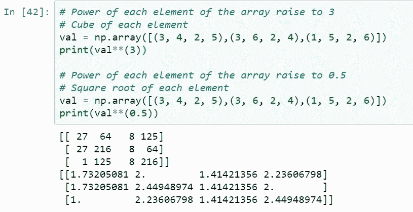

**解释**:这里我们对数组中的每个值进行 3 次幂运算并打印出来。当我们想对数组中的每个值进行 n 次幂运算时，我们只需写(array_name)**n 来对数组中的每个值进行 n 次幂运算。

*   **修改每个元素:**

**示例:**

```
# Multiply each element of the array by 3
val = np.array([(3, 4, 2, 5),(3, 6, 2, 4),(1, 5, 2, 6)])
print(val*(3))# Divide each element of the array by 3
val = np.array([(3, 4, 2, 5),(3, 6, 2, 4),(1, 5, 2, 6)])
print(val/3)
```

**实施:**

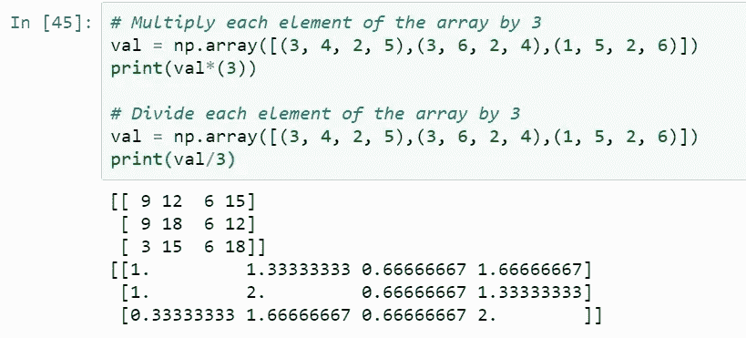

**解释:**这里我们将数组的每个值乘以 3 并打印出来。类似地，当我们想要划分数组的每个值时，我们只需写(array_name)/n 来用值 n 划分数组。

*   **np.sort()** —此函数用于对数组进行排序，并采用参数轴，该轴允许在分别用值 1 和 0 初始化时对数组进行按行和按列排序。

**例 1:**

```
# Sort the array row-wise
val = np.array([(3, 4, 2, 5),(3, 6, 2, 4),(1, 5, 2, 6)])
print(np.sort(val,axis=1))
```

**实施:**

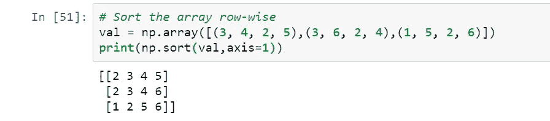

**解释:**这里我们将数组的值按行排序，因为我们已经提供了轴的值为 1。

**例 2:**

```
# Sort the array column-wise
val = np.array([(3, 4, 2, 5),(3, 6, 2, 4),(1, 5, 2, 6)])
np.sort(val,axis=0)
```

**实施:**

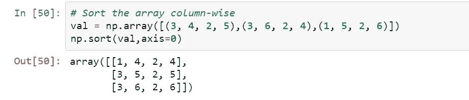

**解释:**这里我们对数组的值进行列排序，因为我们已经提供了轴的值为 0。

## 下一步做什么？

Python 中的 NumPy 库是数值计算中使用最广泛的库之一。借助本文中的各种例子，我们深入研究了 NumPy 库。我们还演示了如何利用 NumPy 库进行一些线性代数运算。我建议你练习这篇文章中提供的例子。如果你想成为一名数据科学家，NumPy 库是你需要掌握的工具之一，这样你才能成为这个职业中成功且有生产力的一员。[了解更多](https://numpy.org/)。