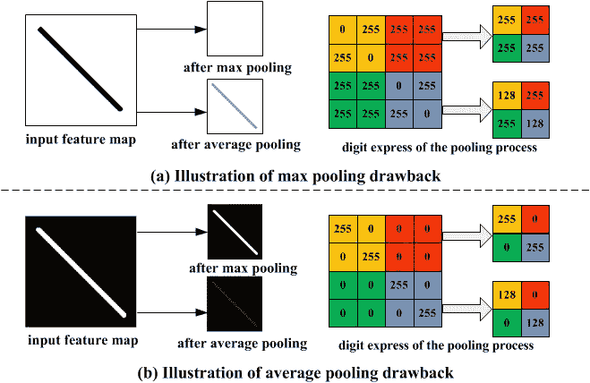
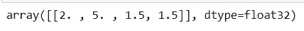
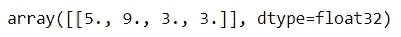

# CNN 中的池层介绍

> 原文：<https://pub.towardsai.net/introduction-to-pooling-layers-in-cnn-dafe61eabe34?source=collection_archive---------0----------------------->

卷积神经网络(CNN)是一种特殊类型的人工神经网络，由于其能够识别图像中的模式，因此通常用于图像识别和处理。它消除了从视觉数据中手动提取特征的需要。它通过在图像上滑动一定大小的过滤器来学习图像，不仅从数据中学习特征，还保持平移不变性。

CNN 的典型结构包括三个基本层

1.  **卷积层:**这些层**通过在输入图像上滑动过滤器并识别图像中的模式来生成特征图**。
2.  **池层:**这些层**对特征图**进行下采样以引入平移不变性，这减少了 CNN 模型的过拟合。
3.  **全连接密集层:**该层包含与类别数量相同的**个单元，以及输出激活函数，如“softmax”或“sigmoid”**

## 什么是池层？

池层是卷积神经网络的构造块之一。卷积层**从图像中提取特征**，汇集层**巩固 CNN 学习的特征**。其目的是逐渐缩小表示的空间维度，以最小化网络中的参数和计算的数量。

## 为什么需要池化图层？

由卷积层的滤波器产生的特征图是位置相关的。例如，如果图像中的对象移动了一点，卷积层可能无法识别它。因此，这意味着要素地图记录了要素在输入中的精确位置。池层提供的是“平移不变性”，这使得 CNN 对于平移不变，即，即使 CNN 的输入被平移，CNN 仍将能够识别输入中的特征。

> 在所有情况下，池有助于使表示变得对输入的小平移近似不变。对平移的不变性意味着，如果我们对输入进行少量的平移，大部分汇集输出的值不会改变—第 342 页，深度学习，Ian Goodfellow，2016。

池层如何实现这一点？如上面 CNN 的结构所示，在卷积层之后添加了一个汇集层。它通过以某个步长滑动某个大小的滤波器并计算输入的最大值或平均值来对卷积层的输出进行下采样。

有两种类型的池**被使用:**

1.  **最大池化**:从每个池中选择最大值。Max Pooling 保留了特征图的**最突出的**特征，返回的图像比原始图像更清晰。
2.  **平均池**:这个池层通过获取池的平均值来工作。平均池保留特征地图的特征的平均值。它平滑图像，同时保持图像中特征的本质。



[图像来源](https://www.researchgate.net/figure/Toy-example-illustrating-the-drawbacks-of-max-pooling-and-average-pooling_fig2_300020038)

让我们来探索使用 TensorFlow 合并图层的工作方式。创建一个 NumPy 数组并重塑它。

```
matrix=np.array([[3.,2.,0.,0.],
                [0.,7.,1.,3.],
                [5.,2.,3.,0.],
                [0.,9.,2.,3.]]).reshape(1,4,4,1)
```

## **最大池化**

使用 pool_size=2 和 strides=2 创建 MaxPool2D 层。将 MaxPool2D 图层应用到矩阵，您将获得张量形式的 MaxPooled 输出。通过将其应用于矩阵，最大池层将通过计算每个 2x2 池的最大值(跳跃 2)来遍历矩阵。打印张量的形状。使用 tf.squeeze 从张量形状中移除大小为 1 的维度。

```
max_pooling=tf.keras.layers.MaxPool2D(pool_size=2,strides=2)
max_pooled_matrix=max_pooling(matrix)
print(max_pooled_matrix.shape)
print(tf.squeeze(max_pooled_matrix))
```

## 平均池

用同样的 2 pool_size 和步幅创建一个 AveragePooling2D 层。将 AveragePooling2D 图层应用于矩阵。通过将其应用于矩阵，平均池层将通过计算每个池的 2x2 平均值(跳跃为 2)来遍历矩阵。打印矩阵的形状，并使用 tf.squeeze 通过删除所有 1 size 维将输出转换为可读形式。

```
average_pooling=tf.keras.layers.AveragePooling2D(pool_size=2,
                                                 strides=2)
average_pooled_matrix=average_pooling(matrix)
print(averge_pooled_matrix.shape)
print(tf.squeeze(average_pooled_matrix))
```

这里的 GIF 解释了这些池层如何通过输入矩阵，并分别计算最大池和平均池的最大值或平均值。


正在执行的最大池化和平均池化— [来源](https://towardsdatascience.com/convolutional-neural-networks-explained-how-to-successfully-classify-images-in-python-df829d4ba761)

## 全局池层

全局池层通常会替换分类器的完全连接或展平层。相反，该模型以一个卷积层结束，该卷积层生成与目标类一样多的要素地图，并对每个要素地图执行全局平均汇集，以将每个要素地图组合成一个值。

创建相同的 NumPy 数组，但形状不同。通过保持与上面相同的形状，全局池层将把它们减少到一个值。

```
matrix=np.array([[[3.,2.,0.,0.],
                [0.,7.,1.,3.]],
                [[5.,2.,3.,0.],
                [0.,9.,2.,3.]]]).reshape(1,2,2,4)
```

**全球平均池**

考虑形状为 **h*w*n** 的张量，全局平均池层的输出是跨越 **h*w** 的单个值，该值概括了特征的存在。全局平均池图层不是缩小输入要素地图的面片，而是通过取平均值将整个 **h*w** 缩小为 1 个值。

```
global_average_pooling=tf.keras.layers.GlobalAveragePooling2D()
global_average_pooled_matrix=global_average_pooling(matrix)
print(global_average_pooled_matrix)
```



GlobalAveragePooled 图层的输出

**全局最大池**

使用形状张量 **h*w*n** ，全局最大池图层的输出是跨越 **h*w** 的单个值，该值概括了要素的存在。全局最大池图层通过取最大值将整个 **h*w** 缩小为 1 个值，而不是缩小输入要素地图的面片。

```
global_max_pooling=tf.keras.layers.GlobalMaxPool2D()
global_max_pooled_matrix=global_max_pooling(matrix)
print(global_max_pooled_matrix)
```



GlobalMaxPooled 图层的输出

## 结论

通常，当您想要检测图像中的对象，而不管其在图像中的位置如何时，池化层非常有用。添加池层的结果是减少了过度拟合，提高了效率，并加快了 CNN 模型中的训练时间。当最大池层提取出图像最突出的特征时，平均池会平滑图像，保留其特征的本质。全局池图层通常会替换平坦或密集输出图层。

阅读 [Keras Pooling layers API](https://keras.io/api/layers/pooling_layers/) 和 Franç ois Chollet 的《用 Python 进行深度学习》第 5 章，了解详细信息。此外，查看 [CNN 解说](https://poloclub.github.io/cnn-explainer/)获取 CNN 模型的直观解释。