# 通过 AWS EMR 和动手 EDA 介绍 PySpark

> 原文：<https://pub.towardsai.net/introduction-to-pyspark-via-aws-emr-and-hands-on-eda-de1866d641f5?source=collection_archive---------4----------------------->

## [数据分析](https://towardsai.net/p/category/data-analysis)，[编程](https://towardsai.net/p/category/programming)

## 在纽约出租车费数据集上执行 EDA 以查看 PySpark 的运行情况——因为云计算是下一件大事！


照片由 [C 达斯汀](https://unsplash.com/@dianamia?utm_source=medium&utm_medium=referral)在 [Unsplash](https://unsplash.com?utm_source=medium&utm_medium=referral) 上拍摄

# 介绍技术

## 什么是 Spark 和 PySpark — Spark SQL 和 Spark MLlib？

来自维基百科，Spark by Apache 是一个用于大规模数据处理的开源分析引擎。它使程序员能够利用固有的数据并行性和容错能力处理存储在多个集群中的数据。

Spark 引擎的基础是弹性分布式数据库(rdd ),它是以容错方式在机器集群上维护的一组数据项。开发这些 rdd 是为了克服 Map-Reduce 范式的限制，这种范式通过从磁盘读取数据、*映射*和*还原*并写回磁盘来强制程序中的线性数据流。另一方面，rdd 作为一个跨集群的工作集，在程序执行期间提供受限形式的共享内存。

**星火核心**是整个项目的基础。它提供分布式任务分派、调度和基本的 I/O 功能，通过以上面讨论的 RDD 抽象为中心的 API 公开。 **Spark SQL** 是 Spark Core 之上的一个组件，它引入了一个名为 DataFrames 的数据抽象，为结构化和半结构化数据提供支持。它提供了一种特定于领域的语言(类似于 pandas)来操作数据帧，并通过 CLIs 和 ODBC 服务器提供了基本的 SQL 支持。同样， **Spark MLlib** 是一个分布式机器学习框架，位于 Spark Core 之上。

基本上， **PySpark** 是 Scala 编写的 Spark 框架的 Python API。该 API 包含库和包装器，允许程序员利用底层 SparkSQL 和 Spark MLlib 模块的功能和特性。

## 什么是 AWS EMR？

Amazon Elastic Map Reduce 是业界领先的云大数据平台，使用 Apache Spark、Apache Hive、Apache HBase、Apache Flink 和 Apache 胡迪等开源工具处理海量数据。Amazon EMR 通过自动执行配置容量和调整集群等耗时的任务，简化了大数据环境的设置、操作和扩展。

> 基本上就是在云上使用 Spark 的分布式数据处理。

# 设置— AWS EMR 与本地 PySpark 实例

程序员在使用 Spark 框架时有两种选择。他可以决定将它安装在自己的本地系统上，或者使用某个云提供商提供的服务。

如果他选择第一个选项，那么本地系统中的处理器内核将充当集群，并在内核级别实现并行性。这种方法的问题是，RAM 的某个部分已经被保留作为工作存储器*用于在数据的分布式处理完成后组合结果。这与今天个人笔记本电脑的 RAM 规格(8GB 或 16GB)一起，使得这个选项非常没有吸引力；可以理解，数据处理非常缓慢。另一方面，在按使用付费的模式下使用云中的集群提供了无限的系统配置选项，显然是更好的选择。*

下面简要介绍如何在 [AWS EMR](https://console.aws.amazon.com/elasticmapreduce/home?region=us-east-1) 上设置集群和笔记本:

1.  点击上面的链接。然后点击边栏上的“集群”。
2.  点击蓝色的“创建集群”,进入“高级选项”

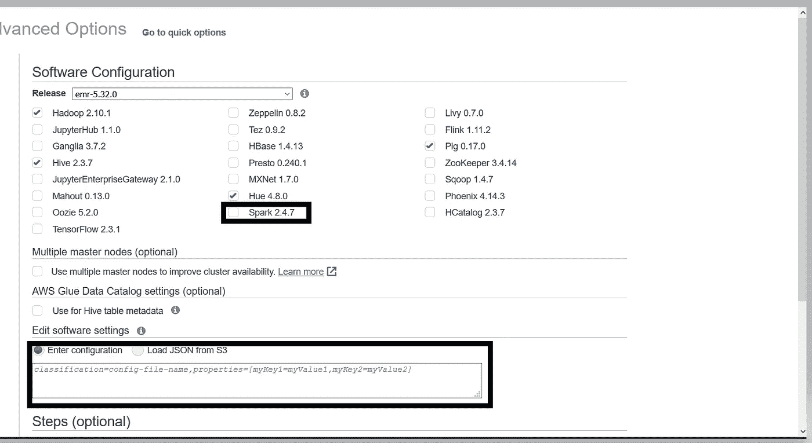

步骤 3:检查要安装在集群上的 Spark 框架。软件设置需要一个存储在 S3 桶中的配置文件或 JSON 文件，该文件指定工作内存和核心内存的数量。来源:图片由作者提供。

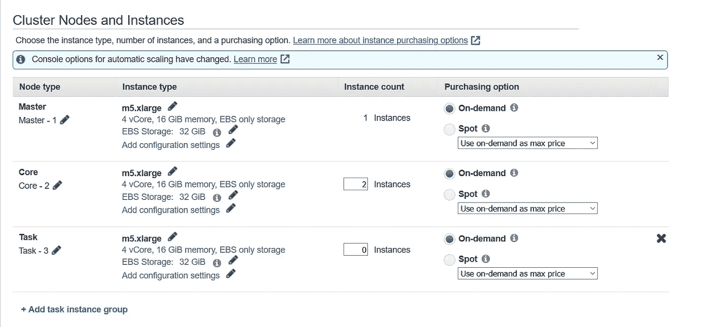

步骤 4:在硬件中，根据任务需要选择集群中实例的类型和数量。其他的都可以保持原样。来源:图片由作者提供。

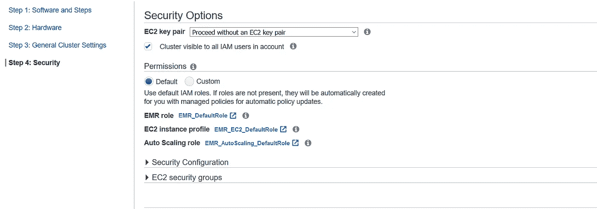

步骤 5:我们可以保留“常规群集设置”中的默认设置。在“安全性”中，必须在最终创建集群之前指定 EC2 密钥对。来源:图片由作者提供。

创建集群后，转到边栏上的“笔记本”并创建一个与集群相关联的笔记本。你可以走了！

# 数据集

现在，我们已经简要了解了我们将使用的不同技术，并决定了配置选项，让我们看看我们将处理的数据集。

该数据集可以在 [Kaggle](https://www.kaggle.com/c/new-york-city-taxi-fare-prediction/data) 上下载，包含 5500 万条纽约出租车出行记录——非常适合大数据和 Spark。它具有以下特点:

*   *键*:这是旅行开始的时间戳
*   *车费金额*:该行程的车费(美元)
*   *pickup_datetime:* 与 key 相同，这是旅行开始的时间戳
*   *皮卡 _ 经度:*皮卡的经度坐标
*   *皮卡 _ 纬度*:皮卡的纬度坐标
*   *drop off _ longitude:*drop 的经度坐标
*   *dropoff_latitude:* 空投的纬度坐标
*   *乘客计数:*旅途中出租车上的乘客数量

本问题陈述的目的是应用适当的 EDA 和特征工程来尽可能接近地预测从特定上车点到下车点的出租车费用(与测试集地面真实情况进行比较)。

# 最后，EDA

现在，让我们深入了解针对该数据集完成的 EDA。正如之前顺便提到的，使用云提供商服务进行分布式数据处理是有益的，并且通过查看纽约出租车数据集的大小证明了这一观点——无论如何都不可能在 PC 上进行处理。

## 初步分析

我们导入库并读入下面给出的数据。接下来，我们对数据集、模式和其中的列的大小进行非常基本的分析。

```
import numpy as np
import matplotlib.pyplot as plt
import seaborn as sns
import pandas as pd# all data manipulation functions
import pyspark.sql.functions as F
from pyspark.sql import Row#PySpark does not have visualization capabilities
from pyspark_dist_explore import Histogram, hist, distplot, pandas_histogramtrain_data_path = 's3://ny-taxi-emr/train.csv'
test_data_path = 's3://ny-taxi-emr/test.csv'train_data = spark.read.csv(train_data_path, header = True, inferSchema = True, mode="DROPMALFORMED")
test_data = spark.read.csv(test_data_path, header = True, inferSchema = True, mode="DROPMALFORMED")
```

接下来，我们将带有日期时间值的列的数据类型转换为*日期时间*数据类型。这里， **withColumn()** 用于创建和替换现有列，而 **col()** 用于访问列值。

```
train_data = train_data.withColumn("pickup_datetime", F.to_timestamp(F.col("pickup_datetime"), "yyyy-MM-dd HH:mm:ss"))def create_date_columns():
    """
        Create new rows from pickup_datetime, 
        namely, date, day, hour, day_of_week, month and year
    """
    # Get datetime.date objects and create a new column pickup_date
    new_train_data = train_data.withColumn("pickup_date", F.to_date(F.col("pickup_datetime")))
    new_train_data = new_train_data.withColumn("pickup_day", F.dayofmonth(F.col("pickup_datetime")))
    new_train_data = new_train_data.withColumn("pickup_hour", F.hour(F.col("pickup_datetime")))
    new_train_data = new_train_data.withColumn("pickup_day_of_week", F.dayofweek(F.col("pickup_datetime")))
    new_train_data = new_train_data.withColumn("pickup_month", F.month(F.col("pickup_datetime")))
    new_train_data = new_train_data.withColumn("pickup_year", F.year(F.col("pickup_datetime")))

    return new_train_data
```

接下来，我们检查空值并删除包含空值的行。

```
new_train_data.select([F.count(F.when(F.isnull(col), col)).alias(col) for col in new_train_data.columns]).show()
```

## 可视化维度分布

我们首先从可视化适当维度的分布开始。我们从*票价*维度开始，删除过高或负值的票价。 **collect()** 用于从所有从节点检索到主节点或驱动节点的最终结果。

```
print("Maximum Fare:{}\n Minimum Fare: {}".format(new_train_data.agg({"fare_amount": "max"}).collect()[0],\
      new_train_data.agg({"fare_amount": "min"}).collect()[0]))train_data_fare_filtered = new_train_data.filter(F.col("fare_amount").between(2.5, 100))
```

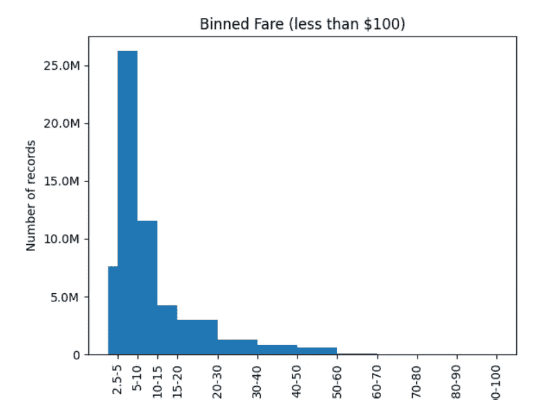

票价金额的分配(装箱)。来源:图片由作者提供。

同样，我们分析乘客数分布，发现最大值是 208，没有意义。我们将 7 座车作为最大乘客数。

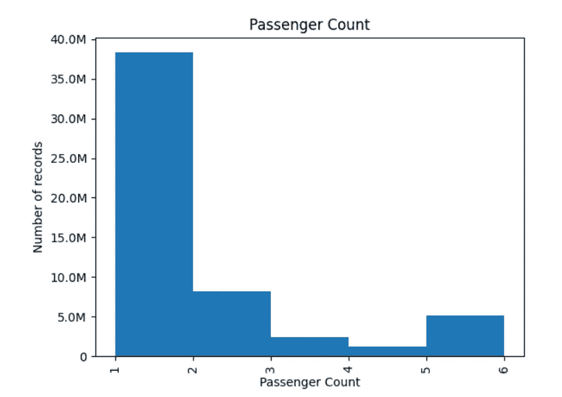

乘客数量分布。来源:图片由作者提供。

同样，我们对坐标字段进行相同的边界分析，并删除坐标距离纽约中心超过 2 度的行程。(40.771133, -73.974187).

```
train_data_filtered = train_data_passenger_filtered.filter((F.col("pickup_latitude").between(38.5, 42.5)))
train_data_filtered = train_data_filtered.filter((F.col("dropoff_latitude").between(38.5, 42.5)))
train_data_filtered = train_data_filtered.filter((F.col("pickup_longitude").between(-76, -72)))
train_data_filtered = train_data_filtered.filter((F.col("dropoff_longitude").between(-76, -72)))
```

## 机场票价分析

在地图上绘制行程坐标，我们看到纽约机场有许多接送服务。在获得纽约机场的坐标后，我们继续对此进行分析。

```
1\. Coordinates of Newark Airport = 40.6895° N, 74.1745° W

2\. Coordinates of JFK Airport = 40.6413° N, 73.7781° W

3\. Coordinates of La Guardia Airport = 40.7769° N, 73.8740° W
```

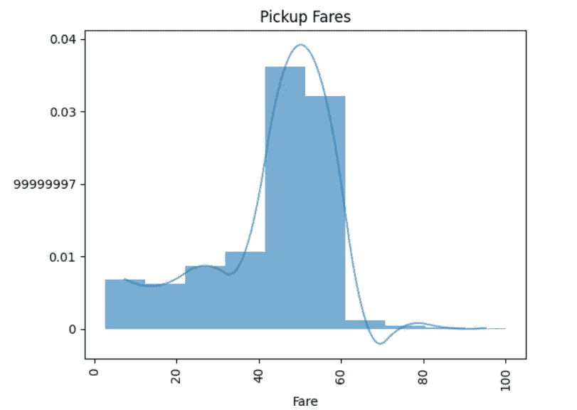

JFK 的接送费用分配。来源:图片由作者提供

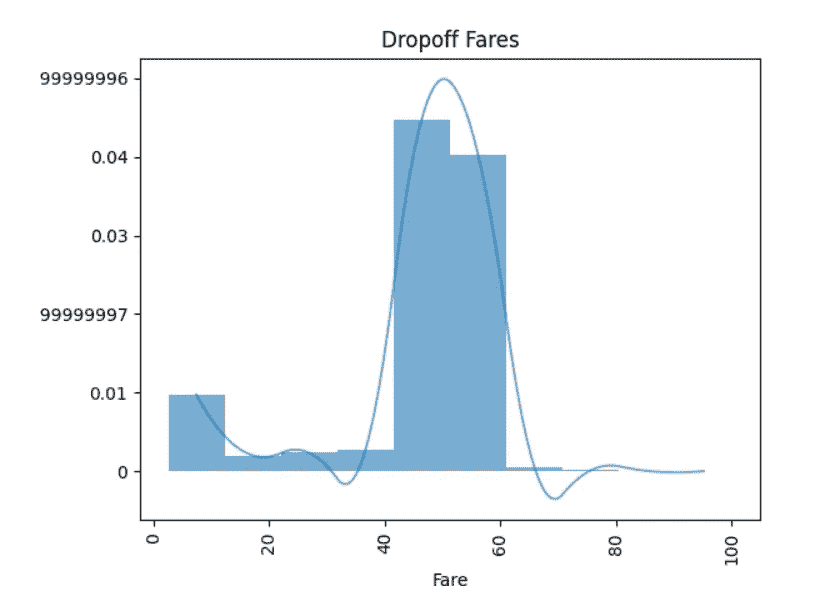

JFK 的落客票价分布。来源:图片由作者提供。

我们可以看到，JFK 的接送费用更多地在 40 美元到 60 美元之间，这表明价格是固定的。为了证实这一点，让我们将它与所有旅行的平均费用进行比较。

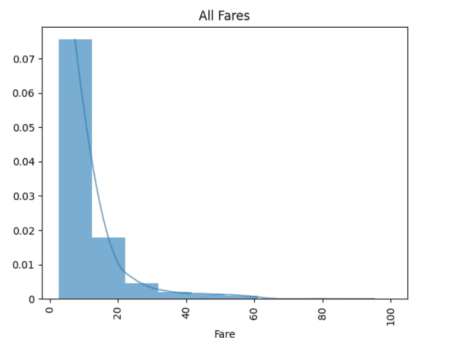

票价金额的分配。来源:图片由作者提供。

我们发现，当旅行与机场有关时，平均票价要高得多。因此，通过特征工程区分这些记录将有助于我们建立一个更好的模型，因为它将能够区分和识别机场旅行和非机场旅行之间的模式差异。因此，我们创建了指定记录(行程)是否到达三个机场中的任何一个的特征。

## 特征工程

对于功能工程和制作与机场相关的额外维度，我们在 PySpark 中使用了一个叫做[的用户自定义函数](https://docs.databricks.com/spark/latest/spark-sql/udf-python.html) (UDF)。这允许我们在 Spark 框架中使用用户定义的 Python 函数。

```
from pyspark.sql.functions import udf
from pyspark.sql.types import BooleanType# user-defined Python function
def isTripRelatedToAirport(latitude,longitude,airport_name='JFK'):   
    if ((latitude >= nyc_airports[airport_name]['min_lat']) & 
        (latitude <= nyc_airports[airport_name]['max_lat']) & 
        (longitude >= nyc_airports[airport_name]['min_lng']) & 
       (longitude <= nyc_airports[airport_name]['max_lng'])):
        return True
    else:
        return False# name the UDF using lambdas
featureEngineeringUDF = udf(lambda x, y, z: isTripRelatedToAirport(x,y,z),BooleanType())# register the Python UDF with Spark
spark.udf.register("featureEngineeringUDF", featureEngineeringUDF)
```

使用这个 UDF，我们构建与机场相关的维度。 **lit** 用于将硬编码的字符串传递到 UDF。

```
train_data_filtered = train_data_filtered.withColumn("is_pickup_JFK", featureEngineeringUDF(F.col("pickup_latitude"),F.col("pickup_longitude"), lit("JFK")))train_data_filtered = train_data_filtered.withColumn("is_dropoff_JFK", featureEngineeringUDF(F.col("dropoff_latitude"),F.col("dropoff_longitude"), lit("JFK")))train_data_filtered = train_data_filtered.withColumn("is_pickup_EWR", featureEngineeringUDF(F.col("pickup_latitude"),F.col("pickup_longitude"), lit("EWR")))train_data_filtered = train_data_filtered.withColumn("is_dropoff_EWR", featureEngineeringUDF(F.col("dropoff_latitude"),F.col("dropoff_longitude"), lit("EWR")))train_data_filtered = train_data_filtered.withColumn("is_pickup_LaGuardia", featureEngineeringUDF(F.col("pickup_latitude"),F.col("pickup_longitude"), lit("LaGuardia")))train_data_filtered =  train_data_filtered.withColumn("is_dropoff_LaGuardia", featureEngineeringUDF(F.col("dropoff_latitude"),F.col("dropoff_longitude"), lit("LaGuardia")))
```

接下来，我们使用 [**哈弗辛公式**](https://en.wikipedia.org/wiki/Haversine_formula) **计算距离坐标的公里数。**

```
from pyspark.sql.types import DoubleType, ArrayType, DecimalType
import math

def trip_distance(lat1, lat2, lon1, lon2):
    """
    Calculate trip distance based on Haversine formula
    Args:
        lat1: Latitude of first point
        lat2: Latitude of second point
        lon1: Longitude of first point
        lon2: :ongitude of second point
    Returns:
        Distance between the two points in miles
    """
    # pi / 180
    p = 0.017453292519943295
    a = 0.5 - math.cos((lat2 - lat1) * p)/2 + math.cos(lat1 * p) * math.cos(lat2 * p) * (1 - math.cos((lon2 - lon1) * p)) / 2
    return 0.6213712 * 12742 * math.asin(math.sqrt(a))

haversineUDF = udf(lambda a, b, c, d: trip_distance(a,b,c,d), DoubleType())
spark.udf.register("haversineUDF", haversineUDF)train_data_filtered = train_data_filtered.withColumn("trip_distance", haversineUDF(F.col("pickup_latitude"), F.col("dropoff_latitude"), F.col("pickup_longitude"), F.col("dropoff_longitude")))
```

## 逐区分析

我们还通过获取纽约所有行政区的坐标(皇后区、布鲁克林区、布朗克斯区、曼哈顿区、斯塔滕岛区)进行行政区旅行费用分析，类似于机场分析。

```
def getBorough(lat,lng):
    """
    Get the borough based on latitude and longitude
    Args:
        lat: Latitude of the place
        lng: Longitude of the place
    Returns:
        A string representing the name of the borough
    """
    locations = nyc_boroughs.keys()
    for location in locations:
        if (lat >= nyc_boroughs[location]['min_lat'] and 
            lat <= nyc_boroughs[location]['max_lat'] and 
            lng >= nyc_boroughs[location]['min_lng'] and 
            lng <= nyc_boroughs[location]['max_lng']):
            return location
    return 'others'

boroughUDF = udf(lambda a, b: getBorough(a,b))
spark.udf.register("boroughUDF", boroughUDF) train_data_filtered = train_data_filtered.withColumn("pickup_borough", boroughUDF(F.col("pickup_latitude"), F.col("pickup_longitude")))train_data_filtered = train_data_filtered.withColumn("dropoff_borough", boroughUDF(F.col("dropoff_latitude"), F.col("dropoff_longitude")))
```

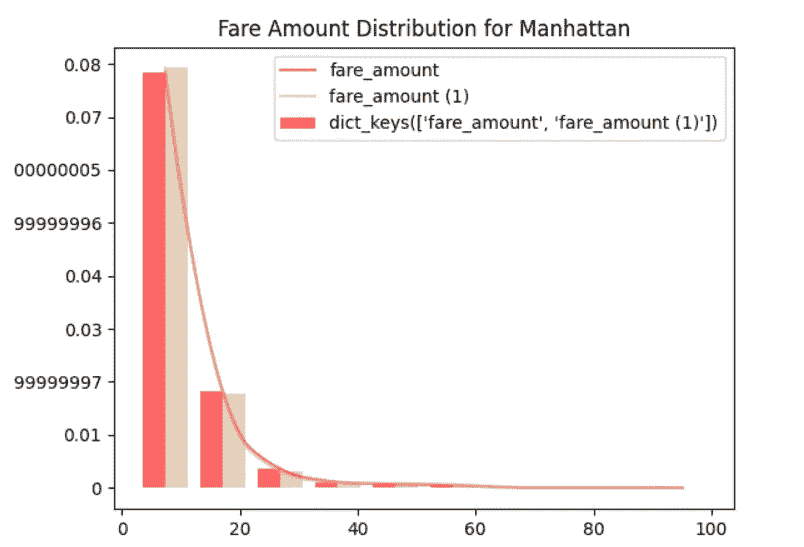

曼哈顿的票价分布。深红色代表接送车费，浅红色代表接送车费。来源:图片由作者提供。

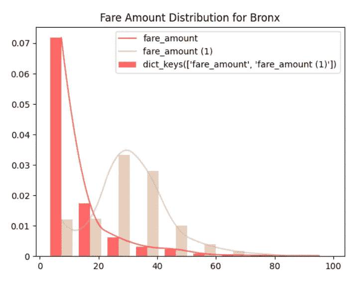

布朗克斯的票价分布。深红色代表接送车费，浅红色代表接送车费。来源:图片由作者提供。

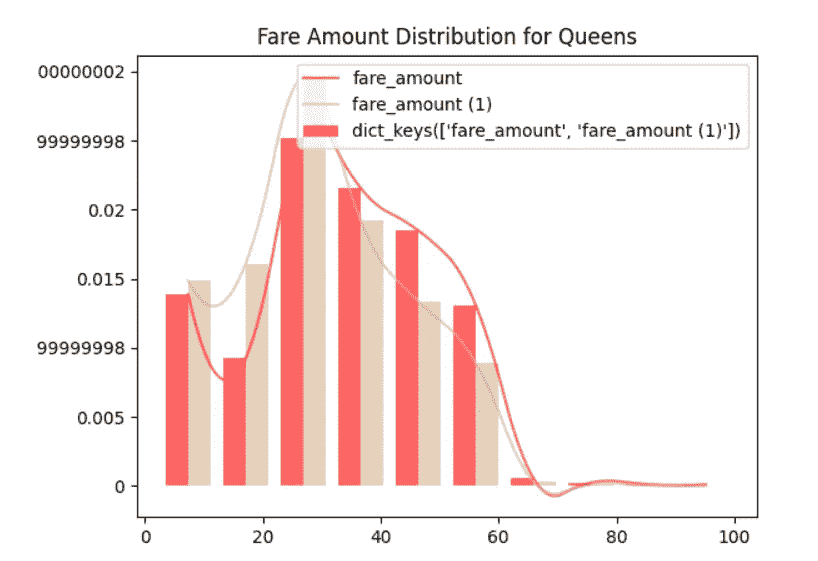

皇后区的票价分布。深红色代表接送车费，浅红色代表接送车费。来源:图片由作者提供。

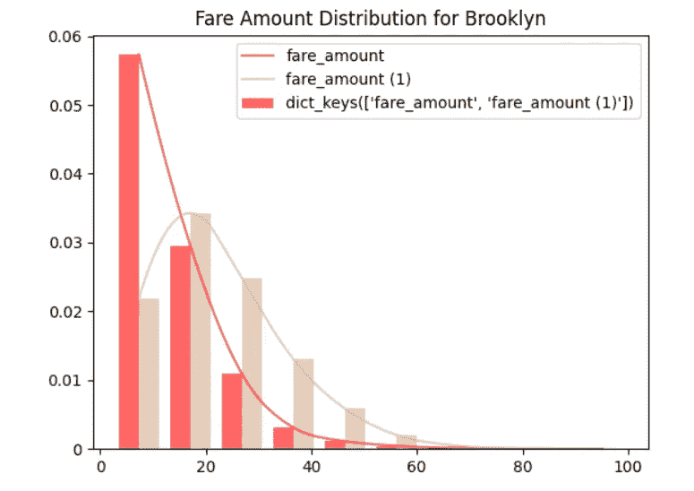

布鲁克林的票价分布。深红色代表接送车费，浅红色代表接送车费。来源:图片由作者提供。

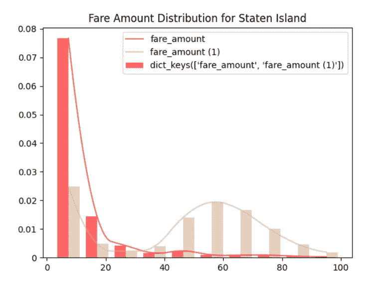

斯塔滕岛的票价分布。深红色代表接送车费，浅红色代表接送车费。来源:图片由作者提供。

我们从上面的逐区图表中得出以下结论:

1.  对于曼哈顿，接送费用金额分布几乎相似。
2.  布朗克斯、布鲁克林和斯塔滕岛的折扣价格更高，这意味着人们从很远的地方来到布朗克斯、布鲁克林和斯塔滕岛
3.  对于皇后区，这两个平均值都更高，这意味着人们通常会进行更长时间的旅行

## 基于时间的分析

最后，在使用 Spark MLlib 进行预测之前，我们进行一些基于时间的分析。为了更好地帮助可视化，使用 **toPandas()** 将 PySpark 数据帧的最终结果转换成 Pandas 数据帧

```
trips_by_year = train_data_filtered.groupBy("pickup_year").count().toPandas()
trips_by_year = trips_by_year.sort_values(by = "pickup_year")
trips_by_yeartrips_by_month = train_data_filtered.groupBy("pickup_month").count().toPandas()
trips_by_month = trips_by_month.sort_values(by = "pickup_month")
trips_by_month#similar for other granularities of time
```


每年的旅行次数。来源:图片由作者提供

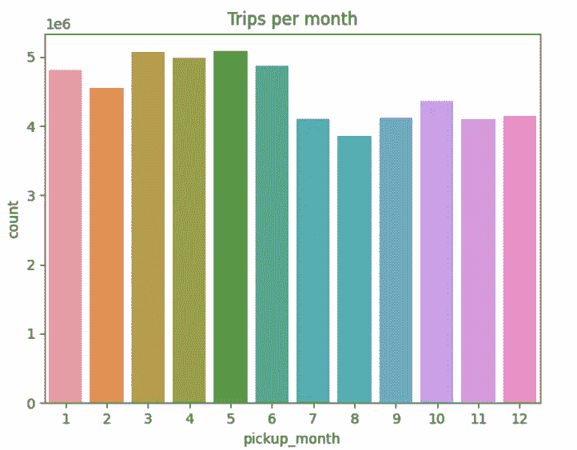

按月旅行。来源:图片由作者提供

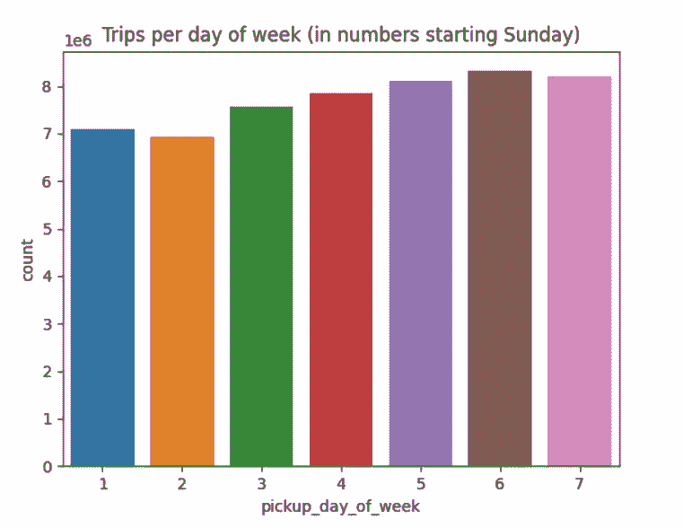

按星期几的旅行。来源:图片由作者提供

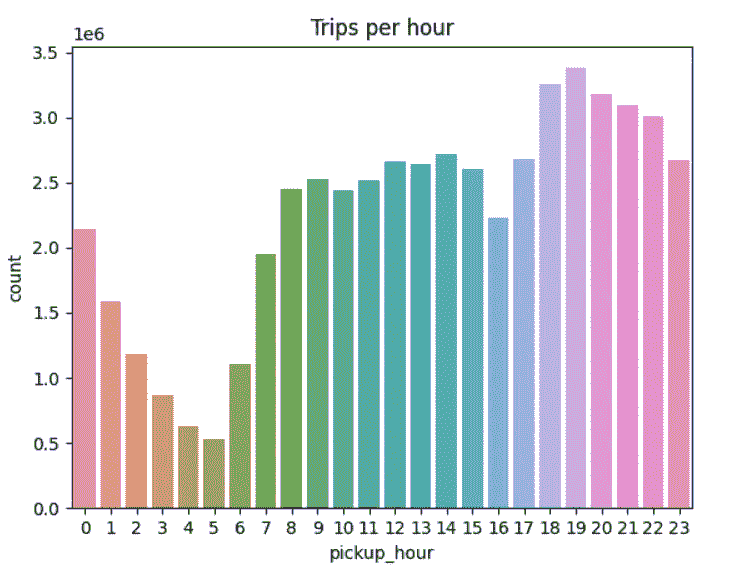

每小时的行程。来源:图片由作者提供。

# 构建 ML 管道

首先，我们删除数据类型为 *date-time* 的列，因为这些列需要时间序列概念。我们还对与每次旅行相关的行政区进行编码。 **StringIndexer** 用于编码(从分类转换为数字)，而 **OneHotEncoderEstimator** 用于一次性编码随后的行政区数字编码。

```
train_data_filtered = train_data_filtered.drop("pickup_datetime", "pickup_date", "key")# create object of StringIndexer class and specify input and output column
SI_pickup = StringIndexer(inputCol='pickup_borough',outputCol='pickup_borough_encoded')
SI_dropoff = StringIndexer(inputCol='dropoff_borough',outputCol='dropoff_borough_encoded')

# transform the data
train_data_filtered = SI_pickup.fit(train_data_filtered).transform(train_data_filtered)
train_data_filtered = SI_dropoff.fit(train_data_filtered).transform(train_data_filtered)

# create object and specify input and output column
OHE = OneHotEncoderEstimator(inputCols=['pickup_borough_encoded', 'dropoff_borough_encoded'],outputCols=['pickup_borough_OHE', 'dropoff_borough_OHE'])

# transform the data
train_data_filtered = OHE.fit(train_data_filtered).transform(train_data_filtered)

train_data_filtered = train_data_filtered.drop("pickup_borough", "dropoff_borough", "pickup_borough_encoded", dropoff_borough_encoded")
```

接下来， **VectorAssembler** 用于将所有特征组合成单个特征向量，这简化了机器学习算法的数据处理和预测。

```
featureColumns = ['pickup_longitude', 'pickup_latitude', 'dropoff_longitude', 'dropoff_latitude', 'passenger_count', 'pickup_day', 'pickup_hour', 'pickup_day_of_week', 'pickup_month', 'pickup_year', 'is_pickup_JFK', 'is_dropoff_JFK', 'is_pickup_EWR', 'is_dropoff_EWR', 'is_pickup_LaGuardia', 'is_dropoff_LaGuardia', 'trip_distance', 'is_pickup_in_lower_manhattan', 'is_drop_in_lower_manhattan', 'pickup_borough_OHE', 'dropoff_borough_OHE']

assembler = VectorAssembler(inputCols= featureColumns, outputCol="features")

full_set = assembler.transform(train_data_filtered)
```

最后，我们应用训练-测试分裂，并使用决策树和随机森林进行模型训练。

```
train_set, test_set = full_set.randomSplit([0.9, 0.1], seed=0)from pyspark.ml.regression import RandomForestRegressor
from pyspark.ml.evaluation import RegressionEvaluator

rf = RandomForestRegressor(labelCol="fare_amount", featuresCol= "features")
model = rf.fit(train_set)

predictions = model.transform(test_set)evaluator = RegressionEvaluator(predictionCol="prediction", labelCol="fare_amount",metricName="rmse")
print("RMSE Error on test set: ", evaluator.evaluate(predictions)
```

随机森林模型的精度为 4.4201。

```
from pyspark.ml.regression import DecisionTreeRegressor
from pyspark.ml.evaluation import RegressionEvaluatordt = DecisionTreeRegressor(labelCol="fare_amount", featuresCol= "features")
model = dt.fit(train_set)

predictions = model.transform(test_set)evaluator = RegressionEvaluator(predictionCol="prediction", labelCol="fare_amount",metricName="rmse")
print("RMSE Error on test set: ", evaluator.evaluate(predictions))
```

我们得到的最佳 RMSE 误差是针对决策树模型 **— 4.2814。**你可以在 [GitHub](https://github.com/kunjmehta/ny-taxi-prediction-pyspark-emr/blob/main/NY%20Taxi%20PySpark.ipynb) 上查阅完整的代码(包括可视化)和输出。

我很乐意在 Linkedin 上与你联系！