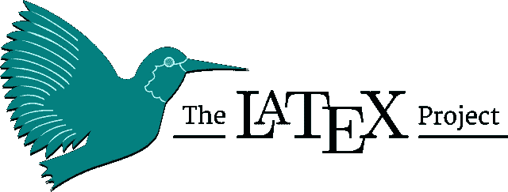
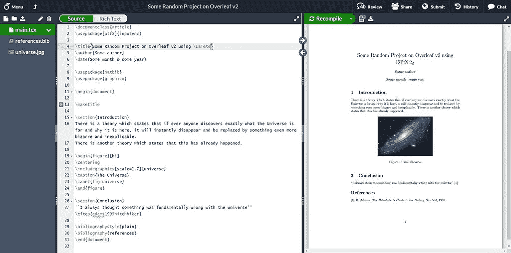
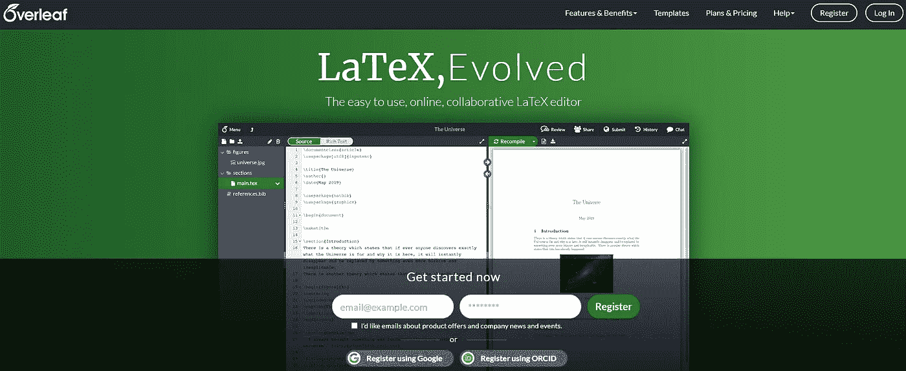
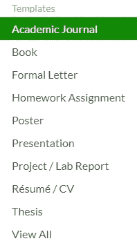
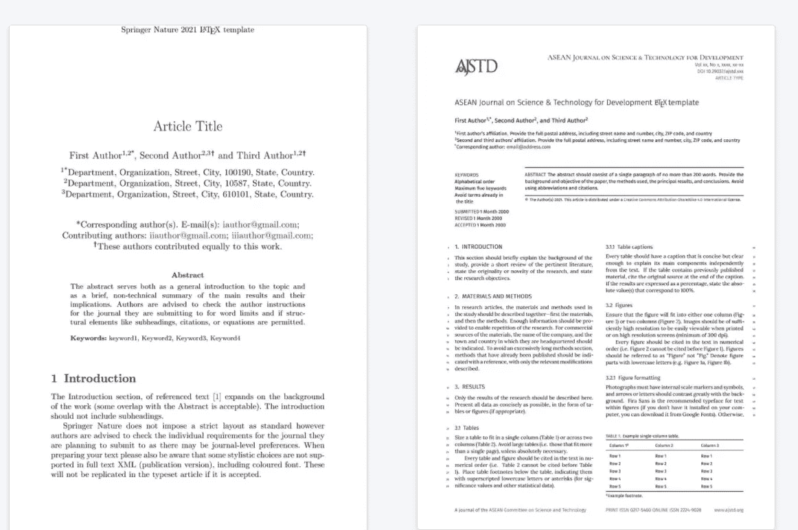

# TeX、LaTeX 和背面介绍

> 原文：<https://pub.towardsai.net/introduction-to-tex-latex-and-overleaf-f71d080f47ea?source=collection_archive---------2----------------------->

[JESHOOTS.COM](https://unsplash.com/@jeshoots?utm_source=medium&utm_medium=referral)在 [Unsplash](https://unsplash.com?utm_source=medium&utm_medium=referral) 上拍照

来自学术世界之窗的问候🍂
当提到学术文章/出版物时，我们的大脑肯定会开始打问号。作为一名理学硕士学生，我开始这份工作时，希望在我的硕士论文和我将创作的学术出版物中提出一个成功的具体成果。

## TeX 是什么？

📓这是一个排版系统，由 Donald Knuth 设计、编写并于 1978 年首次发布。

📓TeX 是创建复杂数学公式的一种流行方式；它被公认为最先进的数字印刷系统之一。

📓TeX 广泛应用于[学术界](https://en.wikipedia.org/wiki/Academy)，尤其是[数学](https://en.wikipedia.org/wiki/Mathematics)、[计算机科学](https://en.wikipedia.org/wiki/Computer_science)、[经济学](https://en.wikipedia.org/wiki/Economics)、[工程学](https://en.wikipedia.org/wiki/Engineering)、[语言学](https://en.wikipedia.org/wiki/Linguistics)、[物理学](https://en.wikipedia.org/wiki/Physics)、[统计学](https://en.wikipedia.org/wiki/Statistics)、[定量心理学](https://en.wikipedia.org/wiki/Quantitative_psychology)。

📑它也用于许多其他排版任务，特别是以 [LaTeX](https://en.wikipedia.org/wiki/LaTeX) 、 [ConTeXt](https://en.wikipedia.org/wiki/ConTeXt) 和其他宏包的形式。

## 乳胶是什么？

📘这是一个文件准备的软件系统。

📘当作者写作时，他使用纯文本，而不是像 Microsoft Word、LibreOffice Writer 和 Apple Pages 这样的“所见即所得”的文字处理器中的格式化文本。

📘作者使用标记标签规则来定义文档的一般结构(如文章、书籍和信件)，对整个文档中的文本进行样式化(如粗体和斜体)，并添加引用和交叉引用。

📘为了创建适合打印或数字分发的输出文件(如 PDF 或 DVI ),可以使用 TeX 分发，如 TeX Live 或 MiKTeX。

简而言之，就是在这条路上，我第一次遇到了 LaTeX 和 OverLeaf，也是在这条路上，我开始着手建立一个学术出版物。我也想和你分享这个信息。

## 什么是背页？🍃

📕Overleaf 是一个基于云的协作式 LaTeX 编辑器，用于撰写、编辑和发布科学文档。官方杂志与众多科学出版商合作，提供 LaTeX 模板和直接提交链接。

📕背面最初是由 WriteLaTeX 有限公司以 WriteLaTeX 的名字发布的，该公司由约翰·哈默斯利和约翰·利斯·米勒于 2012 年创立。

📕两位作者都是数学家，他们在大学的个人经历启发下设计了一个更好的合作科学写作解决方案。

📕他们于 2011 年开始开发 WriteLaTeX，并于 2014 年 1 月 16 日在伦敦大英图书馆的第一次 *#FuturePub* 活动上发布了 Overleaf 的测试版。

## 全世界 3，600 个机构的 800 多万名学生和学者使用背页。

> 我只想说，我真的很感谢背页，它使我的工作中的大量研究和教学发展成为可能，这在以前是非常困难的。即使不知道 LaTeX 的人也和我一起参与研究提案，如果你知道 LaTeX 对外行人来说是什么样的，那就说明了一些问题。谢了。谢谢你的支持！！
> 
> —加州大学圣地亚哥分校医学先进设备实验室的 James Friend 教授

背面的外观如下所示。如你所见，在图像的左边是一个 TeX 屏幕，右边是一个 PDF 预览。这样，我们就有可能创造出既更有规律又更容易的日记。

背面项目屏幕

## 使用背面

当你访问[的](http://overleaf.com)网站时，你会看到一个类似于下图的登录界面。您必须首先创建一个帐户。为了在学术上取得进步，我用我的账号登录。您也可以从头开始创建一个帐户。

背面登录屏幕

第二阶段是开始做一个项目。OverLeaf 的最大特点是它为您提供了一个适合您想要创建的杂志或出版物的模板格式。因为我要写一篇学术论文，所以我选择了插图中的选项。当然，这取决于期刊的格式(单栏对双栏)(爱思唯尔对施普林格)。

选择项目屏幕

☄️The 施普林格/东盟模板如下所示。它有很多模板。您可以通过将与您的项目最匹配的格式传输到它来改变它。

以下内容将涵盖 TeX、Bib 文件以及 LaTeX 格式命令的含义。请留意更新👀

 [## TeX -维基百科

### TeX(，见下文)，在系统内程式化为，是一个排版系统，是由唐纳德…

en.wikipedia.org](https://en.wikipedia.org/wiki/TeX)  [## 乳胶-维基百科

### LaTeX ( LAH-tekh 或 LAY-tekh，通常风格化为)是一个用于文档准备的软件系统。写作时…

en.wikipedia.org](https://en.wikipedia.org/wiki/LaTeX)  [## 背页-维基百科

### Overleaf 是一个基于云的协作式 LaTeX 编辑器，用于撰写、编辑和发布科学文档。它…

en.wikipedia.org](https://en.wikipedia.org/wiki/Overleaf)