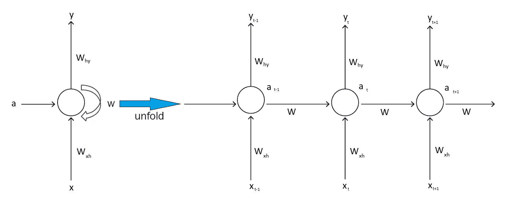
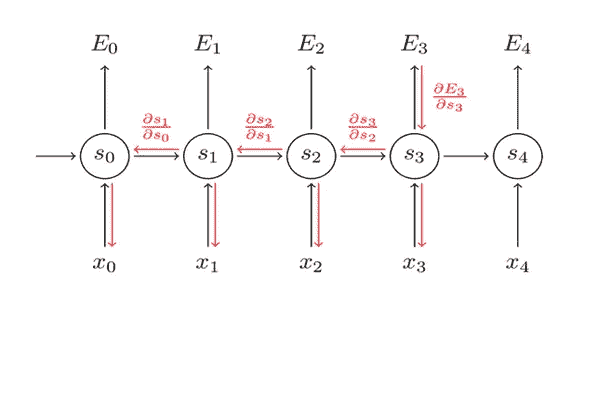
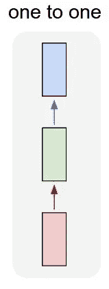
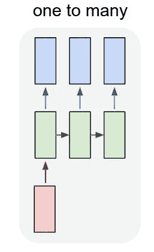
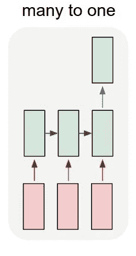
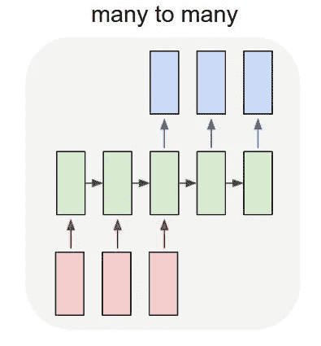
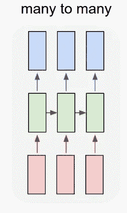

# 递归神经网络体系结构介绍

> 原文：<https://pub.towardsai.net/introduction-to-the-architecture-of-recurrent-neural-networks-rnns-a277007984b7?source=collection_archive---------0----------------------->

## RNNs 架构| [走向 AI](https://towardsai.net)

# 介绍

在我之前的文章中，我解释了将文本表示为向量的不同方式。你可以阅读一下 [**Word2Vec**](https://medium.com/towards-artificial-intelligence/an-intuitive-introduction-of-word2vec-by-building-a-word2vec-from-scratch-a1647e1c266c) 、 [**Doc2Vec**](https://medium.com/towards-artificial-intelligence/an-intuitive-introduction-of-document-vector-doc2vec-42c6205ca5a2) 你也可以找一个 jupyter 笔记本用于Word2Vec 型号使用[**fast text**](https://github.com/nitwmanish/An-Intuitive-Introduction-Of-Word2Vec-By-Building-A-Word2Vec-From-Scratch/blob/master/Building%20word%20vectors%20using%20fastText%20library.ipynb)**。**我们可以使用密集层在这些表示之上执行情感分类。你可以在**[**GitHub**](https://github.com/nitwmanish/An-Intuitive-Introduction-Of-Word2Vec-By-Building-A-Word2Vec-From-Scratch/blob/master/Building%20sentiment%20classification%20using%20word%20vectors.ipynb)**上找到一个用于**情感分类**的 jupyter 笔记本。****

**这种方法有一个问题，密集层不考虑单词的顺序。例如，考虑这两个句子**

1.  **鲍勃比汤姆强壮。**
2.  **汤姆比鲍勃强壮。**

**这里**

*   **在这两个句子中，单词完全相同。**
*   **但是单词的顺序不同。**
*   **单词的矢量表示在两个句子中是相同的。**

**我们知道这两个句子是不同的，它们不应该用数学结构来表示。**

****递归神经网络** ( **RNNs** )对于这类需要考虑单词顺序的场景很有用。**

**你可以把 **RNNs** 看作一种保存内存的机制——内存包含在隐藏层中。**

# **RNN 建筑**

****

****递归神经网络** ( **RNNs** )**

**右侧的网络是左侧网络的展开图，其中**

*   ****Wxh:** 是输入层与隐藏层连接的权重。**
*   ****W:** 是隐藏层到隐藏层的连接的权重。**
*   ****为什么:**是隐藏层到输出层连接的权重。**
*   ****答:**是层的激活。**

**递归神经网络从左到右扫描数据。**

**它用于每个时间步长的参数是共享的。在上图中，参数 **Wxh，Why** 和 **W** 对于每个时间步都是相同的。**

**在 **RNN** 在时间 **t** 进行预测时，不仅使用时间 **t** 的输入**“XT”**，还通过激活参数**“a”**和从前一个隐含层传递到当前隐含层的权重**“W”**使用来自时间 **t-1** 的前一个输入的信息。**

****注:**这种 **RNN** 有一个缺点就是它只使用序列中较早的信息来进行预测。因此 **RNN** 在某个时间的预测使用输入或使用来自序列中较早的信息，而不是序列中较晚的信息。**

# **穿越时间的反向传播**

**误差从最后一个时间步长反向传播到第一个时间步长。计算每个时间步长的误差，这允许我们更新权重。下图是一段时间后向传播的可视化。**

****

****通过时间反向传播****

# ****架构及其用例****

**可以有**一个**不同架构的 **RNN。下面是一些可能的方法。****

*   **这是一个标准的通用神经网络，我们不需要 RNN。该神经网络用于固定大小的输入到固定大小的输出，例如图像分类。**

****

****一对一****

*   ****一对多:**图像字幕，用于图像字幕输入，是图像，输出是图像的字幕。音乐生成，对于音乐生成，一个输入音符被馈送到网络，它预测序列中的下一个音符。**

****

****一对多****

*   ****多对一:**输入是一部电影的评论(输入多个单词)，输出是与评论相关联的情感。**

****

****多对一****

*   **多对多:把一种语言的句子翻译成另一种语言的句子的机器翻译。语音识别。**

****

****多对多****

*   ****多对多:**输入长度和输出长度相同的命名实体识别。**

****

****多对多****

****伴随 jupyter 本帖的笔记本可以在** [**Github**](https://github.com/nitwmanish/An-Introduction-Of-Recurrent-Neural-Networks) **上找到。****

# **结论**

****递归神经网络** ( **RNNs** )是用于处理序列数据的神经网络家族。 **RNNs** 考虑并使用来自输入序列的先前信息进行预测。 **RNNs** 也有限制，它不使用序列中后面的信息。**

*****我希望这篇文章能帮助你了解 RNNs，穿越时间的反向传播(BPTT)，RNNs 的不同架构，以及 RNNs 如何考虑单词的顺序和先前的输入来进行预测。*****

# **参考**

**安德烈·卡帕西，递归神经网络的不合理有效性。[http://karpathy.github.io/2015/05/21/rnn-effectiveness/](http://karpathy.github.io/2015/05/21/rnn-effectiveness/)**