# 马尔可夫链、过程和隐马尔可夫模型简介

> 原文：<https://pub.towardsai.net/introduction-to-the-markov-chain-process-and-hidden-markov-model-7b6abad37035?source=collection_archive---------0----------------------->

## [数据科学](https://towardsai.net/p/category/data-science)，[机器学习](https://towardsai.net/p/category/machine-learning)

## 数量金融学中马尔可夫链和隐马尔可夫模型的概念及应用

照片由[肖恩·奥·](https://unsplash.com/@seantookthese?utm_source=unsplash&utm_medium=referral&utm_content=creditCopyText)在 [Unsplash](https://unsplash.com/s/photos/sea?utm_source=unsplash&utm_medium=referral&utm_content=creditCopyText) 上拍摄

# 介绍

在机器学习领域最近的进展中，我们开始越来越多地讨论强化学习。强化学习不同于我们应该非常熟悉的监督学习，在监督学习中，它们不需要提供示例或标签。强化学习的重点是在探索(新环境)和利用(利用现有知识)之间找到正确的平衡。

强化学习的概念图

强化学习的环境一般以马尔可夫决策过程(MDP)的形式描述。因此，对我们来说，理解各种马尔可夫概念将是一个好主意；马尔可夫链、马尔可夫过程和隐马尔可夫模型(HMM)。

# 马尔可夫过程和马尔可夫链

这两个过程都是重要的随机过程。用更简单的术语来描述随机过程，想象我们有一袋多色球，我们继续从袋中取出球，而不放回袋中。这样，一个随机过程开始以随机变量的颜色存在，但它不满足马尔可夫性。因为每次球被移走，得到下一个特定颜色球的概率可能会有很大的不同。然而，如果我们允许球被放回袋子里，这就产生了一个随机变量带有颜色的随机过程。但是，这满足马尔可夫性质。

记住这一点，马尔可夫链是一个随机过程。然而，马尔可夫链必须是**无记忆的**，即未来的行动不依赖于导致当前状态的步骤。这个性质叫做 ***马尔可夫性质*** 。

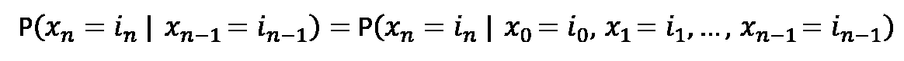

对于任意正整数 n 和随机变量的可能状态 I

确定当前状态的概率分布只需要知道以前的状态。

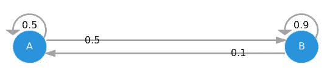

两状态马尔可夫链图，每个数字，，代表马尔可夫链从一种状态变化到另一种状态的概率

马尔可夫链是一个**离散时间**过程，其未来行为仅取决于当前状态而非过去状态。而马尔可夫过程是马尔可夫链的**连续时间**版本。

## 马尔可夫链

马尔可夫链的特征在于一组状态 ***S*** 和每个状态之间的转移概率 ***P*** ij。具有元素 Pij 的矩阵 P 被称为马尔可夫链的*转移概率矩阵*。

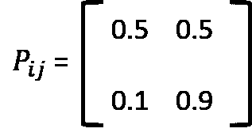

上述两状态马尔可夫链的转移矩阵

注意，P 的行和等于 1。在…的情况下；

*   马尔可夫链的所有状态都相互通信(可能从一个状态经过多个步骤到达另一个状态)
*   马尔可夫链不是周期性的(周期性的马尔可夫链就像你只能在偶数步中回到一个状态)
*   马尔可夫链不会漂移到无穷大

## 马尔可夫过程

主要区别在于转换行为的行为方式。在每种状态下，都有许多可能导致转换的事件。导致从状态 I 到 J 的转变的事件可以在指数量的时间后发生，**Q**ij。

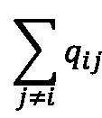

在状态 I 中，在参数为的指数时间量之后发生转变

系统可以从状态 I 转换到状态 j 的概率为；

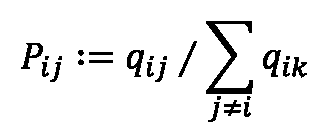

从 I 到 j 概率方程的马尔可夫过程转移

含有**Q**ij 元素的矩阵 Q 称为马尔可夫过程的*生成器*。Q 的行和为 0。在条件下；

*   马尔可夫过程的所有状态都相互通信
*   马尔可夫过程不会向无穷大漂移

# 应用

我们实际上在日常生活中处理马尔可夫链和马尔可夫过程用例，从购物，活动，演讲，欺诈，点击流预测。

让我们观察如何在 Python 中为银行业的贷款违约和付清实现这一点。我们可以观察和汇总投资组合的表现(在这种情况下，让我们假设我们有 1 年的数据)。我们可以计算概率路径，P(好贷款->坏贷款)= 3%，构造转移矩阵。

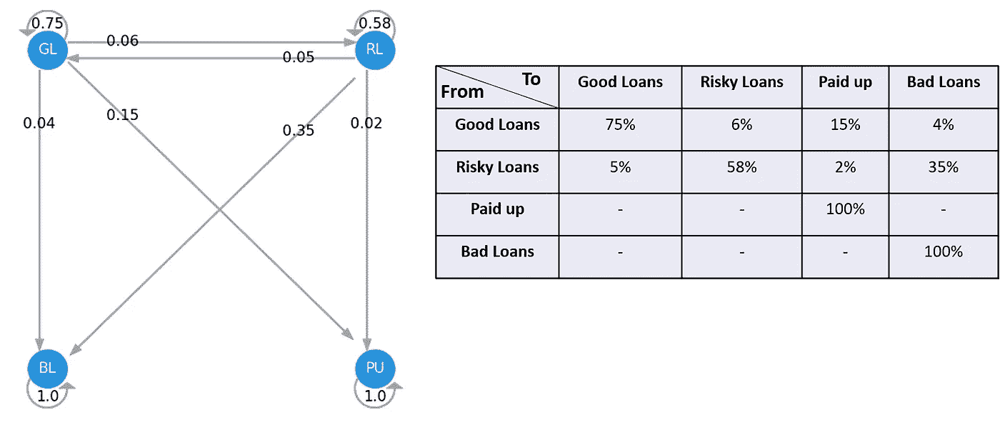

贷款组合一年绩效的四态转移矩阵

一旦我们有了这个转变，我们就可以用它来预测贷款组合在第一年末会变成什么样。假设我们有两个投资组合，一个是 90%的优质贷款，10%的风险贷款，另一个是 50:50。

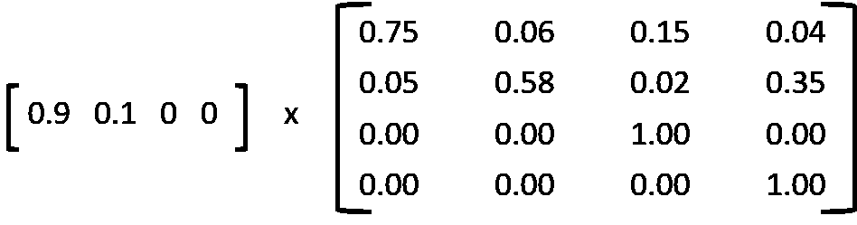

将转移矩阵乘以投资组合构成的计算示例

在第一年末，A 港将有 13.7%的已付贷款和 7.1%的不良贷款，而有 11.2%成为高风险贷款。端口 B 将分别成为 40%、32%、8.5%和 19.5%的良好贷款、风险贷款、已付贷款和不良贷款。

**马尔可夫模型的假设和局限性**

马尔可夫链在建模随机过程(例如，排序和 CRM 事件)时可以是强大的工具。然而，这种技术需要满足一些假设。

***假设 1*** :概率适用于系统中的所有参与者

***假设 2*** :转移概率随时间恒定

***假设 3*** :状态随时间独立

# 隐马尔可夫模型(HMM)

隐马尔可夫模型(hmm)是概率模型，它意味着数据背后的马尔可夫模型是隐藏的或未知的。更具体地说，我们只知道观察数据，而不知道关于状态的信息。

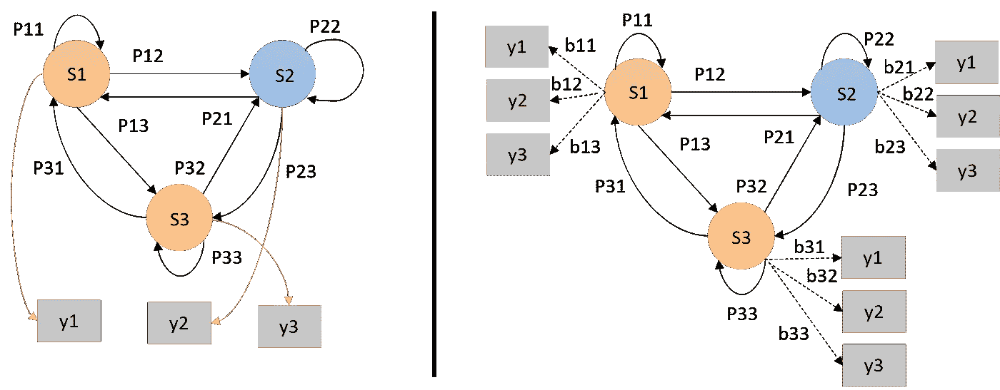

从马尔可夫链(左)到隐马尔可夫模型(右)；其中 S =状态，y =可能的观察值，P =状态转移概率，b =观察概率

HMM 由三个模型参数决定；

*   *开始概率*；包含状态成为序列的第**个**状态的概率的向量。
*   *状态转移概率*；由从状态 *Si* 转移到状态 *Sj* 的概率组成的矩阵。
*   *观察概率*；如果模型处于状态 *Si* 时，某个观察值 *y* 的可能性。

HMMs 可以用来解决四个基本问题；

1.  给定模型参数和观测序列，估计最可能的(隐藏)状态序列，这称为 ***解码问题*** 。
2.  给定模型参数和观测序列，求给定模型下观测序列的概率。这个过程涉及属性的最大似然估计，有时称为 ***评估问题*** 。
3.  给定观测序列，估计模型参数，这叫做 ***训练问题*** 。
4.  估计观测序列， *y1，y2* ，…，以及模型参数，使 y 的概率最大化，这叫做一个 ***学习或优化问题*** 。

## HMM 在量化金融中的用例

考虑到我们在尝试将预测技术应用于资产回报时面临的最大问题是一个 ***非平稳时间序列*** 。换句话说，资产回报的预期均值和波动性随着时间而变化。大多数时间序列模型和技术都假设数据是平稳的，这是这些模型的主要缺点。

现在，让我们用不同的方式来描述这个问题，我们知道时间序列展示了一个临时的时期，在这个时期，期望的均值和方差是稳定的。**这些时期或制度可以与 HMM** 的隐藏状态相关联。基于这个假设，我们所需要的是 ***可观察变量*** ，其行为允许我们 ***推断*** 到真正的隐藏状态。

在金融界，如果我们能够更好地估计一项资产最可能的状态，包括相关的均值和方差，那么我们的预测模型将变得更具适应性，并可能得到改善。此外，我们可以使用估计的状态参数进行更好的情景分析。

在这个例子中，我将使用可观察变量，Ted 利差，10 年-2 年恒定到期利差，10 年-3 个月恒定到期利差，以及 ICE BofA 美国高收益指数总回报指数，来找到隐藏的状态

在这个例子中，我使用的可观察变量是基础资产回报、ICE 美国银行高收益指数总回报指数、Ted 利差、10 年-2 年恒定到期利差和 10 年-3 个月恒定到期利差。

现在，我们试图用两种方法来模拟通用电气股票的隐藏状态；`sklearn's GaussianMixture`和`HMMLearn's GaussianHMM`。这两个模型都要求我们指定适合时间序列的组件数量，我们可以将这些组件视为政权。对于这个具体的例子，我将分配三个组成部分，并假设是高，神经，低挥发性。

获取数据的脚本

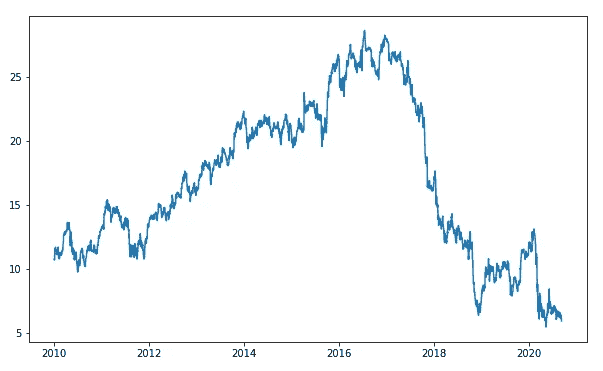

通用电气股价的可视化

## 高斯混合方法

这种混合模型通过利用期望最大化算法来估计隐藏状态的均值和协方差，实现了密切相关的监督形式的密度估计。请参考此[链接](https://scikit-learn.org/stable/modules/generated/sklearn.mixture.GaussianMixture.html)获取完整文档。

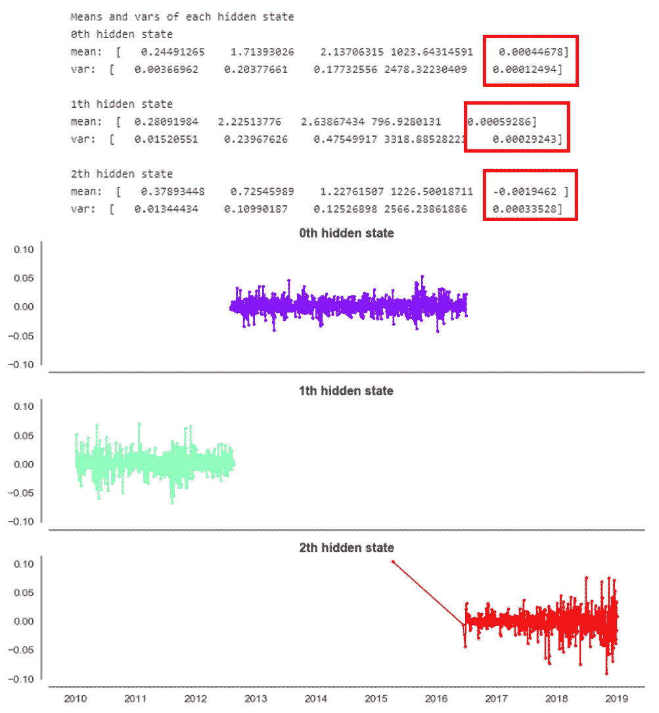

使用高斯混合模型的结果和可视化

红色突出显示表示通用电气股票回报的平均值和方差值。我们可以解释为，最后一个隐藏状态代表高波动性状态，基于最高方差，具有负收益。而第 0 个和第 1 个隐藏状态代表低的和中性的波动性。这种中性波动也显示了最大的预期收益。让我们来绘制这个颜色代码，并对照实际的 GE 股价进行绘图。

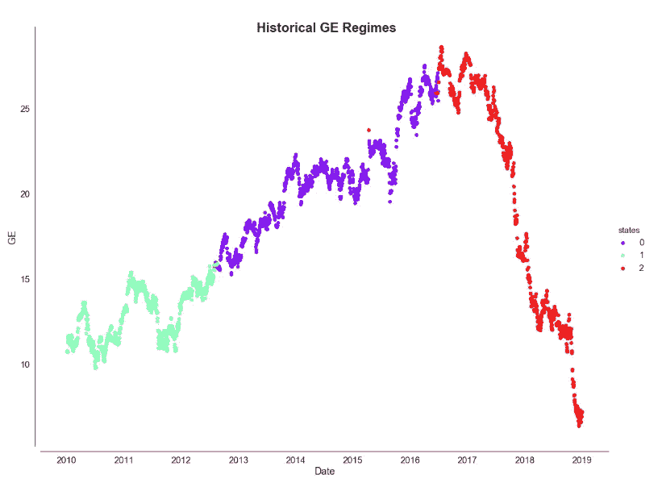

通用电气股价的隐藏状态(政权)( 2010 年初至 2019 年底)

## HMMLearn's GaussianHMM

HMMLearn 实现了简单的算法和模型来学习隐马尔可夫模型。有多种模型，如高斯、高斯混合和多项式，在这个例子中，我将使用`GaussianHMM`。更多详情，请参考本[文档](https://hmmlearn.readthedocs.io/en/latest/)。

使用 GaussianHMM 的结果和可视化

GaussianHMM 的结果与我们使用高斯混合模型得到的结果几乎相同。

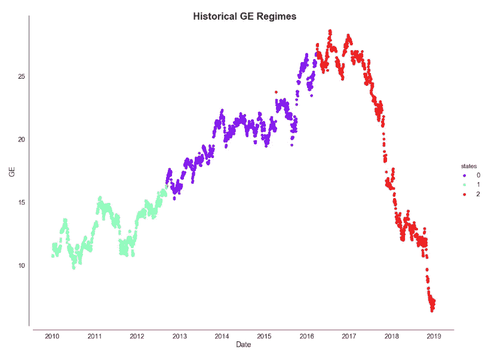

使用高斯-安海姆模型的隐藏状态(政权)

# 尾注

在这篇文章中，我们讨论了马尔可夫链、马尔可夫过程和隐马尔可夫模型的概念，以及它们的实现。我们使用 sklearn 的 GaussianMixture 和 HMMLearn 的 GaussianHMM 从其他观察变量来估计历史状态。

完整的代码实现，你可以参考这里的或者访问下面链接中的 my GitHub。快乐学习！！！

# 参考和 Github 知识库

[约翰霍普金斯资源](http://www.cs.jhu.edu/~langmea/resources/lecture_notes/hidden_markov_models.pdf)

 [## netsatsawat/马尔可夫与隐马尔可夫模型

### 这两个过程都是重要的随机过程。用更简单的术语来描述随机过程，假设我们…

github.com](https://github.com/netsatsawat/markov_and_hidden_markov_model)  [## 走向人工智能——最好的技术、科学和工程

### 欢迎来到人工智能最好的技术，科学和工程。走向人工智能最新故事更新[rev_slider…

towardsai.net](https://towardsai.net/)