# 熊猫图书馆简介

> 原文：<https://pub.towardsai.net/introduction-to-the-pandas-library-4e00f07fc18?source=collection_archive---------0----------------------->


Source — Nimble 编码

在开始之前，我建议你阅读我之前关于 NumPy [的文章。尽管 NumPy 的数组比 Python 的数据结构好，但有几个限制阻碍了它的使用。
1。NumPy 的**高维数组**每个数组只支持单一数据类型，这使得处理既有数字又有字符串的数据变得困难。
一般来说实时数据是一种或多种数据类型的组合。
2。Numpy 有硬件级的方法，但是没有为经常使用的分析模式预先构建的方法。](https://medium.com/datadriveninvestor/real-time-introduction-to-numpy-d556deb56f49)

熊猫库又称“Python 数据分析库”解决了上述问题。Pandas 是一个构建在 Numpy 之上的 python 库，它支持数据清理和数据操作。使用 Pandas，我们可以高效地对**多维和异构数据**执行操作。熊猫还让我们能够灵活地处理来自更广泛资源类别的数据，如`.csv`、`.tsv`、`excel`和`webpages`。Pandas 库主要由两种数据结构组成。(第三个数据结构**“面板”**这里不讨论。)

# 1.系列

一个**系列**是一个一维数据结构，可以看作是 Python 的字典和 Numpy 的 n-d 数组数据结构的扩展。一个系列可以被想象成一个具有两列的数据结构，一列用于索引(类似于 Python 中字典的键)，另一列用于实际数据。这里要注意的一个要点是数据列也可以有自己的标签。

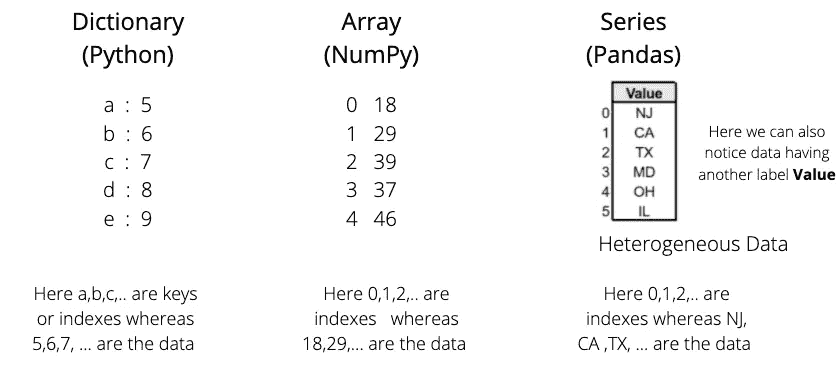

序列、数组和字典之间的区别

在内部，Pandas 使用 Numpy 库将一个 Series 对象存储在一个类型化数组中。与传统的 python 列表相比，这提高了处理数据的速度和性能。

**创建系列**

可以通过多种方式创建系列。首先，要使用熊猫图书馆，我们需要—

```
import pandas as pd
```

可以从 Python 列表、字典和 Numpy 数组创建 Series 对象。我们可以使用基本语法`pd.Series(data,index)`创建一个系列。index 参数在这里是可选的。

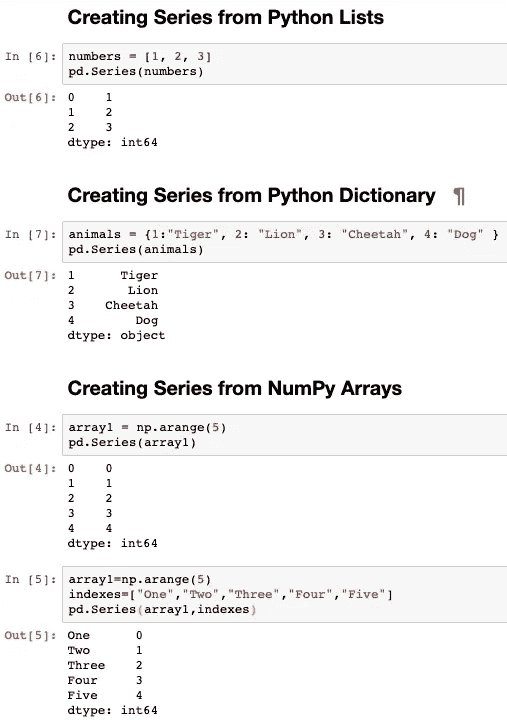

创建系列数据结构的不同方法

在前三个方法中，我们没有向 Series 方法传递任何索引参数，因此默认值 0… n-1 被视为索引。我们可以将自定义索引传递给数据值，如第四种方法所示。

**查询一个系列**

可以通过索引位置或索引标签来查询系列数据结构。当我们不传递 index 参数时，值的位置就变成了它的标签。为了通过数字位置进行查询，从零开始，我们使用了 *iloc* 属性。为了通过索引标签进行查询，我们可以使用 *loc* 属性。

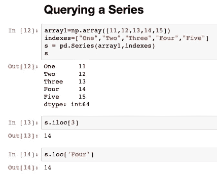

**让我们来回答一个问题！**

如果 indexes 对象中的值列表与字典中的键不匹配，如下所示，该怎么办？

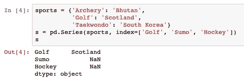

Pandas 将忽略索引对象中不存在的键。它将为存在于索引对象中但不在字典中的键提供一个 NaN 值，如上所示。

# 2.数据帧

数据帧结构是熊猫图书馆的核心。这些是具有行和列的二维数据结构。我们同样可以认为数据帧是一系列对象的集合。与 NumPy 二维数组不同，DataFrame 对象具有异构数据。组成数据帧的元素以及 Pandas 如何存储数据帧(每一列都是一个序列)可以在这里看到。

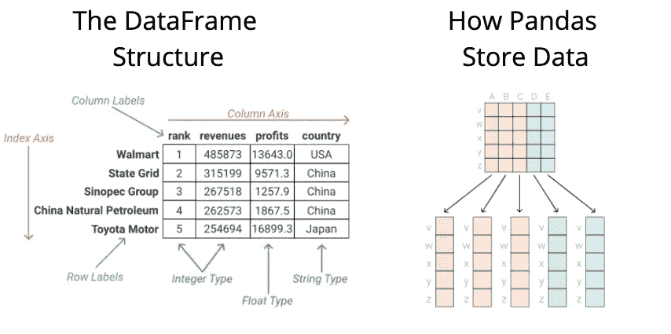

图像源— DataQuest

**创建数据帧**

数据帧的创建方式与系列的创建方式相同，由— `pd.DataFrame(data,index)`创建。我们将创建一个数据帧，首先创建三个系列对象，然后将它们转换成一个数据帧。

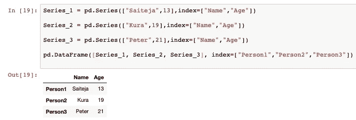

**探索数据帧**

`df.info()`返回数据帧的行数、列数和每列的数据类型以及内存使用情况。

`df.describe()`返回描述性统计数据，如数据框的中心性测量值和扩散性测量值。

**使用行和列**

类似于系列对象，
1。如果我们想要查询数据帧的一行，我们可以通过使用 **loc** 和 **iloc** 属性来使用索引标签或索引位置。
2。如果我们想要查询列，我们可以直接使用**括号符号[]** 和列名来检索整个列。
3。如果我们想要特定行和特定列的元素，我们使用 **loc** 属性并传递行标签或索引位置以及列标签或索引位置。

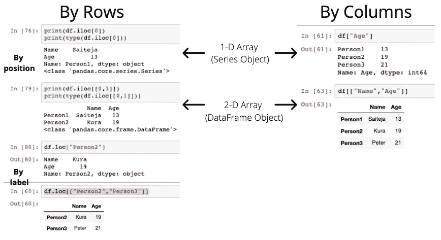

查询数据框的各种方法

我们注意到，如果我们的输出是一维数组，它将作为一个 Series 对象返回，如果我们的输出大于一维数组，它将作为 DataFrame 对象返回。

```
***# Query a particular cell using the labels***
df.loc["Person1","Name"]***# Query a particular cell using the labels***
df.iloc[0,1]
```

让我们来回答一个问题！

**df.iloc[[0，1]]** 和 **df.iloc[0，1]** 有什么区别？看起来差不多，对吗？但是仔细看看。

在第一种情况下，我们向 df.iloc[ ]属性传递一个由两个数字组成的列表，这意味着我们预期有 2 行，它们的索引位置分别为 0 和 1。该查询返回 DataFrame 对象。

在第二种情况下，我们将两个数字分别传递给 df.iloc[ ]属性，第一个数字是行索引，第二个数字是列索引。
**注:**我们也可以通过 **":"** 符号表示整行或整列。示例— df.iloc[:，7]将返回所有行，但仅返回第 7 列。

**向数据框架添加列**

这可以直接使用括号符号`[]`来完成，我们在其中传递新的列标签。如果我们向不存在的索引添加值，Pandas 会自动添加 **NaN** 值。

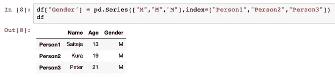

**删除行/列**

这可以使用` drop()函数来完成。它有两个参数。
1) **轴**，以指示方向。(`axis=0`暗示行，`axis=1`暗示列。)
2) **就地**，如果设置为 true，DataFrame 将就地更新，而不是返回一个副本。

另一个用于删除列的函数是 **del** 函数。

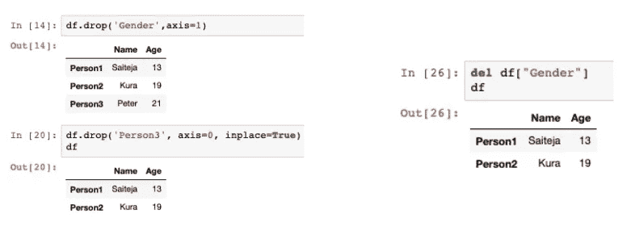

**过滤数据**

一个有趣的概念**布尔屏蔽**可用于对数据帧进行高效过滤。

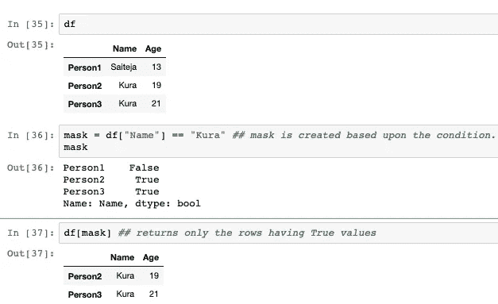

**分组依据**

例如，让我们向表中添加职业和薪水列。

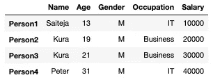

现在我们想找出从事“IT”和“商业”的人的平均工资。

常见的方法是遍历数据帧中的每一行，检查占用率并计算平均值。但我确实认为这种方法不太容易(熊猫的标准)。一种选择是使用`groupby()`功能。

`groupby()`允许我们根据列名对行进行分组，并执行求和、均值、标准差等聚合操作。

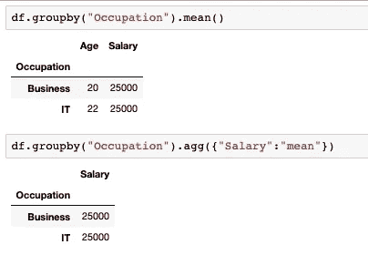

当我们直接调用 **mean()** 方法时，它对所有具有兼容数据类型的列进行操作。

为了仅对所需的列执行 mean，我们需要使用`.agg()`方法，将列名和函数作为键值对传递给它。

熊猫使用的更多功能…

`sort_values`以列名为参数，默认按升序排序。示例`df.sort_values(“Age”,ascending=True)`

`nlargest()` 和`nsmallest()`返回给定列中“n”个最大和最小的元素。示例 df.nlargest(3，" Age ")返回年龄最大的前 3 个人。

`idxmax()`和`idxmin()`返回第一个出现的最大值和最小值的索引。

`dropna()`用于删除包含空值/缺失值的列。

`astype(x)`尝试遍历每一行，并将数据类型改为 x。

`apply()`用于在数据帧上调用**用户自定义函数**。语法如下所示。

```
def cube(x):
    return x*x*xdf['Salary'].apply(cube)
```

**合并数据帧**

当我们想要将数据帧连接在一起时，我们不能直接跳到代码中。我们必须先做出选择。让我们创建两个数据帧 student_df 和 staff_df。

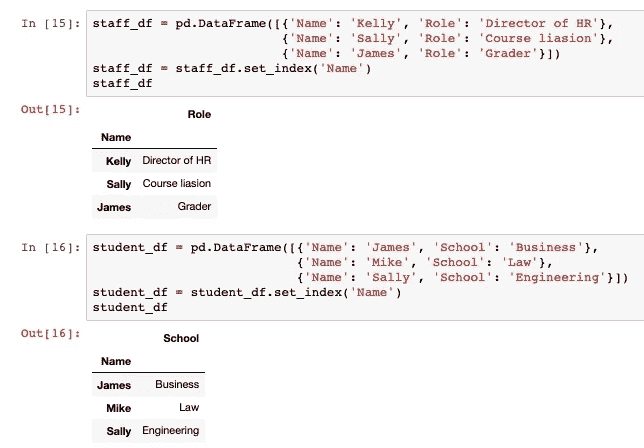

首先，如果我们想获得每个人的信息，不管他们是学生还是职员，我们使用**全外部连接。**
接下来，如果我们想获得职员和学生的信息，我们使用**内部连接**。

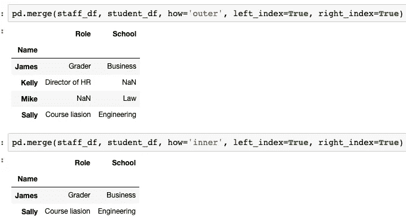

我们需要将连接的类型传递给`how`参数进行合并。我们还告诉 merge 函数，我们希望通过将 left_index 和 right_index 设置为 **True** 来使用左索引和右索引作为连接列。在完全外部连接的情况下，詹姆斯·凯利没有学校，迈克也没有角色。因此，这些被 NaN 值替换。

类似地，如果我们想知道所有职员的详细信息，不管他们是否是学生，但是如果他们是学生，我们也想得到他们的学生详细信息，我们可以使用 **left join。**我们可以用**右连接**反之亦然。

**从文件中读取**

`pd.read_csv()`用于将. csv 文件转换为数据帧。

`pd.read_excel()`用于从 Excel 文件导入数据。

`pd.read_html()`允许我们从 HTML 文件中读取表格。

**写入文件**

`.to_csv()`将我们的数据帧转换为. csv 文件。

类似地，`to_excel()`将我们的数据框存储在一个 Excel 文件中。

# 结论

希望这篇文章能帮助你理解熊猫的重要性和它所提供的性能改进。对于有志于从事数据领域工作的人来说，Pandas 是一个非常方便的图书馆。非常感谢您的阅读，如果您觉得这篇文章有用，请随意分享。