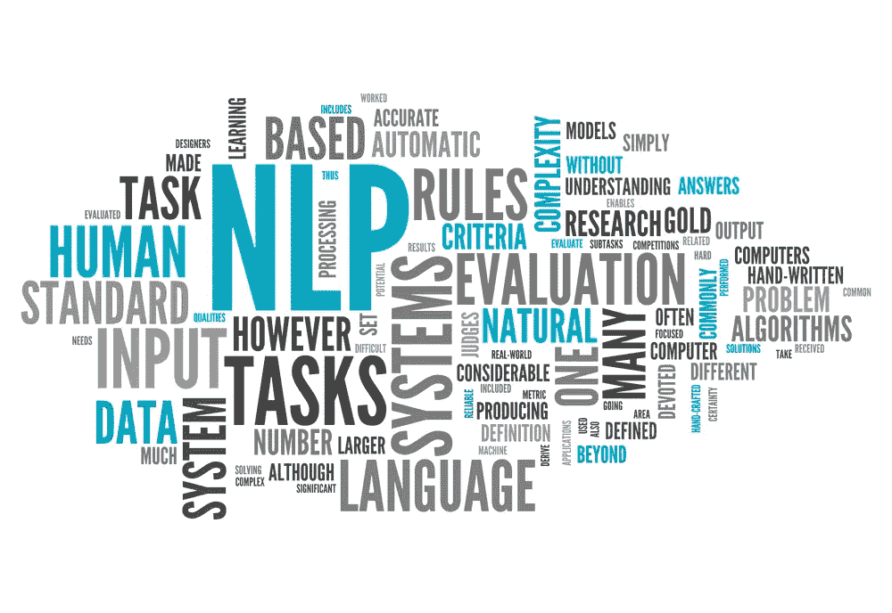
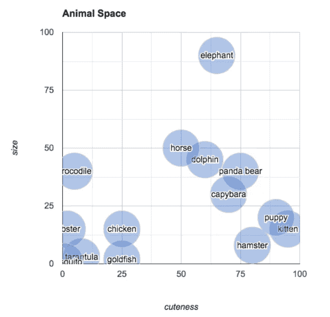
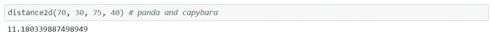
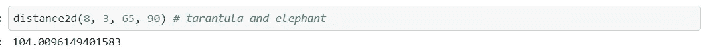

# 单词嵌入简介

> 原文：<https://pub.towardsai.net/introduction-to-word-embedding-5ba5cf97d296?source=collection_archive---------1----------------------->

## [深度学习](https://towardsai.net/p/category/machine-learning/deep-learning)，[自然语言处理](https://towardsai.net/p/category/nlp)

## 利用深度学习实现自然语言处理中的单词嵌入。



来自 Kaggle 的单词云

单词嵌入是一种通过低维向量获取单词“含义”的方法，可以用于自然语言处理的各种任务中。

在开始单词嵌入教程之前，我们应该了解一下**向量空间**和**相似度矩阵**。

# 向量空间

用于识别空间中一个点的数字序列被称为**向量**，如果我们有一整串向量都属于同一个数据集，它将被称为**向量空间**。

文本中的单词也可以在向量空间的更高维度中表示，其中具有相同含义的单词将具有相似的表示。举个例子，



照片来自 Github

上图显示了动物可爱程度和大小的矢量表示。我们可以看到，在相似性质的基础上，词与词之间存在着语义关系。很难描述单词之间的高维度关系，但是背后的数学原理是一样的，所以在高维度中也是一样的。

# **相似度矩阵**

它用于计算向量空间中向量之间的距离。它测量向量空间中两个数据点之间的相似性或距离。这使我们能够捕捉到以相似方式使用的单词，从而使相似的表达自然地捕捉到它们的意思。有许多相似性矩阵可用，但我们将讨论**欧几里德距离**和**余弦相似性。**

## 欧几里得距离

> 计算两个数据点在向量空间中有多远的一种方法是计算欧几里德距离。

```
**import** **math**
**def** distance2d(x1, y1, x2, y2):
    **return** math.sqrt((x1 - x2)**2 + (y1 - y2)**2)
```

因此，上面图像示例中“水豚”(70，30)和“熊猫”(74，40)之间的距离:



…小于上图示例中“狼蛛”和“大象”之间的距离:



这表明“熊猫”和“水豚”比“狼蛛”和“大象”更相似。

## 余弦相似性

> 它是内积空间的两个非零向量之间相似性的度量，度量它们之间角度的余弦。

```
from numpy import dot
from numpy.linalg import norm

cos_sim = dot(a, b)/(norm(a)*norm(b))
```

# 现在的问题是什么是单词嵌入，我们为什么要使用它们？

简单来说，它们是句子、文档等中单词的向量表示。,

单词嵌入是数字向量形式的单词的学习表示。它从文本语料库中学习预定义的固定大小词汇的密集分布表示。单词嵌入表示能够揭示单词之间的许多隐藏关系。例如，vector(“国王”)— vector(“领主”)类似于 vector(“女王”)— vector(“公主”)

这是对表示单词的传统方法的改进，例如**单词袋**模型，其产生大的稀疏向量，这在计算上不切实际地表示整个词汇。由于其庞大的词汇表，这些表示是稀疏的，并且给定的单词或文档将由主要由零值组成的大向量来表示，稀疏表示。

> 从文本中学习单词嵌入的两种流行方法包括:
> 
> **1。Word2Vec** 。
> 
> **2。手套**。

有一些预先训练好的模型是在一个大的文本语料库上训练出来的。我们可以在用例中使用它们。

除了这些方法，还可以使用深度学习模型来学习单词嵌入。这可能是一种较慢的方法，但我们可以为自己的用例设计它。该模型将根据我们自己的要求在特定的训练数据集上进行训练。Keras 提供了一个非常简单灵活的[嵌入](https://keras.io/api/layers/core_layers/embedding/#embedding)层，可以用于文本数据上的神经网络。

> 在本教程中，我们将使用 Keras 来训练我们自己的单词嵌入模型，并可进一步用于情感分析、机器翻译、语言建模和各种其他自然语言处理任务。

## 导入模块

让我们开始导入数据集、模块并检查它的头部。我从卡格尔·IMBD 电影评论中获取了一组数据。

[](https://www.kaggle.com/krystalliu152/imbd-movie-reviewnpl) [## IMBD 电影评论

### 卡格尔

www.kaggle.com](https://www.kaggle.com/krystalliu152/imbd-movie-reviewnpl) 

```
import pandas as pd
import numpy as np
from numpy import array
from keras.preprocessing.text import one_hot, Tokenizer
from keras.preprocessing.sequence import pad_sequences
from keras.models import Sequential
from keras.layers import Dense
from keras.layers import Flatten
from keras.layers.embeddings import Embedding
```

我们将使用 [Scikit-learn](https://scikit-learn.org/stable/modules/generated/sklearn.model_selection.train_test_split.html) 将数据集分为训练集和测试集。我们将在 70%的数据上训练单词 embedding，并在 30%的数据上进行测试。

## 对所有文件进行整数编码

在此之后，所有唯一的单词将由一个整数表示。为此，我们使用 Keras 中可用的 **one_hot** 函数。请注意， **vocab_size** 被指定为唯一字的总数，以确保每个字的**唯一整数编码**。

**注意一件重要的事情，单词的整数编码在不同的文本中保持不变。在每一份文件中,“年”都用 23518 表示。**

现在让我们来看看其中的一篇评论。在接下来的步骤中，我们将把这个句子和它的变形进行比较。

```
I really didn't like this movie because it didn't really bring across the messages and ideas L'Engle brought out in her novel. We had read the novel in our English class and i absolutely loved it, i'm afraid i can't say the same for the film. There were some serious differences between the novel and the adapted version and it just didn't do any credit to the imaginative genius that is Madeleine L'Engle! This is the reason i gave it such a poor rating. Don't see this movie if you are a big fan of L'Engle's texts because you will be sorely disappointed. However, if you are watching the movie for entertainment purposes (or educational as was my case) then it is an alright movie!
```

该评论将被转换成整数表示，其中每个数字代表一个唯一的单词。

```
[24608, 32542, 30289, 58025, 50966, 19624, 43296, 35850, 30289, 32542, 31519, 11569, 30465, 7968, 12928, 34105, 8750, 49668, 38039, 40264, 3503, 45016, 63074, 41404, 53275, 30465, 45016, 40264, 28666, 47101, 44909, 12928, 24608, 62202, 46727, 35850, 24425, 5515, 24608, 25601, 35725, 30465, 10577, 55918, 30465, 13875, 62286, 22967, 5067, 9001, 33291, 1247, 30465, 45016, 12928, 30465, 23555, 44142, 12928, 35850, 41976, 30289, 20229, 15687, 7845, 50705, 30465, 58301, 14031, 11556, 1495, 26143, 8750, 50966, 1495, 30465, 63056, 24608, 39847, 35850, 30936, 54227, 33469, 55622, 8193, 3111, 50966, 19624, 9403, 51670, 40033, 54227, 42254, 52367, 44935, 63226, 17625, 43296, 51670, 65642, 30053, 42863, 34757, 32894, 9403, 51670, 40033, 1112, 30465, 19624, 55918, 55169, 57666, 10193, 50176, 59413, 10480, 63135, 56156, 64520, 35850, 1495, 49938, 59074, 19624]
```

## 填充文本(使文本具有相同的长度)

**Keras 嵌入层要求所有单个文档长度相同。**因此，我们现在用 0 填充较短的文档。因此现在在 Keras 嵌入层中，**‘input _ length’**将等于具有最大长度或最大字数的文档的长度(即字数)。

为了填充较短的文档，我使用了 Keras 库中的 **pad_sequences** 函数。

```
The maximum number of words in any document is :  1719
```

在这里，我们发现一个句子最多可以容纳 1719 个单词。所以我们将根据它填充。在填充中，我们将在比 max_length 更短的句子中添加零(0)。在较短的句子中,“0”将被加在句子的开头。

例如:

```
array([    0,     0,     0, ..., 32875, 18129, 60728])
```

## 我们将使用 KERAS 嵌入层创建嵌入

现在所有的文本长度相同(填充后)。所以现在我们准备创建和使用嵌入层。

**嵌入层的参数—**

**'Input_dim' =我们将选择的 vocab 大小**。它是词汇表中唯一单词的数量。

**'Output_dim' =我们希望嵌入到**中的维数。每个单词可以用一个相同维数的向量来表示。

**'输入长度' =最大文本长度**。它存储在示例中的`maxlen`变量中。

```
Model: "sequential_1"
_________________________________________________________________
Layer (type)                 Output Shape              Param #   
=================================================================
embedding_1 (Embedding)      (None, 1719, 8)           527680    
_________________________________________________________________
flatten_1 (Flatten)          (None, 13752)             0         
_________________________________________________________________
dense_1 (Dense)              (None, 1)                 13753     
=================================================================
Total params: 541,433
Trainable params: 541,433
Non-trainable params: 0
_________________________________________________________________
None
```

现在，让我们在训练集上检查模型的准确性。

```
6000/6000 [==============================] - 1s 170us/step
Training Accuracy is 100.0
```

下一步我们可以在测试集上检查它的准确性。

```
4000/4000 [==============================] - 1s 179us/step
Testing Accuracy is 86.57500147819519
```

我们得到了 100%的训练准确率，因为在我们训练嵌入的数据上，但是对于测试数据，使用了一些看不见的词，所以我们得到的准确率有点低。

在实践中，我建议使用固定的预训练嵌入来执行单词嵌入，并尝试在预训练嵌入的基础上执行学习。这肯定会提高测试数据的性能。

## 下一步是什么

现在我们已经学会了如何用连续数字的形式来表示单词。与诸如词袋或 TF-IDF(术语频率-逆文档频率)等其他形式的文本表示相比。单词嵌入给出了单词之间更好的语义关系。它可以显著提高自然语言处理(NLP)任务的性能。

现在，我建议你在自己的 NLP 任务中尝试单词嵌入，你会发现性能有了显著的提高。您还可以通过使用预先训练的单词嵌入(如 Word2Vec)在同一个数据集上尝试实现单词嵌入，并在此基础上执行学习。

通常，您会注意到预训练模型在测试集上具有更高的准确性，原因是它已经在大量的 NLP 数据集上进行了训练。但是如果你有足够的数据，并且想要执行一个特定的任务，那么训练你自己的单词嵌入将是一个更好的选择。

[**GitHub**](https://github.com/bharatc9530/Machine-Learning/tree/master/Embedding) **上有嵌入文字的代码。**

# 参考

1.  这是一个很好的基本理解单词向量的教程。

2.

[](https://keras.io/api/layers/core_layers/embedding/#embedding) [## Keras 文档:嵌入层

### 将正整数(索引)转换为固定大小的密集向量。例如[[4]，[20]]-->[[0.25，0.1]，[0.6，-0.2]]这个…

keras.io](https://keras.io/api/layers/core_layers/embedding/#embedding) 

3.把 GloVe 和 Word2Vec 理解为预先训练好的单词嵌入。

[](https://machinelearningmastery.com/use-word-embedding-layers-deep-learning-keras/) [## 如何用 Keras 使用单词嵌入层进行深度学习——机器学习掌握

### 单词嵌入提供了单词及其相关含义的密集表示。它们比…有所改进

machinelearningmastery.com](https://machinelearningmastery.com/use-word-embedding-layers-deep-learning-keras/) 

谢谢你的阅读。我希望这有助于您理解单词嵌入及其在自然语言处理(NLP)中的重要性。

跟我上 [**中**](https://medium.com/@bharatchoudhary817) 。一如既往，我欢迎反馈和建设性的批评，您可以通过 [**Linkedin**](http://www.linkedin.com/in/bharat-choudhary-9530) 联系我。