# 中心极限定理背后的直觉

> 原文：<https://pub.towardsai.net/intuition-behind-central-limit-theorem-1d4a4bfeda8c?source=collection_archive---------0----------------------->

## [统计数据](https://towardsai.net/p/category/statistics)

## 直觉最简单的例子&用 Python 可视化 CLT

[乔丹·罗兰](https://unsplash.com/@yakimadesign?utm_source=medium&utm_medium=referral)在 [Unsplash](https://unsplash.com?utm_source=medium&utm_medium=referral) 上的照片

> mean 和 sd 的所有可视化代码和计算都在这个 [GitHub 笔记本](https://github.com/AlisonYao/Data-Science-All-Along/blob/main/Stats/CLT_blog.ipynb)中。

**中心极限定理(CLT)** 是统计学和数据科学中最重要也是最美的定理之一。在这篇博客中，我将解释一个简单直观的方法分布的例子，并使用 python 可视化 CLT。

让我们从基础开始。

# 均值分布与分数分布

当我们谈论统计学时，大多数人会想到分数的分布。也就是说，如果我们有 6，34，11，98，52，34，13，4，48，68，我们可以计算这 10 个分数的平均值:

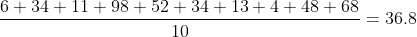

随后，人口标准差是:

另一方面，**均值分布**着眼于样本中 2 个或 3 个或更多分数的分组。例如，如果我们为了方便而对分数进行分组，我们可以将 6 和 34 作为第一组，将 11 和 98 作为第二组，以此类推。我们看所有组的均值，分别是(6+34)/2=20，(11+98)/2 = 54.5 等等。然后，我们计算 5 个平均值的分布的平均值，这应该与分数 36.8 的分布的平均值相同。

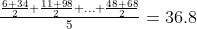

因此，你可以把分数的分布想象成学习 6、34、11、98、52、34、13、4、48、68(这 10 个分数)，把平均数的分布想象成学习 10、54.5、43、8.5、58(这 5 个平均数)。

但是当然，这种类型的分组 2 分数仅仅是为了演示的目的。实际上，我们从 10 个分数中 [bootstrap](https://en.wikipedia.org/wiki/Bootstrapping_(statistics)) (带替换的随机抽样)并且有无限多个相同大小 n 的组。

接下来，让我们深入一个简单的硬币例子。

# CLT 形象化的例子

## 对 CLT 的误解

假设我们有 1000 枚公平硬币，我们用 1 表示正面，用 0 表示反面。如果我将每枚硬币抛一次，我们将会得到这样的分布:

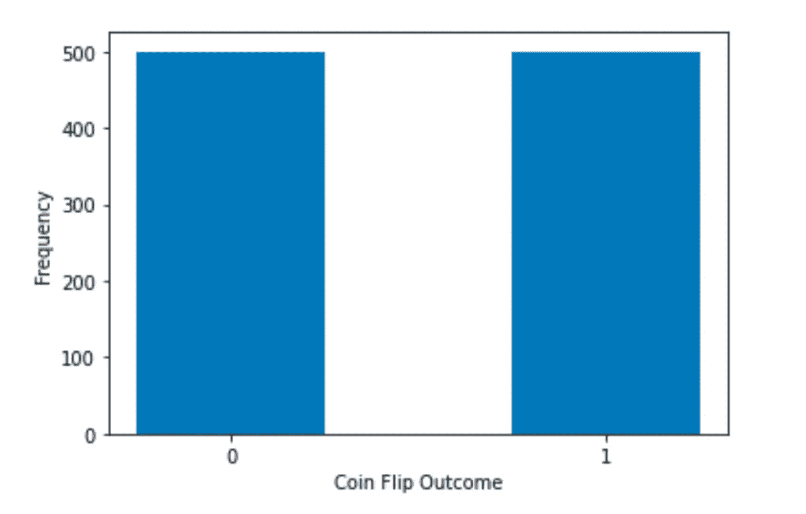

作者图片

我强调*是理想的*，因为在现实中，一个人可能很容易以 501/499 或 490/510 的比例结束。

那么为什么 500/500 比较理想呢？直观地理解这一点似乎相当容易。我们如何从数学上证明这一点？

要回答这个问题，我们需要谈一谈**概率**。

> 概率涉及预测未来事件发生的可能性，而统计学涉及对过去事件发生频率的分析。[1]

在此之前，我们一直在严格地谈论统计学，因为我们在看实验结果，并计算头尾。然而，当预见一个头部和尾部均分的理想情况时，我们预测的是当样本量非常大时应该发生的事情的可能性。由于[大数定律](https://en.wikipedia.org/wiki/Law_of_large_numbers)，应该发生的事情与发生的可能性是一致的。请注意，要使用 LLG，样本大小需要无限大。

为了说明，让我们用公平硬币做另一个实验，但是这次我们有 100000000000 个公平硬币。你预计会发生什么？同样，我们将**理想地**得到这样的分布:

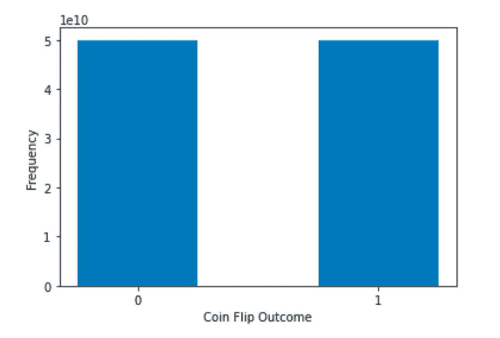

作者图片

那是因为，对于一枚公平的硬币，抛正面或抛反面的概率是一样的，都是 0.5。因此，当样本量大得多时，我们预计实际结果会更接近一半对一半。

这里另一个非常重要的点是**增加样本量不会改变分数分布的形状**！

无论一个人掷多少枚公平硬币，结果永远不会成为正态分布，因为 **CLT 是关于平均值的分布，而不是分数的分布**。

我们可以很容易地根据无穷分数的分布计算出均值和标准差。当我们投掷 n 枚公平硬币时(n 为无穷大)，我们将有 n/2 个正面和 n/2 个反面。

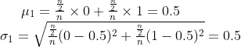

## CLT 可视化了

现在，我们来看看硬币对的含义，也就是说，我们将 2 个硬币组合在一起，有无限多组 2 个硬币。2 个硬币的可能均值是 0，0.5，1。

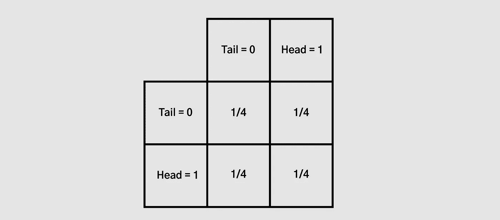

作者图片

第一个硬币是尾，第二个硬币是尾的概率是 1/2 * 1/2 = 1/4。其他三个也是。

因此，得到均值为 0(两个尾部)的概率是 1/4。得到均值 0.5(一尾一头)的概率是 1/4 * 2= 1/2。得到平均值 1(两个头)的概率也是 1/4。

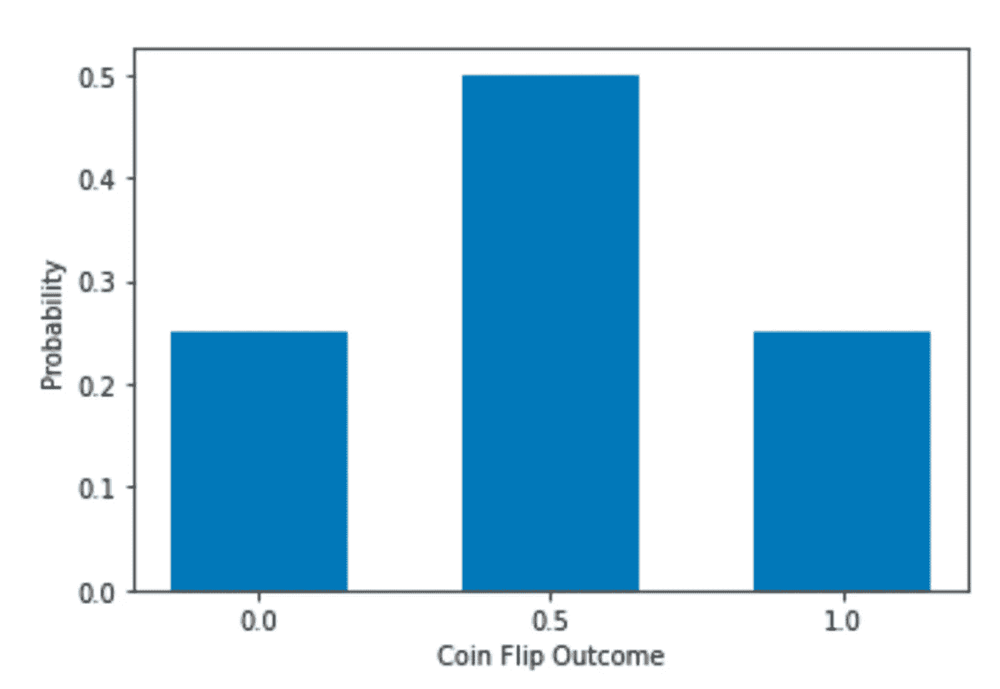

作者图片

然后，分布会像这样。请注意，y 轴现在是概率而不是频率(又名计数)，但无论使用哪个 y 轴，形状都是一样的。与之前的条形图相比，我们现在有 3 个条形，峰值位于中间。

同样，我们计算平均值和标准差:

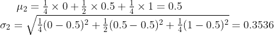

平均值保持不变，但标准差现在变小了。

同样，我们可以将 3 枚硬币放在一起。3 个硬币的可能均值现在是 0，1/3，2/3，1。总共有 2 * 2 * 2 = 8 种组合。

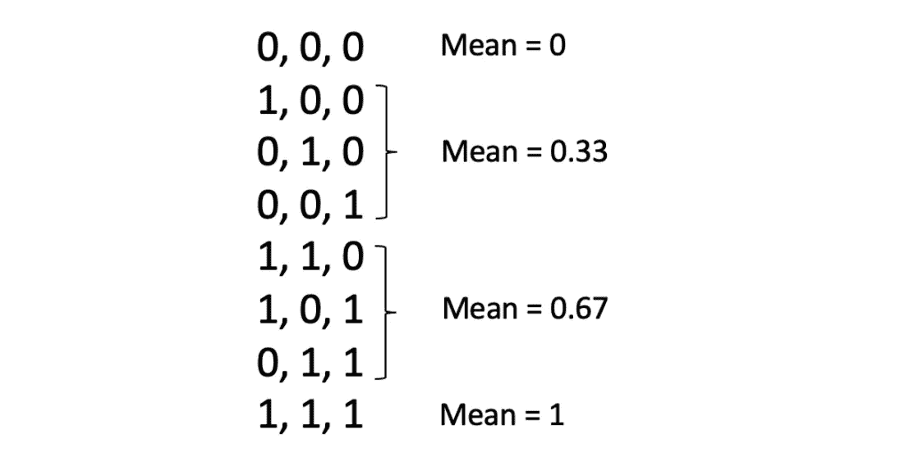

作者图片

得到平均值 0 的概率是 p(0) = 1/8。

同理，
p(0.33) = p(0.67) = 3/8，
p(1) = 1/8。

平均值和标准偏差为:

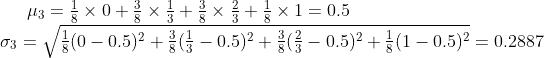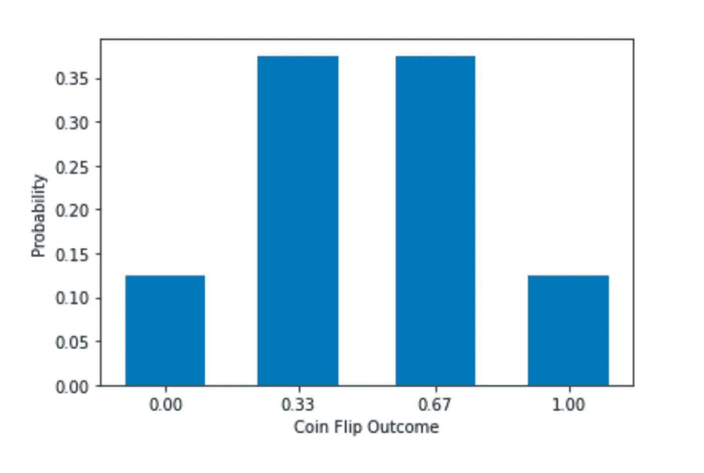

作者图片

分布现在有 4 个酒吧，比以前多 1 个，*再次*。平均值保持不变，标准差在下降。

**这似乎是一种模式。**

如果我们增加 N 的值，均值、标准差和分布会发生什么变化？

为了看它是否确实是一种模式，我计算并可视化了更多的结果。下面的数字 N 是每组硬币的数量。分数的分布意味着 N = 1。

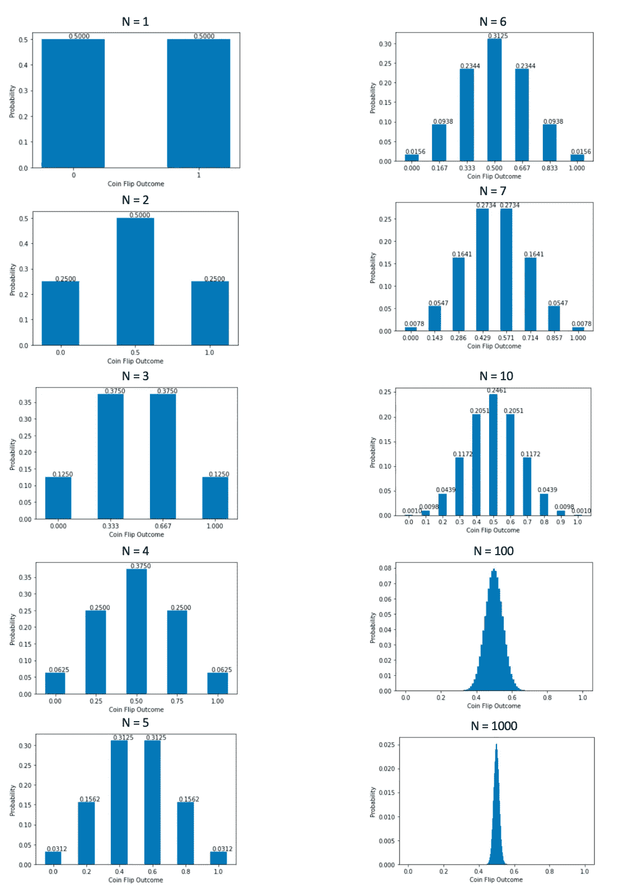

作者图片

很容易看出，随着 N 变大，均值的分布越来越接近钟形正态分布。当 N 非常大时，我们几乎看不到边上的条形，因为概率太小，但可能的均值仍然在 0 到 1 之间。

我们还可以看到，均值分布的均值始终是 0.5，而均值分布的标准差却在不断减小，因为可见的形状越来越窄。

# 标准误差

随着 N 变大，我们实际上有办法量化标准差的变化。我编写了以下 python 代码来计算平均值和标准差。

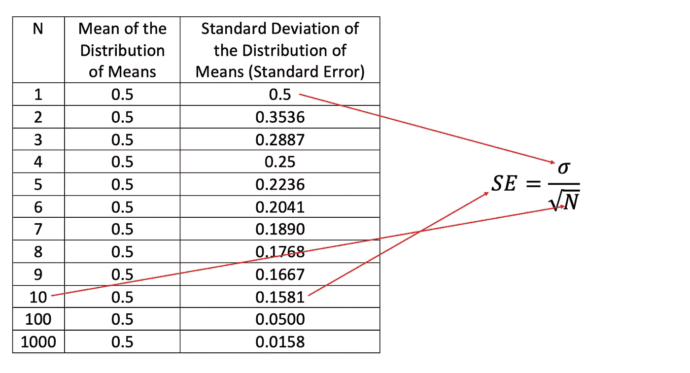

作者图片

同样，我们可以看到，随着 N 变大，均值保持不变，均值分布的标准差下降。均值分布的标准偏差也称为**标准误差(SE)** ，SE 和 N 之间的关系是 SE = sigma/N 的平方根。在这种情况下，sigma = 0.5，因为当 N=1 时，也就是当一个组只有一个分数时，它是分数的分布。当 N 等于或大于 2 时，就变成了均值分布。而随着 N 的增大，SE 的分母增大，所以 SE 减小。

# 结论

最后，我们仔细研究了硬币示例，并了解到以下几点:

*   分数的分布不同于均值的分布。
*   当计算平均值(N)的分数的数目无限大时，CLT 利用平均值的分布得到正态分布。无论样本量有多大，分数的分布都不会是正态的。
*   均值分布的均值等于分数分布的均值。
*   平均值分布的标准偏差(也称为标准误差)随着计算平均值(N)的分数的增加而减少。准确的关系是:

> 所有可视化代码和平均值和标准差的计算都在这个 [GitHub 笔记本](https://github.com/AlisonYao/Data-Science-All-Along/blob/main/Stats/CLT_blog.ipynb)中。

感谢您的阅读！希望这对你有帮助。

特别感谢 PJ·亨利教授在课堂上介绍硬币的例子。我修改了它，并在这里添加了我自己的解释和可视化。

## 参考

[1]史蒂夫·斯基纳*、*、[概率与统计](https://www3.cs.stonybrook.edu/~skiena/jaialai/excerpts/node12.html)、*计算赌注:计算机、赌博、数学建模赢！* (2001)，剑桥大学出版社和美国数学协会